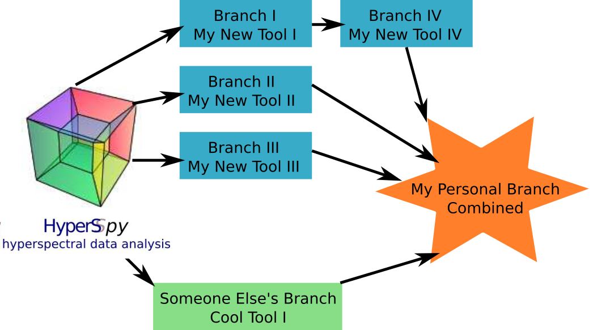


.. _dev_guide-label:

Developer Guide
===============

This 6-step guide is intended to give people who want to start contributing
their own tools to HyperSpy a foothold to kick-start the process. This is
also the way to start if you ultimately hope to become a member of the
developer team.

We anticipate that many potential contributors and developers will be
scientists who may have a lot to offer in terms of expert knowledge but may
have little experience when it comes to working on a reasonably large
open-source project like HyperSpy. This guide is aimed at you - helping to
reduce the barrier to make a contribution.

Before you start you should decide which platform (i.e. Linux, Windows, or Mac)
you are going to work in. All are possible and the advice below is the same
it's only the specifics that change.

1. Start using HyperSpy and understand it
-----------------------------------------

The best way to start understanding how HyperSpy works and to build a broad
overview of the code as it stands is to use it -- so what are you waiting for?
`Download HyperSpy <http://hyperspy.org/download.html>`_.

The user-guide also provides a good overview of all the parts of the code that
are currently implemented as well as much information about how everything
works -- so read it well:
`HyperSpy User-Guide <http://www.hyperspy.org/hyperspy-doc/current/index
.html>`_.

For developing the code the home of HyperSpy is on github and you'll see that
a lot of this guide boils down to using that platform well. so visit the
following link and poke around the code, issues, and pull requests: `HyperSpy
on Github <https://github.com/hyperspy/hyperspy>`_.

It's probably also worth visiting the `Github <https://github.com/>`_ home page
and going through the `"boot camp" <https://help.github
.com/categories/bootcamp/>`_ to get a feel for the terminology.

In brief, to give you a hint on the terminology to search for, the contribution
pattern is:
    1. Setup git/github if you don't have it.
    2. Fork HyperSpy on github.
    3. Checkout your fork on your local machine.
    4. Create a new branch locally where you will make your changes.
    5. Push the local changes to your own github fork.
    6. Create a pull request (PR) to the official HyperSpy repository.

Note: You cannot mess up the main HyperSpy project unless you have been
promoted to write access and the dev-team. So when you're starting out be
confident to play, get it wrong, and if it all goes wrong you can always get
a fresh install of HyperSpy!!

PS: If you choose to develop in Windows/Mac you may find `Github Desktop
<https://desktop.github.com>`_ useful.

2. Got a problem? -- ask!
-------------------------

Open source projects are all about community - we put in much effort to make
good tools available to all and most people are happy to help others start out.
Everyone had to start at some point and the philosophy of these projects
centres around the fact that we can do better by working together.

Much of the conversation happens in 'public' via online platforms. The main two
forums used by HyperSpy developers are:

`Gitter <https://gitter.im/hyperspy/hyperspy>`_ -- where we host a live
chat-room in which people can ask questions and discuss things in a relatively
informal way.

`Github <https://github.com/hyperspy/hyperspy/issues>`_ -- the main repository
for the source code also enables issues to be raised in a way that means
they're logged until dealt with. This is also a good place to make a proposal
for some new feature or tool that you want to work on.

3. Pick your battles
--------------------

Work out what you want to contribute and break it down in to manageable chunks.

You may have a very clear idea of what you want to contribute but if you're
not sure where to start you can always look through the issues and pull
requests on the `GitHub Page <https://github.com/hyperspy/hyperspy/>`_.
You'll find that there are many known areas for development in the issues
and a number of pull-requests are part finished projects just sitting there
waiting for a keen new contributor to come and learn by finishing.

When you've decided what you're going to work on - let people know using the
online forums!

It may be that someone else is doing something similar and can help, it's also
good to make sure that those working on related projects are pulling in the
same direction.

4. Get good habits
------------------

There are 3 key points to get right when starting out as a contributor - keep
work separated in manageable sections, make sure that your code style is good,
and bear in mind that every new function you write will need a test and user
documentation!

Use git and work in manageable branches
^^^^^^^^^^^^^^^^^^^^^^^^^^^^^^^^^^^^^^^

By now you'll have had a look around GitHub - but why's it so important?

Well GitHub is the public forum in which we manage and discuss development of
the code. More importantly, it enables every developer to utilise Git which is
an open source "version control" system that you can use on your laptop or
desktop. By version control we mean that you can separate out your contribution
to the code into many versions (called branches) and switch between them
easily. Later you can choose which version you want to have integrated into
HyperSpy.

You can learn all about Git `here <http://www.git-scm.com/about>`_!

The most important thing for you to do is to separate your contributions so
that each branch is small advancement on the "master" code or on another
branch. In the end each branch will have to be checked and reviewed by
someone else before it can be included - so if it's too big, you will be
asked to split it up!

For personal use, before integrating things into the main HyperSpy code, you
may want to use a few branches together. You can do that but just make sure
each new thing has it's own branch! You can merge some together for your
personal use.

Diagrammatically you should be aiming for something like this:

Get the style right
^^^^^^^^^^^^^^^^^^^

HyperSpy follows the Style Guide for Python Code - these are just some rules
for consistency that you can read all about in the `Python Style Guide
<https://www.python.org/dev/peps/pep-0008/>`_.

You can check your code with the `pep8 Code Checker
<https://pypi.python.org/pypi/pep8>`_.

.. _tests-label:

Write tests
^^^^^^^^^^^

Every new function that is written in to HyperSpy needs to be tested and
documented.

Tests are short functions found in hyperspy/tests that call your functions
under some known conditions and check the outputs against known values. They
should depend on as few other features as possible so that when they break
we know exactly what caused it. Ideally, the tests should be written at the
same time than the code itself, as they are very convenient to run to check
outputs when coding. Writing tests can seem laborious but you'll probably
soon find that they're very important as they force you to sanity check all
you do.

HyperSpy uses the `py.test <http://doc.pytest.org/>`_ library for testing. The
tests reside in the ``hyperspy.tests`` module. To run them:

.. code:: bash

   py.test --pyargs hyperspy

Or, from HyperSpy's project folder simply:

.. code:: bash

   py.test

Useful hints on testing:

* When comparing integers, it's fine to use ``==``. When comparing floats, be
  sure to use ``numpy.testing.assert_almost_equal()`` or
  ``numpy.testing.assert_allclose()``.
* ``numpy.testing.assert_equal()`` is convenient to compare numpy arrays.
* The ``hyperspy.misc.test_utils.py`` contains a few useful functions for
  testing.
* ``@pytest.mark.parametrize()`` is a very convenient decorator to test several
  parameters of the same function without having to write to much repetitive
  code, which is often error-prone. See `pytest documentation for more details
  <http://doc.pytest.org/en/latest/parametrize.html>`_.
* It is good to check that the tests does not use too much of memory after
  creating new tests. If you need to explicitly delete your objects and free
  memory, you can do the following to release the memory associated to the
  ``s`` object, for example:

.. code:: python

    del s
    gc.collect()

* Once, you have pushed your PR to the official HyperSpy repository, it can be
  useful to check the coverage of your tests using the coveralls.io check of
  your PR. There should be a link to it at the bottom of your PR on the github
  PR page. This service can help you to find how well your code is being tested
  and exactly which part is not currently tested.
* `pytest-sugar <https://pypi.python.org/pypi/pytest-sugar>`_ can be installed
  to have a nicer look and feel of py.test in the console (encoding issue have
  been reported in the Windows console).

.. _plot-test-label:

Plot testing
^^^^^^^^^^^^
Plotting is tested using the ``@pytest.mark.mpl_image_compare`` decorator of
the `pytest mpl plugin <https://pypi.python.org/pypi/pytest-mpl>`_.  This
decorator uses reference images to compare with the generated output during the
tests. The references images are located in the folder defined by the argument
``baseline_dir`` of the ``@pytest.mark.mpl_image_compare`` decorator.

To run plotting tests, you simply need to add the option ``--mpl``:
::

    pytest --mpl

If you don't use the ``--mpl``, the code of the tests will be executed but the
images will not be compared to the references images.

If you need to add or change some plots, follow the workflow below:

    1. Write the tests using appropriate decorator such as
       ``@pytest.mark.mpl_image_compare``.
    2. If you need to generate new reference image in the folder
       ``plot_test_dir``, for example, run: ``py.test
       --mpl-generate-path=plot_test_dir``
    3. Run again the tests and this time they should pass.
    4. Use ``git add`` to put the new file in the git repository.

During the execution of plot tests, the figures are created but not deleted
after execution. It is necessary to delete the figure and this can be done
by using mpl_cleanup fixture: you juste need to add ``mpl_cleanup``
as the first argument of the tests.

When the plotting tests are failling, it is possible to download the figure comparison images generated by pytest-mpl in the `artifacts tabs <https://ci.appveyor.com/project/hyperspy/hyperspy/build/1.0.2500/job/2c2qccaktd90po2q/artifacts>`_ of the corresponding build.

The plotting tests need matplotlib > 2.0.0, since the matplotlib `style change
<http://matplotlib.org/style_changes.html>`_ between matplotlib 1.x and 2.x is
enough to make the test failed. Freetype>=2.8 is also required to pass the 
plotting tests.

In travis and appveyor, the matplotlib backend is set to ``agg`` by setting
the ``MPLBACKEND`` environment variable to ``agg``. At the first import of
``matplotlib.pyplot``, matplotlib will look at the ``MPLBACKEND`` environment
variable and set accordingly the backend.

See `pytest-mpl <https://pypi.python.org/pypi/pytest-mpl>`_ for more details.

Write documentation
^^^^^^^^^^^^^^^^^^^

Documentation comes in two parts docstrings and user-guide documentation.

Docstrings -- written at the start of a function and give essential information
about how it should be used, such as which arguments can be passed to it and
what the syntax should be. The docstrings need to follow the `numpy
specification <https://github.com/numpy/numpy/blob/master/doc/HOWTO_DOCUMENT
.rst.txt>`_, as shown in `this example
<https://github.com/numpy/numpy/blob/master/doc/example.py>`_.

User-guide Documentation -- A description of the functionality of the code and
how to use it with examples and links to the relevant code.

When writing both the docstrings and user guide documentation, it is useful to
have some kind of data which the users can use themselves. Artificial
datasets for this purpose can be found in `hyperspy.datasets.artificial_data`.

Build the documentation -- To check the output of what you wrote, you can build
the documentation, which requires python-sphinx and numpydoc to be installed.
Run the make command in the ``doc`` to build the documentation. For example
``make html`` will build the whole documentation in html format. See the make
command documentation for more details.

5. Make your contribution
-------------------------

When you've got a branch that's ready to be incorporated in to the main code of
HyperSpy -- make a pull request on GitHub and wait for it to be reviewed and
discussed.

6. Contributing cython code
---------------------------

Python is not the fastest language, and can be particularly slow in loops.
Performance can sometimes be significantly improved by implementing optional
cython code alongside the pure Python versions. While developing cython code,
make use of the official cython recommendations (http://docs.cython.org/).  Add
your cython extensions to the setup.py, in the existing list of
``raw_extensions``.

Unlike the cython recommendation, the cythonized .c or .cpp files are not
welcome in the git source repository (except original c or c++ files), since
they are typically quite large. Cythonization will take place during Travis
CI and Appveyor building. The cythonized code will be generated and included
in source or binary distributions for end users. To help troubleshoot
potential deprecation with future cython releases, add a comment with in the
header of your .pyx files with the cython version. If cython is present in
the build environment and any cythonized c/c++ file is missing, then setup
.py tries to cythonize all extensions automatically.

To make the development easier the new command ``recythonize`` has been added
to setup.py.  It can be used in conjunction with other default commands.  For
example ``python setup.py recythonize build_ext --inplace`` will recythonize
all changed (and described in setup.py!) cython code and compile.

When developing on git branches, the first time you call setup.py in
conjunction with or without any other command - it will generate a
post-checkout hook, which will include a potential cythonization and
compilation product list (.c/.cpp/.so/.pyd). With your next ``git checkout``
the hook will remove them and automatically run ``python setup.py build_ext
--inplace`` to cythonize and compile the code if available.  If an older
version of HyperSpy (<= 0.8.4.x) is checked out this should have no side
effects.

If another custom post-checkout hook is detected on PR, then setup.py tries to
append or update the relevant part. To prevent unwanted hook generation or
update you can create the empty file ``.hook_ignore`` in source directory (same
level as setup.py).

7. Adding new methods
---------------------

With the addition of the ``LazySignal`` class and its derivatives, adding
methods that operate on the data becomes slightly more complicated. However, we
have attempted to streamline it as much as possible. ``LazySignals`` use
``dask.array.Array`` for the ``data`` field instead of the usual
``numpy.ndarray``. The full documentation is available
`here <https://dask.readthedocs.io/en/latest/array.html>`_. While interfaces of
the two arrays are indeed almost identical, the most important differences are
(``da`` being ``dask.array.Array`` in the examples):

 - **Dask arrays are immutable**: ``da[3] = 2`` does not work. ``da += 2``
   does, but it's actually a new object -- might as well use ``da = da + 2``
   for a better distinction.
 - **Unknown shapes are problematic**: ``res = da[da>0.3]`` works, but the
   shape of the result depends on the values and cannot be inferred without
   execution. Hence few operations can be run on ``res`` lazily, and it should
   be avoided if possible.

The easiest way to add new methods that work both with arbitrary navigation
dimensions and ``LazySignals`` is by using the ``map`` (or, for more control,
``_map_all`` or ``_map_iterate``) method to map your function ``func`` across
all "navigation pixels" (e.g. spectra in a spectrum-image). ``map`` methods
will run the function on all pixels efficiently and put the results back in the
correct order. ``func`` is not constrained by ``dask`` and can use whatever
code (assignment, etc.) you wish.

If the new method cannot be coerced into a shape suitable ``map``, separate
cases for lazy signals will have to be written. If a function operates on
arbitrary-sized arrays and the shape of the output can be known before calling,
``da.map_blocks`` and ``da.map_overlap`` are efficient and flexible.

Finally, in addition to ``_iterate_signal`` that is available to all HyperSpy
signals, lazy counterparts also have ``_block_iterator`` method that supports
signal and navigation masking and yields (returns on subsequent calls) the
underlying dask blocks as numpy arrays. It is important to note that stacking
all (flat) blocks and reshaping the result into the initial data shape will not
result in identical arrays. For illustration it is best to see the `dask
documentation <https://dask.readthedocs.io/en/latest/array.html>`_.
