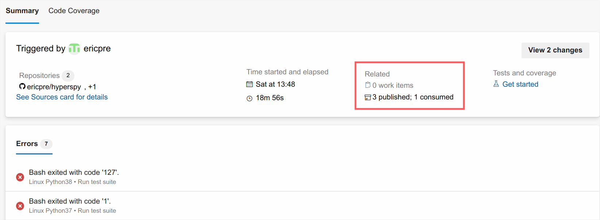

.. _testing-label:

Running and writing tests
=========================

Writing tests
^^^^^^^^^^^^^

Every new function that is written in to HyperSpy should be tested and
documented. HyperSpy uses the `pytest <http://doc.pytest.org/>`_ library
for testing. The tests reside in the ``hyperspy.tests`` module.

Tests are short functions, found in ``hyperspy/tests``, that call your functions
under some known conditions and check the outputs against known values. They
should depend on as few other features as possible so that when they break,
we know exactly what caused it. Ideally, the tests should be written at the
same time as the code itself, as they are very convenient to run to check
outputs when coding. Writing tests can seem laborious but you'll probably
soon find that they are very important, as they force you to sanity-check
all the work that you do.

**Useful testing hints:**

* When comparing integers, it's fine to use ``==``
* When comparing floats, be sure to use :func:`numpy.testing.assert_allclose`
  or :func:`numpy.testing.assert_almost_equal`
* :func:`numpy.testing.assert_allclose` is also convenient for comparing
  numpy arrays
* The ``hyperspy.misc.test_utils.py`` contains a few useful functions for
  testing
* ``@pytest.mark.parametrize()`` is a very convenient decorator to test several
  parameters of the same function without having to write to much repetitive
  code, which is often error-prone. See `pytest documentation
  <http://doc.pytest.org/en/latest/parametrize.html>`__ for more details.
* It is good to check that the tests do not use too much memory after
  creating new tests. If you need to explicitly delete your objects and free
  memory, you can do the following to release the memory associated with the
  ``s`` object:

  .. code:: python

    >>> import gc

    >>> # Do some work with the object
    >>> s = ...

    >>> # Clear the memory
    >>> del s
    >>> gc.collect() # doctest: +SKIP

Running tests
^^^^^^^^^^^^^

First ensure pytest and its plugins are installed by:

.. code:: bash

   # If using a standard hyperspy install
   $ pip install hyperspy[tests]

   # Or, from a hyperspy local development directory
   $ pip install -e .[tests]

   # Or just installing the dependencies using conda
   $ conda install -c conda-forge pytest pytest-mpl

To run them:

.. code:: bash

   $ pytest --mpl --pyargs hyperspy

Or, from HyperSpy's project folder, simply:

.. code:: bash

   $ pytest

.. note::

  pytest configuration options are set in the ``setup.cfg`` file, under the
  ``[tool:pytest]`` section. See the `pytest configuration documentation
  <https://docs.pytest.org/en/latest/customize.html>`_ for more details.

The HyperSpy test suite can also be run in parallel if you have multiple CPUs
available, using the `pytest-xdist plugin <https://pypi.org/project/pytest-xdist/>`_.
If you have the plugin installed, HyperSpy will automatically run the test suite in
parallel on your machine.

.. code:: bash

   # To run on all the cores of your machine
   $ pytest -n auto --dist loadfile

   # To run on 2 cores
   $ pytest -n 2 --dist loadfile

The ``--dist loadfile`` argument will group tests by their containing file. The
groups are then distributed to available workers as whole units, thus guaranteeing
that all tests in a file run in the same worker.

.. note::

    Running tests in parallel using ``pytest-xdist`` will change the content
    and format of the output of ``pytest`` to the console. We recommend installing
    `pytest-sugar <https://pypi.org/project/pytest-sugar/>`_ to produce
    nicer-looking output including an animated progressbar.

To test docstring examples, assuming the current location is the HyperSpy root
directory:

.. code:: bash

    # All
    $ pytest --doctest-modules --ignore-glob=hyperspy/tests --pyargs hyperspy

    # In a single file, like the signal.py file
    $ pytest --doctest-modules hyperspy/signal.py

Flaky tests
^^^^^^^^^^^

Test functions can sometimes exhibit intermittent or sporadic failure, with seemingly
random or non-deterministic behaviour. They may sometimes pass or sometimes fail, and
it won't always be clear why. These are usually known as "flaky" tests.

One way to approach flaky tests is to rerun them, to see if the failure was a one-off.
This can be achieved using the `pytest-rerunfailures plugin <https://pypi.org/project/pytest-rerunfailures/>`_.

.. code:: bash

    # To re-run all test suite failures a maximum of 3 times
    $ pytest --reruns 3

    # To wait 1 second before the next retry
    $ pytest --reruns 3 --reruns-delay 1

You can read more about flaky tests in the `pytest documentation 
<https://docs.pytest.org/en/stable/flaky.html>`__.

Test coverage
^^^^^^^^^^^^^

Once you have pushed your pull request to the official HyperSpy repository,
you can see the coverage of your tests using the
`codecov.io <https://codecov.io/gh/hyperspy/hyperspy>`_ check for
your PR. There should be a link to it at the bottom of your PR on the Github
PR page. This service can help you to find how well your code is being tested
and exactly which parts are not currently tested.

You can also measure code coverage locally. If you have installed ``pytest-cov``,
you can run (from HyperSpy's project folder):

.. code:: bash

    $ pytest --cov=hyperspy

Configuration options for code coverage are also set in the ``setup.cfg`` file,
under the ``[coverage:run]`` and ``[coverage:report]`` sections. See the `coverage
documentation <https://coverage.readthedocs.io/en/coverage-5.1/config.html>`_
for more details.

.. note::

   The `codecov.io <https://codecov.io/gh/hyperspy/hyperspy>`_ check in your
   PR will fail if it either decreases the overall test coverage of HyperSpy,
   or if any of the lines introduced in your diff are not covered.

Continuous integration (CI)
^^^^^^^^^^^^^^^^^^^^^^^^^^^

The HyperSpy test suite is run using continuous integration services provided by
`Github Actions <https://github.com/hyperspy/hyperspy/actions>`_ and
`Azure Pipelines <https://dev.azure.com/franciscode-la-pena-manchon/hyperspy/_build>`_.
In case of Azure Pipelines, CI helper scripts are pulled from the
`ci-scripts <https://github.com/hyperspy/ci-scripts>`_ repository.

The testing matrix is as follows:

- **Github Actions**: test a range of Python versions on Linux, MacOS and Windows;
  all dependencies are installed from `PyPI <https://pypi.org>`_.
  See ``.github/workflows/tests.yml`` in the HyperSpy repository for further details.
- **Azure Pipeline**: test a range of Python versions on Linux, MacOS and Windows;
  all dependencies are installed from `Anaconda Cloud <https://anaconda.org/>`_
  using the `"conda-forge" <https://anaconda.org/conda-forge>`_ channel.
  See ``azure-pipelines.yml`` in the HyperSpy repository for further details.
- The testing of **HyperSpy extensions** is described in the 
  :ref:`integration test suite <integration_test_suite-label>` section.

This testing matrix has been designed to be simple and easy to maintain, whilst
ensuring that packages from PyPI and Anaconda cloud are not mixed in order to
avoid red herring failures of the test suite caused by application binary
interface (ABI) incompatibility between dependencies.

The most recent versions of packages are usually available first on PyPI, before
they are available on Anaconda Cloud. These means that if a recent release of a
dependency breaks the test suite, it should happen first on Github Actions.
Similarly, deprecation warnings will usually appear first on Github Actions.

The documentation build is done on both Github Actions and
`Read the Docs <https://readthedocs.org/>`_, and it is worth checking that no new
warnings have been introduced when writing documentation in the user guide or
in the docstrings.

The Github Actions testing matrix also includes the following special cases:

- The test suite is run against HyperSpy's minimum requirements on Python 3.7
  on Linux. This will skip any tests that require **optional** packages such as
  ``scikit-learn``.
- The test suite is run against the oldest supported versions of ``numpy``,
  ``matplotlib`` and ``scipy``. For more details, see this
  `Github issue <https://github.com/hyperspy/hyperspy/pull/2485>`__.
- The test suite is run against the development supported versions of ``numpy``,
  ``scipy``, ``scikit-learn`` and ``scikit-image`` using the weekly build wheels
  available on https://anaconda.org/scipy-wheels-nightly. For more details, see
  this `Github issue <https://github.com/hyperspy/hyperspy/pull/2616>`__.

.. _plot-test-label:

Plot testing
^^^^^^^^^^^^
Plotting is tested using the ``@pytest.mark.mpl_image_compare`` decorator of
the `pytest mpl plugin <https://pypi.python.org/pypi/pytest-mpl>`_.  This
decorator uses reference images to compare with the generated output during the
tests. The reference images are located in the folder defined by the argument
``baseline_dir`` of the ``@pytest.mark.mpl_image_compare`` decorator.

To run plot tests, you simply need to add the option ``--mpl``:

.. code:: bash

    $ pytest --mpl

If you don't use ``--mpl``, the test functions will be executed, but the
images will not be compared to the reference images.

If you need to add or change some plots, follow the workflow below:

1. Write the tests using appropriate decorators such as
   ``@pytest.mark.mpl_image_compare``.
2. If you need to generate a new reference image in the folder
   ``plot_test_dir``, for example, run: ``pytest
   --mpl-generate-path=plot_test_dir``
3. Run again the tests and this time they should pass.
4. Use ``git add`` to put the new file in the git repository.

When the plotting tests fail, it is possible to download the figure
comparison images generated by ``pytest-mpl`` in the artifacts tabs of the
corresponding build on Azure Pipeliness:

.. note::
  
  To generate the baseline images, the version of matplotlib defined in
  `conda_environment_dev.yml <https://github.com/hyperspy/hyperspy/blob/RELEASE_next_minor/conda_environment_dev.yml>`__
  is required.

The plotting tests are tested on Azure Pipelines against a specific version of
matplotlib defined in `conda_environment_dev.yml <https://github.com/hyperspy/hyperspy/blob/RELEASE_next_minor/conda_environment_dev.yml>`__.
This is because small changes in the way matplotlib generates the figure between
versions can sometimes make the tests fail.

For plotting tests, the matplotlib backend is set to ``agg`` by setting
the ``MPLBACKEND`` environment variable to ``agg``. At the first import of
``matplotlib.pyplot``, matplotlib will look at the ``MPLBACKEND`` environment
variable and accordingly set the backend.

Exporting pytest results as HTML
^^^^^^^^^^^^^^^^^^^^^^^^^^^^^^^^
With ``pytest-html``, it is possible to export the results of running pytest
for easier viewing. It can be installed by conda:

.. code:: bash

    $ conda install pytest-html

and run by:

.. code:: bash

    $ pytest --mpl --html=report.html

See `pytest-mpl <https://pypi.python.org/pypi/pytest-mpl>`_ for more details.

