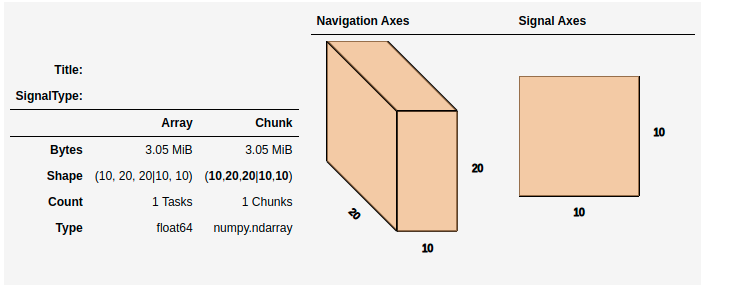

.. _big-data-label:

Working with big data
*********************

.. versionadded:: 1.2

HyperSpy makes it possible to analyse data larger than the available memory by
providing "lazy" versions of most of its signals and functions. In most cases
the syntax remains the same. This chapter describes how to work with data
larger than memory using the :class:`~._signals.lazy.LazySignal` class and
its derivatives.

Creating Lazy Signals
---------------------

Lazy Signals from external data
^^^^^^^^^^^^^^^^^^^^^^^^^^^^^^^

If the data is large and not loaded by HyperSpy (for example a ``hdf5.Dataset``
or similar), first wrap it in ``dask.array.Array`` as shown `here
<https://dask.readthedocs.io/en/latest/array-creation.html>`_ and then pass it
as normal and call ``as_lazy()``:

.. code-block:: python
    
    >>> import h5py # doctest: +SKIP
    >>> f = h5py.File("myfile.hdf5") # doctest: +SKIP
    >>> data = f['/data/path'] # doctest: +SKIP

    Wrap the data in dask and chunk as appropriate

    >>> import dask.array as da # doctest: +SKIP
    >>> x = da.from_array(data, chunks=(1000, 100)) # doctest: +SKIP
    
    Create the lazy signal
    
    >>> s = hs.signals.Signal1D(x).as_lazy() # doctest: +SKIP

Loading lazily
^^^^^^^^^^^^^^

To load the data lazily, pass the keyword ``lazy=True``.  As an example,
loading a 34.9 GB ``.blo`` file on a regular laptop might look like:

.. code-block:: python

    >>> s = hs.load("shish26.02-6.blo", lazy=True)  # doctest: +SKIP
    >>> s # doctest: +SKIP
    <LazySignal2D, title: , dimensions: (400, 333|512, 512)>
    >>> s.data # doctest: +SKIP
    dask.array<array-e..., shape=(333, 400, 512, 512), dtype=uint8, chunksize=(20, 12, 512, 512)>
    >>> print(s.data.dtype, s.data.nbytes / 1e9) # doctest: +SKIP
    uint8 34.9175808

    Change dtype to perform decomposition, etc.

    >>> s.change_dtype("float")  # doctest: +SKIP
    >>> print(s.data.dtype, s.data.nbytes / 1e9) # doctest: +SKIP
    float64 279.3406464

Loading the dataset in the original unsigned integer format would require
around 35GB of memory. To store it in a floating-point format one would need
almost 280GB of memory. However, with the lazy processing both of these steps
are near-instantaneous and require very little computational resources.

.. versionadded:: 1.4
    :meth:`~._signals.lazy.LazySignal.close_file`

Currently when loading an hdf5 file lazily the file remains open at
least while the signal exists. In order to close it explicitly, use the
:meth:`~._signals.lazy.LazySignal.close_file` method. Alternatively,
you could close it on calling :meth:`~._signals.lazy.LazySignal.compute`
by passing the keyword argument ``close_file=True`` e.g.:

.. code-block:: python

    >>> s = hs.load("file.hspy", lazy=True) # doctest: +SKIP
    >>> ssum = s.sum(axis=0) # doctest: +SKIP

    Close the file

    >>> ssum.compute(close_file=True)  # doctest: +SKIP

Lazy stacking
^^^^^^^^^^^^^

Occasionally the full dataset consists of many smaller files. To combine them
into a one large ``LazySignal``, we can :ref:`stack<signal.stack_split>` them
lazily (both when loading or afterwards):

.. code-block:: python

    >>> siglist = hs.load("*.hdf5") # doctest: +SKIP
    >>> s = hs.stack(siglist, lazy=True) # doctest: +SKIP
    
    Or load lazily and stack afterwards:
    
    >>> siglist = hs.load("*.hdf5", lazy=True) # doctest: +SKIP

    Make a stack, no need to pass 'lazy', as signals are already lazy

    >>> s = hs.stack(siglist) # doctest: +SKIP
    
    Or do everything in one go:
    
    >>> s = hs.load("*.hdf5", lazy=True, stack=True) # doctest: +SKIP

Casting signals as lazy
^^^^^^^^^^^^^^^^^^^^^^^

To convert a regular HyperSpy signal to a lazy one such that any future
operations are only performed lazily, use the
:meth:`~.api.signals.BaseSignal.as_lazy` method:

.. code-block:: python

    >>> s = hs.signals.Signal1D(np.arange(150.).reshape((3, 50)))
    >>> s
    <Signal1D, title: , dimensions: (3|50)>
    >>> sl = s.as_lazy()
    >>> sl
    <LazySignal1D, title: , dimensions: (3|50)>

.. _big_data.decomposition:

Machine learning
----------------

.. warning:: The machine learning features are in beta state.

   Although most of them work as described, their operation may not always
   be optimal, well-documented and/or consistent with their in-memory counterparts.

:ref:`mva.decomposition` algorithms for machine learning often perform
large matrix manipulations, requiring significantly more memory than the data size.
To perform decomposition operation lazily, HyperSpy provides access to several "online"
algorithms  as well as `dask <https://dask.pydata.org/>`_'s lazy SVD algorithm.
Online algorithms perform the decomposition by operating serially on chunks of
data, enabling the lazy decomposition of large datasets. In line with the
standard HyperSpy signals, lazy :meth:`~._signals.lazy.LazySignal.decomposition`
offers the following online algorithms:

.. _lazy_decomposition-table:

.. table:: Available lazy decomposition algorithms in HyperSpy

   +--------------------------+---------------------------------------------------+
   | Algorithm                | Method                                            |
   +==========================+===================================================+
   | "SVD" (default)          | :func:`dask.array.linalg.svd`                     |
   +--------------------------+---------------------------------------------------+
   | "PCA"                    | :class:`sklearn.decomposition.IncrementalPCA`     |
   +--------------------------+---------------------------------------------------+
   | "ORPCA"                  | :class:`~.learn.rpca.ORPCA`                       |
   +--------------------------+---------------------------------------------------+
   | "ORNMF"                  | :class:`~.learn.ornmf.ORNMF`                      |
   +--------------------------+---------------------------------------------------+

.. seealso::

  :meth:`~.api.signals.BaseSignal.decomposition` for more details on decomposition
  with non-lazy signals.

Navigator plot
--------------

The default signal navigator is the sum of the signal across all signal
dimensions and all but 1 or 2 navigation dimensions. If the dataset is large,
this can take a significant amount of time to perform with every plot.
By default, a navigator is computed with minimally required approach to obtain
a good signal-to-noise ratio image: the sum is taken on a single chunk of the
signal space, in order to avoid to compute the navigator for the whole dataset.
In the following example, the signal space is divided in 25 chunks (5 along on
each axis), and therefore computing the navigation will only be perfomed over
a small subset of the whole dataset by taking the sum on only 1 chunk out
of 25:

.. code-block:: python

    >>> import dask.array as da
    >>> import hyperspy.api as hs
    >>> data = da.random.random((100, 100, 1000, 1000), chunks=('auto', 'auto', 200, 200))
    >>> s = hs.signals.Signal2D(data).as_lazy()
    >>> s.plot() # doctest: +SKIP

In the example above, the calculation of the navigation is fast but the actual
visualisation of the dataset is slow, each for each navigation index change,
25 chunks of the dataset needs to be fetched from the harddrive. In the
following example, the signal space contains a single chunk (instead of 25, in
the previous example) and the calculating the navigator will then be slower (~20x)
because the whole dataset will need to processed, however in this case, the
visualisation will be faster, because only a single chunk will fetched from the
harddrive when changing navigation indices:

.. code-block:: python

    >>> data = da.random.random((100, 100, 1000, 1000), chunks=('auto', 'auto', 1000, 1000))
    >>> s = hs.signals.Signal2D(data).as_lazy()
    >>> s.plot() # doctest: +SKIP

This approach depends heavily on the chunking of the data and may not be
always suitable. The :meth:`~hyperspy._signals.lazy.LazySignal.compute_navigator`
can be used to calculate the navigator efficient and store the navigator, so
that it can be used when plotting and saved for the later loading of the dataset.
The :meth:`~hyperspy._signals.lazy.LazySignal.compute_navigator` has optional
argument to specify the index where the sum needs to be calculated and how to
rechunk the dataset when calculating the navigator. This allows to
efficiently calculate the navigator without changing the actual chunking of the
dataset, since the rechunking only takes during the computation of the navigator:

.. code-block:: python

    >>> data = da.random.random((100, 100, 1000, 1000), chunks=('auto', 'auto', 100, 100))
    >>> s = hs.signals.Signal2D(data).as_lazy()
    >>> s.compute_navigator(chunks_number=5) # doctest: +SKIP
    >>> s.plot() # doctest: +SKIP

.. code-block:: python

    >>> data = da.random.random((100, 100, 2000, 400), chunks=('auto', 'auto', 100, 100))
    >>> s = hs.signals.Signal2D(data).as_lazy()
    >>> s
    <LazySignal2D, title: , dimensions: (100, 100|400, 2000)>
    >>> s.compute_navigator(chunks_number=(2, 10))
    >>> s.plot()
    >>> s.navigator.original_metadata
    └── sum_from = [slice(200, 400, None), slice(1000, 1200, None)]

The index can also be specified following the
:ref:`HyperSpy indexing signal1D <signal.indexing>` syntax for float and
interger.

.. code-block:: python

    >>> data = da.random.random((100, 100, 2000, 400), chunks=('auto', 'auto', 100, 100))
    >>> s = hs.signals.Signal2D(data).as_lazy()
    >>> s
    <LazySignal2D, title: , dimensions: (100, 100|400, 2000)>
    >>> s.compute_navigator(index=0, chunks_number=(2, 10))
    >>> s.navigator.original_metadata
    └── sum_from = [slice(0, 200, None), slice(0, 200, None)]

An alternative is to calculate the navigator separately and store it in the
signal using the :attr:`~hyperspy._signals.lazy.LazySignal.navigator` setter.

.. code-block:: python

    >>> data = da.random.random((100, 100, 1000, 1000), chunks=('auto', 'auto', 100, 100))
    >>> s = hs.signals.Signal2D(data).as_lazy()
    >>> s
    <LazySignal2D, title: , dimensions: (100, 100|1000, 1000)>
    
For fastest results, just pick one signal space pixel

.. code-block:: python

    >>> nav = s.isig[500, 500]
    
Alternatively, sum as per default behaviour of non-lazy signal

.. code-block:: python

    >>> nav = s.sum(s.axes_manager.signal_axes) # doctest: +SKIP
    >>> nav # doctest: +SKIP
    <LazySignal2D, title: , dimensions: (|100, 100)>
    >>> nav.compute() # doctest: +SKIP
    [########################################] | 100% Completed | 13.1s
    >>> s.navigator = nav # doctest: +SKIP
    >>> s.plot() # doctest: +SKIP

Alternatively, it is possible to not have a navigator, and use sliders instead

.. code-block:: python

    >>> s
    <LazySignal2D, title: , dimensions: (100, 100|1000, 1000)>
    >>> s.plot(navigator='slider') # doctest: +SKIP

.. versionadded:: 1.7

.. _big_data.gpu:

GPU support
-----------

Lazy data processing on GPUs requires explicitly transferring the data to the
GPU.

On linux, it is recommended to use the
`dask_cuda <https://docs.rapids.ai/api/dask-cuda/stable/index.html>`_ library
(not supported on windows) to manage the dask scheduler. As for CPU lazy
processing, if the dask scheduler is not specified, the default scheduler
will be used.

.. code-block:: python

    >>> from dask_cuda import LocalCUDACluster # doctest: +SKIP
    >>> from dask.distributed import Client # doctest: +SKIP
    >>> cluster = LocalCUDACluster() # doctest: +SKIP
    >>> client = Client(cluster) # doctest: +SKIP

.. code-block:: python

    >>> import cupy as cp # doctest: +SKIP
    >>> import dask.array as da
    
    Create a dask array
    
    >>> data = da.random.random(size=(20, 20, 100, 100))
    >>> data
    dask.array<random_sample, shape=(20, 20, 100, 100), dtype=float64, chunksize=(20, 20, 100, 100), chunktype=numpy.ndarray>
    
    Convert the dask chunks from numpy array to cupy array
    
    >>> data = data.map_blocks(cp.asarray) # doctest: +SKIP
    >>> data # doctest: +SKIP
    dask.array<random_sample, shape=(20, 20, 100, 100), dtype=float64, chunksize=(20, 20, 100, 100), chunktype=cupy.ndarray>
    
    Create the signal
    
    >>> s = hs.signals.Signal2D(data).as_lazy() # doctest: +SKIP

.. note::
    See the dask blog on `Richardson Lucy (RL) deconvolution <https://blog.dask.org/2020/11/12/deconvolution>`_
    for an example of lazy processing on GPUs using dask and cupy

.. _FitBigData-label:

Model fitting
-------------
Most curve-fitting functionality will automatically work on models created from
lazily loaded signals. HyperSpy extracts the relevant chunk from the signal and fits to that.

The linear ``'lstsq'`` optimizer supports fitting the entire dataset in a vectorised manner
using :func:`dask.array.linalg.lstsq`. This can give potentially enormous performance benefits over fitting
with a nonlinear optimizer, but comes with the restrictions explained in the :ref:`linear fitting<linear_fitting-label>` section.

Practical tips
--------------

Despite the limitations detailed below, most HyperSpy operations can be
performed lazily. Important points are:

- :ref:`big_data.chunking`
- :ref:`compute_lazy_signals`
- :ref:`lazy_operations_axes`

.. _big_data.chunking:

Chunking
^^^^^^^^

Data saved in the HDF5 format is typically divided into smaller chunks which can be loaded separately into memory,
allowing lazy loading. Chunk size can dramatically affect the speed of various HyperSpy algorithms, so chunk size is
worth careful consideration when saving a signal. HyperSpy's default chunking sizes are probably not optimal
for a given data analysis technique. For more comprehensible documentation on chunking,
see the dask `array chunks
<https://docs.dask.org/en/latest/array-chunks.html>`_ and `best practices
<https://docs.dask.org/en/latest/array-best-practices.html>`_ docs. The chunks saved into HDF5 will
match the dask array chunks in ``s.data.chunks`` when lazy loading.
Chunk shape should follow the axes order of the numpy shape (``s.data.shape``), not the hyperspy shape.
The following example shows how to chunk one of the two navigation dimensions into smaller chunks:

.. code-block:: python

    >>> import dask.array as da
    >>> data = da.random.random((10, 200, 300))
    >>> data.chunksize
    (10, 200, 300)

    >>> s = hs.signals.Signal1D(data).as_lazy()

    Note the reversed order of navigation dimensions

    >>> s
    <LazySignal1D, title: , dimensions: (200, 10|300)>

    Save data with chunking first hyperspy dimension (second array dimension)

    >>> s.save('chunked_signal.zspy', chunks=(10, 100, 300)) # doctest: +SKIP
    >>> s2 = hs.load('chunked_signal.zspy', lazy=True) # doctest: +SKIP
    >>> s2.data.chunksize # doctest: +SKIP
    (10, 100, 300)

To get the chunk size of given axes, the :meth:`~._signals.lazy.LazySignal.get_chunk_size`
method can be used:

.. code-block:: python

    >>> import dask.array as da
    >>> data = da.random.random((10, 200, 300))
    >>> data.chunksize
    (10, 200, 300)
    >>> s = hs.signals.Signal1D(data).as_lazy()
    >>> s.get_chunk_size() # All navigation axes
    ((10,), (200,))
    >>> s.get_chunk_size(0) # The first navigation axis
    ((200,),)

.. versionadded:: 2.0.0

Starting in version 2.0.0 HyperSpy does not automatically rechunk datasets as
this can lead to reduced performance. The ``rechunk`` or ``optimize`` keyword argument
can be set to ``True`` to let HyperSpy automatically change the chunking which
could potentially speed up operations.

.. versionadded:: 1.7.0

.. _lazy._repr_html_:

For more recent versions of dask (dask>2021.11) when using hyperspy in a jupyter
notebook a helpful html representation is available.

.. code-block:: python

    >>> import dask.array as da
    >>> data = da.zeros((20, 20, 10, 10, 10))
    >>> s = hs.signals.Signal2D(data).as_lazy()
    >>> s # doctest: +SKIP

This helps to visualize the chunk structure and identify axes where the chunk spans the entire
axis (bolded axes).

.. _compute_lazy_signals:

Computing lazy signals
^^^^^^^^^^^^^^^^^^^^^^

Upon saving lazy signals, the result of computations is stored on disk.

In order to store the lazy signal in memory (i.e. make it a normal HyperSpy
signal) it has a :meth:`~._signals.lazy.LazySignal.compute` method:

.. code-block:: python

    >>> s
    <LazySignal2D, title: , dimensions: (10, 20, 20|10, 10)>
    >>> s.compute() # doctest: +SKIP
    [########################################] | 100% Completed |  0.1s
    >>> s # doctest: +SKIP
    <Signal2D, title: , dimensions: (10, 20, 20|10, 10)>

.. _lazy_operations_axes:

Lazy operations that affect the axes
^^^^^^^^^^^^^^^^^^^^^^^^^^^^^^^^^^^^

When using lazy signals the computation of the data is delayed until
requested. However, the changes to the axes properties are performed
when running a given function that modfies them i.e. they are not
performed lazily. This can lead to hard to debug issues when the result
of a given function that is computed lazily depends on the value of the
axes parameters that *may have changed* before the computation is requested.
Therefore, in order to avoid such issues, it is reccomended to explicitly
compute the result of all functions that are affected by the axes
parameters. This is the reason why e.g. the result of
:meth:`~.api.signals.Signal1D.shift1D` is not lazy.

.. _dask_backends:

Dask Backends
-------------

Dask is a flexible library for parallel computing in Python. All of the lazy operations in
hyperspy run through dask. Dask can be used to run computations on a single machine or
scaled to a cluster. The following example shows how to use dask to run computations on a
variety of different hardware:

Single Threaded Scheduler
^^^^^^^^^^^^^^^^^^^^^^^^^

The single threaded scheduler in dask is useful for debugging and testing. It is not
recommended for general use.

.. code-block:: python

    >>> import dask
    >>> import hyperspy.api as hs
    >>> import numpy as np
    >>> import dask.array as da

    Set the scheduler to single-threaded globally
    
    >>> dask.config.set(scheduler='single-threaded') # doctest: +SKIP

Alternatively, you can set the scheduler to single-threaded for a single function call by
setting the ``scheduler`` keyword argument to ``'single-threaded'``.

Or for something like plotting you can set the scheduler to single-threaded for the
duration of the plotting call by using the ``with dask.config.set`` context manager.

.. code-block:: python

    >>> s.compute(scheduler="single-threaded") # doctest: +SKIP

    >>> with dask.config.set(scheduler='single-threaded'):
    ...     s.plot() # doctest: +SKIP

Single Machine Schedulers
^^^^^^^^^^^^^^^^^^^^^^^^^
Dask has two schedulers available for single machines.

1. Threaded Scheduler:
    Fastest to set up but only provides parallelism through threads so only non python functions will be parallelized.
    This is good if you have largely numpy code and not too many cores.
2. Processes Scheduler:
    Each task (and all of the necessary dependencies) are shipped to different processes.  As such it has a larger set
    up time. This preforms well for python dominated code.

.. code-block:: python

    >>> import dask
    >>> dask.config.set(scheduler='processes') # doctest: +SKIP
    
    Any hyperspy code will now use the multiprocessing scheduler
    
    >>> s.compute()  # doctest: +SKIP

    Change to threaded Scheduler, overwrite default

    >>> dask.config.set(scheduler='threads') # doctest: +SKIP
    >>> s.compute() # doctest: +SKIP

Distributed Scheduler
^^^^^^^^^^^^^^^^^^^^^

.. warning:: Distributed computing is not supported for all file formats.

   Distributed computing is limited to a few file formats, see the list of
   :external+rsciio:ref:`supported file format <supported-formats>` in
   RosettaSciIO documentation.

The recommended way to use dask is with the distributed scheduler. This allows you to scale your computations
to a cluster of machines. The distributed scheduler can be used on a single machine as well. ``dask-distributed``
also gives you access to the dask dashboard which allows you to monitor your computations.

Some operations such as the matrix decomposition algorithms in hyperspy don't currently work with
the distributed scheduler.

.. code-block:: python

    >>> from dask.distributed import Client # doctest: +SKIP
    >>> from dask.distributed import LocalCluster # doctest: +SKIP
    >>> import dask.array as da
    >>> import hyperspy.api as hs

    >>> cluster = LocalCluster() # doctest: +SKIP
    >>> client = Client(cluster) # doctest: +SKIP
    >>> client # doctest: +SKIP
    
    Any calculation will now use the distributed scheduler
    
    >>> s # doctest: +SKIP
    >>> s.plot() # doctest: +SKIP
    >>> s.compute() # doctest: +SKIP

Running computation on remote cluster can be done easily using ``dask_jobqueue``

.. code-block:: python

    >>> from dask_jobqueue import SLURMCluster # doctest: +SKIP
    >>> from dask.distributed import Client # doctest: +SKIP
    >>> cluster = SLURMCluster(cores=48,
    ...                        memory='120Gb',
    ...                        walltime="01:00:00",
    ...                        queue='research') # doctest: +SKIP

    Get 3 nodes

    >>> cluster.scale(jobs=3) # doctest: +SKIP
    >>> client = Client(cluster) # doctest: +SKIP
    >>> client # doctest: +SKIP

Any calculation will now use the distributed scheduler

.. code-block:: python

    >>> s = hs.data.two_gaussians()
    >>> repeated_data = da.repeat(da.array(s.data[np.newaxis, :]),10, axis=0)
    >>> s = hs.signals.Signal1D(repeated_data).as_lazy()
    >>> summed = s.map(np.sum, inplace=False)
    >>> s.compute() # doctest: +SKIP

Limitations
-----------

Most operations can be performed lazily. However, lazy operations come with
a few limitations and constraints that we detail below.

Immutable signals
^^^^^^^^^^^^^^^^^

An important limitation when using ``LazySignal`` is the inability to modify
existing data (immutability). This is a logical consequence of the DAG (tree
structure, explained in :ref:`lazy_details`), where a complete history of the
processing has to be stored to traverse later.

In fact, lazy evaluation removes the need for such operation, since only
additional tree branches are added, requiring very little resources. In
practical terms the following fails with lazy signals:

.. code-block:: python

    >>> s = hs.signals.BaseSignal([0]).as_lazy()
    >>> s += 1 # doctest: +SKIP
    Traceback (most recent call last):
      File "<ipython-input-6-1bd1db4187be>", line 1, in <module>
        s += 1
      File "<string>", line 2, in __iadd__
      File "/home/fjd29/Python/hyperspy3/hyperspy/signal.py", line 1591, in _binary_operator_ruler
        getattr(self.data, op_name)(other)
    AttributeError: 'Array' object has no attribute '__iadd__'

However, when operating lazily there is no clear benefit to using in-place
operations. So, the operation above could be rewritten as follows:

.. code-block:: python

    >>> s = hs.signals.BaseSignal([0]).as_lazy()
    >>> s = s + 1

Or even better:

.. code-block:: python

    >>> s = hs.signals.BaseSignal([0]).as_lazy()
    >>> s1 = s + 1

Other minor differences
^^^^^^^^^^^^^^^^^^^^^^^

* **Histograms** for a ``LazySignal`` do not support ``knuth`` and ``blocks``
  binning algorithms.
* **CircleROI** sets the elements outside the ROI to ``np.nan`` instead of
  using a masked array, because ``dask`` does not support masking. As a
  convenience, ``nansum``, ``nanmean`` and other ``nan*`` signal methods were
  added to mimic the workflow as closely as possible.

.. _big_data.saving:

Saving Big Data
^^^^^^^^^^^^^^^

The most efficient format supported by HyperSpy to write data is the
:external+rsciio:ref:`ZSpy format <zspy-format>`,
mainly because it supports writing concurrently from multiple threads or processes.
This also allows for smooth interaction with dask-distributed for efficient scaling.

.. _lazy_details:

Behind the scenes -- technical details
--------------------------------------

Standard HyperSpy signals load the data into memory for fast access and
processing. While this behaviour gives good performance in terms of speed, it
obviously requires at least as much computer memory as the dataset, and often
twice that to store the results of subsequent computations. This can become a
significant problem when processing very large datasets on consumer-oriented
hardware.

HyperSpy offers a solution for this problem by including
:class:`~._signals.lazy.LazySignal` and its derivatives. The main idea of
these classes is to perform any operation (as the name suggests)
`lazily <https://en.wikipedia.org/wiki/Lazy_evaluation>`_ (delaying the
execution until the result is requested (e.g. saved, plotted)) and in a
`blocked fashion <https://en.wikipedia.org/wiki/Block_matrix>`_. This is
achieved by building a "history tree" (formally called a Directed Acyclic Graph
(DAG)) of the computations, where the original data is at the root, and any
further operations branch from it. Only when a certain branch result is
requested, the way to the root is found and evaluated in the correct sequence
on the correct blocks.

The "magic" is performed by (for the sake of simplicity) storing the data not
as ``numpy.ndarray``, but ``dask.array.Array`` (see the
`dask documentation <https://dask.readthedocs.io/en/latest/>`_). ``dask``
offers a couple of advantages:

* **Arbitrary-sized data processing is possible**. By only loading a couple of
  chunks at a time, theoretically any signal can be processed, albeit slower.
  In practice, this may be limited: (i) some operations may require certain
  chunking pattern, which may still saturate memory; (ii) many chunks should
  fit into the computer memory comfortably at the same time.
* **Loading only the required data**. If a certain part (chunk) of the data is
  not required for the final result, it will not be loaded at all, saving time
  and resources.
* **Able to extend to a distributed computing environment (clusters)**.
  :``dask.distributed`` (see
  `the dask documentation <https://distributed.readthedocs.io/en/latest/>`_) offers
  a straightforward way to expand the effective memory for computations to that
  of a cluster, which allows performing the operations significantly faster
  than on a single machine.
