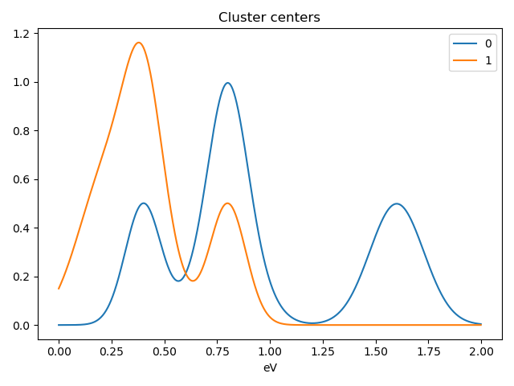

Cluster analysis
================

.. versionadded:: 1.6

Introduction
------------

`Cluster analysis <https://en.wikipedia.org/wiki/Cluster_analysis>`_ or clustering 
is the task of grouping a set of measurements such that measurements in the same 
group (called a cluster) are more similar (in some sense) to each other than to 
those in other groups (clusters).
A Hyperspy signal can represent a number of large arrays of different measurements
which can represent spectra, images or sets of paramaters.
Identifying and extracting trends from large datasets is often difficult and 
PCA, BSS, NMF and cluster analysis play an important role in this process. 

Cluster analysis, in essence, compares the "distances" (or similar metric) 
between different sets of measurements and groups those that are closest together.   
The features it groups can be raw data points, for example, comparing for 
every navigation dimension all points of a spectrum. However if the 
dataset is large the process of clustering can be computationally intensive so 
clustering is more commonly used on an extracted set of features or parameters.
For example, extraction of two peak positions of interest via a fitting process
rather than clustering all spectra points.

Decomposition or Blind Source Separation (PCA, NMF, BSS etc.) can produce a smaller set 
of features as it reduces the description of the data into a set of loadings and factors. 
The loadings capture a core representation of the features in the data and the factors 
provide the mixing ratios of these loadings that best describe the original data. 
Overall this represents a much smaller data volume compared to the original data 
and can helps to identify initial differences. Cluster analysis is then performed 
on the factors. 

A detailed description of the application of cluster analysis in x-ray
spectro-microscopy and further details on the theory and implementation can
be found in :ref:`[Lerotic2004] <Lerotic2004>`.

Nomenclature
------------

Taking the example of a 1D Signal of dimensions `(20, 10|4)` containing the
dataset, we say there are 200 *samples*. The four measured parameters are the
*features*. If we choose to search for 3 clusters within this dataset, we
derive two main values: the `labels`, of dimensions `(20, 10|3)` (each
sample is assigned a label to each cluster), and the `centers`, of
dimensions `(3, 4)` (each centre has a coordinate in each feature).
If you take all features within a given cluster and average them
this average set of features is the center of that cluster.

Clustering functions HyperSpy
-----------------------------

All HyperSpy signals have the following methods for clustering analysis:

* :py:meth:`~.learn.mva.MVA.cluster_analysis`
* :py:meth:`~.signal.MVATools.plot_cluster_results`
* :py:meth:`~.signal.MVATools.plot_cluster_labels`
* :py:meth:`~.signal.MVATools.plot_cluster_centers`
* :py:meth:`~.learn.mva.MVA.estimate_number_of_clusters`
* :py:meth:`~.learn.mva.MVA.plot_cluster_metric`

The :py:meth:`~.learn.mva.MVA.cluster_analysis` method can perform cluster
analysis using any `sklearn.clustering
<https://scikit-learn.org/stable/modules/clustering.html>`_ clustering
algorithms or any other object with a compatible API. This involves importing
the relevant algorithm class from scikit-learn. For convenience, the
``kmeans`` and ``agglomerative`` algorithms are imported internally.

For example:

.. code-block:: python

    >>> s.cluster_analysis(cluster_source="signal", n_clusters=3,
    algorithm="kmeans", n_init=8)

is equivalent to:

.. code-block:: python

    >>> from sklearn.cluster import KMeans
    >>> s.cluster_analysis(cluster_source="signal",
    algorithm=KMeans(n_clusters=3, n_init=8))

:py:meth:`~.learn.mva.MVA.cluster_analysis` computes the cluster labels. The
clusters areas with identical label are averaged to create a set of cluster
centers. This averaging can be performed on the ``signal`` itself, the
``bss`` or ``decomposition`` results or a user supplied signal.

Pre-processing
--------------

Cluster analysis measures the distances between features and groups them. It
is often necessary to pre-process the features in order to obtain meaningful
results.

For example, consider the case of a spectrum image. If the signal magnitude
varies strongly from spectra to spectra, then the
clustering would group the data into clusters based on differences in
magnitude. However, if the objective is to identify, for example, that peak 1
is the same as peak 2, then this magnitude variation needs to be removed and
the spectra should therefore all be normalized first to remove the effect of
peak height.

Similarly, pre-processing can also be useful to reveal clusters when
performing cluster analysis of decomposition results. Decomposition methods
decompose data into a set of components and a set of factors defining the
mixing needed to represent the data. If signal 1 is reduced to three
components with mixing 0.1 0.5 2.0, and signal 2 is reduced to a mixing of 0.2
1.0 4.0, it should be clear that these represent the same signal but with a
scaling difference. Normalization of the data can again be used to remove
scaling effects.

For the reasons described above the pre-processing step
will highly influence the results and should be evaluated for the problem
under investigation.

All pre-processing methods from (or compatible with) `sklearn.preprocessing
<https://scikit-learn.org/stable/modules/preprocessing.html>`_ can be passed
to the ``scaling`` keyword of the :py:meth:`~.learn.mva.MVA.cluster_analysis`
method. For convenience, the following methods from scikit-learn are
available as standard: ``standard`` , ``minmax`` and ``norm`` as
standard.Briefly, ``norm`` treats the features as a vector and normalizes the
vector length. ``standard`` re-scales each feature by removing the mean and
scaling to unit variance. ``minmax`` normalizes each feature between the
minimum and maximum range of that feature.

Examples
--------

Clustering using decomposition results
^^^^^^^^^^^^^^^^^^^^^^^^^^^^^^^^^^^^^^

Let's use the `make_blobs
<https://scikit-learn.org/stable/modules/generated/sklearn.datasets.make_blobs.html>`_
function supplied by `scikit-learn` to make dummy data to see how clustering
might work in practice.

.. code-block:: python

    >>> import hyperspy.api as hs
    >>> from sklearn.datasets import make_blobs
    >>> data = make_blobs(
    >>>         n_samples=500,
    >>>         n_features=3,
    >>>         shuffle=False)[0].reshape(50, 10, 4)
    >>> s = hs.signals.Signal1D(data)

make_blobs creates 3 distinct centres or 3 "types" of signal by default.
If we examine the signal using PCA we can see that there are 3 regions but
their interpretation of the signal is a little ambiguous.

.. code-block:: python

    >>> hs.plot.plot_images(data.T)

.. image:: images/clustering_data.png

To see how cluster analysis works it's best to first examine the signal.
Moving around the image you should be able to see 3 distinct regions in which
the 1D signal modulates slightly.

.. code-block:: python

    >>> s.plot()

If we then perform PCA we start to see the 3 regions a little more clearly but,
in general, it is not easy to interpret those results.

.. code-block:: python

    >>> s.decomposition()
    >>> s.plot_decomposition_loadings(comp_ids=3, axes_decor="off")

.. image:: images/clustering_decomposition_loadings.png

We can then cluster, using the decomposition results, to find similar regions
and the representative features in those regions. 
This indentifies 3 regions and the average 1D signals in 
those regions

.. code-block:: python

    >>> s.cluster_analysis(cluster_source="decomposition", number_of_components=3)
    >>> s.plot_cluster_labels(axes_decor="off")

.. image:: images/clustering_labels.png

To see what the labels the cluster algorithm has assigned you can inspect:

.. code-block:: python

    >>> s.learning_results.cluster_membership
    array([1, 1, 1, 1, 1, 1, 1, 1, 1, 1, 1, 1, 1, 1, 1, 1, 1, 1, 1, 1, 1, 1,
       1, 1, 1, 1, 1, 1, 1, 1, 1, 1, 1, 1, 1, 1, 1, 1, 1, 1, 1, 1, 1, 1,
       1, 1, 1, 1, 1, 1, 1, 1, 1, 1, 1, 1, 1, 1, 1, 1, 1, 1, 1, 1, 1, 1,
       1, 1, 1, 1, 1, 1, 1, 1, 1, 1, 1, 1, 1, 1, 1, 1, 1, 1, 1, 1, 1, 1,
       1, 1, 1, 1, 1, 1, 1, 1, 1, 1, 1, 1, 1, 1, 1, 1, 1, 1, 1, 1, 1, 1,
       1, 1, 1, 1, 1, 1, 1, 1, 1, 1, 1, 1, 1, 1, 1, 1, 1, 1, 1, 1, 1, 1,
       1, 1, 1, 1, 1, 1, 1, 1, 1, 1, 1, 1, 1, 1, 1, 1, 1, 1, 1, 1, 1, 1,
       1, 1, 1, 1, 1, 1, 1, 1, 1, 1, 1, 1, 1, 1, 1, 1, 1, 1, 1, 1, 1, 1,
       1, 1, 1, 1, 1, 1, 1, 1, 1, 1, 1, 1, 1, 1, 1, 1, 1, 1, 1, 1, 1, 1,
       1, 1, 1, 1, 1, 1, 1, 1, 1, 1, 1, 1, 1, 1, 1, 1, 1, 1, 1, 1, 1, 1,
       1, 1, 1, 1, 1, 1, 1, 1, 1, 1, 1, 1, 1, 1, 1, 1, 1, 1, 1, 1, 1, 1,
       1, 1, 1, 1, 1, 1, 1, 1, 1, 1, 1, 1, 1, 1, 1, 1, 1, 1, 1, 1, 1, 1,
       1, 1, 1, 1, 1, 1, 1, 1, 1, 1, 1, 1, 1, 1, 1, 1, 1, 1, 1, 1, 1, 1,
       1, 1, 1, 1, 1, 1, 1, 1, 1, 1, 1, 1, 1, 1, 1, 1, 1, 1, 1, 1, 1, 1,
       1, 1, 1, 1, 1, 1, 1, 1, 1, 1, 1, 1, 1, 1, 1, 1, 1, 1, 1, 1, 1, 1,
       1, 1, 1, 1, 0, 0, 0, 0, 0, 0, 0, 0, 0, 0, 0, 0, 0, 0, 0, 0, 0, 0,
       0, 0, 0, 0, 0, 0, 0, 0, 0, 0, 0, 0, 0, 0, 0, 0, 0, 0, 0, 0, 0, 0,
       0, 0, 0, 0, 0, 0, 0, 0, 0, 0, 0, 0, 0, 0, 0, 0, 0, 0, 0, 0, 0, 0,
       0, 0, 0, 0, 0, 0, 0, 0, 0, 0, 0, 0, 0, 0, 0, 0, 0, 0, 0, 0, 0, 0,
       0, 0, 0, 0, 0, 0, 0, 0, 0, 0, 0, 0, 0, 0, 0, 0, 0, 0, 0, 0, 0, 0,
       0, 0, 0, 0, 0, 0, 0, 0, 0, 0, 0, 0, 0, 0, 0, 0, 0, 0, 0, 0, 0, 0,
       0, 0, 0, 0, 0, 0, 0, 0, 0, 0, 0, 0, 0, 0, 0, 0, 0, 0, 0, 0, 0, 0,
       0, 0, 0, 0, 0, 0, 0, 0, 0, 0, 0, 0, 0, 0, 0, 0, 0, 0, 0, 0, 0, 0,
       0, 0, 0, 0, 0, 0, 0, 0, 0, 0, 0, 0, 0, 0, 0, 0, 0, 0, 0, 0, 0, 0,
       0, 0, 0, 0, 0, 0, 0, 0, 0, 0, 0, 0, 0, 0, 0, 0, 0, 0, 0, 0, 0, 0,
       0, 0, 0, 0, 0, 0, 0, 0, 0, 0, 0, 0, 0, 0, 0, 0, 0, 0, 0, 0, 0, 0,
       0, 0, 0, 0, 0, 0, 0, 0, 0, 0, 0, 0, 0, 0, 0, 0, 0, 0, 0, 0, 0, 0,
       0, 0, 0, 0, 0, 0, 0, 0, 0, 0, 0, 0, 0, 0, 0, 0, 0, 0, 0, 0, 0, 0,
       0, 0, 0, 0, 0, 0, 0, 0, 0, 0, 0, 0, 0, 0, 0, 0, 0, 0, 0, 0, 0, 0,
       0, 0, 0, 0, 0, 0, 0, 0, 0, 0, 0, 0, 0, 0, 0, 0, 0, 0, 0, 0, 0, 0,
       0, 0, 0, 0, 0, 0, 0, 2, 2, 2, 2, 2, 2, 2, 2, 2, 2, 2, 2, 2, 2, 2,
       2, 2, 2, 2, 2, 2, 2, 2, 2, 2, 2, 2, 2, 2, 2, 2, 2, 2, 2, 2, 2, 2,
       2, 2, 2, 2, 2, 2, 2, 2, 2, 2, 2, 2, 2, 2, 2, 2, 2, 2, 2, 2, 2, 2,
       2, 2, 2, 2, 2, 2, 2, 2, 2, 2, 2, 2, 2, 2, 2, 2, 2, 2, 2, 2, 2, 2,
       2, 2, 2, 2, 2, 2, 2, 2, 2, 2, 2, 2, 2, 2, 2, 2, 2, 2, 2, 2, 2, 2,
       2, 2, 2, 2, 2, 2, 2, 2, 2, 2, 2, 2, 2, 2, 2, 2, 2, 2, 2, 2, 2, 2,
       2, 2, 2, 2, 2, 2, 2, 2, 2, 2, 2, 2, 2, 2, 2, 2, 2, 2, 2, 2, 2, 2,
       2, 2, 2, 2, 2, 2, 2, 2, 2, 2, 2, 2, 2, 2, 2, 2, 2, 2, 2, 2, 2, 2,
       2, 2, 2, 2, 2, 2, 2, 2, 2, 2, 2, 2, 2, 2, 2, 2, 2, 2, 2, 2, 2, 2,
       2, 2, 2, 2, 2, 0, 2, 2, 2, 2, 2, 2, 2, 2, 2, 2, 2, 2, 2, 2, 2, 2,
       2, 2, 2, 2, 2, 2, 2, 2, 2, 2, 2, 2, 2, 2, 2, 2, 2, 2, 2, 2, 2, 2,
       2, 2, 2, 2, 2, 2, 2, 2, 2, 2, 2, 2, 2, 2, 2, 2, 2, 2, 2, 2, 2, 2,
       2, 2, 2, 2, 2, 2, 2, 2, 2, 2, 2, 2, 2, 2, 2, 2, 2, 2, 2, 2, 2, 2,
       2, 2, 2, 2, 2, 2, 2, 2, 2, 2, 2, 2, 2, 2, 2, 2, 2, 2, 2, 2, 2, 2,
       2, 2, 2, 2, 2, 2, 2, 2, 2, 2, 2, 2, 2, 2, 2, 2, 2, 2, 2, 2, 2, 2,
       2, 2, 2, 2, 2, 2, 2, 2, 2, 2])

Internally they are split into a ``cluster_labels`` array to help plotting and masking:

.. code-block:: python

    >>> s.learning_results.cluster_labels[0]
    array([0, 0, 0, 0, 0, 0, 0, 0, 0, 0, 0, 0, 0, 0, 0, 0, 0, 0, 0, 0, 0, 0,
       0, 0, 0, 0, 0, 0, 0, 0, 0, 0, 0, 0, 0, 0, 0, 0, 0, 0, 0, 0, 0, 0,
       0, 0, 0, 0, 0, 0, 0, 0, 0, 0, 0, 0, 0, 0, 0, 0, 0, 0, 0, 0, 0, 0,
       0, 0, 0, 0, 0, 0, 0, 0, 0, 0, 0, 0, 0, 0, 0, 0, 0, 0, 0, 0, 0, 0,
       0, 0, 0, 0, 0, 0, 0, 0, 0, 0, 0, 0, 0, 0, 0, 0, 0, 0, 0, 0, 0, 0,
       0, 0, 0, 0, 0, 0, 0, 0, 0, 0, 0, 0, 0, 0, 0, 0, 0, 0, 0, 0, 0, 0,
       0, 0, 0, 0, 0, 0, 0, 0, 0, 0, 0, 0, 0, 0, 0, 0, 0, 0, 0, 0, 0, 0,
       0, 0, 0, 0, 0, 0, 0, 0, 0, 0, 0, 0, 0, 0, 0, 0, 0, 0, 0, 0, 0, 0,
       0, 0, 0, 0, 0, 0, 0, 0, 0, 0, 0, 0, 0, 0, 0, 0, 0, 0, 0, 0, 0, 0,
       0, 0, 0, 0, 0, 0, 0, 0, 0, 0, 0, 0, 0, 0, 0, 0, 0, 0, 0, 0, 0, 0,
       0, 0, 0, 0, 0, 0, 0, 0, 0, 0, 0, 0, 0, 0, 0, 0, 0, 0, 0, 0, 0, 0,
       0, 0, 0, 0, 0, 0, 0, 0, 0, 0, 0, 0, 0, 0, 0, 0, 0, 0, 0, 0, 0, 0,
       0, 0, 0, 0, 0, 0, 0, 0, 0, 0, 0, 0, 0, 0, 0, 0, 0, 0, 0, 0, 0, 0,
       0, 0, 0, 0, 0, 0, 0, 0, 0, 0, 0, 0, 0, 0, 0, 0, 0, 0, 0, 0, 0, 0,
       0, 0, 0, 0, 0, 0, 0, 0, 0, 0, 0, 0, 0, 0, 0, 0, 0, 0, 0, 0, 0, 0,
       0, 0, 0, 0, 1, 1, 1, 1, 1, 1, 1, 1, 1, 1, 1, 1, 1, 1, 1, 1, 1, 1,
       1, 1, 1, 1, 1, 1, 1, 1, 1, 1, 1, 1, 1, 1, 1, 1, 1, 1, 1, 1, 1, 1,
       1, 1, 1, 1, 1, 1, 1, 1, 1, 1, 1, 1, 1, 1, 1, 1, 1, 1, 1, 1, 1, 1,
       1, 1, 1, 1, 1, 1, 1, 1, 1, 1, 1, 1, 1, 1, 1, 1, 1, 1, 1, 1, 1, 1,
       1, 1, 1, 1, 1, 1, 1, 1, 1, 1, 1, 1, 1, 1, 1, 1, 1, 1, 1, 1, 1, 1,
       1, 1, 1, 1, 1, 1, 1, 1, 1, 1, 1, 1, 1, 1, 1, 1, 1, 1, 1, 1, 1, 1,
       1, 1, 1, 1, 1, 1, 1, 1, 1, 1, 1, 1, 1, 1, 1, 1, 1, 1, 1, 1, 1, 1,
       1, 1, 1, 1, 1, 1, 1, 1, 1, 1, 1, 1, 1, 1, 1, 1, 1, 1, 1, 1, 1, 1,
       1, 1, 1, 1, 1, 1, 1, 1, 1, 1, 1, 1, 1, 1, 1, 1, 1, 1, 1, 1, 1, 1,
       1, 1, 1, 1, 1, 1, 1, 1, 1, 1, 1, 1, 1, 1, 1, 1, 1, 1, 1, 1, 1, 1,
       1, 1, 1, 1, 1, 1, 1, 1, 1, 1, 1, 1, 1, 1, 1, 1, 1, 1, 1, 1, 1, 1,
       1, 1, 1, 1, 1, 1, 1, 1, 1, 1, 1, 1, 1, 1, 1, 1, 1, 1, 1, 1, 1, 1,
       1, 1, 1, 1, 1, 1, 1, 1, 1, 1, 1, 1, 1, 1, 1, 1, 1, 1, 1, 1, 1, 1,
       1, 1, 1, 1, 1, 1, 1, 1, 1, 1, 1, 1, 1, 1, 1, 1, 1, 1, 1, 1, 1, 1,
       1, 1, 1, 1, 1, 1, 1, 1, 1, 1, 1, 1, 1, 1, 1, 1, 1, 1, 1, 1, 1, 1,
       1, 1, 1, 1, 1, 1, 1, 0, 0, 0, 0, 0, 0, 0, 0, 0, 0, 0, 0, 0, 0, 0,
       0, 0, 0, 0, 0, 0, 0, 0, 0, 0, 0, 0, 0, 0, 0, 0, 0, 0, 0, 0, 0, 0,
       0, 0, 0, 0, 0, 0, 0, 0, 0, 0, 0, 0, 0, 0, 0, 0, 0, 0, 0, 0, 0, 0,
       0, 0, 0, 0, 0, 0, 0, 0, 0, 0, 0, 0, 0, 0, 0, 0, 0, 0, 0, 0, 0, 0,
       0, 0, 0, 0, 0, 0, 0, 0, 0, 0, 0, 0, 0, 0, 0, 0, 0, 0, 0, 0, 0, 0,
       0, 0, 0, 0, 0, 0, 0, 0, 0, 0, 0, 0, 0, 0, 0, 0, 0, 0, 0, 0, 0, 0,
       0, 0, 0, 0, 0, 0, 0, 0, 0, 0, 0, 0, 0, 0, 0, 0, 0, 0, 0, 0, 0, 0,
       0, 0, 0, 0, 0, 0, 0, 0, 0, 0, 0, 0, 0, 0, 0, 0, 0, 0, 0, 0, 0, 0,
       0, 0, 0, 0, 0, 0, 0, 0, 0, 0, 0, 0, 0, 0, 0, 0, 0, 0, 0, 0, 0, 0,
       0, 0, 0, 0, 0, 1, 0, 0, 0, 0, 0, 0, 0, 0, 0, 0, 0, 0, 0, 0, 0, 0,
       0, 0, 0, 0, 0, 0, 0, 0, 0, 0, 0, 0, 0, 0, 0, 0, 0, 0, 0, 0, 0, 0,
       0, 0, 0, 0, 0, 0, 0, 0, 0, 0, 0, 0, 0, 0, 0, 0, 0, 0, 0, 0, 0, 0,
       0, 0, 0, 0, 0, 0, 0, 0, 0, 0, 0, 0, 0, 0, 0, 0, 0, 0, 0, 0, 0, 0,
       0, 0, 0, 0, 0, 0, 0, 0, 0, 0, 0, 0, 0, 0, 0, 0, 0, 0, 0, 0, 0, 0,
       0, 0, 0, 0, 0, 0, 0, 0, 0, 0, 0, 0, 0, 0, 0, 0, 0, 0, 0, 0, 0, 0,
       0, 0, 0, 0, 0, 0, 0, 0, 0, 0])

In this case we know there are 3 signals but for real examples it is difficult
to define the number of clusters to use. A number of metrics, such as elbow,
Silhouette and Gap can be used to determine the optimal number of clusters.
The elbow method measures the sum-of-squares of the distances within a
cluster and, as for the PCA decomposition, an "elbow" or point where the gains
diminish with increasing number of clusters indicates the ideal number of
clusters. Silhouette analysis measures how well separated clusters are and
can be used to determine the most likely number of clusters. As the scoring
is a measure of separation of clusters a number of solutions may occur and
maxima in the scores are used to indicate possible solutions. Gap analysis
is similar but compares the “gap” between the clustered data results and
those from a randomly data set of the same size. The largest gap indicates
the best clustering. The metric results can be plotted to check how
well-defined the clustering is.

.. code-block:: python

    >>> s.estimate_number_of_clusters(cluster_source="decomposition", metric="gap")
    >>> s.plot_cluster_metric()

.. image:: images/clustering_Gap.png

The optimal number of clusters can be set or accessed from the learning 
results

.. code-block:: python

    >>> s.learning_results.number_of_clusters
    3

Clustering using another signal as source
^^^^^^^^^^^^^^^^^^^^^^^^^^^^^^^^^^^^^^^^^

In this example we will perform clustering analysis on the position of two
peaks. The signals containing the position of the peaks can be computed for
example using :ref:`curve fitting <model-label>`. Given an existing fitted
model, the parameters can be extracted as signals and stacked. Clustering can
then be applied as described previously to identify trends in the fitted
results.

Let's start by creating a suitable synthetic dataset.

.. code-block:: python

    >>> import hyperspy.api as hs
    >>> import numpy as np
    >>> s_dummy = hs.signals.Signal1D(np.zeros((64, 64, 1000)))
    >>> s_dummy.axes_manager.signal_axes[0].scale = 2e-3
    >>> s_dummy.axes_manager.signal_axes[0].units = "eV"
    >>> s_dummy.axes_manager.signal_axes[0].name = "energy"
    >>> m = s_dummy.create_model()
    >>> m.append(hs.model.components1D.GaussianHF(fwhm=0.2))
    >>> m.append(hs.model.components1D.GaussianHF(fwhm=0.3))
    >>> m.components.GaussianHF.centre.map["values"][:32, :] = .3 + .1 * np.random.normal(size=(32, 64))
    >>> m.components.GaussianHF.centre.map["values"][32:, :] = .7 + .1 * np.random.normal(size=(32, 64))
    >>> m.components.GaussianHF_0.centre.map["values"][:, 32:] = m.components.GaussianHF.centre.map["values"][:, 32:] * 2
    >>> m.components.GaussianHF_0.centre.map["values"][:, :32] = m.components.GaussianHF.centre.map["values"][:, :32] * 0.5
    >>> for component in m:
    ...     component.centre.map["is_set"][:] = True 
    >>> s = m.as_signal()
    >>> stack = hs.stack([m.components.GaussianHF.centre.as_signal(),
    >>> hs.plot.plot_images(stack, axes_decor="off", colorbar="single",
    suptitle="")

.. image:: images/clustering_gaussian_centres.png

Let's now perform cluster analysis on the stack and calculate the centres using
the spectrum image. Notice that we don't need to fit the model to the data
because this is a synthetic dataset. When analyzing experimental data you will
need to fit the model first.

.. code-block:: python

    >>> stack = hs.stack([m.components.GaussianHF.centre.as_signal(), m.components.GaussianHF_0.centre.as_signal()])s.cluster_analysis(cluster_source=stack.T, source_for_centers=s, n_clusters=2)
    >>> s.plot_cluster_labels()

.. image:: images/clustering_gaussian_centres_labels.png

.. code-block:: python

    >>> s.plot_cluster_centers()

