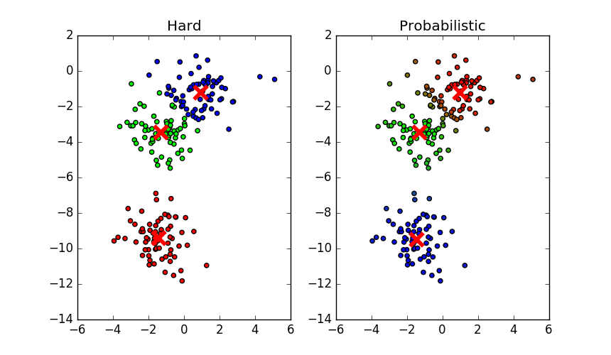

Clustering
**********

Introduction
============

Many real signals come in clusters - that is, there are clear
sets of data that have approximately the same parameters, well-separated from
other sets. Though multivariate analysis such as Singular Value Decomposition
*can* elucidate such clusters, it may be useful to invoke a clustering
algorithm specifically to analyse these types of data. HyperSpy supports the
`scikit-cmeans` package, which implements a number of Fuzzy C-means
algorithms that can be easily extended or altered. These are:

Hard
    Conventional k-means clustering. Each data point is assigned
    unambiguously to its nearest cluster center.

Probabilistic
    Each data point must have total membership equal to 1, divided between
    the derived cluster centers. Usually more accurate than hard clustering.

Possibilistic
    Each data point can have any membership between 0 and 1, and is highest
    closest to the cluster centers. This tends to result in overlapping
    clusters, but has a slightly more satisfying interpretation.

In addition, a "plugin" to either of the latter two algorithms
is available, known as the Gustafson-Kessel variation. This assigns a
covariance matrix to each cluster centre and redefines the distance metric to
take this into account, the upshot being the ability to derive clusters with
ellipsoidal character. Though slower than either algorithm alone, for some
data types the results can be much more intuitive.

Nomenclature
============

Taking the example of a 1D Signal of dimensions `(20, 10|4)` containing the
dataset, we say there are 200 *samples*. The four measured parameters are the
*features*. If we choose to search for 3 clusters within this dataset, we
derive two main values: the `membership`, of dimensions `(20, 10|3)` (each
sample is assigned a membership to each cluster), and the `centers`, of
dimensions `(3, 4)` (each centre has a coordinate in each feature).

Example
=======

We can use the `make_blobs` function supplied by `scikit-learn` to see how
clustering might work in practice.

.. code-block:: python

    import hyperspy.api as hs
    from sklearn.datasets import make_blobs
    import matplotlib.pyplot as plt
    data = hs.signals.Signal1D(
        make_blobs(
            n_samples=200,
            centers=2,
            shuffle=False
            )[0].reshape(20, 10, 2))

The resultant signal contains 2 distinct "types" of signal. Clustering them
is straightforward. Note that `use_decomposition_results` is set to `False`
here - as clustering is best performed on low-dimensional data, using the
decomposition loadings is the default behaviour. Here, the signal dimension
is sufficiently low to cluster the data directly.

.. code-block:: python

    data.cluster(2, use_decomposition_results=False)

By default, the algorithm used is `probabilistic`. It is useful to see how
this compares to the conventional k-means algorithm.

.. code-block:: python

    fig = plt.figure(figsize=(10, 5))
    ax = fig.add_subplot(121)
    ax.set_aspect('equal')

    data.cluster(3, algorithm="hard", use_decomposition_results=False, m=4)
    with data.unfolded():
        centers = data.learning_results.centers
        memberships = data.learning_results.memberships
        plt.scatter(data.data[:, 0], data.data[:, 1], c=memberships)
        plt.scatter(centers[:, 0], centers[:, 1], c="r", marker="x", s=180, linewidth=4)
    ax.set_title("Hard")

    ax = fig.add_subplot(122)
    ax.set_aspect('equal')
    data.cluster(3, algorithm="probabilistic", use_decomposition_results=False, m=4)
    with data.unfolded():
        centers = data.learning_results.centers
        memberships = data.learning_results.memberships
        plt.scatter(data.data[:, 0], data.data[:, 1], c=memberships)
        plt.scatter(centers[:, 0], centers[:, 1], c="r", marker="x", s=180, linewidth=4)
    ax.set_title("Probabilistic")

The colours here represent the cluster each data point belongs to, and the
intensity of the colour to some extent reflects the degree of membership. The
difference between the methods is evident - hard clustering cannot recognize
that points at the boundary between the overlapping clusters have ambiguous
membership, and could plausibly belong to either cluster. Probabilistic
clustering overcomes this problem, colorizing those points with a mixture of
the primary colours.

.. note::

    Setting `c=memberships` is a trick that only works with three clusters,
    as pyplot interprets each of the three memberships as an RGB colour
    intensity. For other numbers of clusters a more convoluted approach is
    required, beyond the scope of this example, but perhaps to be implemented
    in later versions.

   Hard vs Probabilistic Clustering