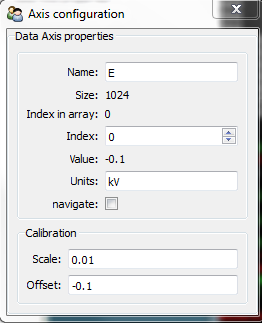
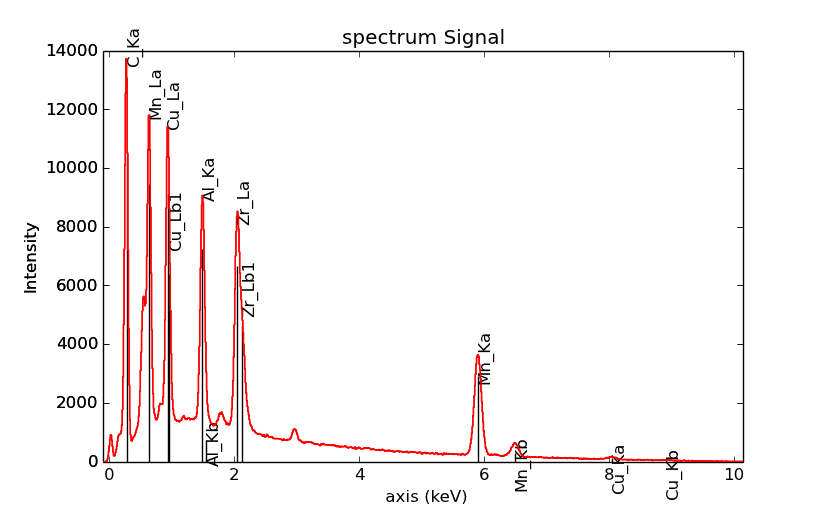
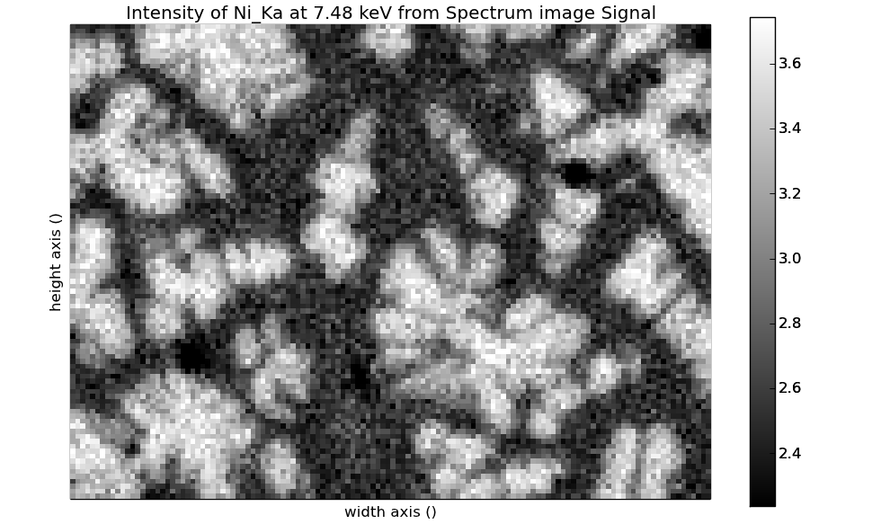
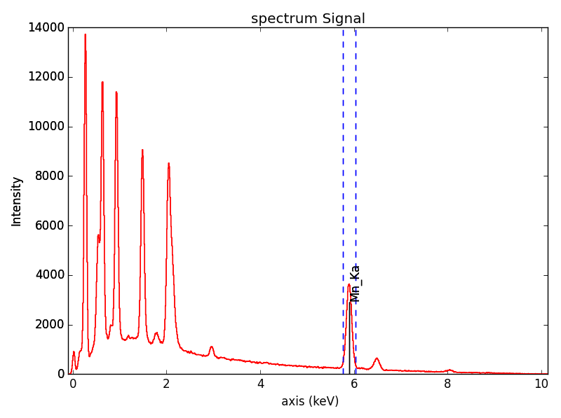
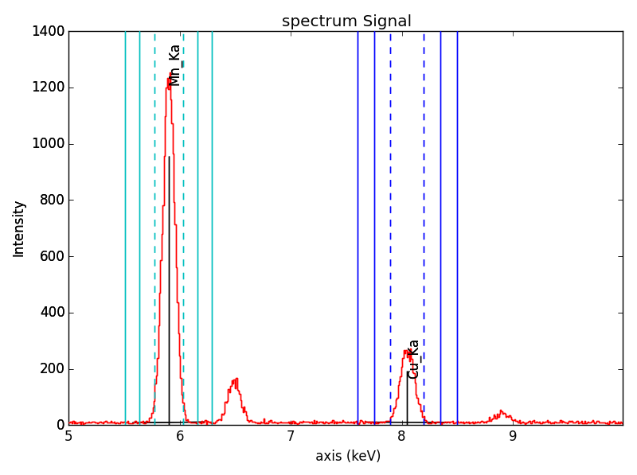

.. _eds-label:

Energy-Dispersive X-ray Spectrometry (EDS)
******************************************

The methods described in this chapter are specific to the following signals:

* :py:class:`~._signals.eds_tem.EDSTEMSpectrum`
* :py:class:`~._signals.eds_sem.EDSSEMSpectrum`

This chapter describes step-by-step the analysis of an EDS
spectrum (SEM or TEM).

.. NOTE::
    See also the `EDS tutorials <http://nbviewer.ipython.org/github/hyperspy/hyperspy-	demos/blob/master/electron_microscopy/EDS/>`_ .

Signal1D loading and parameters
-------------------------------

The sample and  data used in this section are described in [Burdet2013]_, and can be
downloaded using:

.. code-block:: python

    >>> from urllib import urlretrieve
    >>> url = 'http://cook.msm.cam.ac.uk//~hyperspy//EDS_tutorial//'
    >>> urlretrieve(url + 'Ni_superalloy_1pix.msa', 'Ni_superalloy_1pix.msa')
    >>> urlretrieve(url + 'Ni_superalloy_010.rpl', 'Ni_superalloy_010.rpl')
    >>> urlretrieve(url + 'Ni_superalloy_010.raw', 'Ni_superalloy_010.raw')

Loading data
^^^^^^^^^^^^

All data are loaded with the :py:func:`~.io.load` function, as described in detail in
:ref:`Loading files<loading_files>`. HyperSpy is able to import different formats,
among them ".msa" and ".rpl" (the raw format of Oxford Instruments and Brucker).

Here are three example for files exported by Oxford Instruments software (INCA).
For a single spectrum:

.. code-block:: python

    >>> s = hs.load("Ni_superalloy_1pix.msa")
    >>> s
    <Signal1D, title: Signal1D, dimensions: (|1024)>

For a spectrum image (The .rpl file is recorded as an image in this example,
The method :py:meth:`~.signal.BaseSignal.as_signal1D` set it back to a one
dimensional signal with the energy axis in first position):

.. code-block:: python

    >>> si = hs.load("Ni_superalloy_010.rpl").as_signal1D(0)
    >>> si
    <Signal1D, title: , dimensions: (256, 224|1024)>

Finally, for a stack of spectrum images, using "*" as a wildcard character:

.. code-block:: python

    >>> si4D = hs.load("Ni_superalloy_0*.rpl", stack=True)
    >>> si4D = si4D.as_signal1D(0)
    >>> si4D
    <Signal1D, title:, dimensions: (256, 224, 2|1024)>

.. _eds_calibration-label:

Microscope and detector parameters
^^^^^^^^^^^^^^^^^^^^^^^^^^^^^^^^^^

First, the signal type ("EDS_TEM" or "EDS_SEM") needs to be set with the
:py:meth:`~.signal.BaseSignal.set_signal_type` method. By assigning the class of
the object, specific EDS methods are made available.

.. code-block:: python

    >>> s = hs.load("Ni_superalloy_1pix.msa")
    >>> s.set_signal_type("EDS_SEM")
    >>> s
    <EDSSEMSpectrum, title: Signal1D, dimensions: (|1024)>

You can also specify the signal type as an argument of
the :py:func:`~.io.load` function:

.. code-block:: python

   >>> s = hs.load("Ni_superalloy_1pix.msa", signal_type="EDS_SEM")
   >>> s
   <EDSSEMSpectrum, title: Signal1D, dimensions: (|1024)>

HyperSpy will automatically load any existing  microscope parameters from the
file, and store them in the :py:attr:`~.signal.BaseSignal.metadata`
attribute (see :ref:`metadata_structure`). These parameters can be displayed
as follows:

.. code-block:: python

    >>> s = hs.load("Ni_superalloy_1pix.msa", signal_type="EDS_SEM")
    >>> s.metadata.Acquisition_instrument.SEM
    ├── Detector
    │   └── EDS
    │       ├── azimuth_angle = 63.0
    │       ├── elevation_angle = 35.0
    │       ├── energy_resolution_MnKa = 130.0
    │       ├── live_time = 0.006855
    │       └── real_time = 0.0
    ├── beam_current = 0.0
    ├── beam_energy = 15.0
    └── tilt_stage = 38.0

You can also set these parameters directly:

.. code-block:: python

    >>> s = hs.load("Ni_superalloy_1pix.msa", signal_type="EDS_SEM")
    >>> s.metadata.Acquisition_instrument.SEM.beam_energy = 30

or by using the
:py:meth:`~._signals.eds_tem.EDSTEMSpectrum.set_microscope_parameters` method:

.. code-block:: python

    >>> s = hs.load("Ni_superalloy_1pix.msa", signal_type="EDS_SEM")
    >>> s.set_microscope_parameters(beam_energy = 30)

or through the GUI:

.. code-block:: python

    >>> s = hs.load("Ni_superalloy_1pix.msa", signal_type="EDS_SEM")
    >>> s.set_microscope_parameters()

.. figure::  images/EDS_microscope_parameters_gui.png
   :align:   center
   :width:   350

   EDS microscope parameters preferences window

Any microscope and detector parameters that are not found in the imported file
will be set by default. These default values can be changed in the
:py:class:`~.defaults_parser.Preferences` class (see :ref:`preferences
<configuring-hyperspy-label>`).

.. code-block:: python

    >>> hs.preferences.EDS.eds_detector_elevation = 37

or through the GUI:

.. code-block:: python

    >>> hs.preferences.gui()

.. figure::  images/EDS_preferences_gui.png
   :align:   center
   :width:   400

   EDS preferences window

Energy axis
^^^^^^^^^^^

The size, scale and units of the energy axis are automatically imported from
the imported file, where they exist. These properties can also be set
or adjusted manually with the :py:class:`~.axes.AxesManager`
(see :ref:`Axis properties<Setting_axis_properties>` for more info):

.. code-block:: python

    >>> si = hs.load("Ni_superalloy_010.rpl", signal_type="EDS_TEM").as_signal1D(0)
    >>> si.axes_manager[-1].name = 'E'
    >>> si.axes_manager['E'].units = 'keV'
    >>> si.axes_manager['E'].scale = 0.01
    >>> si.axes_manager['E'].offset = -0.1

or through the GUI:

.. code-block:: python

    >>> si.axes_manager.gui()

   Axis properties window

Copying spectrum calibration
^^^^^^^^^^^^^^^^^^^^^^^^^^^^

All of the above parameters can be copied from one spectrum to another
with the :py:meth:`~._signals.eds_tem.EDSTEMSpectrum.get_calibration_from`
method.

.. code-block:: python

    >>> # s1pixel contains all the parameters
    >>> s1pixel = hs.load("Ni_superalloy_1pix.msa", signal_type="EDS_TEM")
    >>>
    >>> # si contains no parameters
    >>> si = hs.load("Ni_superalloy_010.rpl", signal_type="EDS_TEM").as_signal1D(0)
    >>>
    >>> # Copy all the properties of s1pixel to si
    >>> si.get_calibration_from(s1pixel)

.. _eds_sample-label:

Describing the sample
---------------------

The description of the sample is also stored in the
:py:attr:`~.signal.BaseSignal.metadata` attribute. It can be displayed using:

.. code-block:: python

    >>> s = hs.datasets.example_signals.EDS_TEM_Spectrum()
    >>> s.add_lines()
    >>> s.metadata.Sample.thickness = 100
    >>> s.metadata.Sample
    ├── description = FePt bimetallic nanoparticles
    ├── elements = ['Fe', 'Pt']
    ├── thickness = 100
    └── xray_lines = ['Fe_Ka', 'Pt_La']

The following methods are either called "set" or "add".

* "set" methods overwrite previously defined values
* "add" methods add to the previously defined values

Elements
^^^^^^^^

The elements present in the sample can be defined using the
:py:meth:`~._signals.eds.EDSSpectrum.set_elements`  and
:py:meth:`~._signals.eds.EDSSpectrum.add_elements` methods.  Only element
abbreviations are accepted:

.. code-block:: python

    >>> s = hs.datasets.example_signals.EDS_TEM_Spectrum()
    >>> s.set_elements(['Fe', 'Pt'])
    >>> s.add_elements(['Cu'])
    >>> s.metadata.Sample
    └── elements = ['Cu', 'Fe', 'Pt']

X-ray lines
^^^^^^^^^^^

Similarly, the X-ray lines can be defined using the
:py:meth:`~._signals.eds.EDSSpectrum.set_lines` and
:py:meth:`~._signals.eds.EDSSpectrum.add_lines` methods. The corresponding
elements will be added automatically.
Several lines per element can be defined at once.

.. code-block:: python

    >>> s = hs.datasets.example_signals.EDS_TEM_Spectrum()
    >>> s.set_elements(['Fe', 'Pt'])
    >>> s.set_lines(['Fe_Ka', 'Pt_La'])
    >>> s.add_lines(['Fe_La'])
    >>> s.metadata.Sample
    ├── elements = ['Fe', 'Pt']
    └── xray_lines = ['Fe_Ka', 'Fe_La', 'Pt_La']

The X-ray lines can also be defined automatically, if the beam energy is set.
The most excited X-ray line is selected per element (highest energy above an
overvoltage of 2 (< beam energy / 2)):

.. code-block:: python

    >>> s = hs.datasets.example_signals.EDS_SEM_Spectrum()
    >>> s.set_elements(['Al', 'Cu', 'Mn'])
    >>> s.set_microscope_parameters(beam_energy=30)
    >>> s.add_lines()
    >>> s.metadata.Sample
    ├── elements = ['Al', 'Cu', 'Mn']
    └── xray_lines = ['Al_Ka', 'Cu_Ka', 'Mn_Ka']

.. code-block:: python

    >>> s.set_microscope_parameters(beam_energy=10)
    >>> s.set_lines([])
    >>> s.metadata.Sample
    ├── elements = ['Al', 'Cu', 'Mn']
    └── xray_lines = ['Al_Ka', 'Cu_La', 'Mn_La']

A warning is raised if you try to set an X-ray line higher than the beam energy:

.. code-block:: python

    >>> s = hs.datasets.example_signals.EDS_SEM_Spectrum()
    >>> s.set_elements(['Mn'])
    >>> s.set_microscope_parameters(beam_energy=5)
    >>> s.add_lines(['Mn_Ka'])
    Warning: Mn Ka is above the data energy range.

Elemental database
^^^^^^^^^^^^^^^^^^

HyperSpy includes an elemental database, which contains the energy of the X-ray lines.

.. code-block:: python

    >>> hs.material.elements.Fe.General_properties
    ├── Z = 26
    ├── atomic_weight = 55.845
    └── name = iron
    >>> hs.material.elements.Fe.Physical_properties
    └── density (g/cm^3) = 7.874
    >>> hs.material.elements.Fe.Atomic_properties.Xray_lines
    ├── Ka
    │   ├── energy (keV) = 6.404
    │   └── weight = 1.0
    ├── Kb
    │   ├── energy (keV) = 7.0568
    │   └── weight = 0.1272
    ├── La
    │   ├── energy (keV) = 0.705
    │   └── weight = 1.0
    ├── Lb3
    │   ├── energy (keV) = 0.792
    │   └── weight = 0.02448
    ├── Ll
    │   ├── energy (keV) = 0.615
    │   └── weight = 0.3086
    └── Ln
        ├── energy (keV) = 0.62799
        └── weight = 0.12525

.. _eds_plot-label:

Finding elements from energy
^^^^^^^^^^^^^^^^

To find the nearest X-ray line for a given energy, use the utility function
:py:meth:`~.utils.eds.get_xray_lines_near_energy` to search the elemental
database:

.. code-block:: python

    >>> s = hs.datasets.example_signals.EDS_SEM_Spectrum()
    >>> P = s.find_peaks1D_ohaver(maxpeakn=1)[0]
    >>> hs.eds.get_xray_lines_near_energy(P['position'], only_lines=['a', 'b'])
    ['C_Ka', 'Ca_La', 'B_Ka']

The lines are returned in order of distance from the specified energy, and can
be limited by additional, optional arguments.

.. _eds_absorption_db-label

Mass absorption coefficient database
^^^^^^^^^^^^^^^^^^^^^^^^^^^^^^^^^^^^

A mass absorption coefficient database [Chantler2005]_ is available:

.. code-block:: python

    >>> hs.material.mass_absorption_coefficient(
    >>>     element='Al', energies=['C_Ka','Al_Ka'])
    array([ 26330.38933818,    372.02616732])

.. code-block:: python

    >>> hs.material.mass_absorption_mixture(
    >>>     elements=['Al','Zn'], weight_percent=[50,50], energies='Al_Ka')
    2587.4161643905127

.. _eds_plot-label:

Plotting
--------

You can visualize an EDS spectrum using the :py:meth:`~.signals.eds.EDSSpectrum.plot`
method (see :ref:`visualisation<visualization-label>`). For example:

.. code-block:: python

    >>> s = hs.datasets.example_signals.EDS_SEM_Spectrum()
    >>> s.plot()

.. figure::  images/EDS_plot_spectrum.png
   :align:   center
   :width:   500

   EDS spectrum

An example of multi-dimensional EDS data (e.g. 3D SEM-EDS) is given in
:ref:`visualisation multi-dimension<visualization_multi_dim>`.

.. _eds_plot_markers-label:

Plotting X-ray lines
^^^^^^^^^^^^^^^^^^^^

.. versionadded:: 0.8

X-ray lines can be added as plot labels with :py:meth:`~.signals.eds.EDSSpectrum.plot`.
The lines are either retrieved from "metadata.Sample.Xray_lines",
or selected with the same method as :py:meth:`~._signals.eds.EDSSpectrum.add_lines`
using the elements in "metadata.Sample.elements".

.. code-block:: python

    >>> s = hs.datasets.example_signals.EDS_SEM_Spectrum()
    >>> s.add_elements(['C','Mn','Cu','Al','Zr'])
    >>> s.plot(True)

   EDS spectrum plot with line markers

You can also select a subset of lines to label:

.. code-block:: python

    >>> s = hs.datasets.example_signals.EDS_SEM_Spectrum()
    >>> s.add_elements(['C','Mn','Cu','Al','Zr'])
    >>> s.plot(True, only_lines=['Ka','b'])

.. figure::  images/EDS_plot_Xray_a.png
   :align:   center
   :width:   500

   EDS spectrum plot with a selection of line markers

.. _get_lines_intensity:

Geting the intensity of an X-ray line
-------------------

.. versionadded:: 0.8

The sample and data used in this section are described in [Rossouw2015]_, and
can be downloaded using:

.. code-block:: python

    >>> from urllib import urlretrieve
    >>> url = 'http://cook.msm.cam.ac.uk//~hyperspy//EDS_tutorial//'
    >>> urlretrieve(url + 'core_shell.hdf5', 'core_shell.hdf5')

The width of integration is defined by extending the energy resolution of
Mn Ka to the peak energy ("energy_resolution_MnKa" in metadata):

.. code-block:: python

    >>> s = hs.load('core_shell.hdf5')
    >>> s.get_lines_intensity(['Fe_Ka'], plot_result=True)

   Iron map as computed and displayed by ``get_lines_intensity``

The X-ray lines defined in "metadata.Sample.Xray_lines" (see above)
are used by default:

.. code-block:: python

    >>> s = hs.load('core_shell.hdf5')
    >>> s.set_lines(['Fe_Ka', 'Pt_La'])
    >>> s.get_lines_intensity()
    [<Signal2D, title: X-ray line intensity of Core shell: Fe_Ka at 6.40 keV, dimensions: (|64, 64)>,
    <Signal2D, title: X-ray line intensity of Core shell: Pt_La at 9.44 keV, dimensions: (|64, 64)>]

Finally, the windows of integration can be visualised using :py:meth:`~._signals.eds.EDSSpectrum.plot` method:

.. code-block:: python

    >>> s = hs.datasets.example_signals.EDS_TEM_Spectrum()[5.:13.]
    >>> s.add_lines()
    >>> s.plot(integration_windows='auto')

   EDS spectrum with integration windows markers

.. _eds_background_subtraction-label:

Background subtraction
^^^^^^^^^^^^^^^^^^^^^^

.. versionadded:: 0.8

The background can be subtracted from the X-ray intensities with
:py:meth:`~._signals.eds.EDSSpectrum.get_lines_intensity`.
The background value is obtained by averaging the intensity in two
windows on each side of the X-ray line.
The position of the windows can be estimated using
:py:meth:`~._signals.eds.EDSSpectrum.estimate_background_windows`, and
can be plotted using :py:meth:`~._signals.eds.EDSSpectrum.plot`:

.. code-block:: python

    >>> s = hs.datasets.example_signals.EDS_TEM_Spectrum()[5.:13.]
    >>> s.add_lines()
    >>> bw = s.estimate_background_windows(line_width=[5.0, 2.0])
    >>> s.plot(background_windows=bw)
    >>> s.get_lines_intensity(background_windows=bw, plot_result=True)

   EDS spectrum with background subtraction markers.

.. _eds_quantification-label:

EDS Quantification
------------------

.. versionadded:: 0.8 EDS Quantification

.. versionadded:: 1.0 zeta-factors and ionization cross sections

HyperSpy now includes three methods for EDS quantification:

* Cliff-Lorimer
* Zeta-factors
* Ionization cross sections

Quantification must be applied to the background-subtracted intensities, which can
be found using :py:meth:`~._signals.eds.EDSSpectrum.get_lines_intensity`.
The quantification of these intensities can then be calculated using
:py:meth:`~._signals.eds_tem.EDSTEMSpectrum.quantification`.

The quantification method needs be specified as either 'CL', 'zeta', or 'cross_section'.
If no method is specified, the function will raise an exception.

A list of factors or cross sections should be supplied in the same order as the listed intensities
(please note that HyperSpy intensities in :py:meth:~._signals.eds.EDSSpectrum.get_lines_intensity
are in alphabetical order).

A set of k-factors can be usually found in the EDS manufacturer software
although determination from standard samples for the particular instrument used
is usually preferable. In the case of zeta-factors and cross sections, these must
be determined experimentally using standards.

Zeta-factors should be provided in units of kg/m^2. The method is described further in [Watanabe1996]_ and [Watanabe2006]_ .
Cross sections should be provided in units of barns (b). Further details on the cross section method can be found in [MacArthur2016]_ .
Conversion between zeta-factors and cross sections is possible using :py:meth:~._misc.eds.util.edx_cross_section_to_zeta or :py:meth:~._misc.eds.util.zeta_to_edx_cross_section .

Using the Cliff-Lorimer method as an example, quantification can be carried out as follows:

.. code-block:: python

    >>> s = hs.datasets.example_signals.EDS_TEM_Spectrum()
    >>> s.add_lines()
    >>> kfactors = [1.450226, 5.075602] #For Fe Ka and Pt La
    >>> bw = s.estimate_background_windows(line_width=[5.0, 2.0])
    >>> intensities = s.get_lines_intensity(background_windows=bw)
    >>> atomic_percent = s.quantification(intensities, method='CL', kfactors)
    Fe (Fe_Ka): Composition = 15.41 atomic percent
    Pt (Pt_La): Composition = 84.59 atomic percent

The obtained composition is in atomic percent, by default. However, it can be
transformed into weight percent either with the option :py:meth:`~._signals.eds_tem.EDSTEMSpectrum.quantification`:

.. code-block:: python

    >>> # With s, intensities and kfactors from before
    >>> s.quantification(intensities, method='CL',kfactors,
    >>>                  composition_units='weight')
    Fe (Fe_Ka): Composition = 4.96 weight percent
    Pt (Pt_La): Composition = 95.04 weight percent

or using :py:func:`~.misc.material.atomic_to_weight`:

.. code-block:: python

    >>> # With atomic_percent from before
    >>> weight_percent = hs.material.atomic_to_weight(atomic_percent)

The reverse method is :py:func:`~.misc.material.weight_to_atomic`.

The zeta-factor method needs both the 'beam_current' (in nA) and the acquisition
or dwell time (referred to as 'real_time' in seconds) in order to obtain an accurate
quantification. Both of the these parameters can be assigned to the metadata using:

.. code-block:: python

    >>> s.set_microscope_parameters(beam_current=0.5)
    >>> s.set_microscope_parameters(real_time=1.5)

If these parameters are not set, the code will produce an error.
The zeta-factor method will produce two sets of results. Index [0] contains the
composition maps for each element in atomic percent, and index [1] contains the mass-thickness map.

The cross section method needs the 'beam_current', dwell time ('real_time') and probe area
in order to obtain an accurate quantification. The 'beam_current' and 'real_time' can be set as shown above.
The 'probe_area' (in nm^2) can be defined in two different ways.

If the probe diameter is narrower than the pixel width, then the probe is being
under-sampled and an estimation of the probe area needs to be used. This can be added
to the metadata with:

.. code-block: python

    >>> s.set_microscope_parameters(probe_area=0.00125)

Alternatively, if sub-pixel scanning is used (or the spectrum map was recorded
at a high spatial sampling and subsequently binned into much larger pixels) then
the illumination area becomes the pixel area of the spectrum image. This is a much
more accurate approach for quantitative EDS and should be used where possible.
The pixel width could either be added to the metadata by putting the pixel area
in as the 'probe_area' (above) or by calibrating the spectrum image
(see :ref:`Setting axis properties`).

Either approach will provide an illumination area for the cross_section
quantification. If the pixel width is not set, the code will still run with the
default value of 1 nm with a warning message to remind the user that this is the case.

The cross section method will produce two sets of results. Index [0] contains the
composition maps for each element in atomic percent and index [1] is the
number of atoms per pixel for each element.

.. NOTE::

    Please note that the function does not assume square pixels, so both the x and y pixel
    dimensions must be set. For quantification of line scans, rather than spectrum images,
    the pixel area should be added to the metadata as above.

.. _eds_fitting-label:

EDS curve fitting
-----------------

The intensity of X-ray lines can be extracted using curve-fitting in HyperSpy.
This example uses an EDS-SEM spectrum of a a test material (EDS-TM001) provided
by `BAM <http://www.webshop.bam.de>`_.

First, we load the spectrum, define the chemical composition of the sample and
set the beam energy:

.. code-block:: python

    >>> s = hs.load('bam.msa')
    >>> s.add_elements(['Al', 'Ar', 'C', 'Cu', 'Mn', 'Zr'])
    >>> s.set_microscope_parameters(beam_energy=10)

Next, the model is created with :py:func:`~._signals.eds_sem.create_model`. One
Gaussian is automatically created per X-ray line, along with a polynomial for
the background.

.. code-block:: python

    >>> m = s.create_model()
    >>> m.print_current_values()

    Components    Parameter    Value
    Al_Ka
                  A            65241.4
    Al_Kb
    Ar_Ka
                  A            3136.88
    Ar_Kb
    C_Ka
                  A            79258.9
    Cu_Ka
                  A            1640.8
    Cu_Kb
    Cu_La
                  A            74032.6
    Cu_Lb1
    Cu_Ln
    Cu_Ll
    Cu_Lb3
    Mn_Ka
                  A            47796.6
    Mn_Kb
    Mn_La
                  A            73665.7
    Mn_Ln
    Mn_Ll
    Mn_Lb3
    Zr_La
                  A            68703.8
    Zr_Lb1
    Zr_Lb2
    Zr_Ln
    Zr_Lg3
    Zr_Ll
    Zr_Lg1
    Zr_Lb3
    background_order_6

The width and the energies are fixed, while the heights of the sub-X-ray lines are linked
to the main X-ray lines (alpha lines). The model can now be fitted:

.. code-block:: python

    >>> m.fit()

The background fitting can be improved with :py:meth:`~.models.edsmodel.EDSModel.fit_background`
by enabling only energy ranges containing no X-ray lines:

.. code-block:: python

    >>> m.fit_background()

The width of the X-ray lines is defined from the energy resolution (FWHM at Mn Ka)
provided by `energy_resolution_MnKa` in `metadata`. This parameters can be calibrated
by fitting with :py:meth:`~.models.edsmodel.EDSModel.calibrate_energy_axis`:

.. code-block:: python

    >>> m.calibrate_energy_axis(calibrate='resolution')
    Energy resolution (FWHM at Mn Ka) changed from 130.000000 to 131.927922 eV

Fine-tuning of specific X-ray lines can be achieved using :py:meth:`~.models.edsmodel.EDSModel.calibrate_xray_lines`:

.. code-block:: python

    >>> m.calibrate_xray_lines('energy', ['Ar_Ka'], bound=10)
    >>> m.calibrate_xray_lines('width', ['Ar_Ka'], bound=10)
    >>> m.calibrate_xray_lines('sub_weight', ['Mn_La'], bound=10)

The result of the fit is obtained with the :py:meth:`~.models.edsmodel.EDSModel.get_lines_intensity` method.

.. code-block:: python

    >>> result = m.get_lines_intensity(plot_result=True)
    Al_Ka at 1.4865 keV : Intensity = 65241.42
    Ar_Ka at 2.9577 keV : Intensity = 3136.88
    C_Ka at 0.2774 keV : Intensity = 79258.95
    Cu_Ka at 8.0478 keV : Intensity = 1640.80
    Cu_La at 0.9295 keV : Intensity = 74032.56
    Mn_Ka at 5.8987 keV : Intensity = 47796.57
    Mn_La at 0.63316 keV : Intensity = 73665.70
    Zr_La at 2.0423 keV : Intensity = 68703.75

Finally, we visualize the result:

.. code-block:: python

    >>> m.plot()

.. figure::  images/EDS_fitting.png
   :align:   center
   :width:   500

The following methods can be used to enable/disable different functionalities of
X-ray lines when fitting:

* :py:meth:`~.models.edsmodel.EDSModel.free_background`
* :py:meth:`~.models.edsmodel.EDSModel.fix_background`
* :py:meth:`~.models.edsmodel.EDSModel.enable_xray_lines`
* :py:meth:`~.models.edsmodel.EDSModel.disable_xray_lines`
* :py:meth:`~.models.edsmodel.EDSModel.free_sub_xray_lines_weight`
* :py:meth:`~.models.edsmodel.EDSModel.fix_sub_xray_lines_weight`
* :py:meth:`~.models.edsmodel.EDSModel.free_xray_lines_energy`
* :py:meth:`~.models.edsmodel.EDSModel.fix_xray_lines_energy`
* :py:meth:`~.models.edsmodel.EDSModel.free_xray_lines_width`
* :py:meth:`~.models.edsmodel.EDSModel.fix_xray_lines_width`
