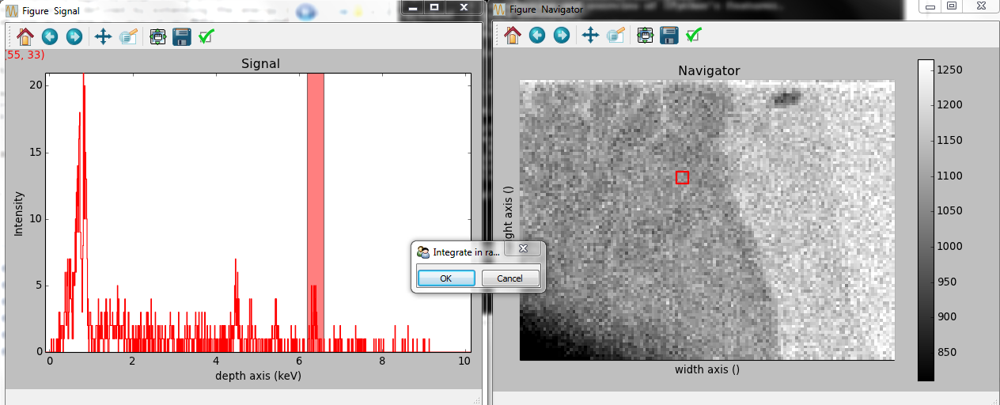

.. _eds-label:

Energy-Dispersive X-Rays Spectrometry (EDS)
******************************************

.. versionadded:: 0.7

The methods described here are specific to the following signals:

* :py:class:`~._signals.eds_tem.EDSTEMSpectrum`
* :py:class:`~._signals.eds_sem.EDSSEMSpectrum`

This chapter described step by step a qualitative analysis of an EDS 
spectrum (SEM or TEM). 

Spectrum loading and parameters
-------------------------------

Loading
^^^^^^^^

All data are loaded with the :py:func:`~.io.load` function, as described in details in 
:ref:`Loading files<loading_files>`. HyperSpy is able to import different formats,
among them ".msa" and ".rpl" (the raw format of Oxford Instrument and Brucker). 

Here is three example for files exported by Oxford Instrument software (INCA).
For a single spectrum:

.. code-block:: python

    >>> spec = load("spectrum.msa")    
    
For a spectrum_image (The .rpl file is recorded as an image in this example,
The method :py:meth:`~.signal.Signal.as_spectrum` set it back to a spectrum
with the energy axis in first position):

.. code-block:: python

    >>> spec_img = load("spectrum_image.rpl").as_spectrum(0)   
    
For a stack of spectrum_images (The "*" replace all chains of string, in this
example 01, 02, 03,...):

.. code-block:: python

    >>> spec_img_3D = load("spectrum_image_*.rpl",stack=True)  
    >>> spec_img_3D = spec_img_3D.as_spectrum(0) 

.. _eds_calibration-label: 
   
Microscope and detector parameters
^^^^^^^^^^^^^^^^^^^^^^^^^^^^^^^^^^

First, the type of microscope ("EDS_TEM" or "EDS_SEM") needs to be set with the 
:py:meth:`~.signal.Signal.set_signal_type` method. The class of the
object is thus assigned, and specific EDS methods become available.

.. code-block:: python

    >>> spec.set_signal_type("EDS_TEM")
    
or as an argument of the :py:func:`~.io.load` function:
    
.. code-block:: python
    
    >>> spec = load("spectrum.msa",signal_type="EDS_TEM")
    
The main values for the energy axis and the microscope parameters are 
automatically imported from the file, if existing. The microscope and 
detector parameters are stored in stored in the 
:py:attr:`~.signal.Signal.metadata` 
attribute (see :ref:`metadata_structure`). These parameters can be displayed
as follow:
    
.. code-block:: python

    >>> spec.metadata.Acquisition_instrument.TEM
    ├── Detector
    │   └── EDS
    │       ├── azimuth_angle = 0.0
    │       ├── elevation_angle = 37.0
    │       ├── energy_resolution_MnKa = 130.0
    │       ├── live_time = 30.0
    │       └── real_time = 55.0
    ├── beam_current = 0.0
    ├── beam_energy = 300
    └── tilt_stage = 36.0    

These parameters can be set directly:

.. code-block:: python

    >>> spec.metadata.Acquisition_instrument.TEM.beam_energy = 300

or with the  
:py:meth:`~._signals.eds_tem.EDSTEMSpectrum.set_microscope_parameters` method:

.. code-block:: python

    >>> spec.set_microscope_parameters(beam_energy = 300)
    
or raising the gui:
    
.. code-block:: python

    >>> spec.set_microscope_parameters()
    
.. figure::  images/EDS_microscope_parameters_gui.png
   :align:   center
   :width:   350  
   
If the microscope and detector parameters are not written in the original file, some 
of them are set by default. The default values can be changed in the 
:py:class:`~.defaults_parser.Preferences` class (see :ref:`preferences
<configuring-hyperspy-label>`).

.. code-block:: python

    >>> preferences.EDS.eds_detector_elevation = 37
    
or raising the gui:

.. code-block:: python

    >>> preferences.gui()
    
.. figure::  images/EDS_preferences_gui.png
   :align:   center
   :width:   400 

Energy axis
^^^^^^^^^^^

The properties of the energy axis can be set manually with the :py:class:`~.axes.AxesManager`.
(see :ref:`Axis properties<Setting_axis_properties>` for more info):

.. code-block:: python

    >>> spec.axes_manager[-1].name = 'E'
    >>> spec.axes_manager['E'].units = 'kV'
    >>> spec.axes_manager['E'].scale = 0.01
    >>> spec.axes_manager['E'].offset = -0.1

or with the :py:meth:`~.axes.AxesManager.gui` method:

.. code-block:: python

    >>> spec.axes_manager.gui()
    
.. figure::  images/EDS_energy_axis_gui.png
   :align:   center
   :width:   280 
   
Related method
^^^^^^^^^^^^^^

All the above parameters can be copy from one spectrum to another one
with the :py:meth:`~._signals.eds_tem.EDSTEMSpectrum.get_calibration_from`
method.

.. code-block:: python

    >>> # Load spectrum.msa which contains the parameters
    >>> spec = load("spectrum.msa",signal_type="EDS_TEM")
    >>> # Load spectrum_image.rpl which contains no parameters
    >>> spec_img = load("spectrum_image.rpl",signal_type="EDS_TEM").as_spectrum(0)
    >>> # Set all the properties of spec to spec_img
    >>> spec_img.get_calibration_from(spec)
    
.. _eds_sample-label:
   
Describing the sample
---------------------

The description of the sample is stored in metadata.Sample (in the 
:py:attr:`~.signal.Signal.metadata` attribute). It can be displayed as
follow:

.. code-block:: python

    >>> spec.metadata.Sample
    ├── description = Sample 1.3
    ├── elements = ['Al', 'Ni', 'Ti']
    ├── thickness = 100
    └── xray_lines = ['Al_Ka', 'Ni_La', 'Ti_Ka']

The following methods are either called "set" or "add". When "set" 
methods erases all previously defined values, the "add" methods add the
values to the previously defined values.

Elements
^^^^^^^^

The elements present in the sample can be defined with the
:py:meth:`~._signals.eds.EDSSpectrum.set_elements`  and  
:py:meth:`~._signals.eds.EDSSpectrum.add_elements` methods.  Only element
abbreviations are accepted:

.. code-block:: python

    >>> spec.set_elements(["Ni","Ti","Al"])
    >>> spec.add_elements(["Ta"])
    >>> spec.metadata.Sample
    └── elements = ['Al', 'Ni', 'Ta', 'Ti']

X-ray lines
^^^^^^^^^^^

Similarly, the X-ray lines can be defined with the 
:py:meth:`~._signals.eds.EDSSpectrum.set_lines` and 
:py:meth:`~._signals.eds.EDSSpectrum.add_lines` methods. The corresponding 
elements will be added automatically. Several lines per elements can be defined. 

.. code-block:: python

    >>> spec.set_elements(["Ni","Ti","Al"])
    >>> spec.set_lines(["Ni_La","Ti_Ka","Al_Ka"])
    >>> spec.add_lines(["Ti_La"])
    >>> spec.metadata.Sample
    ├── elements = ['Al', 'Ni', 'Ti'] 
    └── xray_lines = ['Al_Ka', 'Ni_La', 'Ti_Ka', 'Ti_La']  
    
These methods can be used automatically, if the beam energy is set. 
The most excited X-ray line is selected per element (highest energy above an 
overvoltage of 2 (< beam energy / 2)).

.. code-block:: python

    >>> spec.set_elements(["Ni","Ti","Al"])
    >>> spec.metadata.Acquisition_instrument.TEM.beam_energy = 30
    >>> spec.add_lines()
    >>> spec.metadata.Sample
    ├── elements = ['Al', 'Ni', 'Ti']
    └── Xray_lines = ['Al_Ka', 'Ni_Ka', 'Ti_Ka']
    >>> spec.metadata.Acquisition_instrument.TEM.beam_energy = 5
    >>> spec.add_lines()
    >>> spec.metadata.Sample
    ├── elements = ['Al', 'Ni', 'Ti']
    └── Xray_lines = ['Al_Ka', 'Ni_La', 'Ti_La']
    
A warning is raised, if setting a X-ray lines higher than the beam energy.

.. code-block:: python

    >>> spec.metadata.Acquisition_instrument.TEM.beam_energy = 5
    >>> spec.add_lines(["Ta_Ka"])
    Warning: Ta Ka is above the data energy range.

            
Element database
^^^^^^^^^^^^^^^^

An elemental database is available with the energy of the X-ray lines. 

.. code-block:: python

    >>>  utils.material.elements.Fe.General_properties
    ├── Z = 26
    ├── atomic_weight = 55.845
    └── name = iron
    >>>  utils.material.elements.Fe.Physical_properties
    └── density (g/cm^3) = 7.874
    >>>  utils.material.elements.Fe.Atomic_properties.Xray_lines
    ├── Ka
    │   ├── energy (keV) = 6.404
    │   └── factor = 1
    ├── Kb
    │   ├── energy (keV) = 7.0568
    │   └── factor = 0.1
    ├── La
    │   ├── energy (keV) = 0.705
    │   └── factor = 1
    ├── Lb3
    │   ├── energy (keV) = 0.792
    │   └── factor = 0.08
    ├── Ll
    │   ├── energy (keV) = 0.615
    │   └── factor = 0.04
    └── Ln
        ├── energy (keV) = 0.62799
        └── factor = 0.01

.. _eds_plot-label: 

Plotting
--------

As decribed in :ref:`visualisation<visualization-label>`, the 
:py:meth:`~.signal.Signal.plot` method can be used:

.. code-block:: python

    >>> spec.plot()

.. figure::  images/EDS_plot_spectrum.png
   :align:   center
   :width:   500   
   
An example of plotting EDS data of higher dimension (3D SEM-EDS) is given in
:ref:`visualisation multi-dimension<visualization_multi_dim>`.

Plot X-ray lines
^^^^^^^^^^^^^^^^

X-ray lines can be labbeled on a plot with 
:py:meth:`~._signals.eds.EDSSpectrum.plot_Xray_lines`. The lines are 
either given, either retrieved from "metadata.Sample.Xray_lines",
or selected with the same method as 
:py:meth:`~._signals.eds.EDSSpectrum.add_lines` using the 
elements in "metadata.Sample.elements". 

.. code-block:: python

    >>> spec.add_elements(['C','Mn','Cu','Al','Zr'])
    >>> spec.plot_Xray_lines()

.. figure::  images/EDS_plot_Xray_default.png
   :align:   center
   :width:   500   
   
Selecting certain type of lines:
   
.. code-block:: python

    >>> spec.plot_Xray_lines(only_lines=['Ka','b'])

.. figure::  images/EDS_plot_Xray_a.png
   :align:   center
   :width:   500 

.. _get_lines_intensity:

Get lines intensity
^^^^^^^^^^^^^^^^^^^

The :py:meth:`~._signals.eds.EDSSpectrum.get_lines_intensity` 
method generates intensity maps by peak integration.
The width of integration is defined by extending the energy resolution of
Mn Ka to the peak energy ("energy_resolution_MnKa" in metadata). 

.. code-block:: python

    >>> spec_img.get_lines_intensity(['Ni_Ka'],plot_result=True)
    
.. figure::  images/EDS_get_lines_intensity.png
   :align:   center
   :width:   500 
   
The X-ray lines defined in "metadata.Sample.Xray_lines" (see above)
are used by default.
   
.. code-block:: python

    >>> spec_img.set_lines(["Ni_La","Ti_Ka","Al_Ka"])
    >>> spec_img.get_lines_intensity()
    [<Image, title: Intensity of Al_Ka at 1.49 keV from Spectrum image,
     dimensions: (|128, 95)>,
    <Image, title: Intensity of Ni_La at 0.85 keV from Spectrum image,
     dimensions: (|128, 95)>,
    <Image, title: Intensity of Ti_Ka at 4.51 keV from Spectrum image,
     dimensions: (|128, 95)>]
     
The :py:meth:`~.signal.Signal1DTools.integrate_in_range` 
method (see :ref:`spectrum tools<integrate_1D-label>`) provides
an interactive way to generate intensity map.

.. code-block:: python

    >>> spec.integrate_in_range()
    <Image, title: , dimensions: (|128, 95)>
    

