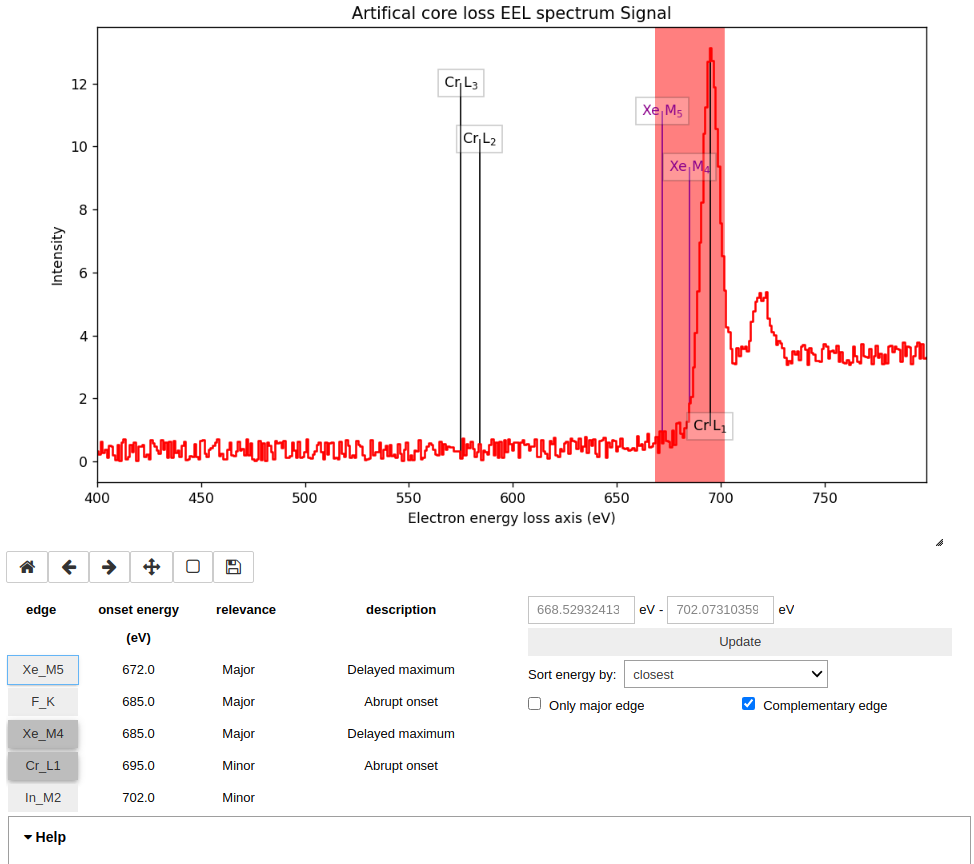
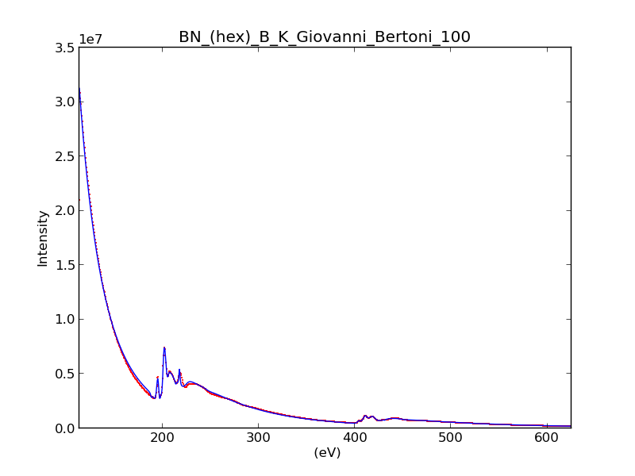

Electron Energy Loss Spectroscopy
*********************************

.. _eels_tools-label:

Tools for EELS data analysis
----------------------------

The functions described in this chapter are only available for the
:py:class:`~._signals.eels.EELSSpectrum` class. To transform a
:py:class:`~.signal.BaseSignal` (or subclass) into a
:py:class:`~._signals.eels.EELSSpectrum`:

.. code-block:: python

    >>> s.set_signal_type("EELS")

Note these chapter discusses features that are available only for
:py:class:`~._signals.eels.EELSSpectrum` class. However, this class inherits
many useful feature from its parent class that are documented in previous
chapters.

.. _eels_elemental_composition-label:

Elemental composition of the sample
^^^^^^^^^^^^^^^^^^^^^^^^^^^^^^^^^^^

It can be useful to define the elemental composition of the sample for
archiving purposes or to use some feature (e.g. curve fitting) that requires
this information.  The elemental composition of the sample can be declared
using :py:meth:`~._signals.eels.EELSSpectrum_mixin.add_elements`. The
information is stored in the :py:attr:`~.signal.BaseSignal.metadata`
attribute (see :ref:`metadata_structure`). This information is saved to file
when saving in the hspy format (HyperSpy's HDF5 specification).

An utility function :py:meth:`~.misc.eels.tools.get_edges_near_energy` can be
helpful to identify possible elements in the sample.
:py:meth:`~.misc.eels.tools.get_edges_near_energy` returns a list of edges
arranged in the order closest to the specified energy within a window, both
measured in eV. The size of the window can be controlled by the argument
`width` (default as 10)--- If the specified energy is 849 eV and the width is
6 eV, it returns a list of edges with onset energy between 846 eV to 852 eV and
they are arranged in the order closest to 849 eV.

.. code-block:: python

    >>> from hyperspy.misc.eels.tools import get_edges_near_energy
    >>> get_edges_near_energy(532)
    ['O_K', 'Pd_M3', 'Sb_M5', 'Sb_M4']
    >>> get_edges_near_energy(849, width=6)
    ['La_M4', 'Fe_L1']

`
The static method :py:meth:`~._signals.eels.EELSSpectrum_mixin.print_edges_near_energy`
in :py:class:`~._signals.eels.EELSSpectrum` will print out a table containing
more information about the edges.

.. code-block:: python

    >>> s = hs.datasets.artificial_data.get_core_loss_eels_signal()
    >>> s.print_edges_near_energy(401, width=20)
    +-------+-------------------+-----------+-----------------------------+
    |  edge | onset energy (eV) | relevance |         description         |
    +-------+-------------------+-----------+-----------------------------+
    |  N_K  |       401.0       |   Major   |         Abrupt onset        |
    | Sc_L3 |       402.0       |   Major   | Sharp peak. Delayed maximum |
    | Cd_M5 |       404.0       |   Major   |       Delayed maximum       |
    | Sc_L2 |       407.0       |   Major   | Sharp peak. Delayed maximum |
    | Mo_M2 |       410.0       |   Minor   |          Sharp peak         |
    | Mo_M3 |       392.0       |   Minor   |          Sharp peak         |
    | Cd_M4 |       411.0       |   Major   |       Delayed maximum       |
    +-------+-------------------+-----------+-----------------------------+

The method :py:meth:`~._signals.eels.EELSSpectrum_mixin.edges_at_energy` allows
inspecting different sections of the signal for interactive edge 
identification (the default). A region can be selected by dragging the mouse 
across the signal and after clicking the `Update` button, edges with onset 
energies within the selected energy range will be displayed. By toggling the 
edge buttons, it will put or remove the corresponding edges on the signal. When 
the `Complementary edge` box is ticked, edges outside the selected range with 
the same element of edges within the selected energy range will be shown as well 
to aid identification of edges.

.. code-block:: python

    >>> s = hs.datasets.artificial_data.get_core_loss_eels_signal()
    >>> s.edges_at_energy()

   Labels of edges can be put or remove by toggling the edge buttons.
    

.. _eels_thickness-label:

Thickness estimation
^^^^^^^^^^^^^^^^^^^^

.. versionadded:: 1.6
    Option to compute the absolute thickness, including the angular corrections
    and mean free path estimation.

The :py:meth:`~._signals.eels.EELSSpectrum_mixin.estimate_thickness` method can
estimate the thickness from a low-loss EELS spectrum using the log-ratio
method. If the beam energy, collection angle, convergence angle and sample
density are known, the absolute thickness is computed using the method in
:ref:`[Iakoubovskii2008] <Iakoubovskii2008>`. This includes the estimation of
the inelastic mean free path (iMFP). For more accurate results, it is possible
to input the iMFP of the material if known.  If the density and/or the iMFP are
not known, the output is the thickness relative to the (unknown) iMFP without
any angular corrections.

Zero-loss peak centre and alignment
^^^^^^^^^^^^^^^^^^^^^^^^^^^^^^^^^^^

The
:py:meth:`~._signals.eels.EELSSpectrum_mixin.estimate_zero_loss_peak_centre`
can be used to estimate the position of the zero-loss peak. The method assumes
that the ZLP is the most intense feature in the spectra. For a more general
approach see :py:meth:`~.signal.Signal1DTools.find_peaks1D_ohaver`.

The :py:meth:`~._signals.eels.EELSSpectrum_mixin.align_zero_loss_peak` can
align the ZLP with subpixel accuracy. It is more robust and easy to use than
:py:meth:`~.signal.Signal1DTools.align1D` for the task. Note that it is
possible to apply the same alignment to other spectra using the `also_align`
argument. This can be useful e.g. to align core-loss spectra acquired
quasi-simultaneously. If there are other features in the low loss signal
which are more intense than the ZLP, the `signal_range` argument can narrow
down the energy range for searching for the ZLP.

Deconvolutions
^^^^^^^^^^^^^^

Three deconvolution methods are currently available:

* :py:meth:`~._signals.eels.EELSSpectrum_mixin.fourier_log_deconvolution`
* :py:meth:`~._signals.eels.EELSSpectrum_mixin.fourier_ratio_deconvolution`
* :py:meth:`~._signals.eels.EELSSpectrum_mixin.richardson_lucy_deconvolution`

Estimate elastic scattering intensity
^^^^^^^^^^^^^^^^^^^^^^^^^^^^^^^^^^^^^

The
:py:meth:`~._signals.eels.EELSSpectrum_mixin.estimate_elastic_scattering_intensity`
can be used to calculate the integral of the zero loss peak (elastic intensity)
from EELS low-loss spectra containing the zero loss peak using the
(rudimentary) threshold method. The threshold can be global or spectrum-wise.
If no threshold is provided it is automatically calculated using
:py:meth:`~._signals.eels.EELSSpectrum_mixin.estimate_elastic_scattering_threshold`
with default values.

:py:meth:`~._signals.eels.EELSSpectrum_mixin.estimate_elastic_scattering_threshold`
can be used to  calculate separation point between elastic and inelastic
scattering on EELS low-loss spectra. This algorithm calculates the derivative
of the signal and assigns the inflexion point to the first point below a
certain tolerance.  This tolerance value can be set using the `tol` keyword.
Currently, the method uses smoothing to reduce the impact of the noise in the
measure. The number of points used for the smoothing window can be specified by
the npoints keyword.

.. _eels.kk:

Kramers-Kronig Analysis
^^^^^^^^^^^^^^^^^^^^^^^

The single-scattering EEL spectrum is approximately related to the complex
permittivity of the sample and can be estimated by Kramers-Kronig analysis.
The :py:meth:`~._signals.eels.EELSSpectrum_mixin.kramers_kronig_analysis`
method implements the Kramers-Kronig FFT method as in
:ref:`[Egerton2011] <Egerton2011>` to estimate the complex dielectric function
from a low-loss EELS spectrum. In addition, it can estimate the thickness if
the refractive index is known and approximately correct for surface
plasmon excitations in layers.

.. _eels.fitting:

EELS curve fitting
------------------

HyperSpy makes it really easy to quantify EELS core-loss spectra by curve
fitting as it is shown in the next example of quantification of a boron nitride
EELS spectrum from the `EELS Data Base
<https://eelsdb.eu/>`__ (see :ref:`example-data-label`).

Load the core-loss and low-loss spectra

.. code-block:: python

    >>> s = hs.datasets.eelsdb(title="Hexagonal Boron Nitride",
    ...                        spectrum_type="coreloss")[0]
    >>> ll = hs.datasets.eelsdb(title="Hexagonal Boron Nitride",
    ...                         spectrum_type="lowloss")[0]

Set some important experimental information that is missing from the original
core-loss file

.. code-block:: python

    >>> s.set_microscope_parameters(beam_energy=100,
    ...                             convergence_angle=0.2,
    ...                             collection_angle=2.55)

.. warning::

    `convergence_angle` and `collection_angle` are actually semi-angles and are
    given in mrad. `beam_energy` is in keV.

Define the chemical composition of the sample

.. code-block:: python

    >>> s.add_elements(('B', 'N'))

In order to include the effect of plural scattering, the model is convolved with the loss loss spectrum in which case the low loss spectrum needs to be provided to :py:meth:`~._signals.eels.EELSSpectrum_mixin.create_model`:

.. code-block:: python

    >>> m = s.create_model(ll=ll)

HyperSpy has created the model and configured it automatically:

.. code-block:: python

    >>> m.components
       # |       Attribute Name |       Component Name |       Component Type
    ---- | -------------------- | -------------------- | --------------------
       0 |             PowerLaw |             PowerLaw |             PowerLaw
       1 |                  N_K |                  N_K |           EELSCLEdge
       2 |                  B_K |                  B_K |           EELSCLEdge

Conveniently, all the EELS core-loss components of the added elements are added
automatically, names after its element symbol.

.. code-block:: python

    >>> m.components.N_K
    <N_K (EELSCLEdge component)>
    >>> m.components.B_K
    <B_K (EELSCLEdge component)>

By default the fine structure features are disabled (although
the default value can be configured (see :ref:`configuring-hyperspy-label`).
We must enable them to accurately fit this spectrum.

.. code-block:: python

    >>> m.enable_fine_structure()

We use smart_fit instead of standard fit method because smart_fit is optimized
to fit EELS core-loss spectra

.. code-block:: python

    >>> m.smart_fit()

This fit can also be applied over the entire signal to fit a whole spectrum
image

.. code-block:: python

    >>> m.multifit(kind='smart')

.. NOTE::

    `m.smart_fit()` and `m.multifit(kind='smart')` are methods specific to the EELS model.
    The fitting procedure acts in iterative manner along the energy-loss-axis.
    First it fits only the background up to the first edge. It continues by deactivating all edges except the first one, then performs the fit.
    Then it only activates the the first two, fits, and repeats this until all edges are fitted simultanously.

    Other, non-EELSCLEdge components, are never deactivated, and fitted on every iteration.

Print the result of the fit

.. code-block:: python

    >>> m.quantify()
    Absolute quantification:
    Elem.	Intensity
    B	0.045648
    N	0.048061

Visualize the result

.. code-block:: python

    >>> m.plot()

   Curve fitting quantification of a boron nitride EELS core-loss spectrum
   from the `EELS Data Base <https://eelsdb.eu>`__.

There are several methods that are only available in
:py:class:`~.models.eelsmodel.EELSModel`:

* :py:meth:`~.models.eelsmodel.EELSModel.smart_fit` is a fit method that is
  more robust than the standard routine when fitting EELS data.
* :py:meth:`~.models.eelsmodel.EELSModel.quantify` prints the intensity at
  the current locations of all the EELS ionisation edges in the model.
* :py:meth:`~.models.eelsmodel.EELSModel.remove_fine_structure_data` removes
  the fine structure spectral data range (as defined by the
  :py:attr:`~._components.eels_cl_edge.EELSCLEdge.fine_structure_width)`
  ionisation edge components. It is specially useful when fitting without
  convolving with a zero-loss peak.

The following methods permit to easily enable/disable background and ionisation
edges components:

* :py:meth:`~.models.eelsmodel.EELSModel.enable_edges`
* :py:meth:`~.models.eelsmodel.EELSModel.enable_background`
* :py:meth:`~.models.eelsmodel.EELSModel.disable_background`
* :py:meth:`~.models.eelsmodel.EELSModel.enable_fine_structure`
* :py:meth:`~.models.eelsmodel.EELSModel.disable_fine_structure`

The following methods permit to easily enable/disable several ionisation
edge functionalities:

* :py:meth:`~.models.eelsmodel.EELSModel.set_all_edges_intensities_positive`
* :py:meth:`~.models.eelsmodel.EELSModel.unset_all_edges_intensities_positive`
* :py:meth:`~.models.eelsmodel.EELSModel.enable_free_onset_energy`
* :py:meth:`~.models.eelsmodel.EELSModel.disable_free_onset_energy`
* :py:meth:`~.models.eelsmodel.EELSModel.fix_edges`
* :py:meth:`~.models.eelsmodel.EELSModel.free_edges`
* :py:meth:`~.models.eelsmodel.EELSModel.fix_fine_structure`
* :py:meth:`~.models.eelsmodel.EELSModel.free_fine_structure`

When fitting edges with fine structure enabled it is often desirable that the
fine structure region of nearby ionization edges does not overlap. HyperSpy
provides a method,
:py:meth:`~.models.eelsmodel.EELSModel.resolve_fine_structure`, to
automatically adjust the fine structure to prevent fine structure to avoid
overlapping. This method is executed automatically when e.g. components are
added or removed from the model, but sometimes is necessary to call it
manually.

Sometimes it is desirable to disable the automatic adjustment of the fine
structure width. It is possible to suspend this feature by calling
:py:meth:`~.models.eelsmodel.EELSModel.suspend_auto_fine_structure_width`.
To resume it use
:py:meth:`~.models.eelsmodel.EELSModel.suspend_auto_fine_structure_width`
