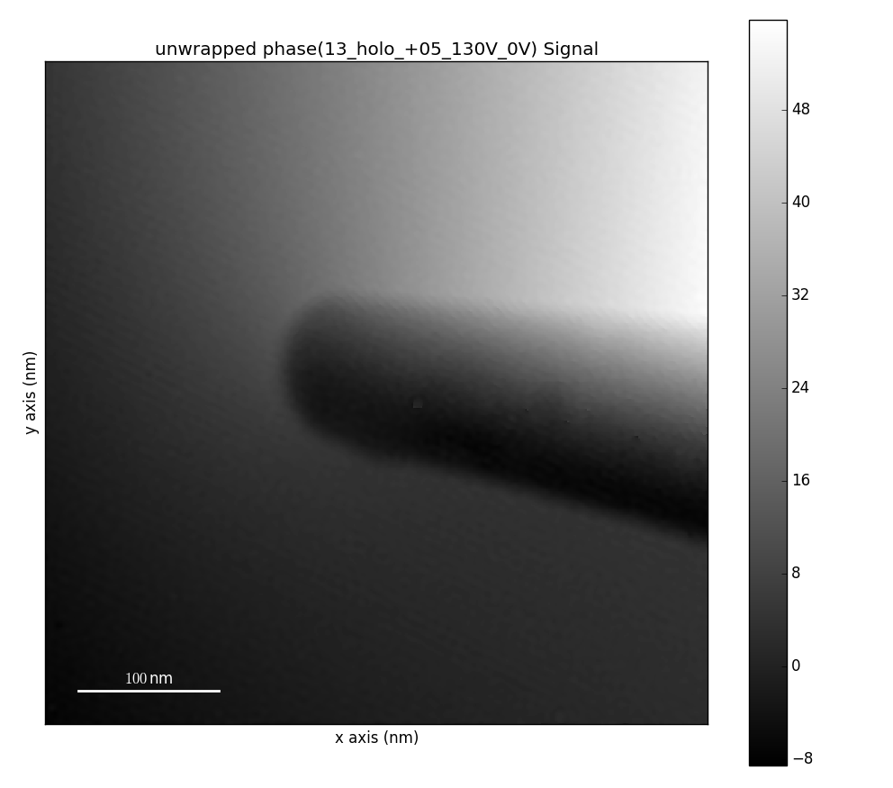

.. _electron-holography-label:

Electron Holography
*******************

HyperSpy provides the user with a signal class which can be used to process
electron holography data:

* :py:class:`~._signals.hologram_image.HologramImage`

It inherits from :py:class:`~._signals.signal2d.Signal2D` class and thus can
use all of its functionality. The usage of the class is explained in the
following sections.

The HologramImage class
=======================

The :py:class:`~._signals.hologram_image.HologramImage` class is designed to
contain images acquired via electron holography.

To transform a :py:class:`~._signals.signal2d.Signal2D` (or subclass) into a
:py:class:`~._signals.hologram_image.HologramImage` use:

.. code-block:: python

    >>> im.set_signal_type('hologram')

Reconstruction of holograms
---------------------------
The detailed description of electron holography and reconstruction of holograms
can be found in literature :ref:`[Gabor1948] <Gabor1948>`,
:ref:`[Tonomura1999] <Tonomura1999>`,
:ref:`[McCartney2007] <McCartney2007>`,
and :ref:`[Joy1993] <Joy1993>`.
Fourier based reconstruction of off-axis holograms (includes
finding a side band in FFT, isolating and filtering it, recenter and
calculate inverse Fourier transform) can be performed using the
:meth:`~._signals.hologram_image.HologramImage.reconstruct_phase` method
which returns a :py:class:`~._signals.complex_signal2d.Complex2D` class,
containing the reconstructed electron wave.
The :meth:`~._signals.hologram_image.HologramImage.reconstruct_phase` method
takes sideband position and size as parameters:

.. code-block:: python

    >>> import hyperspy.api as hs
    >>> im =  hs.datasets.example_signals.object_hologram()
    >>> wave_image = im.reconstruct_phase(sb_position=(<y>, <x>),
    ...                                   sb_size=sb_radius)

The parameters can be found automatically by calling following methods:

.. code-block:: python

    >>> sb_position = im.estimate_sideband_position(ap_cb_radius=None,
    ...                                             sb='lower')
    >>> sb_size = im.estimate_sideband_size(sb_position)

:meth:`~._signals.hologram_image.HologramImage.estimate_sideband_position`
method searches for maximum of intensity in upper or lower part of FFT pattern
(parameter ``sb``) excluding the middle area defined by ``ap_cb_radius``.
:meth:`~._signals.hologram_image.HologramImage.estimate_sideband_size` method
calculates the radius of the sideband filter as half of the distance to the
central band which is commonly used for strong phase objects. Alternatively,
the sideband filter radius can be recalculate as 1/3 of the distance
(often used for weak phase objects) for example:

.. code-block:: python

    >>> sb_size = sb_size * 2 / 3

To reconstruct the hologram with a vacuum reference wave, the reference
hologram should be provided to the method either as Hyperspy's
:py:class:`~._signals.hologram_image.HologramImage` or as a nparray:

.. code-block:: python

    >>> reference_hologram = hs.datasets.example_signals.reference_hologram()
    >>> wave_image = im.reconstruct_phase(reference_hologram,
    ...                                   sb_position=sb_position,
    ...                                   sb_size=sb_sb_size)

Using the reconstructed wave, one can access its amplitude and phase (also
unwrapped phase) using
``amplitude`` and ``phase`` properties
(also the :meth:`~._signals.complex_signal.ComplexSignal_mixin.unwrapped_phase`
method):

.. code-block:: python

    >>> wave_image.unwrapped_phase().plot()

  Unwrapped phase image.

Additionally, it is possible to change the smoothness of the sideband filter
edge (which is by default set to 5% of the filter radius) using parameter
``sb_smoothness``.

Both ``sb_size`` and ``sb_smoothness`` can be provided in desired units rather
than pixels (by default) by setting ``sb_unit`` value either to ``mrad`` or
``nm`` for milliradians or inverse nanometers respectively. For example:

.. code-block:: python

    >>> wave_image = im.reconstruct_phase(reference_hologram,
    ...                                   sb_position=sb_position, sb_size=30,
    ...                                   sb_smoothness=0.05*30,sb_unit='mrad')

Also the :py:meth:`~._signals.hologram_image.HologramImage.reconstruct_phase`
method can output wave images with desired size (shape). By default the shape
of the original hologram is preserved. Though this leads to oversampling of the
output wave images, since the information is limited by the size of the
sideband filter. To avoid oversampling the output shape can be set to the
diameter of the sideband as follows:

.. code-block:: python

    >>> wave_image = im.reconstruct_phase(reference_hologram,
    ...                                   sb_position=sb_position,
    ...                                   sb_size=sb_sb_size,
    ...                                   output_shape=(2*sb_size, 2*sb_size))

Note that the
:py:meth:`~._signals.hologram_image.HologramImage.reconstruct_phase`
method can be called without parameters, which will cause their automatic
assignment by
:py:meth:`~._signals.hologram_image.HologramImage.estimate_sideband_position`
and :py:meth:`~._signals.hologram_image.HologramImage.estimate_sideband_size`
methods. This, however, is not recommended for not experienced users.

.. _holography.stats-label:

Getting hologram statistics
--------------------------
There are many reasons to have an access to some parameters of holograms which describe the quality of the data.
:meth:`~._signals.hologram_image.HologramImage.statistics` can be used to calculate carrier frequency,
fringe spacing and estimate fringe contrast. The method outputs dictionary with the values listed above calculated also
in different units. In particular fringe spacing is calculated in pixels (fringe sampling) as well as in
calibrated units. Carrier frequency is calculated in inverse pixels or calibrated units as well as radians.
Estimation of fringe contrast is either performed by division of standard deviation by mean value of hologram or
in Fourier space as twice the fraction of amplitude of sideband centre and amplitude of center band (i.e. FFT origin).
The first method is default and using it requires the fringe field to cover entire field of view; the method is
highly sensitive to any artifacts in holograms like dud pixels,
fresnel fringes and etc. The second method is less sensitive to the artifacts listed above and gives
reasonable estimation of fringe contrast even if the hologram is not covering entire field of view, but it is highly
sensitive to precise calculation of sideband position and therefore sometimes may underestimate the contrast.
The selection between to algorithms can be done using parameter ``fringe_contrast_algorithm`` setting it to
``'statistical'`` or to ``'fourier'``. The side band position typically provided by a ``sb_position``.
The statistics can be accessed as follows:

.. code-block:: python

    >>> statistics = im.statistics(sb_position=sb_position)

Note that by default the ``single_value`` parameter is ``True`` which forces the output of single values for each
entry of statistics dictionary calculated from first navigation pixel. (I.e. for image stacks only first image
will be used for calculating the statistics.) Otherwise:

.. code-block:: python

    >>> statistics = im.statistics(sb_position=sb_position, single_value=False)

Entries of ``statistics`` are Hyperspy signals containing the hologram parameters for each image in a stack.

The estimation of fringe spacing using ``'fourier'`` method applies apodization in real space prior calculating FFT.
By default ``apodization`` parameter is set to ``hanning`` which applies Hanning window. Other options are using either
``None`` or ``hamming`` for no apodization or Hamming window. Please note that for experimental conditions
especially with extreme sampling of fringes and strong contrast variation due to Fresnel effects
the calculated fringe contrast provides only an estimate and the values may differ strongly depending on apodization.

For further information see documentation of :meth:`~._signals.hologram_image.HologramImage.statistics`.