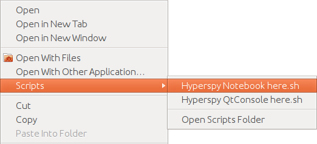

Getting started
***************

.. _importing_hyperspy-label:

Starting HyperSpy
-----------------

HyperSpy is a `Python <http://python.org>`_ library for multi-dimensional data analysis.  HyperSpy's
API can be imported as any other Python library as follows:

.. code-block:: python

   >>> import hyperspy.api as hs

The most common way of using HyperSpy is interactively using the wonderful
interactive computing package `IPython <http://ipython.org>`_. For interactive
data analysis, typically, a number of other modules must be imported and
configured. Indeed all the documentation assumes that HyperSpy, numpy and matplotlib has
been imported as follows:

.. code-block:: python

   >>> import hyperspy.api as hs
   >>> import numpy as np
   >>> import matplotlib.pyplot as plt

To ease the task of importing the modules and setting up the toolkit HyperSpy
provides a :ref:`starting script <starting_hyperspy-label>` and an
:ref:`IPython magic <magic-label>`.  This section describes how to use them.

.. _starting_hyperspy-label:

Starting HyperSpy from the terminal
^^^^^^^^^^^^^^^^^^^^^^^^^^^^^^^^^^^

In all operating systems (OS) you can start HyperSpy by opening a system
terminal and executing ``hyperspy``, optionally followed by the frontend. In most
cases, **the most agreeable way** to work with HyperSpy interactively is
`Jupyter Notebook
<http://jupyter.org>`_ (previously known as the IPython Notebook), which
can be started as follows:

.. code-block:: bash

    $ hyperspy notebook

.. versionadded:: 0.8.1

Once a new Jupyter notebook is started in a browser window, HyperSpy needs to
be imported using the :ref:`hyperspy magic <magic-label>`.

.. code-block:: python

    >>> %hyperspy

Alternatively, hyperspy can be run in two console modes: the terminal you run
the command in (default, no additional arguments required), or the ipython
"qtconsole".

.. code-block:: bash

    $ hyperspy qtconsole

The main difference between notebook and terminal frontends is that ipython
notebook allows for much better reproducibility by re-running any commands and
automatically saving the history in an easy to share format. There are multiple
options available when starting from the terminal. To print these options add
the `-h` flag:

.. code-block:: bash

    $ hyperspy -h
    usage: ana-hyperspy [-h] [-v] [--overwrite_profile]
                        [--ipython_args [IPYTHON_ARGS [IPYTHON_ARGS ...]]]
                        [{terminal,console,qtconsole,notebook}]

    Multidimensional data analysis toolbox

    positional arguments:
      {terminal,console,qtconsole,notebook}
                            Selects the IPython environment in which to start
                            HyperSpy. The default is terminal

    optional arguments:
      -h, --help            show this help message and exit
      -v, --version         show program's version number and exit
      --overwrite_profile   Overwrite the Ipython profile with the default one.
      --ipython_args [IPYTHON_ARGS [IPYTHON_ARGS ...]]
                            Arguments to be passed to IPython. This option must be
                            the last one.Look at the IPython documentation for
                            available options.

.. versionchanged:: 0.8.1
    .. warning::

            The ``toolkit`` and ``pylab_inline`` optional arguments are no
            longer supported. In order to configure the toolkit use the
            :ref:`hyperspy magic <magic-label>` after starting an Jupyter
            notebook.

Starting HyperSpy from the context menu
^^^^^^^^^^^^^^^^^^^^^^^^^^^^^^^^^^^^^^^
This option is only available for Windows and in Linux when using Gnome.

Windows
"""""""

In Windows it is possible to start HyperSpy from :menuselection:`Start Menu -->
Programs --> HyperSpy`.

Alternatively, one can start HyperSpy in any folder by pressing the :kbd:`right
mouse button` or on a yellow folder icon or (in some cases) on the empty area
of a folder, and choosing :menuselection:`HyperSpy qtconsole here` or
:menuselection:`HyperSpy notebook here` from the context menu.

.. figure::  images/windows_hyperspy_here.png
   :align:   center
   :width:   500

   Starting hyperspy using the Windows context menu.

Linux
"""""

If you are using GNOME in Linux, you can open a terminal in a folder by
choosing :menuselection:`open terminal` in the file menu if
:program:`nautilus-open-terminal` is installed in your system.

Alternatively (and more conveniently), if you are using GNOME place `this
<https://github.com/downloads/hyperspy/hyperspy/HyperSpy%20QtConsole%20here.sh>`_
and `this
<https://github.com/downloads/hyperspy/hyperspy/HyperSpy%20Notebook%20here.sh>`_
in the :file:`~/.local/share/nautilus/scripts/` folder in your home directory
(create it if it does not exists) and make them executable to get the
:menuselection:`Scripts --> HyperSpy QtConsole Here` and
:menuselection:`Scripts --> HyperSpy Notebook Here` entries in the context
menu.

   Starting hyperspy using the Gnome nautilus context menu.

.. _magic-label:

HyperSpy IPython magic
^^^^^^^^^^^^^^^^^^^^^^

.. versionadded:: 0.8.1

HyperSpy provides an IPython magic in order to ease the task of setting up the
typical interactive data analysis environment. The magic imports the HyperSpy API,
`numpy <http://www.numpy.org/>`_, `matplotlib <http://matplotlib.org/>`_ and
sets up the right toolkit. Before HyperSpy 0.8.1, all this was done
automatically.  However, starting with IPython version 3.0, auto-importing and
auto-configuring is discouraged (for very good reasons). In order to comply
with the new recommendations without loosing convenience we supply the
``hyperspy`` IPython magic that performs the same operations in a more explicit
and transparent way.

.. code-block:: python

    >>> %hyperspy [-r] [toolkit]

    HyperSpy imported!
    The following commands were just executed:
    ---------------
    [optional 2 code lines if toolkit is "None" or "qt4"]
    %matplotlib [toolkit]
    import numpy as np
    import hyperspy.api as hs
    import matplotlib.pyplot as plt

The magic imports HyperSpy's API as ``hs``, numpy as ``np``, matplotlib's API
as ``plt`` and initialises the chosen toolkit. By default the magic looks for
the toolkit to use in the default settings, however a different one can be
given when running. Once executed, the magic prints which packages were
imported, and HyperSpy is ready to be used.

If the flag ``-r`` is passed as well, the magic overwrites the current input
cell with actual code that can be executed to achieve the same result
without any magic commands (e.g. included in a script).

.. WARNING::
    If "-r" flag is passed, all code in the same cell will be lost. To revert
    the process, use "undo" functionality

.. note::

        The magic is only available when using HyperSpy's IPython profile. The :ref:`starting script <starting_hyperspy_label>` automatically starts IPython using the HyperSpy profile. If you prefer you can do it manually as follows:

   .. code-block:: bash

      $ ipython --profile=hyperspy

Getting help
------------

The documentation (docstring in Python jargon) can be accessed by adding a
question mark to the name of a function. e.g.:

.. code-block:: python

    >>> hs?
    >>> hs.load?
    >>> hs.signals?

This syntax is a shortcut to the standard way one of displaying the help
associated to a given functions (docstring in Python jargon) and it is one of
the many features of `IPython <http://ipython.scipy.org/moin/>`_, which is the
interactive python shell that HyperSpy uses under the hood.

Please note that the documentation of the code is a work in progress, so not
all the objects are documented yet.

Up-to-date documentation is always available in `the HyperSpy website.
<http://hyperspy.org/documentation.html>`_

Autocompletion
--------------

Another useful `IPython <http://ipython.scipy.org/moin/>`_ feature is the
autocompletion of commands and filenames using the tab and arrow keys. It is
highly recommended to read the `Ipython documentation
<http://ipython.scipy.org/moin/Documentation>`_ (specially their `Getting
started <http://ipython.org/ipython-doc/stable/interactive/tutorial.html>`_
section) for many more useful features that will boost your efficiency when
working with HyperSpy/Python interactively.

Loading data
------------

Once hyperspy is running, to load from a supported file format (see
:ref:`supported-formats`) simply type:

.. code-block:: python

    >>> s = hs.load("filename")

.. HINT::

   The load function returns an object that contains data read from the file.
   We assign this object to the variable ``s`` but you can choose any (valid)
   variable name you like. for the filename, don't forget to include the
   quotation marks and the file extension.

If no argument is passed to the load function, a window will be raised that
allows to select a single file through your OS file manager, e.g.:

.. code-block:: python

    >>> # This raises the load user interface
    >>> s = hs.load()

It is also possible to load multiple files at once or even stack multiple
files. For more details read :ref:`loading_files`

"Loading" data from a numpy array
---------------------------------

HyperSpy can operate on any numpy array by assigning it to a Signal class.
This is useful e.g. for loading data stored in a format that is not yet
supported by HyperSpy—supposing that they can be read with another Python
library—or to explore numpy arrays generated by other Python
libraries. Simply select the most appropiate signal from the
:py:mod:`~.signals` module and create a new instance by passing a numpy array
to the constructor e.g.

.. code-block:: python

    >>> my_np_array = np.random.random((10,20,100))
    >>> s = hs.signals.Spectrum(my_np_array)
    >>> s
    <Spectrum, title: , dimensions: (20, 10|100)>

The numpy array is stored in the :py:attr:`~.signal.Signal.data` attribute
of the signal class.

The navigation and signal dimensions
------------------------------------

In HyperSpy the data is interpreted as a signal array and, therefore, the data
axes are not equivalent. HyperSpy distiguises between *signal* and *navigation*
axes and most functions operate on the *signal* axes and iterate on the
*navigation* axes. For example, an EELS spectrum image (i.e. a 2D array of
spectra) has three dimensions X, Y and energy-loss. In HyperSpy, X and Y are
the *navigation* dimensions an the energy-loss is the *signal* dimension. To
make this distinction more explicit the representation of the object includes
a separator ``|`` between the navigaton and signal dimensions e.g.

In Hyperpsy a spectrum image has signal dimension 1 and navigation dimension 2.

.. code-block:: python

    >>> s = hs.signals.Spectrum(np.zeros((10, 20, 30)))
    >>> s
    <Spectrum, title: , dimensions: (20, 10|30)>

An image stack has signal dimension 2 and navigation dimension 1.

.. code-block:: python

    >>> im = hs.signals.Image(np.zeros((30, 10, 20)))
    >>> im
    <Image, title: , dimensions: (30|20, 10)>

Note the HyperSpy rearranges the axes position to match the following pattern:
(navigatons axis 0,..., navigation axis n|signal axis 0,..., signal axis n).
This is the order used for :ref:`indexing the Signal class <signal.indexing>`.

.. _Setting_axis_properties:

Setting axis properties
-----------------------

The axes are managed and stored by the :py:class:`~.axes.AxesManager` class
that is stored in the :py:attr:`~.signal.Signal.axes_manager` attribute of
the signal class. The indidual axes can be accessed by indexing the AxesManager
e.g.

.. code-block:: python

    >>> s = hs.signals.Spectrum(np.random.random((10, 20 , 100)))
    >>> s
    <Spectrum, title: , dimensions: (20, 10|100)>
    >>> s.axes_manager
    <Axes manager, axes: (<Unnamed 0th axis, size: 20, index: 0>, <Unnamed 1st
    axis, size: 10, index: 0>|<Unnamed 2nd axis, size: 100>)>
    >>> s.axes_manager[0]
    <Unnamed 0th axis, size: 20, index: 0>

The axis properties can be set by setting the :py:class:`~.axes.DataAxis`
attributes e.g.

.. code-block:: python

    >>> s.axes_manager[0].name = "X"
    >>> s.axes_manager[0]
    <X axis, size: 20, index: 0>

Once the name of an axis has been defined it is possible to request it by its
name e.g.:

.. code-block:: python

    >>> s.axes_manager["X"]
    <X axis, size: 20, index: 0>
    >>> s.axes_manager["X"].scale = 0.2
    >>> s.axes_manager["X"].units = nm
    >>> s.axes_manager["X"].offset = 100

It is also possible to set the axes properties using a GUI by calling the
:py:meth:`~.axes.AxesManager.gui` method of the :py:class:`~.axes.AxesManager`.

.. _saving:

Saving Files
------------

The data can be saved to several file formats.  The format is specified by
the extension of the filename.

.. code-block:: python

    >>> # load the data
    >>> d = hs.load("example.tif")
    >>> # save the data as a tiff
    >>> d.save("example_processed.tif")
    >>> # save the data as a png
    >>> d.save("example_processed.png")
    >>> # save the data as an hdf5 file
    >>> d.save("example_processed.hdf5")

Some file formats are much better at maintaining the information about
how you processed your data.  The preferred format in HyperSpy is hdf5,
the hierarchical data format.  This format keeps the most information
possible.

There are optional flags that may be passed to the save function. See
:ref:`saving_files` for more details.

Accessing and setting the metadata
----------------------------------

When loading a file HyperSpy stores all metadata in the Signal
:py:attr:`~.signal.Signal.original_metadata` attribute. In addition, some of
those metadata and any new metadata generated by HyperSpy are stored in
:py:attr:`~.signal.Signal.metadata` attribute.

.. code-block:: python

   >>> s = hs.load("NbO2_Nb_M_David_Bach,_Wilfried_Sigle_217.msa")
   >>> s.metadata
   ├── original_filename = NbO2_Nb_M_David_Bach,_Wilfried_Sigle_217.msa
   ├── record_by = spectrum
   ├── signal_origin =
   ├── signal_type = EELS
   └── title = NbO2_Nb_M_David_Bach,_Wilfried_Sigle_217

   >>> s.original_metadata
   ├── DATATYPE = XY
   ├── DATE =
   ├── FORMAT = EMSA/MAS Spectral Data File
   ├── NCOLUMNS = 1.0
   ├── NPOINTS = 1340.0
   ├── OFFSET = 120.0003
   ├── OWNER = eelsdatabase.net
   ├── SIGNALTYPE = ELS
   ├── TIME =
   ├── TITLE = NbO2_Nb_M_David_Bach,_Wilfried_Sigle_217
   ├── VERSION = 1.0
   ├── XPERCHAN = 0.5
   ├── XUNITS = eV
   └── YUNITS =

   >>> s.set_microscope_parameters(100, 10, 20)
   >>> s.metadata
   ├── TEM
   │   ├── EELS
   │   │   └── collection_angle = 20
   │   ├── beam_energy = 100
   │   └── convergence_angle = 10
   ├── original_filename = NbO2_Nb_M_David_Bach,_Wilfried_Sigle_217.msa
   ├── record_by = spectrum
   ├── signal_origin =
   ├── signal_type = EELS
   └── title = NbO2_Nb_M_David_Bach,_Wilfried_Sigle_217

   >>> s.metadata.TEM.microscope = "STEM VG"
   >>> s.metadata
   ├── TEM
   │   ├── EELS
   │   │   └── collection_angle = 20
   │   ├── beam_energy = 100
   │   ├── convergence_angle = 10
   │   └── microscope = STEM VG
   ├── original_filename = NbO2_Nb_M_David_Bach,_Wilfried_Sigle_217.msa
   ├── record_by = spectrum
   ├── signal_origin =
   ├── signal_type = EELS
   └── title = NbO2_Nb_M_David_Bach,_Wilfried_Sigle_217

.. _configuring-hyperspy-label:

Configuring HyperSpy
--------------------

The behaviour of HyperSpy can be customised using the
:py:class:`~.defaults_parser.Preferences` class. The easiest way to do it is by
calling the :meth:`gui` method:

.. code-block:: python

    >>> hs.preferences.gui()

This command should raise the Preferences user interface:

.. _preferences_image:

.. figure::  images/preferences.png
   :align:   center

   Preferences user interface.
