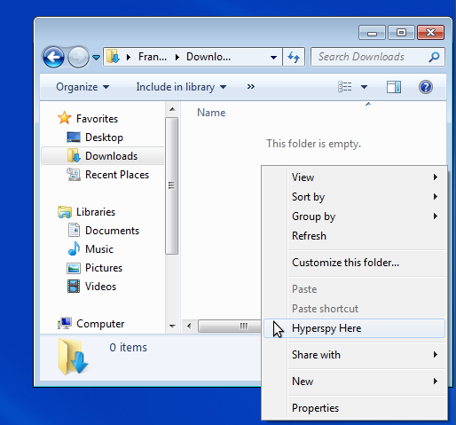

Getting started
***************

First steps with hyperspy
=========================

Starting hyperspy
-----------------

Windows
^^^^^^^

In Windows it is possible to start Hyperspy from :menuselection:`Start Menu --> Programs --> Hyperspy` .

Alternatively, one can start Hyperspy in any folder by pressing the :kbd:`right mouse button` on the empty area of a folder or on a folder and choosing menuselection:`Hyperspy here` from the context menu. see :ref:`windows_hyperspy_here_image`

.. _windows_hyperspy_here_image:

   Starting hyperspy using the Windows context menu.
   

Hyperspy can also be started from a console:

.. code-block:: bash

    $ hyperspy

In any case Hyperspy should welcome you with a message similar to:

.. code-block:: ipython
    
    H y p e r s p y
    Version 0.4.1
    
    http://www.hyperspy.org

Linux and MacOS
^^^^^^^^^^^^^^^

In Linux and MacOS Hyperspy can be started from a console:

.. code-block:: bash

    $ hyperspy

After that, Hyperspy should welcome you with a message similar to:

.. code-block:: ipython
    
    H y p e r s p y
    Version 0.4.0
    
    Copyright (C) 2007-2010 Francisco de la Peña
    Copyright (C) 2011-2012 The Hyperspy development team
    
    http://www.hyperspy.org

.. HINT::
    If you are using GNOME in Linux, you can open a terminal in a folder by 
    choosing :menuselection:`open terminal` in the file menu if 
    :program:`nautilus-open-terminal` is 
    installed in your system.
    

Loading data
------------

To load from a supported file format (see :ref:`supported-formats`) simply type in a Hyperspy session:

.. code-block:: python

    s = load("filename")

.. HINT::

   The load function returns an object that contains data read from the file. We assign this object to the variable ``s`` but you can choose any (valid) variable name you like.
   
If no argument is passed to the load function, a window will be raised that allows to select a single file through your OS file manager, e.g.:

.. code-block:: python

    # This raises the load user interface
    s = load()

It is also possible to load multiple files at once or even stack multiple files. For more details read :ref:`loading_files`

.. _saving:

Saving Files
------------

The data can be saved to several file formats.  The format is specified by
the extension of the filename.

.. code-block:: python

    # load the data
    d = load("example.tif")
    # save the data as a tiff
    d.save("example_processed.tif")
    # save the data as a png
    d.save("example_processed.png")
    # save the data as an hdf5 file
    d.save("example_processed.hdf5")

Some file formats are much better at maintaining the information about
how you processed your data.  The preferred format in Hyperspy is hdf5,
the hierarchical data format.  This format keeps the most information
possible.

There are optional flags that may be passed to the save function. See :ref:`saving_files` for more details.

.. _configuring-hyperspy-label:

Configuring hyperspy
--------------------

The behaviour of Hyperspy can be customised using the :py:class:`~.defaults_parser.Preferences` class. The easiest way to do it is by calling the :meth:`gui` method:

.. code-block:: python

    preferences.gui()
    
This command should raise the :ref:`preferences_image`

.. _preferences_image:

.. figure::  images/preferences.png
   :align:   center

   Preferences user interface

.. _getting-help-label:

Getting help
------------

The documentation can be accessed by adding a question mark to the name of a function. e.g.:

.. code-block:: python
    
    load?

This syntax is one of the many features of `IPython <http://ipython.scipy.org/moin/>`_ that is the interactive python shell that Hyperspy uses under the hood.

Please note that the documentation of the code is a work in progress, so not all the objects are documented yet.

Up-to-date documentation is always available in `the Hyperspy website. <http://hyperspy.org/documentation.html>`_

Autocompletion
--------------

Another useful `IPython <http://ipython.scipy.org/moin/>`_ feature is the 
autocompletion of commands and filenames using the tabulator. It is highly recommended to read the 
`Ipython documentation <http://ipython.scipy.org/moin/Documentation>`_ (specially their `Getting started <http://ipython.org/ipython-doc/stable/interactive/tutorial.html>`_ section) for many more useful features that will boost your efficiency when working with Hyperspy/Python interactively.

Data visualisation
==================

The object returned by :py:func:`~.io.load` is a :py:class:`~.signal.Signal` and has a :py:meth:`~.signal.Signal.plot` method which plots the data and allows navigation.

.. code-block:: python
    
    s = load('YourDataFilenameHere')
    s.plot()

if the object is single spectrum or an image one window will appear when calling 
the plot method.

If the object is a 2D or 3D spectrum image two figures will appear, 
one containing a plot of the spectrum at the current coordinates and the other
an image of the spectrum image summed over its spectral dimension if 2D or an 
image with the spectral dimension in the x-axis e.g see :ref:`2d_SI` and :ref:`1d_SI`. 

.. _2d_SI:

.. figure::  images/2D_SI.png
   :align:   center
   :width:   500

   Visualisation of a 2D spectrum image
   
.. _1d_SI:

.. figure::  images/1D_SI.png
   :align:   center
   :width:   500

   Visualisation of a 1D spectrum image
   
Equivalently, if the object is a 1D or 2D image stack two figures will appear, 
one containing a plot of the image at the current coordinates and the other
a spectrum or an image obtained by summing over the image dimensions, e.g. see :ref:`1D_image_stack.png` and :ref:`2D_image_stack.png`:
   
.. _1D_image_stack.png:

.. figure::  images/1D_image_stack.png
   :align:   center
   :width:   500    

   Visualisation of a 1D image stack
   
.. _2D_image_stack.png:

.. figure::  images/2D_image_stack.png
   :align:   center
   :width:   500
   
   Visualisation of a 2D image stack

To change the current coordinates, click on the pointer (which will be a line or a square depending on the dimensions of the data) and drag it around. It is also possible to move the pointer by using the numpad arrows **when numlock is on and the spectrum or navigator figure is on focus**.When using the numpad arrows the PageUp and PageDown keys change the size of the step.

An extra cursor can be added by pressing the ``e`` key. Pressing ``e`` once more will 
disable the extra cursor, e.g see :ref:`second_pointer.png`.

.. _second_pointer.png:

.. figure::  images/second_pointer.png
   :align:   center
   :width:   500

   Visualisation of a 2D spectrum image using two pointers.

When exploring a 2D hyperspectral object of high spatial resolution the default size of the rectangular cursors can be too small to be dragged or even seen. It is possible to change the size of the cursors by pressing the ``+`` and ``-`` keys  **when the navigator
windows is on focus**.

The same keys can be used to explore an image stack.

=========   =============================
key         function    
=========   =============================
e           Switch second pointer on/off
Arrows      Change coordinates  
PageUp      Increase step size
PageDown    Decrease step size
``+``           Increase pointer size
``-``           Decrease pointer size
``h``       Launch the contrast adjustment tool (only for Image)
=========   =============================

To close all the figures run the following command:

.. code-block:: python

    plt.close('all')

This is a `matplotlib <http://matplotlib.sourceforge.net/>`_ command. 
Matplotlib is the library that hyperspy uses to produce the plots. You can learn how 
to pan/zoom and more  
`in the matplotlib documentation <http://matplotlib.sourceforge.net/users/navigation_toolbar.html>`_

