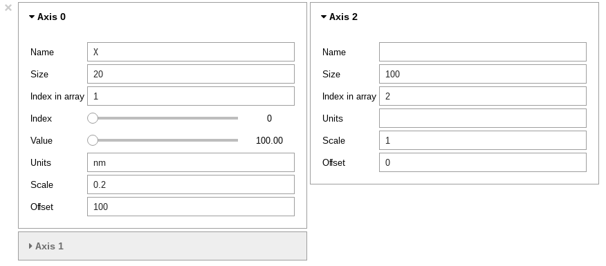
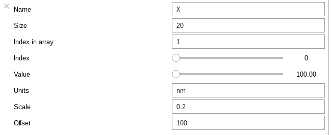
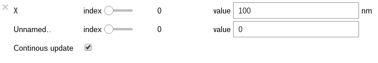

Getting started
***************

.. _importing_hyperspy-label:

Starting Python in Windows
----------------------------
If you used the bundle installation you should be able to use the context menus
to get started. Right-click on the folder containing the data you wish to
analyse and select "Jupyter notebook here" or "Jupyter qtconsole here". We
recommend the former, since notebooks have many advantages over conventional
consoles, as will be illustrated in later sections. The examples in some later
sections assume Notebook operation. A new tab should appear in your default
browser listing the files in the selected folder. To start a python notebook
choose "Python 3" in the "New" drop-down menu at the top right of the page.
Another new tab will open which is your Notebook.

Starting Python in Linux and MacOS
------------------------------------

You can start IPython by opening a system terminal and executing ``ipython``,
(optionally followed by the "frontend": "qtconsole" for example). However, in
most cases, **the most agreeable way** to work with HyperSpy interactively
is using the `Jupyter Notebook <http://jupyter.org>`_ (previously known as
the IPython Notebook), which can be started as follows:

.. code-block:: bash

    $ jupyter notebook

Linux users may find it more convenient to start Jupyter/IPython from the
`file manager context menu <https://github.com/hyperspy/start_jupyter_cm>`_.
In either OS you can also start by `double-clicking a notebook file
<https://github.com/takluyver/nbopen>`_ if one already exists.

Starting HyperSpy in the notebook (or terminal)
-----------------------------------------------
Typically you will need to `set up IPython for interactive plotting with
matplotlib
<http://ipython.readthedocs.org/en/stable/interactive/plotting.html>`_ using
``%matplotlib`` (which is known as a 'Jupyter magic')
*before executing any plotting command*. So, typically, after starting
IPython, you can import HyperSpy and set up interactive matplotlib plotting by
executing the following two lines in the IPython terminal (In these docs we
normally use the general Python prompt symbol ``>>>`` but you will probably
see ``In [1]:`` etc.):

.. code-block:: python

   >>> %matplotlib qt
   >>> import hyperspy.api as hs

Note that to execute lines of code in the notebook you must press
``Shift+Return``. (For details about notebooks and their functionality try
the help menu in the notebook). Next, import two useful modules: numpy and
matplotlib.pyplot, as follows:

.. code-block:: python

   >>> import numpy as np
   >>> import matplotlib.pyplot as plt

The rest of the documentation will assume you have done this. It also assumes
that you have installed at least one of HyperSpy's GUI packages:
`jupyter widgets GUI <https://github.com/hyperspy/hyperspy_gui_ipywidgets>`_
and the
`traitsui GUI <https://github.com/hyperspy/hyperspy_gui_traitsui>`_.

By default, HyperSpy warns the user if one of the GUI packages is not installed.
These warnings can be turned off using the
:py:class:`~.defaults_parser.Preferences` GUI
(see :ref:`here <configuring-hyperspy-label>` for more information) or
programmatically as follows:

    .. code-block:: python

       >>> import hyperspy.api as hs
       >>> hs.preferences.GUIs.warn_if_guis_are_missing = False
       >>> hs.preferences.save()

Now you are ready to load
your data (see below).

.. versionchanged:: v1.3
    HyperSpy works with all matplotlib backends, including the nbagg backend
    that enables interactive plotting embedded in the jupyter notebook.

.. warning::
        When using the qt4 backend in Python 2 the matplotlib magic must be
        executed after importing HyperSpy and qt must be the default HyperSpy
        backend.

.. NOTE::

    When running in a  headless system it is necessary to set the matplotlib
    backend appropiately to avoid a `cannot connect to X server` error, for
    example as follows:

    .. code-block:: python

       >>> import matplotlib
       >>> matplotlib.rcParams["backend"] = "Agg"
       >>> import hyperspy.api as hs

Getting help
------------

When using IPython, the documentation (docstring in Python jargon) can be
accessed by adding a question mark to the name of a function. e.g.:

.. code-block:: python

    >>> hs?
    >>> hs.load?
    >>> hs.signals?

This syntax is a shortcut to the standard way one of displaying the help
associated to a given functions (docstring in Python jargon) and it is one of
the many features of `IPython <http://ipython.scipy.org/moin/>`_, which is the
interactive python shell that HyperSpy uses under the hood.

Please note that the documentation of the code is a work in progress, so not
all the objects are documented yet.

Up-to-date documentation is always available in `the HyperSpy website.
<http://hyperspy.org/documentation.html>`_

Autocompletion
--------------

Another useful `IPython <http://ipython.scipy.org/moin/>`_ feature is the
autocompletion of commands and filenames using the tab and arrow keys. It is
highly recommended to read the `Ipython documentation
<http://ipython.scipy.org/moin/Documentation>`_ (specially their `Getting
started <http://ipython.org/ipython-doc/stable/interactive/tutorial.html>`_
section) for many more useful features that will boost your efficiency when
working with HyperSpy/Python interactively.

Loading data
------------

Once HyperSpy is running, to load from a supported file format (see
:ref:`supported-formats`) simply type:

.. code-block:: python

    >>> s = hs.load("filename")

.. HINT::

   The load function returns an object that contains data read from the file.
   We assign this object to the variable ``s`` but you can choose any (valid)
   variable name you like. for the filename, don\'t forget to include the
   quotation marks and the file extension.

If no argument is passed to the load function, a window will be raised that
allows to select a single file through your OS file manager, e.g.:

.. code-block:: python

    >>> # This raises the load user interface
    >>> s = hs.load()

It is also possible to load multiple files at once or even stack multiple
files. For more details read :ref:`loading_files`

"Loading" data from a numpy array
---------------------------------

HyperSpy can operate on any numpy array by assigning it to a BaseSignal class.
This is useful e.g. for loading data stored in a format that is not yet
supported by HyperSpy—supposing that they can be read with another Python
library—or to explore numpy arrays generated by other Python
libraries. Simply select the most appropriate signal from the
:py:mod:`~.signals` module and create a new instance by passing a numpy array
to the constructor e.g.

.. code-block:: python

    >>> my_np_array = np.random.random((10,20,100))
    >>> s = hs.signals.Signal1D(my_np_array)
    >>> s
    <Signal1D, title: , dimensions: (20, 10|100)>

The numpy array is stored in the :py:attr:`~.signal.BaseSignal.data` attribute
of the signal class.

.. _example-data-label:

Loading example data and data from online databases
----------------------------------------------------

HyperSpy is distributed with some example data that can be found in
`hs.datasets.example_signals`. The following example plots one of the example
signals:

.. code-block:: python

    >>> hs.datasets.example_signals.EDS_TEM_Spectrum().plot()

.. versionadded:: 1.4
    :py:mod:`~.datasets.artificial_data`

There are also artificial datasets, which are made to resemble real
experimental data.

.. code-block:: python

    >>> s = hs.datasets.artificial_data.get_core_loss_eels_signal()
    >>> s.plot()

.. _eelsdb-label:

.. versionadded:: 1.0
    :py:func:`~.misc.eels.eelsdb.eelsdb` function.

The :py:func:`~.misc.eels.eelsdb.eelsdb` function in `hs.datasets` can
directly load spectra from `The EELS Database <http://eelsdb.eu>`_. For
example, the following loads all the boron trioxide spectra currently
available in the database:

.. code-block:: python

    >>> hs.datasets.eelsdb(formula="B2O3")
    [<EELSSpectrum, title: Boron oxide, dimensions: (|520)>,
     <EELSSpectrum, title: Boron oxide, dimensions: (|520)>]

The navigation and signal dimensions
------------------------------------

In HyperSpy the data is interpreted as a signal array and, therefore, the data
axes are not equivalent. HyperSpy distinguishes between *signal* and
*navigation* axes and most functions operate on the *signal* axes and
iterate on the *navigation* axes. For example, an EELS spectrum image (i.e.
a 2D array of spectra) has three dimensions X, Y and energy-loss. In
HyperSpy, X and Y are the *navigation* dimensions and the energy-loss is the
*signal* dimension. To make this distinction more explicit the
representation of the object includes a separator ``|`` between the
navigation and signal dimensions e.g.

In HyperSpy a spectrum image has signal dimension 1 and navigation dimension 2
and is stored in the Signal1D subclass.

.. code-block:: python

    >>> s = hs.signals.Signal1D(np.zeros((10, 20, 30)))
    >>> s
    <Signal1D, title: , dimensions: (20, 10|30)>

An image stack has signal dimension 2 and navigation dimension 1 and is stored
in the Signal2D subclass.

.. code-block:: python

    >>> im = hs.signals.Signal2D(np.zeros((30, 10, 20)))
    >>> im
    <Signal2D, title: , dimensions: (30|20, 10)>

Note that HyperSpy rearranges the axes when compared to the array order. The
following few paragraphs explain how and why it does it.

Depending how the array is arranged, some axes are faster to iterate than
others. Consider an example of a book as the dataset in question. It is
trivially simple to look at letters in a line, and then lines down the page,
and finally pages in the whole book.  However if your words are written
vertically, it can be inconvenient to read top-down (the lines are still
horizontal, it's just the meaning that's vertical!). It's very time-consuming
if every letter is on a different page, and for every word you have to turn 5-6
pages. Exactly the same idea applies here - in order to iterate through the
data (most often for plotting, but applies for any other operation too), you
want to keep it ordered for "fast access".

In Python (more explicitly `numpy`) the "fast axes order" is C order (also
called row-major order). This means that the **last** axis of a numpy array is
fastest to iterate over (i.e. the lines in the book). An alternative ordering
convention is F order (column-major), where it is the reverse - the first axis
of an array is the fastest to iterate over. In both cases, the further an axis
is from the `fast axis` the slower it  is to iterate over it. In the book
analogy you could think, for example, think about reading the first lines of
all pages, then the second and so on.

When data is acquired sequentially it is usually stored in acquisition order.
When a dataset is loaded, HyperSpy generally stores it in memory in the same
order, which is good for the computer. However, HyperSpy will reorder and
classify the axes to make it easier for humans. Let's imagine a single numpy
array that contains pictures of a scene acquired with different exposure times
on different days. In numpy the array dimensions are  ``(D, E, Y, X)``. This
order makes it fast to iterate over the images in the order in which they were
acquired. From a human point of view, this dataset is just a collection of
images, so HyperSpy first classifies the image axes (``X`` and ``Y``) as
`signal axes` and the remaining axes the `navigation axes`. Then it reverses
the order of each sets of axes because many humans are used to get the ``X``
axis first and, more generally the axes in acquisition order from left to
right. So, the same axes in HyperSpy are displayed like this: ``(E, D | X,
Y)``.

Extending this to arbitrary dimensions, by default, we reverse the numpy axes,
chop it into two chunks (signal and navigation), and then swap those chunks, at
least when printing. As an example:

.. code-block:: bash
    (a1, a2, a3, a4, a5, a6) # original (numpy)
    (a6, a5, a4, a3, a2, a1) # reverse
    (a6, a5) (a4, a3, a2, a1) # chop
    (a4, a3, a2, a1) (a6, a5) # swap (HyperSpy)

In the background, HyperSpy also takes care of storing the data in memory in
a "machine-friendly" way, so that iterating over the navigation axes is always
fast.

.. _Setting_axis_properties:

Setting axis properties
-----------------------

The axes are managed and stored by the :py:class:`~.axes.AxesManager` class
that is stored in the :py:attr:`~.signal.BaseSignal.axes_manager` attribute of
the signal class. The individual axes can be accessed by indexing the
AxesManager. e.g.

.. code-block:: python

    >>> s = hs.signals.Signal1D(np.random.random((10, 20 , 100)))
    >>> s
    <Signal1D, title: , dimensions: (20, 10|100)>
    >>> s.axes_manager
    <Axes manager, axes: (<Unnamed 0th axis, size: 20, index: 0>, <Unnamed 1st
    axis, size: 10, index: 0>|<Unnamed 2nd axis, size: 100>)>
    >>> s.axes_manager[0]
    <Unnamed 0th axis, size: 20, index: 0>

The axis properties can be set by setting the :py:class:`~.axes.DataAxis`
attributes e.g.

.. code-block:: python

    >>> s.axes_manager[0].name = "X"
    >>> s.axes_manager[0]
    <X axis, size: 20, index: 0>

Once the name of an axis has been defined it is possible to request it by its
name e.g.:

.. code-block:: python

    >>> s.axes_manager["X"]
    <X axis, size: 20, index: 0>
    >>> s.axes_manager["X"].scale = 0.2
    >>> s.axes_manager["X"].units = "nm"
    >>> s.axes_manager["X"].offset = 100

It is also possible to set the axes properties using a GUI by calling the
:py:meth:`~.axes.AxesManager.gui` method of the :py:class:`~.axes.AxesManager`

.. code-block:: python

    >>> s.axes_manager.gui()

.. _axes_manager_gui_image:

   AxesManager ipywidgets GUI.

or the :py:class:`~.axes.DataAxis`, e.g:

.. code-block:: python

    >>> s.axes_manager["X"].gui()

.. _data_axis_gui_image:

   DataAxis ipywidgets GUI.

To simply change the "current position" (i.e. the indices of the navigation
axes) you could use the navigation sliders:

.. code-block:: python

    >>> s.axes_manager.gui_navigation_sliders()

.. _navigation_sliders_image:

   Navigation sliders ipywidgets GUI.

Alternatively, the "current position" can be changed programmatically by
directly accessing ``indices`` attribute of a Signal's
:py:class:`~.axes.AxesManager`. This is particularly useful if trying to set
a specific location with which to initialize a model's parameters to
sensible values before preforming a fit over an entire spectrum image. The
``indices`` must be provided as a tuple, with the same length as the number of
navigation dimensions:

.. code-block:: python

    >>> s.axes_manager.indices = (5, 4)

.. _quantity_and_converting_units:

Using quantity and converting units
-------------------------------------------

The scale and the offset of each axis can be set and retrieved as quantity.

.. code-block:: python

    >>> s = hs.signals.Signal1D(np.arange(10))
    >>> s.axes_manager[0].scale_as_quantity
    1.0 dimensionless
    >>> s.axes_manager[0].scale_as_quantity = '2.5 µm'
    >>> s.axes_manager
    <Axes manager, axes: (|10)>
                Name |   size |  index |  offset |   scale |  units 
    ================ | ====== | ====== | ======= | ======= | ====== 
    ---------------- | ------ | ------ | ------- | ------- | ------ 
         <undefined> |     10 |        |       0 |     2.5 |     µm
    >>> s.axes_manager[0].offset_as_quantity = '2.5 nm'
    <Axes manager, axes: (|10)>
                Name |   size |  index |  offset |   scale |  units 
    ================ | ====== | ====== | ======= | ======= | ====== 
    ---------------- | ------ | ------ | ------- | ------- | ------ 
         <undefined> |     10 |        |     2.5 | 2.5e+03 |     nm

Internally, HyperSpy uses the `pint <http://pint.readthedocs.io>`_ library to manage the scale and offset quantities. The ``scale_as_quantity`` and ``offset_as_quantity`` attributes return pint object:

.. code-block:: python

    >>> q = s.axes_manager[0].offset_as_quantity
    >>> type(q) # q is a pint quantity object
    pint.quantity.build_quantity_class.<locals>.Quantity
    >>> q
    2.5 nanometer

The ``convert_units`` method of the :py:class:`~.axes.AxesManager` converts units, which by default (no parameters provided) converts all axis units to an optimal units to avoid using too large or small number.

Each axis can also be converted individually using the ``convert_to_units`` method of the :py:class:`~.axes.DataAxis`:

.. code-block:: python

    >>> axis = hs.hyperspy.axes.DataAxis(size=10, scale=0.1, offset=10, units='mm')
    >>> axis.scale_as_quantity
    0.1 millimeter
    >>> axis.convert_to_units('µm')
    >>> axis.scale_as_quantity
    100.0 micrometer

.. _saving:

Saving Files
------------

The data can be saved to several file formats.  The format is specified by
the extension of the filename.

.. code-block:: python

    >>> # load the data
    >>> d = hs.load("example.tif")
    >>> # save the data as a tiff
    >>> d.save("example_processed.tif")
    >>> # save the data as a png
    >>> d.save("example_processed.png")
    >>> # save the data as an hspy file
    >>> d.save("example_processed.hspy")

Some file formats are much better at maintaining the information about
how you processed your data.  The preferred format in HyperSpy is hspy,
which is based on the HDF5 format.  This format keeps the most information
possible.

There are optional flags that may be passed to the save function. See
:ref:`saving_files` for more details.

Accessing and setting the metadata
----------------------------------

When loading a file HyperSpy stores all metadata in the BaseSignal
:py:attr:`~.signal.BaseSignal.original_metadata` attribute. In addition,
some of those metadata and any new metadata generated by HyperSpy are stored in
:py:attr:`~.signal.BaseSignal.metadata` attribute.

.. code-block:: python

   >>> s = hs.load("NbO2_Nb_M_David_Bach,_Wilfried_Sigle_217.msa")
   >>> s.metadata
   ├── original_filename = NbO2_Nb_M_David_Bach,_Wilfried_Sigle_217.msa
   ├── record_by = spectrum
   ├── signal_type = EELS
   └── title = NbO2_Nb_M_David_Bach,_Wilfried_Sigle_217

   >>> s.original_metadata
   ├── DATATYPE = XY
   ├── DATE =
   ├── FORMAT = EMSA/MAS Spectral Data File
   ├── NCOLUMNS = 1.0
   ├── NPOINTS = 1340.0
   ├── OFFSET = 120.0003
   ├── OWNER = eelsdatabase.net
   ├── SIGNALTYPE = ELS
   ├── TIME =
   ├── TITLE = NbO2_Nb_M_David_Bach,_Wilfried_Sigle_217
   ├── VERSION = 1.0
   ├── XPERCHAN = 0.5
   ├── XUNITS = eV
   └── YUNITS =

   >>> s.set_microscope_parameters(100, 10, 20)
   >>> s.metadata
   ├── TEM
   │   ├── EELS
   │   │   └── collection_angle = 20
   │   ├── beam_energy = 100
   │   └── convergence_angle = 10
   ├── original_filename = NbO2_Nb_M_David_Bach,_Wilfried_Sigle_217.msa
   ├── record_by = spectrum
   ├── signal_type = EELS
   └── title = NbO2_Nb_M_David_Bach,_Wilfried_Sigle_217

   >>> s.metadata.TEM.microscope = "STEM VG"
   >>> s.metadata
   ├── TEM
   │   ├── EELS
   │   │   └── collection_angle = 20
   │   ├── beam_energy = 100
   │   ├── convergence_angle = 10
   │   └── microscope = STEM VG
   ├── original_filename = NbO2_Nb_M_David_Bach,_Wilfried_Sigle_217.msa
   ├── record_by = spectrum
   ├── signal_type = EELS
   └── title = NbO2_Nb_M_David_Bach,_Wilfried_Sigle_217

.. _configuring-hyperspy-label:

Configuring HyperSpy
--------------------

The behaviour of HyperSpy can be customised using the
:py:class:`~.defaults_parser.Preferences` class. The easiest way to do it is by
calling the :meth:`gui` method:

.. code-block:: python

    >>> hs.preferences.gui()

This command should raise the Preferences user interface if one of the
hyperspy gui packages are installed and enabled:

.. _preferences_image:

.. figure::  images/preferences.png
   :align:   center

   Preferences user interface.

.. versionadded:: 1.3
    Possibility to enable/disable GUIs in the

It is also possible to set the preferences programmatically. For example,
to disable the traitsui GUI elements and save the changes to disk:

.. code-block:: python

    >>> hs.preferences.GUIs.enable_traitsui_gui = False
    >>> hs.preferences.save()

.. versionchanged:: 1.3

   The following items were removed from preferences:
   ``General.default_export_format``, ``General.lazy``,
   ``Model.default_fitter``, ``Machine_learning.multiple_files``,
   ``Machine_learning.same_window``, ``Plot.default_style_to_compare_spectra``,
   ``Plot.plot_on_load``, ``Plot.pylab_inline``, ``EELS.fine_structure_width``,
   ``EELS.fine_structure_active``, ``EELS.fine_structure_smoothing``,
   ``EELS.synchronize_cl_with_ll``, ``EELS.preedge_safe_window_width``,
   ``EELS.min_distance_between_edges_for_fine_structure``.

.. _logger-label:

Messages log
------------

.. versionadded:: 1.0

HyperSpy writes messages to the `Python logger
<https://docs.python.org/3/howto/logging.html#logging-basic-tutorial>`_. The
default log level is "WARNING", meaning that only warnings and more severe
event messages will be displayed. The default can be set in the
:ref:`preferences <configuring-hyperspy-label>`. Alternatively, it can be set
using :py:func:`~.logger.set_log_level` e.g.:

.. code-block:: python

    >>> import hyperspy.api as hs
    >>> hs.set_log_level('INFO')
    >>> hs.load(r'my_file.dm3')
    INFO:hyperspy.io_plugins.digital_micrograph:DM version: 3
    INFO:hyperspy.io_plugins.digital_micrograph:size 4796607 B
    INFO:hyperspy.io_plugins.digital_micrograph:Is file Little endian? True
    INFO:hyperspy.io_plugins.digital_micrograph:Total tags in root group: 15
    <Signal2D, title: My file, dimensions: (|1024, 1024)
