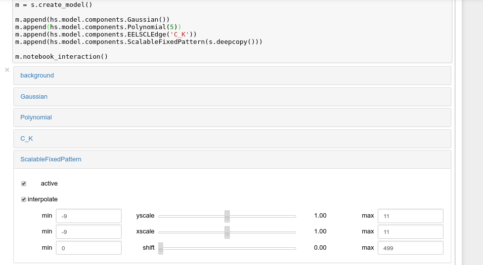
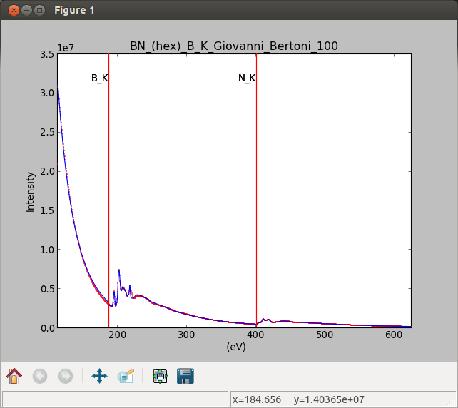

Model fitting
*************

HyperSpy can perform curve fitting of one-dimensional signals (spectra) and
two-dimensional signals (images) in n-dimensional data sets. Models can be
created as a linear combination of predefined components and multiple
optimisation algorithms can be used to fit the model to experimental data.
Bounds and weights are supported. The syntax for creating both kinds of model
is essentially the same, as in this documentation any method referred to in
the :py:class:`~.model.BaseModel` class is available for both kinds.

.. _2D_model-label:

.. versionadded:: 1.0
   2D models. Note that this first implementation lacks many of the
   features of 1D models e.g. plotting. Those will be added in future releases.

Models can be created and fit to experimental data in both one and two
dimensions i.e. spectra and images respectively. Most of the syntax is
identical in either case. A one-dimensional model is created when a model
is created for a :py:class:`~._signals.signal1d.Signal1D` whereas a two-
dimensional model is created for a :py:class:`~._signals.signal2d.Signal2D`.
At present plotting and gradient fitting methods tools for are not yet
provided for the :py:class:`~.models.model2d.Model2D` class.

.. versionadded:: 0.7
   Binned/unbinned signals

Before creating a model verify that the ``Signal.binned`` metadata
attribute of the signal is set to the correct value because the resulting
model depends on this parameter. See :ref:`signal.binned` for more details.

.. Warning::

   When importing data that have been binned using other software, in
   particular Gatan's DM, the stored values may be the averages of the
   binned channels or pixels, instead of their sum, as would be required
   for proper statistical analysis. We therefore cannot guarantee that
   the statistics will be valid. We therefore strongly recommend that all
   pre-fitting binning should be done using Hyperspy.

Creating a model
----------------

A :py:class:`~.models.model1d.Model1D` can be created for data in the
:py:class:`~._signals.signal1d.Signal1D` class using the
:py:meth:`~._signals.signal1d.Signal1D.create_model` method:

.. code-block:: python

    >>> s = hs.signals.Signal1D(np.arange(300).reshape(30, 10))
    >>> m = s.create_model() # Creates the 1D-Model and assign it to m

Similarly A :py:class:`~.models.model2d.Model2D` can be created for data in the
:py:class:`~._signals.signal2d.Signal2D` class using the
:py:meth:`~._signals.signal2d.Signal2D.create_model` method:

.. code-block:: python

    >>> im = hs.signals.Signal2D(np.arange(300).reshape(3, 10, 10))
    >>> mod = im.create_model() # Create the 2D-Model and assign it to mod

The syntax for creating both one-dimensional and two-dimensional models is thus
identical for the user in practice. When a model is created  you may be
prompted to provide important information not already included in the
datafile, e.g.if s is EELS data, you may be asked for the accelerating
voltage, convergence and collection semi-angles etc.

.. _model_components-label:

Adding components to the model
------------------------------

.. versionchanged:: 1.0 `hyperspy.api.model.components` renamed to
   `hyperspy.api.model.components1D`

.. versionadded:: 1.0 `hyperspy.api.model.components2D`.

In HyperSpy a model consists of a linear combination of components
and various components are available in one (:py:mod:`~.components1d`)and
two-dimensions (:py:mod:`~.components2d`) to construct a
model.

The following components are currently available for one-dimensional models:

* :py:class:`~._components.eels_cl_edge.EELSCLEdge`
* :py:class:`~._components.volume_plasmon_drude.VolumePlasmonDrude`
* :py:class:`~._components.power_law.PowerLaw`
* :py:class:`~._components.offset.Offset`
* :py:class:`~._components.exponential.Exponential`
* :py:class:`~._components.scalable_fixed_pattern.ScalableFixedPattern`
* :py:class:`~._components.gaussian.Gaussian`
* :py:class:`~._components.gaussianhf.GaussianHF`
* :py:class:`~._components.lorentzian.Lorentzian`
* :py:class:`~._components.voigt.Voigt`
* :py:class:`~._components.polynomial.Polynomial`
* :py:class:`~._components.logistic.Logistic`
* :py:class:`~._components.bleasdale.Bleasdale`
* :py:class:`~._components.error_function.Erf`
* :py:class:`~._components.pes_see.SEE`
* :py:class:`~._components.arctan.Arctan`
* :py:class:`~._components.heaviside.HeavisideStep`

.. versionadded:: 1.0 The following components are currently available for
                  two-dimensional models:

* :py:class:`~._components.gaussian2d.Gaussian2D`

However, this doesn't mean that you have to limit yourself to this meagre list
of functions. A new function can easily be written or a custom function may
be specified as below.

Specifying custom components
^^^^^^^^^^^^^^^^^^^^^^^^^^^^

.. _expression_component-label:

.. versionadded:: 0.8.1 :py:class:`~._components.expression.Expression`
                  component

.. versionadded:: 1.2 :py:class:`~._components.expression.Expression` component
                  can create 2D components.

The easiest way to turn a mathematical expression into a component is using the
:py:class:`~._components.expression.Expression` component. For example, the
following is all you need to create a
:py:class:`~._components.gaussian.Gaussian` component  with more sensible
parameters for spectroscopy than the one that ships with HyperSpy:

.. code-block:: python

    >>> g = hs.model.components1D.Expression(
    ... expression="height * exp(-(x - x0) ** 2 * 4 * log(2)/ fwhm ** 2)",
    ... name="Gaussian",
    ... position="x0",
    ... height=1,
    ... fwhm=1,
    ... x0=0,
    ... module="numpy")

If the expression is inconvenient to write out in full (e.g. it's long and/or
complicated), multiple substitutions can be given, separated by semicolons.
Both symbolic and numerical substitutions are allowed:

.. code-block:: python

    >>> expression = "h / sqrt(p2) ; p2 = 2 * m0 * e1 * x * brackets;"
    >>> expression += "brackets = 1 + (e1 * x) / (2 * m0 * c * c) ;"
    >>> expression += "m0 = 9.1e-31 ; c = 3e8; e1 = 1.6e-19 ; h = 6.6e-34"
    >>> wavelength = hs.model.components1D.Expression(
    ... expression=expression,
    ... name="Electron wavelength with voltage")

:py:class:`~._components.expression.Expression` uses `Sympy
<http://www.sympy.org>`_ internally to turn the string into
a function. By default it "translates" the expression using
numpy, but often it is possible to boost performance by using
`numexpr <https://github.com/pydata/numexpr>`_ instead.

It can also create 2D components with optional rotation. In the following
example we create a 2D gaussian that rotates around its center:

.. code-block:: python

    >>> g = hs.model.components2D.Expression(
    ... "k * exp(-((x-x0)**2 / (2 * sx ** 2) + (y-y0)**2 / (2 * sy ** 2)))",
    ... "Gaussian2d", add_rotation=True, position=("x0", "y0"),
    ... module="numpy", )

Of course :py:class:`~._components.expression.Expression` is only useful for
analytical functions. For more general components you need to create the
component "by hand". The good news is that, if you know how to write the
function with Python, turning it into a component is very easy, just modify
the following template to suit your needs:

.. code-block:: python

    from hyperspy.component import Component

    class MyComponent(Component):

        """
        """

        def __init__(self, parameter_1=1, parameter_2=2):
            # Define the parameters
            Component.__init__(self, ('parameter_1', 'parameter_2'))

            # Optionally we can set the initial values
            self.parameter_1.value = parameter_1
            self.parameter_1.value = parameter_1

            # The units (optional)
            self.parameter_1.units = 'Tesla'
            self.parameter_2.units = 'Kociak'

            # Once defined we can give default values to the attribute
            # For example we fix the attribure_1 (optional)
            self.parameter_1.attribute_1.free = False

            # And we set the boundaries (optional)
            self.parameter_1.bmin = 0.
            self.parameter_1.bmax = None

            # Optionally, to boost the optimization speed we can also define
            # the gradients of the function we the syntax:
            # self.parameter.grad = function
            self.parameter_1.grad = self.grad_parameter_1
            self.parameter_2.grad = self.grad_parameter_2

        # Define the function as a function of the already defined parameters,
        # x being the independent variable value
        def function(self, x):
            p1 = self.parameter_1.value
            p2 = self.parameter_2.value
            return p1 + x * p2

        # Optionally define the gradients of each parameter
        def grad_parameter_1(self, x):
            """
            Returns d(function)/d(parameter_1)
            """
            return 0

        def grad_parameter_2(self, x):
            """
            Returns d(function)/d(parameter_2)
            """
            return x

If you need help with the task please submit your question to the :ref:`users
mailing list <http://groups.google.com/group/hyperspy-users>`.

.. _model_components-label:

.. versionchanged:: 0.8.1 printing current model components

To print the current components in a model use
:py:attr:`~.model.BaseModel.components`. A table with component number,
attribute name, component name and component type will be printed:

.. code-block:: python

    >>> m
    <Model, title: my signal title>
    >>> m.components # an empty model
       # |       Attribute Name |       Component Name |        Component Type
    ---- | -------------------- | -------------------- | ---------------------

In fact, components may be created automatically in some cases. For example, if
the :py:class:`~._signals.signal1d.Signal1D` is recognised as EELS data, a
power-law background component will automatically be placed in the model. To
add a component first we have to create an instance of the component. Once
the instance has been created we can add the component to the model using
the :py:meth:`~.model.BaseModel.append` method, e.g. for a type of data that
can be modelled using Gaussians we might proceed as follows:

.. code-block:: python

    >>> gaussian = hs.model.components1D.Gaussian() # Create a Gaussian comp.
    >>> m.append(gaussian) # Add it to the model
    >>> m.components # Print the model components
       # |       Attribute Name |        Component Name |        Component Type
    ---- | -------------------- | --------------------- | ---------------------
       0 |             Gaussian |              Gaussian |              Gaussian
    >>> gaussian2 = hs.model.components1D.Gaussian() # Create another gaussian
    >>> gaussian3 = hs.model.components1D.Gaussian() # Create a third gaussian

We could use the :py:meth:`~.model.BaseModel.append` method twice to add the
two gaussians, but when adding multiple components it is handier to use the
extend method that enables adding a list of components at once.

.. code-block:: python

    >>> m.extend((gaussian2, gaussian3)) # note the double parentheses!
    >>> m.components
       # |       Attribute Name |      Component Name |        Component Type
    ---- | -------------------- | ------------------- | ---------------------
       0 |             Gaussian |            Gaussian |              Gaussian
       1 |           Gaussian_0 |          Gaussian_0 |              Gaussian
       2 |           Gaussian_1 |          Gaussian_1 |              Gaussian

We can customise the name of the components.

.. code-block:: python

    >>> gaussian.name = 'Carbon'
    >>> gaussian2.name = 'Long Hydrogen name'
    >>> gaussian3.name = 'Nitrogen'
    >>> m.components
       # |        Attribute Name |        Component Name |      Component Type
    ---- | --------------------- | --------------------- | -------------------
       0 |                Carbon |                Carbon |            Gaussian
       1 |    Long_Hydrogen_name |    Long Hydrogen name |            Gaussian
       2 |              Nitrogen |              Nitrogen |            Gaussian

Two components cannot have the same name.

.. code-block:: python

    >>> gaussian2.name = 'Carbon'
    Traceback (most recent call last):
      File "<ipython-input-5-2b5669fae54a>", line 1, in <module>
        g2.name = "Carbon"
      File "/home/fjd29/Python/hyperspy/hyperspy/component.py", line 466, in
        name "the name " + str(value))
    ValueError: Another component already has the name Carbon

It is possible to access the components in the model by their name or by the
index in the model.

.. code-block:: python

    >>> m
       # |        Attribute Name |       Component Name |      Component Type
    ---- | --------------------- | -------------------- | -------------------
       0 |                Carbon |               Carbon |            Gaussian
       1 |    Long_Hydrogen_name |   Long Hydrogen name |            Gaussian
       2 |              Nitrogen |             Nitrogen |            Gaussian
    >>> m[0]
    <Carbon (Gaussian component)>
    >>> m["Long Hydrogen name"]
    <Long Hydrogen name (Gaussian component)>

.. versionadded:: 0.8.1 :py:attr:`~.model.BaseModel.components` attribute

In addition, the components can be accessed in the
:py:attr:`~.model.BaseModel.components` `Model` attribute. This is specially
useful when working in interactive data analysis with IPython because it
enables tab completion.

.. code-block:: python

    >>> m
       # |        Attribute Name |        Component Name |      Component Type
    ---- | --------------------- | --------------------- | -------------------
       0 |                Carbon |                Carbon |            Gaussian
       1 |    Long_Hydrogen_name |    Long Hydrogen name |            Gaussian
       2 |              Nitrogen |              Nitrogen |            Gaussian
    >>> m.components.Long_Hydrogen_name
    <Long Hydrogen name (Gaussian component)>

It is possible to "switch off" a component by setting its
``active`` attribute to ``False``. When a component is
switched off, to all effects it is as if it was not part of the model. To
switch it on simply set the ``active`` attribute back to ``True``.

.. versionadded:: 0.7.1 :py:attr:`~.component.Component.active_is_multidimensional`

In multidimensional signals it is possible to store the value of the
``active`` attribute at each navigation index.
To enable this feature for a given component set the
:py:attr:`~.component.Component.active_is_multidimensional` attribute to
`True`.

.. code-block:: python

    >>> s = hs.signals.Signal1D(np.arange(100).reshape(10,10))
    >>> m = s.create_model()
    >>> g1 = hs.model.components1D.Gaussian()
    >>> g2 = hs.model.components1D.Gaussian()
    >>> m.extend([g1,g2])
    >>> g1.active_is_multidimensional = True
    >>> g1._active_array
    array([ True,  True,  True,  True,  True,  True,  True,  True,  True,  True], dtype=bool)
    >>> g2._active_array is None
    True
    >>> m.set_component_active_value(False)
    >>> g1._active_array
    array([False, False, False, False, False, False, False, False, False, False], dtype=bool)
    >>> m.set_component_active_value(True, only_current=True)
    >>> g1._active_array
    array([ True, False, False, False, False, False, False, False, False, False], dtype=bool)
    >>> g1.active_is_multidimensional = False
    >>> g1._active_array is None
    True

.. _model_indexing-label:

Indexing the model
--------------

.. versionadded:: 1.0 model indexing

Often it is useful to consider only part of the model - for example at
a particular location (i.e. a slice in the navigation space) or energy range
(i.e. a slice in the signal space). This can be done using exactly the same
syntax that we use for signal indexing (:ref:`signal.indexing`).
:py:attr:`~.model.BaseModel.red_chisq` and :py:attr:`~.model.BaseModel.dof`
are automatically recomputed for the resulting slices.

.. code-block:: python

    >>> s = hs.signals.Signal1D(np.arange(100).reshape(10,10))
    >>> m = s.create_model()
    >>> m.append(hs.model.components1D.Gaussian())
    >>> # select first three navigation pixels and last five signal channels
    >>> m1 = m.inav[:3].isig[-5:]
    >>> m1.signal
    <Signal1D, title: , dimensions: (3|5)>

Getting and setting parameter values and attributes
---------------------------------------------------

:py:meth:`~.model.BaseModel.print_current_values` prints the value of the
parameters of the components in the current coordinates.

The :py:attr:`~.component.Component.parameters` attribute of a
:py:class:`~.component.Component` contains a list of the parameters
of a component and :py:attr:`~.component.Component.free_parameters` lists only
the free parameters. The value of a particular parameter can be accessed in the
:py:attr:`~.component.Parameter.value`.

If a model contains several components with the same parameters, it is possible
to change them all by using :py:meth:`~.model.BaseModel.set_parameters_value`.
Example:

.. code-block:: python

    >>> s = hs.signals.Signal1D(np.arange(100).reshape(10,10))
    >>> m = s.create_model()
    >>> g1 = hs.model.components1D.Gaussian()
    >>> g2 = hs.model.components1D.Gaussian()
    >>> m.extend([g1,g2])
    >>> m.set_parameters_value('A', 20)
    >>> g1.A.map['values']
    array([ 20.,  20.,  20.,  20.,  20.,  20.,  20.,  20.,  20.,  20.])
    >>> g2.A.map['values']
    array([ 20.,  20.,  20.,  20.,  20.,  20.,  20.,  20.,  20.,  20.])
    >>> m.set_parameters_value('A', 40, only_current=True)
    >>> g1.A.map['values']
    array([ 40.,  20.,  20.,  20.,  20.,  20.,  20.,  20.,  20.,  20.])
    >>> m.set_parameters_value('A',30, component_list=[g2])
    >>> g2.A.map['values']
    array([ 30.,  30.,  30.,  30.,  30.,  30.,  30.,  30.,  30.,  30.])
    >>> g1.A.map['values']
    array([ 40.,  20.,  20.,  20.,  20.,  20.,  20.,  20.,  20.,  20.])

To set the ``free`` state of a parameter change the
:py:attr:`~.component.Parameter.free` attribute. To change the ``free`` state
of all parameters in a component to `True` use
:py:meth:`~.component.Component.set_parameters_free`, and
:py:meth:`~.component.Component.set_parameters_not_free` for setting them to
``False``. Specific parameter-names can also be specified by using
``parameter_name_list``, shown in the example:

.. code-block:: python

    >>> g = hs.model.components1D.Gaussian()
    >>> g.free_parameters
    set([<Parameter A of Gaussian component>,
        <Parameter sigma of Gaussian component>,
        <Parameter centre of Gaussian component>])
    >>> g.set_parameters_not_free()
    set([])
    >>> g.set_parameters_free(parameter_name_list=['A','centre'])
    set([<Parameter A of Gaussian component>,
         <Parameter centre of Gaussian component>])

Similar functions exist for :py:class:`~.model.BaseModel`:
:py:meth:`~.model.BaseModel.set_parameters_free` and
:py:meth:`~.model.BaseModel.set_parameters_not_free`. Which sets the
``free`` states for the parameters in components in a model. Specific
components and parameter-names can also be specified. For example:

.. code-block:: python

    >>> g1 = hs.model.components1D.Gaussian()
    >>> g2 = hs.model.components1D.Gaussian()
    >>> m.extend([g1,g2])
    >>> m.set_parameters_not_free()
    >>> g1.free_parameters
    set([])
    >>> g2.free_parameters
    set([])
    >>> m.set_parameters_free(parameter_name_list=['A'])
    >>> g1.free_parameters
    set([<Parameter A of Gaussian component>])
    >>> g2.free_parameters
    set([<Parameter A of Gaussian component>])
    >>> m.set_parameters_free([g1], parameter_name_list=['sigma'])
    >>> g1.free_parameters
    set([<Parameter A of Gaussian component>,
         <Parameter sigma of Gaussian component>])
    >>> g2.free_parameters
    set([<Parameter A of Gaussian component>])

The value of a parameter can be coupled to the value of another by setting the
:py:attr:`~.component.Parameter.twin` attribute.

For example:

.. code-block:: python

    >>> gaussian.parameters # Print the parameters of the gaussian components
    (A, sigma, centre)
    >>> gaussian.centre.free = False # Fix the centre
    >>> gaussian.free_parameters  # Print the free parameters
    set([A, sigma])
    >>> m.print_current_values() # Print the current value of all free param.
    Components	Parameter	Value
    Normalized Gaussian
            A	1.000000
            sigma	1.000000
    Normalized Gaussian
            centre	0.000000
            A	1.000000
            sigma	1.000000
    Normalized Gaussian
            A	1.000000
            sigma	1.000000
            centre	0.000000
    >>> # Couple the A parameter of gaussian2 to the A parameter of gaussian 3:
    >>> gaussian2.A.twin = gaussian3.A
    >>> gaussian2.A.value = 10 # Set the gaussian2 centre value to 10
    >>> m.print_current_values()
    Components	Parameter	Value
    Carbon
            sigma	1.000000
            A	1.000000
            centre	0.000000
    Hydrogen
            sigma	1.000000
            A	10.000000
            centre	10.000000
    Nitrogen
            sigma	1.000000
            A	10.000000
            centre	0.000000

    >>> gaussian3.A.value = 5 # Set the gaussian1 centre value to 5
    >>> m.print_current_values()
    Components	Parameter	Value
    Carbon
            sigma	1.000000
            A	1.000000
            centre	0.000000
    Hydrogen
            sigma	1.000000
            A	5.000000
            centre	10.000000
    Nitrogen
            sigma	1.000000
            A	5.000000
            centre	0.000000

.. deprecated:: 1.2.0
    Setting the :py:attr:`~.component.Parameter.twin_function` and
    :py:attr:`~.component.Parameter.twin_inverse_function` attributes. Set the
    :py:attr:`~.component.Parameter.twin_function_expr` and
    :py:attr:`~.component.Parameter.twin_inverse_function_expr` attributes
    instead.

.. versionadded:: 1.2.0
    :py:attr:`~.component.Parameter.twin_function_expr` and
    :py:attr:`~.component.Parameter.twin_inverse_function_expr`.

By default the coupling function is the identity function. However it is
possible to set a different coupling function by setting the
:py:attr:`~.component.Parameter.twin_function_expr` and
:py:attr:`~.component.Parameter.twin_inverse_function_expr` attributes.  For
example:

.. code-block:: python

    >>> gaussian2.A.twin_function_expr = "x**2"
    >>> gaussian2.A.twin_inverse_function_expr = "sqrt(abs(x))"
    >>> gaussian2.A.value = 4
    >>> m.print_current_values()
    Components	Parameter	Value
    Carbon
            sigma	1.000000
            A	1.000000
            centre	0.000000
    Hydrogen
            sigma	1.000000
            A	4.000000
            centre	10.000000
    Nitrogen
            sigma	1.000000
            A	2.000000
            centre	0.000000

.. code-block:: python

    >>> gaussian3.A.value = 4
    >>> m.print_current_values()
    Components	Parameter	Value
    Carbon
            sigma	1.000000
            A	1.000000
            centre	0.000000
    Hydrogen
            sigma	1.000000
            A	16.000000
            centre	10.000000
    Nitrogen
            sigma	1.000000
            A	4.000000
            centre	0.000000

.. _model.fitting:

Fitting the model to the data
-----------------------------

To fit the model to the data at the current coordinates (e.g. to fit one
spectrum at a particular point in a spectrum-image) use
:py:meth:`~.model.BaseModel.fit`.

The following table summarizes the features of the currently available
optimizers. For more information on the local and global optimization
algorithms, see the
`Scipy documentation <http://docs.scipy.org/doc/scipy/reference/optimize.html>`_.

.. versionadded:: 1.1 Global optimizer `Differential Evolution` added.

.. versionchanged:: 1.1 `leastsq` supports bound constraints. `fmin_XXX`
                    methods changed to the `scipy.optimze.minimize()` notation.

.. _optimizers-table:

.. table:: Features of curve fitting optimizers.

    +--------------------------+--------+------------------+----------------------+--------+
    | Optimizer                | Bounds | Error estimation | Method               | Type   |
    +==========================+========+==================+======================+========+
    | "leastsq"                |  Yes   | Yes              | 'ls'                 | local  |
    +--------------------------+--------+------------------+----------------------+--------+
    | "mpfit"                  |  Yes   | Yes              | 'ls'                 | local  |
    +--------------------------+--------+------------------+----------------------+--------+
    | "odr"                    |  No    | Yes              | 'ls'                 | local  |
    +--------------------------+--------+------------------+----------------------+--------+
    | "Nelder-Mead"            |  No    | No               | 'ls', 'ml', 'custom' | local  |
    +--------------------------+--------+------------------+----------------------+--------+
    | "Powell"                 |  No    | No               | 'ls', 'ml', 'custom' | local  |
    +--------------------------+--------+------------------+----------------------+--------+
    | "CG"                     |  No    | No               | 'ls', 'ml', 'custom' | local  |
    +--------------------------+--------+------------------+----------------------+--------+
    | "BFGS"                   |  No    | No               | 'ls', 'ml', 'custom' | local  |
    +--------------------------+--------+------------------+----------------------+--------+
    | "Newton-CG"              |  No    | No               | 'ls', 'ml', 'custom' | local  |
    +--------------------------+--------+------------------+----------------------+--------+
    | "L-BFGS-B"               |  Yes   | No               | 'ls', 'ml', 'custom' | local  |
    +--------------------------+--------+------------------+----------------------+--------+
    | "TNC"                    |  Yes   | No               | 'ls', 'ml', 'custom' | local  |
    +--------------------------+--------+------------------+----------------------+--------+
    | "Differential Evolution" |  Yes   | No               | 'ls', 'ml', 'custom' | global |
    +--------------------------+--------+------------------+----------------------+--------+

Least squares with error estimation
^^^^^^^^^^^^^^^^^^^^^^^^^^^^^^^^^^^

The following example shows how to perfom least squares optimisation with error estimation.

First we create data consisting of a line line ``y = a*x + b`` with ``a = 1``
and ``b = 100`` and we add white noise to it:

.. code-block:: python

    >>> s = hs.signals.Signal1D(
    ...     np.arange(100, 300))
    >>> s.add_gaussian_noise(std=100)

To fit it we create a model consisting of a
:class:`~._components.polynomial.Polynomial` component of order 1 and fit it
to the data.

.. code-block:: python

    >>> m = s.create_model()
    >>> line = hs.model.components1D.Polynomial(order=1)
    >>> m.append(line)
    >>> m.fit()

On fitting completion, the optimized value of the parameters and their
estimated standard deviation are stored in the following line attributes:

.. code-block:: python

    >>> line.coefficients.value
    (0.99246156488437653, 103.67507406125888)
    >>> line.coefficients.std
    (0.11771053738516088, 13.541061301257537)

When the noise is heterocedastic, only if the
``metadata.Signal.Noise_properties.variance`` attribute of the
:class:`~._signals.signal1d.Signal1D` instance is defined can the errors be
estimated accurately. If the variance is not defined, the standard deviation of
the parameters are still computed and stored in the
:attr:`~.component.Parameter.std` attribute by setting variance equal 1.
However, the value won't be correct unless an accurate value of the variance is
defined in ``metadata.Signal.Noise_properties.variance``. See
:ref:`signal.noise_properties` for more information.

Weighted least squares with error estimation
^^^^^^^^^^^^^^^^^^^^^^^^^^^^^^^^^^^^^^^^^^^^

In the following example, we add poissonian noise to the data instead of
gaussian noise and proceed to fit as in the previous example.

.. code-block:: python

    >>> s = hs.signals.Signal1D(
    ...     np.arange(300))
    >>> s.add_poissonian_noise()
    >>> m = s.create_model()
    >>> line  = hs.model.components1D.Polynomial(order=1)
    >>> m.append(line)
    >>> m.fit()
    >>> line.coefficients.value
    (1.0052331707848698, -1.0723588390873573)
    >>> line.coefficients.std
    (0.0081710549764721901, 1.4117294994070277)

Because the noise is heterocedastic, the least squares optimizer estimation is
biased. A more accurate result can be obtained by using weighted least squares
instead that, although still biased for poissonian noise, is a good
approximation in most cases.

.. code-block:: python

   >>> s.estimate_poissonian_noise_variance(
   ...     expected_value=hs.signals.Signal1D(np.arange(300)))
   >>> m.fit()
   >>> line.coefficients.value
   (1.0004224896604759, -0.46982916592391377)
   >>> line.coefficients.std
   (0.0055752036447948173, 0.46950832982673557)

Maximum likelihood optimisation
^^^^^^^^^^^^^^^^^^^^^^^^^^^^^^^

We can use Poisson maximum likelihood estimation
instead, which is an unbiased estimator for poissonian noise.
To do so, we use a general optimizer called "Nelder-Mead".

.. code-block:: python

   >>> m.fit(fitter="Nelder-Mead", method="ml")
   >>> line.coefficients.value
   (1.0030718094185611, -0.63590210946134107)

Custom optimisations
^^^^^^^^^^^^^^^^^^^^

.. versionadded:: 1.4 Custom optimiser functions

Instead of the in-built least squares (``'ls'``) and maximum likelihood
(``'ml'``) optimisation functions, a custom function can be passed to the
model:

.. code-block:: python

    >>> def my_custom_function(model, values, data, weights=None):
    ...    """
    ...    Parameters
    ...    ----------
    ...    model : Model instance
    ...        the model that is fitted.
    ...    values : np.ndarray
    ...        A one-dimensional array with free parameter values suggested by the
    ...        optimiser (that are not yet stored in the model).
    ...    data : np.ndarray
    ...        A one-dimensional array with current data that is being fitted.
    ...    weights : {np.ndarray, None}
    ...        An optional one-dimensional array with parameter weights.
    ...
    ...    Returns
    ...    -------
    ...    score : float
    ...        A signle float value, representing a score of the fit, with
    ...        lower values corresponding to better fits.
    ...    """
    ...    # Almost any operation can be performed, for example:
    ...    # First we store the suggested values in the model
    ...    model.fetch_values_from_array(values)
    ...
    ...    # Evaluate the current model
    ...    cur_value = model(onlyactive=True)
    ...
    ...    # Calculate the weighted difference with data
    ...    if weights is None:
    ...        weights = 1
    ...    difference = (data - cur_value) * weights
    ...
    ...    # Return squared and summed weighted difference
    ...    return (difference**2).sum()
    >>> m.fit(fitter='TNC', method='custom', min_function=my_custom_function)

If the optimiser requires a gradient estimation function, it can be similarly
passed, using the following signature:

.. code-block:: python

    >>> def my_custom_gradient_function(model, values, data, weights=None):
    ...    """
    ...    Parameters
    ...    ----------
    ...    model : Model instance
    ...        the model that is fitted.
    ...    values : np.ndarray
    ...        A one-dimensional array with free parameter values suggested by the
    ...        optimiser (that are not yet stored in the model).
    ...    data : np.ndarray
    ...        A one-dimensional array with current data that is being fitted.
    ...    weights : {np.ndarray, None}
    ...        An optional one-dimensional array with parameter weights.
    ...
    ...    Returns
    ...    -------
    ...    gradients : np.ndarray
    ...        a one-dimensional array of gradients, the size of `values`,
    ...        containing each parameter gradient with the given values
    ...    """
    ...    # As an example, estimate maximum likelihood gradient:
    ...    model.fetch_values_from_array(values)
    ...    cur_value = model(onlyactive=True)
    ...
    ...    # We use in-built jacobian estimation
    ...    jac = model._jacobian(values, data)
    ...
    ...    return -(jac * (data / cur_value - 1)).sum(1)
    >>> m.fit(method='custom',
    ...       grad=True,
    ...       fitter='BFGS', # an optimiser that requires gradient estimation
    ...       min_function=my_custom_function,
    ...       min_function_grad=my_custom_gradient_function)

Bounded optimisation
^^^^^^^^^^^^^^^^^^^^

Problems of ill-conditioning and divergence can be ameliorated by using bounded
optimization. Currently, not all optimizers support bounds - see the
:ref:`table above <optimizers-table>`. In the following example a gaussian
histogram is fitted using a :class:`~._components.gaussian.Gaussian`
component using mpfit and bounds on the ``centre`` parameter.

.. code-block:: python

    >>> s = hs.signals.BaseSignal(np.random.normal(loc=10, scale=0.01,
    ... size=1e5)).get_histogram()
    >>> s.metadata.Signal.binned = True
    >>> m = s.create_model()
    >>> g1 = hs.model.components1D.Gaussian()
    >>> m.append(g1)
    >>> g1.centre.value = 7
    >>> g1.centre.bmin = 7
    >>> g1.centre.bmax = 14
    >>> g1.centre.bounded = True
    >>> m.fit(fitter="mpfit", bounded=True)
    >>> m.print_current_values()
    Components  Parameter   Value
    Gaussian
            sigma   0.00996345
            A   99918.7
            centre  9.99976

Goodness of fit
^^^^^^^^^^^^^^^

.. versionadded:: 0.7 chi-squared and reduced chi-squared

The chi-squared, reduced chi-squared and the degrees of freedom are
computed automatically when fitting. They are stored as signals, in the
:attr:`~.model.BaseModel.chisq`, :attr:`~.model.BaseModel.red_chisq`  and
:attr:`~.model.BaseModel.dof` attributes of the model respectively. Note that,
unless ``metadata.Signal.Noise_properties.variance`` contains an accurate
estimation of the variance of the data, the chi-squared and reduced
chi-squared cannot be computed correctly. This is also true for
homocedastic noise.

.. _model.visualization:

Visualizing the model
^^^^^^^^^^^^^^^^^^^^^

To visualise the result use the :py:meth:`~.model.BaseModel.plot` method:

.. code-block:: python

    >>> m.plot() # Visualise the results

.. versionadded:: 0.7 plot componets features

By default only the full model line is displayed in the plot. In addition, it
is possible to display the individual components by calling
:py:meth:`~.model.BaseModel.enable_plot_components` or directly using
:py:meth:`~.model.BaseModel.plot`:

.. code-block:: python

    >>> m.plot(plot_components=True) # Visualise the results

To disable this feature call
:py:meth:`~.model.BaseModel.disable_plot_components`.

.. versionadded:: 0.7.1 :py:meth:`~.model.BaseModel.suspend_update`
..                and :py:meth:`~.model.Model.resume_update`

.. versionadded:: 1.4 ``Signal1D.plot`` keyword arguments

All extra keyword argments are passes to the :meth:`plot` method of the
corresponing signal object. For example, the following plots the model signal
figure but not its navigator:

.. code-block:: python

    >>> m.plot(navigator=False)

By default the model plot is automatically updated when any parameter value
changes. It is possible to suspend this feature with
:py:meth:`~.model.BaseModel.suspend_update`.

.. To resume it use :py:meth:`~.model.BaseModel.resume_update`.

.. _model.starting:

Setting the initial parameters
^^^^^^^^^^^^^^^^^^^^^^^^^^^^^^

Non-linear regression often requires setting sensible starting
parameters. This can be done by plotting the model and adjusting the parameters
by hand.

.. versionadded:: 0.7

    In addition, it is possible to fit a given component  independently using
    the :py:meth:`~.model.BaseModel.fit_component` method.

.. versionadded:: 0.8.5
    :py:meth:`~.model.BaseModel.gui`,

.. versionchanged:: 1.3
    All :meth:`notebook_interaction` methods renamed to :meth:`gui`. The
    :meth:`notebook_interaction` methods will be removed in 2.0

.. _notebook_interaction-label:

If running in a Jupyter Notebook, interactive widgets can be used to
conveniently adjust the parameter values by running
:py:meth:`~.model.BaseModel.gui` for :py:class:`~.model.BaseModel`,
:py:class:`~.component.Component` and
:py:class:`~.component.Parameter`.

    Interactive widgets for the full model in a Jupyter notebook. Drag the
    sliders to adjust current parameter values. Typing different minimum and
    maximum values changes the boundaries of the slider.

.. versionadded:: 0.6
    :py:meth:`~.models.model1d.Model1D.enable_adjust_position` and
    :py:meth:`~.models.model1d.Model1D.disable_adjust_position`

Also, :py:meth:`~.models.model1d.Model1D.enable_adjust_position` provides an
interactive way of setting the position of the components with a
well-defined position.
:py:meth:`~.models.model1d.Model1D.disable_adjust_position` disables the tool.

    Interactive component position adjustment tool. Drag the vertical lines
    to set the initial value of the position parameter.

Exclude data from the fitting process
^^^^^^^^^^^^^^^^^^^^^^^^^^^^^^^^^^^^^

The following :py:class:`~.model.BaseModel` methods can be used to exclude
undesired spectral channels from the fitting process:

* :py:meth:`~.models.model1d.Model1D.set_signal_range`
* :py:meth:`~.models.model1d.Model1D.remove_signal_range`
* :py:meth:`~.models.model1d.Model1D.reset_signal_range`

Fitting multidimensional datasets
^^^^^^^^^^^^^^^^^^^^^^^^^^^^^^^^^

To fit the model to all the elements of a multidimensional dataset use
:py:meth:`~.model.BaseModel.multifit`, e.g.:

.. code-block:: python

    >>> m.multifit() # warning: this can be a lengthy process on large datasets

:py:meth:`~.model.BaseModel.multifit` fits the model at the first position,
store the result of the fit internally and move to the next position until
reaching the end of the dataset.

.. NOTE::

    Sometimes this method can fail, especially in the case of a TEM spectrum
    image of a particle surrounded by vacuum (since in that case the
    top-left pixel will typically be an empty signal). To get sensible
    starting parameters, you can do a single
    :py:meth:`~.model.BaseModel.fit` after changing the active position
    within the spectrum image (either using the plotting GUI or by directly
    modifying ``s.axes_manager.indices`` as in :ref:`Setting_axis_properties`).
    After doing this, you can initialize the model at every pixel to the
    values from the single pixel fit using
    ``m.assign_current_values_to_all()``, and then use
    :py:meth:`~.model.BaseModel.multifit` to perform the fit over the entire
    spectrum image.

Sometimes one may like to store and fetch the value of the parameters at a
given position manually. This is possible using
:py:meth:`~.model.BaseModel.store_current_values` and
:py:meth:`~.model.BaseModel.fetch_stored_values`.

Visualising the result of the fit
^^^^^^^^^^^^^^^^^^^^^^^^^^^^^^^^^

The :py:class:`~.model.BaseModel` :py:meth:`~.model.BaseModel.plot_results`,
:py:class:`~.component.Component` :py:meth:`~.component.Component.plot` and
:py:class:`~.component.Parameter` :py:meth:`~.component.Parameter.plot` methods
can be used to visualise the result of the fit **when fitting multidimensional
datasets**.

.. _storing_models-label:

Storing models
--------------
.. versionadded:: 1.0 :py:class:`~.signal.ModelManager`

Multiple models can be stored in the same signal. In particular, when
:py:meth:`~.model.BaseModel.store` is called, a full "frozen" copy of the model
is stored in stored in the signal's :py:class:`~.signal.ModelManager`,
which can be accessed in the ``models`` attribute (i.e. ``s.models``)
The stored models can be recreated at any time by calling
:py:meth:`~.signal.ModelManager.restore` with the stored
model name as an argument. To remove a model from storage, simply call
:py:meth:`~.signal.ModelManager.remove`.

The stored models can be either given a name, or assigned one automatically.
The automatic naming follows alphabetical scheme, with the sequence being (a,
b, ..., z, aa, ab, ..., az, ba, ...).

.. NOTE::

    If you want to slice a model, you have to perform the operation on the
    model itself, not its stored version

.. WARNING::

    Modifying a signal in-place (e.g. :py:meth:`~.signal.BaseSignal.map`,
    :py:meth:`~.signal.BaseSignal.crop`,
    :py:meth:`~._signals.signal1d.Signal1D.align1D`,
    :py:meth:`~._signals.signal2d.Signal2D.align2D` and similar)
    will invalidate all stored models. This is done intentionally.

Current stored models can be listed by calling ``s.models``:

.. code-block:: python

    >>> m = s.create_model()
    >>> m.append(hs.model.components1D.Lorentzian())
    >>> m.store('myname')
    >>> s.models
    └── myname
        ├── components
        │   └── Lorentzian
        ├── date = 2015-09-07 12:01:50
        └── dimensions = (|100)

    >>> m.append(hs.model.components1D.Exponential())
    >>> m.store() # assign model name automatically
    >>> s.models
    ├── a
    │   ├── components
    │   │   ├── Exponential
    │   │   └── Lorentzian
    │   ├── date = 2015-09-07 12:01:57
    │   └── dimensions = (|100)
    └── myname
        ├── components
        │   └── Lorentzian
        ├── date = 2015-09-07 12:01:50
        └── dimensions = (|100)
    >>> m1 = s.models.restore('myname')
    >>> m1.components
       # |      Attribute Name |       Component Name |       Component Type
    ---- | ------------------- | -------------------- | --------------------
       0 |          Lorentzian |           Lorentzian |           Lorentzian

Saving and loading the result of the fit
^^^^^^^^^^^^^^^^^^^^^^^^^^^^^^^^^^^^^^^^
.. versionadded:: 1.0

To save a model, a convenience function :py:meth:`~.model.BaseModel.save` is
provided, which stores the current model into its signal and saves the
signal. As described in :ref:`storing_models-label`, more than just one
model can be saved with one signal.

.. code-block:: python

    >>> m = s.create_model()
    >>> # analysis and fitting goes here
    >>> m.save('my_filename', 'model_name')
    >>> l = hs.load('my_filename.hspy')
    >>> m = l.models.restore('model_name') # or l.models.model_name.restore()

For older versions of HyperSpy (before 0.9), the instructions were as follows:

    Note that this method is known to be brittle i.e. there is no
    guarantee that a version of HyperSpy different from the one used to save
    the model will be able to load it successfully.  Also, it is
    advisable not to use this method in combination with functions that
    alter the value of the parameters interactively (e.g.
    `enable_adjust_position`) as the modifications made by this functions
    are normally not stored in the IPython notebook or Python script.

    To save a model:

    1. Save the parameter arrays to a file using
       :py:meth:`~.model.BaseModel.save_parameters2file`.

    2. Save all the commands that used to create the model to a file. This
       can be done in the form of an IPython notebook or a Python script.

    3. (Optional) Comment out or delete the fitting commands (e.g.
       :py:meth:`~.model.BaseModel.multifit`).

    To recreate the model:

    1. Execute the IPython notebook or Python script.

    2. Use :py:meth:`~.model.BaseModel.load_parameters_from_file` to load
       back the parameter values and arrays.

Exporting the result of the fit
^^^^^^^^^^^^^^^^^^^^^^^^^^^^^^^

The :py:class:`~.model.BaseModel` :py:meth:`~.model.BaseModel.export_results`,
:py:class:`~.component.Component` :py:meth:`~.component.Component.export` and
:py:class:`~.component.Parameter` :py:meth:`~.component.Parameter.export`
methods can be used to export the result of the optimization in all supported
formats.

Batch setting of parameter attributes
-------------------------------------
.. versionadded:: 0.6

The following methods can be used to ease the task of setting some important
parameter attributes:

* :py:meth:`~.model.BaseModel.set_parameters_not_free`
* :py:meth:`~.model.BaseModel.set_parameters_free`
* :py:meth:`~.model.BaseModel.set_parameters_value`

.. _SAMFire-label:

Smart Adaptive Multi-dimensional Fitting (SAMFire)
--------------------------------------------------

.. versionadded:: 1.0
    SAMFire

SAMFire (Smart Adaptive Multi-dimensional Fitting) is an algorithm created to
reduce the starting value (or local / false minima) problem, which often arises
when fitting multi-dimensional datasets.

The algorithm will be described in full when accompanying paper is published,
but we are making the implementation available now, with additional details
available in the following `conference proceeding
<https://doi.org/10.1002/9783527808465.EMC2016.6233>`_.

The idea
^^^^^^^^

The main idea of SAMFire is to change two things compared to the traditional
way of fitting datasets with many dimensions in the navigation space:

 #. Pick a more sensible pixel fitting order.
 #. Calculate the pixel starting parameters from already fitted parts of the
    dataset.

Both of these aspects are linked one to another and are represented by two
different strategy families that SAMFfire uses while operating.

Strategies
^^^^^^^^^^

During operation SAMFire uses a list of strategies to determine how to select
the next pixel and estimate its starting parameters. Only one strategy is used
at a time. Next strategy is chosen when no new pixels are can be fitted with
the current strategy. Once either the strategy list is exhausted or the full
dataset fitted, the algorithm terminates.

There are two families of strategies. In each family there may be many
strategies, using different statistical or significance measures.

As a rule of thumb, the first strategy in the list should always be from the
local family, followed by a strategy from the global family.

Local strategy family
^^^^^^^^^^^^^^^^^^^^^

These strategies assume that locally neighbouring pixels are similar. As a
result, the pixel fitting order seems to follow data-suggested order, and the
starting values are computed from the surrounding already fitted pixels.

More information about the exact procedure will be available once the
accompanying paper is published.

Global strategy family
^^^^^^^^^^^^^^^^^^^^^^

Global strategies assume that the navigation coordinates of each pixel bear no
relation to it's signal (i.e. the location of pixels is meaningless). As a
result, the pixels are selected at random to ensure uniform sampling of the
navigation space.

A number of candidate starting values are computed form global statistical
measures. These values are all attempted in order until a satisfactory result
is found (not necessarily testing all available starting guesses). As a result,
on average each pixel requires significantly more computations when compared to
a local strategy.

More information about the exact procedure will be available once the
accompanying paper is published.

Seed points
^^^^^^^^^^^

Due to the strategies using already fitted pixels to estimate the starting
values, at least one pixel has to be fitted beforehand by the user.

The seed pixel(s) should be selected to require the most complex model present
in the dataset, however in-built goodness of fit checks ensure that only
sufficiently well fitted values are allowed to propagate.

If the dataset consists of regions (in the navigation space) of highly
dissimilar pixels, often called "domain structures", at least one seed pixel
should be given for each unique region.

If the starting pixels were not optimal, only part of the dataset will be
fitted. In such cases it is best to allow the algorithm terminate, then provide
new (better) seed pixels by hand, and restart SAMFire. It will use the
new seed together with the already computed parts of the data.

Usage
^^^^^

After creating a model and fitting suitable seed pixels, to fit the rest of
the multi-dimensional dataset using SAMFire we must create a SAMFire instance
as follows:

.. code-block:: python

    >>> samf = m.create_samfire(workers=None, ipyparallel=False)

By default SAMFire will look for an `ipyparallel
<http://ipyparallel.readthedocs.io/en/latest/index.html>`_ cluster for the
workers for around 30 seconds. If none is available, it will use
multiprocessing instead.  However, if you are not planning to use ipyparallel,
it's recommended specify it explicitly via the ``ipyparallel=False`` argument,
to use the fall-back option of `multiprocessing`.

By default a new SAMFire object already has two (and currently only) strategies
added to its strategist list:

.. code-block:: python

    >>> samf.strategies
      A |    # | Strategy
     -- | ---- | -------------------------
      x |    0 | Reduced chi squared strategy
        |    1 | Histogram global strategy

The currently active strategy is marked by an 'x' in the first column.

If a new datapoint (i.e. pixel) is added manually, the "database" of the
currently active strategy has to be refreshed using the
:py:meth:`~.samfire.Samfire.refresh_database` call.

The current strategy "database" can be plotted using the
:py:meth:`~.samfire.Samfire.plot` method.

Whilst SAMFire is running, each pixel is checked by a ``goodness_test``,
which is by default
:py:class:`~.samfire_utils.goodness_of_fit_tests.red_chisq.red_chisq_test`,
checking the reduced chi-squared to be in the bounds of [0, 2].

This tolerance can (and most likely should!) be changed appropriately for the
data as follows:

.. code-block:: python

    >>> samf.metadata.goodness_test.tolerance = 0.3 # use a sensible value

The SAMFire managed multi-dimensional fit can be started using the
:py:meth:`~.samfire.Samfire.start` method. All keyword arguments are passed to
the underlying (i.e. usual) :py:meth:`~.model.BaseModel.fit` call:

.. code-block:: python

    >>> samf.start(fitter='mpfit', bounded=True)
