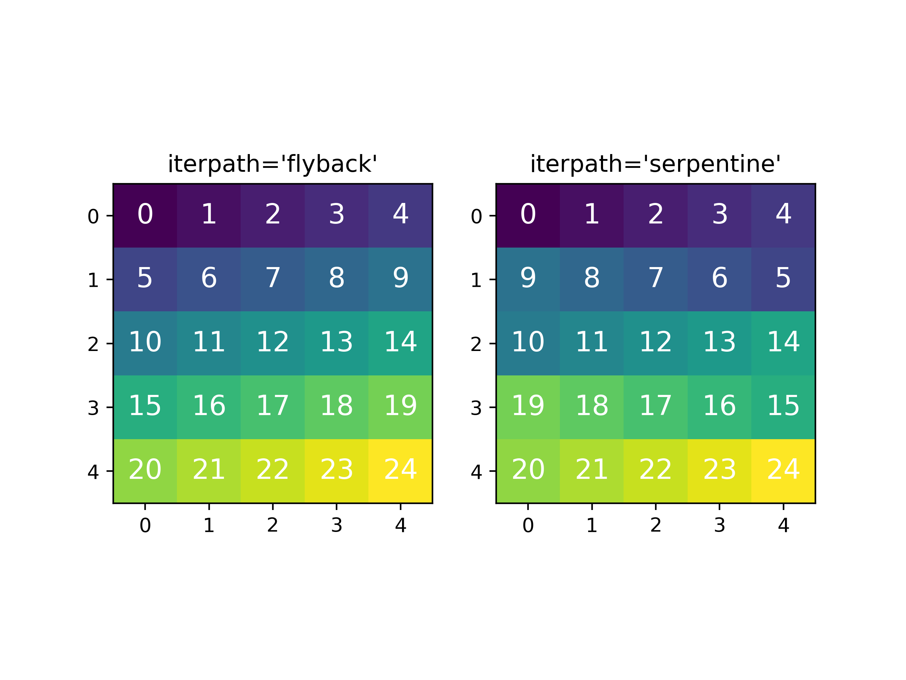

.. _model.fitting:

Fitting the model to the data
-----------------------------

To fit the model to the data at the current coordinates (e.g. to fit one
spectrum at a particular point in a spectrum-image), use
:meth:`~.model.BaseModel.fit`. HyperSpy implements a number of
different optimization approaches, each of which can have particular
benefits and/or drawbacks depending on your specific application.
A good approach to choosing an optimization approach is to ask yourself
the question "Do you want to...":

* Apply bounds to your model parameter values?
* Use gradient-based fitting algorithms to accelerate your fit?
* Estimate the standard deviations of the parameter values found by the fit?
* Fit your data in the least-squares sense, or use another loss function?
* Find the global optima for your parameters, or is a local optima acceptable?

Optimization algorithms
^^^^^^^^^^^^^^^^^^^^^^^

The following table summarizes the features of some of the optimizers
currently available in HyperSpy, including whether they support parameter
bounds, gradients and parameter error estimation. The "Type" column indicates
whether the optimizers find a local or global optima.

.. _optimizers-table:

.. table:: Features of supported curve-fitting optimizers.

    +---------------------------------+----------+-----------+----------+---------------+--------+--------+
    | Optimizer                       | Bounds   | Gradients | Errors   | Loss function | Type   | Linear |
    +=================================+==========+===========+==========+===============+========+========+
    | ``"lm"`` (default)              |  Yes     | Yes       | Yes      | Only ``"ls"`` | local  | No     |
    +---------------------------------+----------+-----------+----------+---------------+--------+--------+
    | ``"trf"``                       |  Yes     | Yes       | Yes      | Only ``"ls"`` | local  | No     |
    +---------------------------------+----------+-----------+----------+---------------+--------+--------+
    | ``"dogbox"``                    |  Yes     | Yes       | Yes      | Only ``"ls"`` | local  | No     |
    +---------------------------------+----------+-----------+----------+---------------+--------+--------+
    | ``"odr"``                       |  No      | Yes       | Yes      | Only ``"ls"`` | local  | No     |
    +---------------------------------+----------+-----------+----------+---------------+--------+--------+
    | ``"lstsq"``                     |  No      | No        | Yes [1]_ | Only ``"ls"`` | global | Yes    |
    +---------------------------------+----------+-----------+----------+---------------+--------+--------+
    | ``"ridge_regression"``          |  No      | No        | Yes [1]_ | Only ``"ls"`` | global | Yes    |
    +---------------------------------+----------+-----------+----------+---------------+--------+--------+
    | :func:`scipy.optimize.minimize` | Yes [2]_ | Yes [2]_  | No       | All           | local  | No     |
    +---------------------------------+----------+-----------+----------+---------------+--------+--------+
    | ``"Differential Evolution"``    |  Yes     | No        | No       | All           | global | No     |
    +---------------------------------+----------+-----------+----------+---------------+--------+--------+
    | ``"Dual Annealing"`` [3]_       |  Yes     | No        | No       | All           | global | No     |
    +---------------------------------+----------+-----------+----------+---------------+--------+--------+
    | ``"SHGO"`` [3]_                 |  Yes     | No        | No       | All           | global | No     |
    +---------------------------------+----------+-----------+----------+---------------+--------+--------+

.. rubric:: Footnotes

.. [1] Requires the :meth:`~hyperspy.model.BaseModel.multifit` ``calculate_errors = True`` argument
       in most cases. See the documentation below on :ref:`linear least square fitting <linear_fitting-label>`
       for more info.

.. [2] **All** of the fitting algorithms available in :func:`scipy.optimize.minimize` are currently
       supported by HyperSpy; however, only some of them support bounds and/or gradients. For more information,
       please see the `SciPy documentation <https://docs.scipy.org/doc/scipy/reference/optimize.html>`_.

.. [3] Requires ``scipy >= 1.2.0``.

The default optimizer in HyperSpy is ``"lm"``, which stands for the `Levenberg-Marquardt
algorithm <https://en.wikipedia.org/wiki/Levenberg%E2%80%93Marquardt_algorithm>`_. In
earlier versions of HyperSpy (< 1.6) this was known as ``"leastsq"``.

Loss functions
^^^^^^^^^^^^^^

HyperSpy supports a number of loss functions. The default is ``"ls"``,
i.e. the least-squares loss. For the vast majority of cases, this loss
function is appropriate, and has the additional benefit of supporting
parameter error estimation and :ref:`goodness-of-fit <model.goodness_of_fit>`
testing. However, if your data contains very low counts per pixel, or
is corrupted by outliers, the ``"ML-poisson"`` and ``"huber"`` loss
functions may be worth investigating.

Least squares with error estimation
~~~~~~~~~~~~~~~~~~~~~~~~~~~~~~~~~~~

The following example shows how to perfom least squares optimization with
error estimation. First we create data consisting of a line
``y = a*x + b`` with ``a = 1`` and ``b = 100``, and we then add Gaussian
noise to it:

.. code-block:: python

    >>> s = hs.signals.Signal1D(np.arange(100, 300, dtype='float32'))
    >>> s.add_gaussian_noise(std=100)

To fit it, we create a model consisting of a
:class:`~._components.polynomial.Polynomial` component of order 1 and fit it
to the data.

.. code-block:: python

    >>> m = s.create_model()
    >>> line = hs.model.components1D.Polynomial(order=1)
    >>> m.append(line)
    >>> m.fit() # doctest: +SKIP

Once the fit is complete, the optimized value of the parameters and their
estimated standard deviation are stored in the following line attributes:

.. code-block:: python

    >>> line.a0.value # doctest: +SKIP
    0.9924615648843765
    >>> line.a1.value # doctest: +SKIP
    103.67507406125888
    >>> line.a0.std # doctest: +SKIP
    0.11771053738516088
    >>> line.a1.std # doctest: +SKIP
    13.541061301257537

.. warning::

    When the noise is heteroscedastic, only if the
    ``metadata.Signal.Noise_properties.variance`` attribute of the
    :class:`~._signals.signal1d.Signal1D` instance is defined can
    the parameter standard deviations be estimated accurately.

    If the variance is not defined, the standard deviations are still
    computed, by setting variance equal to 1. However, this calculation
    will not be correct unless an accurate value of the variance is
    provided. See :ref:`signal.noise_properties` for more information.

.. _weighted_least_squares-label:

Weighted least squares with error estimation
~~~~~~~~~~~~~~~~~~~~~~~~~~~~~~~~~~~~~~~~~~~~

In the following example, we add Poisson noise to the data instead of
Gaussian noise, and proceed to fit as in the previous example.

.. code-block:: python

    >>> s = hs.signals.Signal1D(np.arange(300))
    >>> s.add_poissonian_noise()
    >>> m = s.create_model()
    >>> line  = hs.model.components1D.Polynomial(order=1)
    >>> m.append(line)
    >>> m.fit() # doctest: +SKIP
    >>> line.a0.value # doctest: +SKIP
    -0.7262000522775925
    >>> line.a1.value # doctest: +SKIP
    1.0086925334859176
    >>> line.a0.std # doctest: +SKIP
    1.4141418570079
    >>> line.a1.std # doctest: +SKIP
    0.008185019194679451

Because the noise is heteroscedastic, the least squares optimizer estimation is
biased. A more accurate result can be obtained with weighted least squares,
where the weights are proportional to the inverse of the noise variance.
Although this is still biased for Poisson noise, it is a good approximation
in most cases where there are a sufficient number of counts per pixel.

.. code-block:: python

    >>> exp_val = hs.signals.Signal1D(np.arange(300)+1)
    >>> s.estimate_poissonian_noise_variance(expected_value=exp_val)
    >>> line.estimate_parameters(s, 10, 250)
    True
    >>> m.fit() # doctest: +SKIP
    >>> line.a0.value # doctest: +SKIP
    -0.6666008600519397
    >>> line.a1.value # doctest: +SKIP
    1.017145603577098
    >>> line.a0.std # doctest: +SKIP
    0.8681360488613021
    >>> line.a1.std # doctest: +SKIP
    0.010308732161043038

.. warning::

    When the attribute ``metadata.Signal.Noise_properties.variance``
    is defined, the behaviour is to perform a weighted least-squares
    fit using the inverse of the noise variance as the weights.
    In this scenario, to then disable weighting, you will need to **unset**
    the attribute. You can achieve this with
    :meth:`~.api.signals.BaseSignal.set_noise_variance`:

    .. code-block:: python

        >>> m.signal.set_noise_variance(None) # This will now be an unweighted fit 
        >>> m.fit() # doctest: +SKIP
        >>> line.a0.value # doctest: +SKIP
        -1.9711403542163477
        >>> line.a1.value # doctest: +SKIP
        1.0258716193502546

Poisson maximum likelihood estimation
~~~~~~~~~~~~~~~~~~~~~~~~~~~~~~~~~~~~~

To avoid biased estimation in the case of data corrupted by Poisson noise
with very few counts, we can use Poisson maximum likelihood estimation (MLE) instead.
This is an unbiased estimator for Poisson noise. To perform MLE, we must
use a general, non-linear optimizer from the :ref:`table above <optimizers-table>`,
such as Nelder-Mead or L-BFGS-B:

.. code-block:: python

   >>> m.fit(optimizer="Nelder-Mead", loss_function="ML-poisson") # doctest: +SKIP
   >>> line.a0.value # doctest: +SKIP
   0.00025567973144090695
   >>> line.a1.value # doctest: +SKIP
   1.0036866523183754

Estimation of the parameter errors is not currently supported for Poisson
maximum likelihood estimation.

Huber loss function
~~~~~~~~~~~~~~~~~~~

HyperSpy also implements the
`Huber loss <https://en.wikipedia.org/wiki/Huber_loss>`_ function,
which is typically less sensitive to outliers in the data compared
to the least-squares loss. Again, we need to use one of the general
non-linear optimization algorithms:

.. code-block:: python

   >>> m.fit(optimizer="Nelder-Mead", loss_function="huber") # doctest: +SKIP

Estimation of the parameter errors is not currently supported
for the Huber loss function.

Custom loss functions
~~~~~~~~~~~~~~~~~~~~~

As well as the built-in loss functions described above,
a custom loss function can be passed to the model:

.. code-block:: python

    >>> def my_custom_function(model, values, data, weights=None):
    ...    """
    ...    Parameters
    ...    ----------
    ...    model : Model instance
    ...        the model that is fitted.
    ...    values : np.ndarray
    ...        A one-dimensional array with free parameter values suggested by the
    ...        optimizer (that are not yet stored in the model).
    ...    data : np.ndarray
    ...        A one-dimensional array with current data that is being fitted.
    ...    weights : {np.ndarray, None}
    ...        An optional one-dimensional array with parameter weights.
    ...
    ...    Returns
    ...    -------
    ...    score : float
    ...        A signle float value, representing a score of the fit, with
    ...        lower values corresponding to better fits.
    ...    """
    ...    # Almost any operation can be performed, for example:
    ...    # First we store the suggested values in the model
    ...    model.fetch_values_from_array(values)
    ...
    ...    # Evaluate the current model
    ...    cur_value = model(onlyactive=True)
    ...
    ...    # Calculate the weighted difference with data
    ...    if weights is None:
    ...        weights = 1
    ...    difference = (data - cur_value) * weights
    ...
    ...    # Return squared and summed weighted difference
    ...    return (difference**2).sum()

    >>> # We must use a general non-linear optimizer
    >>> m.fit(optimizer='Nelder-Mead', loss_function=my_custom_function) # doctest: +SKIP

If the optimizer requires an analytical gradient function, it can be similarly
passed, using the following signature:

.. code-block:: python

    >>> def my_custom_gradient_function(model, values, data, weights=None):
    ...    """
    ...    Parameters
    ...    ----------
    ...    model : Model instance
    ...        the model that is fitted.
    ...    values : np.ndarray
    ...        A one-dimensional array with free parameter values suggested by the
    ...        optimizer (that are not yet stored in the model).
    ...    data : np.ndarray
    ...        A one-dimensional array with current data that is being fitted.
    ...    weights : {np.ndarray, None}
    ...        An optional one-dimensional array with parameter weights.
    ...
    ...    Returns
    ...    -------
    ...    gradients : np.ndarray
    ...        a one-dimensional array of gradients, the size of `values`,
    ...        containing each parameter gradient with the given values
    ...    """
    ...    # As an example, estimate maximum likelihood gradient:
    ...    model.fetch_values_from_array(values)
    ...    cur_value = model(onlyactive=True)
    ...
    ...    # We use in-built jacobian estimation
    ...    jac = model._jacobian(values, data)
    ...
    ...    return -(jac * (data / cur_value - 1)).sum(1)

    >>> # We must use a general non-linear optimizer again
    >>> m.fit(optimizer='L-BFGS-B',
    ...       loss_function=my_custom_function,
    ...       grad=my_custom_gradient_function) # doctest: +SKIP

Using gradient information
^^^^^^^^^^^^^^^^^^^^^^^^^^

.. versionadded:: 1.6 ``grad="analytical"`` and ``grad="fd"`` keyword arguments

Optimization algorithms that take into account the gradient of
the loss function will often out-perform so-called "derivative-free"
optimization algorithms in terms of how rapidly they converge to a
solution. HyperSpy can use analytical gradients for model-fitting,
as well as numerical estimates of the gradient based on finite differences.

If all the components in the model support analytical gradients,
you can pass ``grad="analytical"`` in order to use this information
when fitting. The results are typically more accurate than an
estimated gradient, and the optimization often runs faster since
fewer function evaluations are required to calculate the gradient.

Following the above examples:

.. code-block:: python

    >>> m = s.create_model()
    >>> line = hs.model.components1D.Polynomial(order=1)
    >>> m.append(line)

    >>> # Use a 2-point finite-difference scheme to estimate the gradient
    >>> m.fit(grad="fd", fd_scheme="2-point") # doctest: +SKIP

    >>> # Use the analytical gradient
    >>> m.fit(grad="analytical") # doctest: +SKIP

    >>> # Huber loss and Poisson MLE functions
    >>> # also support analytical gradients
    >>> m.fit(grad="analytical", loss_function="huber") # doctest: +SKIP
    >>> m.fit(grad="analytical", loss_function="ML-poisson") # doctest: +SKIP

.. note::

    Analytical gradients are not yet implemented for the
    :class:`~.models.model2d.Model2D` class.

Bounded optimization
^^^^^^^^^^^^^^^^^^^^

Non-linear optimization can sometimes fail to converge to a good optimum,
especially if poor starting values are provided. Problems of ill-conditioning
and non-convergence can be improved by using bounded optimization.

All components' parameters have the attributes ``parameter.bmin`` and
``parameter.bmax`` ("bounded min" and "bounded max"). When fitting using the
``bounded=True`` argument by ``m.fit(bounded=True)`` or ``m.multifit(bounded=True)``,
these attributes set the minimum and maximum values allowed for ``parameter.value``.

Currently, not all optimizers support bounds - see the
:ref:`table above <optimizers-table>`. In the following example, a Gaussian
histogram is fitted using a :class:`~._components.gaussian.Gaussian`
component using the Levenberg-Marquardt ("lm") optimizer and bounds
on the ``centre`` parameter.

.. code-block:: python

    >>> s = hs.signals.BaseSignal(np.random.normal(loc=10, scale=0.01,
    ... size=100000)).get_histogram()
    >>> s.axes_manager[-1].is_binned = True
    >>> m = s.create_model()
    >>> g1 = hs.model.components1D.Gaussian()
    >>> m.append(g1)
    >>> g1.centre.value = 7
    >>> g1.centre.bmin = 7
    >>> g1.centre.bmax = 14
    >>> m.fit(optimizer="lm", bounded=True) # doctest: +SKIP
    >>> m.print_current_values() # doctest: +SKIP
    Model1D:  histogram
    Gaussian: Gaussian
    Active: True
    Parameter Name |  Free |      Value |        Std |        Min |        Max
    ============== | ===== | ========== | ========== | ========== | ==========
                 A |  True | 99997.3481 | 232.333693 |        0.0 |       None
             sigma |  True | 0.00999184 | 2.68064163 |       None |       None
            centre |  True | 9.99980788 | 2.68064070 |        7.0 |       14.0

.. _linear_fitting-label:

Linear least squares
^^^^^^^^^^^^^^^^^^^^

.. versionadded:: 1.7

Linear fitting can be used to address some of the drawbacks of non-linear optimization:

- it doesn't suffer from the *starting parameters* issue, which can sometimes be problematic
  with nonlinear fitting. Since linear fitting uses linear algebra to find the
  solution (find the parameter values of the model), the solution is a unique solution,
  while nonlinear optimization uses an iterative approach and therefore relies
  on the initial values of the parameters.
- it is fast, because i) in favorable situations, the signal can be fitted in a vectorized
  fashion, i.e. the signal is fitted in a single run instead of iterating over
  the navigation dimension; ii) it is not iterative, `i.e.` it does the
  calculation only one time instead of 10-100 iterations, depending on how
  quickly the non-linear optimizer will converge.

However, linear fitting can *only* fit linear models and will not be able to fit
parameters which vary *non-linearly*.

A component is considered linear when its free parameters scale the component only
in the y-axis. For the exemplary function ``y = a*x**b``, ``a`` is a linear parameter, whilst ``b``
is not. If ``b.free = False``, then the component is linear.
Components can also be made up of several linear parts. For instance,
the 2D-polynomial ``y = a*x**2+b*y**2+c*x+d*y+e`` is entirely linear.

.. note::

    After creating a model with values for the nonlinear parameters, a quick way to set
    all nonlinear parameters to be ``free = False`` is to use ``m.set_parameters_not_free(only_nonlinear=True)``

To check if a parameter is linear, use the model or component method
:meth:`~hyperspy.model.BaseModel.print_current_values()`. For a component to be
considered linear, it can hold only one free parameter, and that parameter
must be linear.

If all components in a model are linear, then a linear optimizer can be used to
solve the problem as a linear regression problem! This can be done using two approaches:

- the standard pixel-by-pixel approach as used by the *nonlinear* optimizers
- fit the entire dataset in one *vectorised* operation, which will be much faster (up to 1000 times).
  However, there is a caveat: all fixed parameters must have the same value across the dataset in
  order to avoid creating a very large array whose size will scale with the number of different
  values of the non-free parameters.

.. note::

    A good example of a linear model in the electron-microscopy field is an Energy-Dispersive
    X-ray Spectroscopy (EDS) dataset, which typically consists of a polynomial background and
    Gaussian peaks with well-defined energy (``Gaussian.centre``) and peak widths
    (``Gaussian.sigma``). This dataset can be fit extremely fast with a linear optimizer.

There are two implementations of linear least squares fitting in hyperspy:

- the ``'lstsq'`` optimizer, which uses :func:`numpy.linalg.lstsq`, or
  :func:`dask.array.linalg.lstsq` for lazy signals.
- the ``'ridge_regression'`` optimizer, which supports regularization
  (see :class:`sklearn.linear_model.Ridge` for arguments to pass to
  :meth:`~hyperspy.model.BaseModel.fit`), but does not support lazy signals.

As for non-linear least squares fitting, :ref:`weighted least squares <weighted_least_squares-label>`
is supported.

In the following example, we first generate a 300x300 navigation signal of varying total intensity,
and then populate it with an EDS spectrum at each point. The signal can be fitted with a polynomial
background and a Gaussian for each peak. Hyperspy automatically adds these to the model, and fixes
the ``centre`` and ``sigma`` parameters to known values. Fitting this model with a non-linear optimizer
can about half an hour on a decent workstation. With a linear optimizer, it takes seconds.

.. code-block:: python

    >>> nav = hs.signals.Signal2D(np.random.random((300, 300))).T
    >>> s = exspy.data.EDS_TEM_FePt_nanoparticles() * nav # doctest: +SKIP
    >>> m = s.create_model() # doctest: +SKIP

    >>> m.multifit(optimizer='lstsq') # doctest: +SKIP

Standard errors for the parameters are by default not calculated when the dataset
is fitted in vectorized fashion, because it has large memory requirement.
If errors are required, either pass ``calculate_errors=True`` as an argument
to :meth:`~hyperspy.model.BaseModel.multifit`, or rerun
:meth:`~hyperspy.model.BaseModel.multifit` with a nonlinear optimizer,
which should run fast since the parameters are already optimized.

None of the linear optimizers currently support bounds.

Optimization results
^^^^^^^^^^^^^^^^^^^^

After fitting the model, details about the optimization
procedure, including whether it finished successfully,
are returned as :class:`scipy.optimize.OptimizeResult` object,
according to the keyword argument ``return_info=True``.
These details are often useful for diagnosing problems such
as a poorly-fitted model or a convergence failure.
You can also access the object as the ``fit_output`` attribute:

.. code-block:: python

    >>> m.fit() # doctest: +SKIP
    >>> type(m.fit_output) # doctest: +SKIP
    <scipy.optimize.OptimizeResult object>

You can also print this information using the
``print_info`` keyword argument:

.. code-block:: python

    # Print the info to stdout
    >>> m.fit(optimizer="L-BFGS-B", print_info=True) # doctest: +SKIP
    Fit info:
      optimizer=L-BFGS-B
      loss_function=ls
      bounded=False
      grad="fd"
    Fit result:
      hess_inv: <3x3 LbfgsInvHessProduct with dtype=float64>
       message: b'CONVERGENCE: REL_REDUCTION_OF_F_<=_FACTR*EPSMCH'
          nfev: 168
           nit: 32
          njev: 42
        status: 0
       success: True
             x: array([ 9.97614503e+03, -1.10610734e-01,  1.98380701e+00])

.. _model.goodness_of_fit:

Goodness of fit
^^^^^^^^^^^^^^^

The chi-squared, reduced chi-squared and the degrees of freedom are
computed automatically when fitting a (weighted) least-squares model
(i.e. only when ``loss_function="ls"``). They are stored as signals, in the
:attr:`~.model.BaseModel.chisq`, :attr:`~.model.BaseModel.red_chisq` and
:attr:`~.model.BaseModel.dof` attributes of the model respectively.

.. warning::

    Unless ``metadata.Signal.Noise_properties.variance`` contains
    an accurate estimation of the variance of the data, the chi-squared and
    reduced chi-squared will not be computed correctly. This is true for both
    homocedastic and heteroscedastic noise.

.. _model.visualization:

Visualizing the model
^^^^^^^^^^^^^^^^^^^^^

To visualise the result use the :meth:`~.models.model1d.Model1D.plot` method:

.. code-block:: python

    >>> m.plot() # Visualise the results

By default only the full model line is displayed in the plot. In addition, it
is possible to display the individual components by calling
:meth:`~.model.BaseModel.enable_plot_components` or directly using
:meth:`~.models.model1d.Model1D.plot`:

.. code-block:: python

    >>> m.plot(plot_components=True) # Visualise the results

To disable this feature call
:meth:`~.model.BaseModel.disable_plot_components`.

.. versionadded:: 1.4 :meth:`~.api.signals.Signal1D.plot` keyword arguments

All extra keyword arguments are passed to the :meth:`~.api.signals.Signal1D.plot`
method of the corresponding signal object. The following example plots the
model signal figure but not its navigator:

.. code-block:: python

    >>> m.plot(navigator=False)

By default the model plot is automatically updated when any parameter value
changes. It is possible to suspend this feature with
:meth:`~.model.BaseModel.suspend_update`.

.. To resume it use :meth:`~.model.BaseModel.resume_update`.

.. _model.starting:

Setting the initial parameters
^^^^^^^^^^^^^^^^^^^^^^^^^^^^^^

Non-linear optimization often requires setting sensible starting parameters.
This can be done by plotting the model and adjusting the parameters by hand.

.. versionchanged:: 1.3
    All ``notebook_interaction`` methods renamed to :meth:`~.model.BaseModel.gui`.
    The ``notebook_interaction`` methods were removed in 2.0.

.. _notebook_interaction-label:

If running in a Jupyter Notebook, interactive widgets can be used to
conveniently adjust the parameter values by running
:meth:`~.model.BaseModel.gui` for :class:`~.model.BaseModel`,
:class:`~.component.Component` and
:class:`~.component.Parameter`.

.. figure::  ../images/notebook_widgets.png
    :align:   center
    :width:   985

    Interactive widgets for the full model in a Jupyter notebook. Drag the
    sliders to adjust current parameter values. Typing different minimum and
    maximum values changes the boundaries of the slider.

Also, :meth:`~.models.model1d.Model1D.enable_adjust_position` provides an
interactive way of setting the position of the components with a
well-defined position.
:meth:`~.models.model1d.Model1D.disable_adjust_position` disables the tool.

.. figure::  ../images/model_adjust_position.png
    :align:   center
    :width:   500

    Interactive component position adjustment tool. Drag the vertical lines
    to set the initial value of the position parameter.

Exclude data from the fitting process
^^^^^^^^^^^^^^^^^^^^^^^^^^^^^^^^^^^^^

The following :class:`~.model.BaseModel` methods can be used to exclude
undesired spectral channels from the fitting process:

* :meth:`~.models.model1d.Model1D.set_signal_range`
* :meth:`~.models.model1d.Model1D.add_signal_range`
* :meth:`~.model.BaseModel.set_signal_range_from_mask`
* :meth:`~.models.model1d.Model1D.remove_signal_range`
* :meth:`~.models.model1d.Model1D.reset_signal_range`

The example below shows how a boolean array can be easily created from the
signal and how the ``isig`` syntax can be used to define the signal range.

.. code-block:: python

    >>> # Create a sample 2D gaussian dataset
    >>> g = hs.model.components2D.Gaussian2D(
    ...   A=1, centre_x=-5.0, centre_y=-5.0, sigma_x=1.0, sigma_y=2.0,)

    >>> scale = 0.1
    >>> x = np.arange(-10, 10, scale)
    >>> y = np.arange(-10, 10, scale)
    >>> X, Y = np.meshgrid(x, y)

    >>> im = hs.signals.Signal2D(g.function(X, Y))
    >>> im.axes_manager[0].scale = scale
    >>> im.axes_manager[0].offset = -10
    >>> im.axes_manager[1].scale = scale
    >>> im.axes_manager[1].offset = -10

    >>> m = im.create_model() # Model initialisation
    >>> gt = hs.model.components2D.Gaussian2D()
    >>> m.append(gt)

    >>> m.set_signal_range(-7, -3, -9, -1) # Set signal range
    >>> m.fit() # doctest: +SKIP

    Alternatively, create a boolean signal of the same shape
    as the signal space of im
    
    >>> signal_mask = im > 0.01

    >>> m.set_signal_range_from_mask(signal_mask.data) # Set signal range
    >>> m.fit() # doctest: +SKIP

.. _model.multidimensional-label:

Fitting multidimensional datasets
^^^^^^^^^^^^^^^^^^^^^^^^^^^^^^^^^

To fit the model to all the elements of a multidimensional dataset, use
:meth:`~.model.BaseModel.multifit`:

.. code-block:: python

    >>> m.multifit() # warning: this can be a lengthy process on large datasets

:meth:`~.model.BaseModel.multifit` fits the model at the first position,
stores the result of the fit internally and move to the next position until
reaching the end of the dataset.

.. NOTE::

    Sometimes this method can fail, especially in the case of a TEM spectrum
    image of a particle surrounded by vacuum (since in that case the
    top-left pixel will typically be an empty signal).

    To get sensible starting parameters, you can do a single
    :meth:`~.model.BaseModel.fit` after changing the active position
    within the spectrum image (either using the plotting GUI or by directly
    modifying ``s.axes_manager.indices`` as in :ref:`Setting_axis_properties`).

    After doing this, you can initialize the model at every pixel to the
    values from the single pixel fit using ``m.assign_current_values_to_all()``,
    and then use :meth:`~.model.BaseModel.multifit` to perform the fit over
    the entire spectrum image.

.. versionadded:: 1.6 New optional fitting iteration path `"serpentine"`
.. versionadded:: 2.0 New default iteration path for fitting is "serpentine"`

In HyperSpy, curve fitting on a multidimensional dataset happens in the following
manner: Pixels are fit along the row from the first index in the first row, and
once the last pixel in the row is reached, one proceeds in reverse order from the
last index in the second row. This procedure leads to a serpentine pattern, as
seen on the image below. The serpentine pattern supports n-dimensional
navigation space, so the first index in the second frame of a three-dimensional
navigation space will be at the last position of the previous frame.

An alternative scan pattern would be the ``'flyback'`` scheme, where the map is
iterated through row by row, always starting from the first index. This pattern
can be explicitly set using the :meth:`~.model.BaseModel.multifit`
``iterpath='flyback'`` argument. However, the ``'serpentine'`` strategy is
usually more robust, as it always moves on to a neighbouring pixel and the fitting
procedure uses the fit result of the previous pixel as the starting point for the
next. A common problem in the ``'flyback'`` pattern  is that the fitting fails
going from the end of one row to the beginning of the next, as the spectrum can
change abruptly.

    Comparing the scan patterns generated by the  ``'flyback'`` and ``'serpentine'``
    iterpath options for a 2D navigation space. The pixel intensity and number
    refers to the order that the signal is fitted in.

In addition to ``'serpentine'`` and ``'flyback'``, ``iterpath`` can take as
argument any list or array of indices, or a generator of such, as explained in
the :ref:`Iterating AxesManager <iterating_axesmanager>` section.

Sometimes one may like to store and fetch the value of the parameters at a
given position manually. This is possible using
:meth:`~.model.BaseModel.store_current_values` and
:meth:`~.model.BaseModel.fetch_stored_values`.

Visualising the result of the fit
^^^^^^^^^^^^^^^^^^^^^^^^^^^^^^^^^

The :class:`~.model.BaseModel` :meth:`~.model.BaseModel.plot_results`,
:class:`~.component.Component` :meth:`~.component.Component.plot` and
:class:`~.component.Parameter` :meth:`~.component.Parameter.plot` methods
can be used to visualise the result of the fit **when fitting multidimensional
datasets**.
