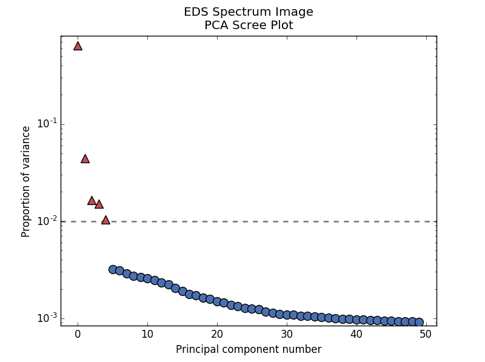
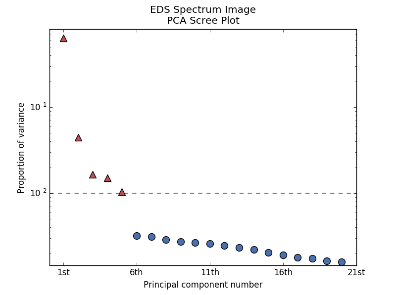

.. _ml-label:

Machine learning
****************

Introduction
============

HyperSpy provides easy access to several "machine learning" algorithms that
can be useful when analysing multi-dimensional data. In particular, decomposition
algorithms, such as principal component analysis (PCA), or blind source
separation (BSS) algorithms, such as independent component analysis (ICA), are
available through the methods described in this section.

The behaviour of some machine learning operations can be customised
:ref:`customised <configuring-hyperspy-label>` in the Machine Learning section
Preferences.

.. Note::

    Currently the BSS algorithms operate on the result of a previous
    decomposition analysis. Therefore, it is necessary to perform a
    decomposition before attempting to perform a BSS.

.. _decomposition-nomenclature:

Nomenclature
============

HyperSpy will decompose a dataset into two new datasets: one
with the dimension of the signal space known as `factors`, and the
other with the dimension of the navigation space known as `loadings`.

.. _decomposition:

Decomposition
=============

Decomposition techniques are most commonly applied as a means of noise reduction (or `denoising`)
and dimensionality reduction.

Principal component analysis
----------------------------
One of the most popular decomposition methods is principal component analysis (PCA). To perform PCA on your dataset, run the
:py:meth:`~.learn.mva.MVA.decomposition` method:

.. code-block:: python

   >>> s.decomposition()

Note that the `s` variable must contain either a :class:`~.signal.BaseSignal`  class
or its subclasses, which will most likely have been loaded with the
:func:`~.io.load` function, e.g. ``s = load('my_file.hdf5')``. Also, the signal must be
multi-dimensional, that is ``s.axes_manager.navigation_size`` must be greater than
one.

Several algorithms exist for performing PCA, and the default algorithm in
HyperSpy is :py:const:`SVD`, which uses an approach called
"singular value decomposition". This method has many options, and for more
information please read the method documentation.

.. _scree-plot:

Scree plots
^^^^^^^^^^^

PCA will sort the components in the dataset in order of decreasing
variance. It is often useful to estimate the dimensionality of the data by
plotting the explained variance against the component index. This plot is
sometimes called a scree plot and it should drop quickly,
eventually becoming a slowly descending line.

The point at which the scree plot becomes linear (often referred to as
the `elbow`) is generally judged to be a good estimation of the dimensionality
of the data (or equivalently, the number of components that should be retained -
see below).

To obtain a scree plot for your dataset, run the
:py:meth:`~.learn.mva.MVA.plot_explained_variance_ratio` method:

.. code-block:: python

    >>> ax = s.plot_explained_variance_ratio(n=20)

   PCA scree plot

The default options for this method will plot a bare scree plot, but the
method's arguments allow for a great deal of customization. For
example, by specifying a ``threshold`` value, a cutoff line will be drawn at
the total variance specified, and the components above this value will be
styled distinctly from the remaining components to show which are considered
signal, as opposed to noise. Alternatively, by providing an integer value
for ``threshold``, the line will be drawn at the specified component (see
below). These options (together with many others), can be customized to
develop a figure of your liking. See the documentation of
:py:meth:`~.learn.mva.MVA.plot_explained_variance_ratio` for more details.

Note that in the above figure, the first component has index 0. This is because
Python uses zero based indexing i.e. the initial element of a sequence is found
at index 0. To switch to a "number-based" (rather than "index-based")
notation, specify the ``xaxis_type`` parameter:

.. code-block:: python

    >>> ax = s.plot_explained_variance_ratio(n=20,
    >>>                                      threshold=4,
    >>>                                      xaxis_type='number')

   PCA scree plot with number-based axis labeling and a threshold value
   specified

.. versionadded:: 0.7

Sometimes it can be useful to get the explained variance ratio as a spectrum,
for example to plot several scree plots obtained using
different data pre-treatmentd in the same figure using
:py:func:`~.drawing.utils.plot_spectra`. This can be achieved using
:py:meth:`~.learn.mva.MVA.get_explained_variance_ratio`

Denoising
^^^^^^^^^

One of the most popular uses of PCA is data denoising. This is achieved by
using a limited set of components to make a model of the original, omitting
the later components that ideally contain only noise. This
is also known as *dimensionality reduction*.

To perform this operation with HyperSpy, run the
:py:meth:`~.learn.mva.MVA.get_decomposition_model` method, usually after
estimating the dimension of your data using a scree plot. For
example:

.. code-block:: python

    >>> sc = s.get_decomposition_model(components)

.. NOTE::
    The components argument can be one of several things (None, int,
    or list of ints):

    * if None, all the components are used to construct the model.
    * if int, only the given number of components (starting from index 0) are
      used to construct the model.
    * if list of ints, only the components in the given list are used to
      construct the model.

Sometimes, it is useful to examine the residuals between your original data and
the decomposition model. You can easily calculate and display the residuals:

.. code-block:: python

    >>> (s - sc).plot()

.. HINT::
    Unlike most of the analysis functions, this function returns a new
    object, which in the example above we have called 'sc'.
    You can perform operations on this new object later. It is a copy of the
    original :py:const:`s` object, except that the data has been replaced by
    the model constructed using the chosen components.

Poissonian noise
----------------

Many decomposition methods such as PCA assume that the noise of the data follows a
Gaussian distribution. In cases where your data is instead corrupted by Poisson noise,
HyperSpy can "normalize" the data by performing a scaling operation, which
can greatly enhance the result.

To perform Poissonian noise normalization:

.. code-block:: python
     The long way:
     >>> s.decomposition(normalize_poissonian_noise=True)

     Because it is the first argument we could have simply written:
     >>> s.decomposition(True)

More details about the scaling procedure can be found in [Keenan2004]_.

.. _rpca-label:

Robust principal component analysis
-----------------------------------

PCA is known to be very sensitive to the presence of outliers in data. These outliers
can be the result of missing or dead pixels, X-ray spikes, or very low count data.
If one assumes a dataset to consist of a low-rank component **L** corrupted by
a sparse error component **S**, then Robust PCA (RPCA) can be used to recover the
low-rank component for subsequent processing [Candes2011]_.

The default RPCA algorithm is GoDec [Zhou2011]_. In HyperSpy it returns the factors
and loadings of **L**, and can be accessed with the following code. You must set the
"output_dimension" when using RPCA.

.. code-block:: python

   >>> s.decomposition(algorithm='RPCA_GoDec',
                       output_dimension=3)

HyperSpy also implements an *online* algorithm for RPCA developed by Feng et al. [Feng2013]_.
This minimizes memory usage, making it suitable for large datasets, and can often
be faster than the default algorithm.

.. code-block:: python

   >>> s.decomposition(algorithm='ORPCA',
                       output_dimension=3)

The online RPCA implementation sets several default parameters that are
usually suitable for most datasets. However, to improve the convergence you can
"train" the algorithm with the first few samples of your dataset. For example,
the following code will train ORPCA using the first 32 samples of the data.

.. code-block:: python

   >>> s.decomposition(algorithm='ORPCA',
                       output_dimension=3,
                       training_samples=32)

Finally, online RPCA includes three alternative methods to the default
closed-form solver, which can again improve both the convergence and speed
of the algorithm. These are particularly useful for very large datasets.

The first method is block-coordinate descent (BCD), and takes no
additional parameters:

.. code-block:: python

   >>> s.decomposition(algorithm='ORPCA',
                       output_dimension=3,
                       method='BCD')

The second is based on stochastic gradient descent (SGD), and takes an
additional parameter to set the learning rate. The learning rate dictates
the size of the steps taken by the gradient descent algorithm, and setting
it too large can lead to oscillations that prevent the algorithm from
finding the correct minima. Usually a value between 1 and 2 works well:

.. code-block:: python

   >>> s.decomposition(algorithm='ORPCA',
                       output_dimension=3,
                       method='SGD',
                       learning_rate=1.1)

The third method is MomentumSGD, which typically improves the convergence
properties of stochastic gradient descent. This takes the further parameter
"momentum", which should be a fraction between 0 and 1.

.. code-block:: python

   >>> s.decomposition(algorithm='ORPCA',
                       output_dimension=3,
                       method='MomentumSGD',
                       learning_rate=1.1,
                       momentum=0.5)

Non-negative matrix factorization
----------------------------

Another popular decomposition method is non-negative matrix factorization (NMF), which
can be accessed in HyperSpy with:

.. code-block:: python

   >>> s.decomposition(algorithm='nmf')

Unlike PCA, NMF forces the components to be strictly non-negative, which can aid
the physical interpretation of components for count data such as images, EELS or EDS.

NMF takes the optional argument "output_dimension", which determines the number
of components to keep. Setting this to a small number is recommended to keep
the computation time small. Often it is useful to run a PCA decomposition first
and use the scree plot to determine a value for "output_dimension".

Blind Source Separation
=======================

In some cases (it largely depends on the particular application) it is possible
to obtain more physically interpretable set of components using a process
called Blind Source Separation (BSS). For more information about blind source separation
please see [Hyvarinen2000]_, and for an example application to EELS analysis, see
[Pena2010]_.

To perform BSS on the result of a decomposition, run the
:py:meth:`~.learn.mva.MVA.blind_source_separation` method, e.g.:

.. code-block:: python

    s.blind_source_separation(number_of_components)

.. NOTE::

        Currently the BSS algorithms operate on the result of a previous
        decomposition analysis. Therefore, it is necessary to perform a
        :ref:`decomposition` first.

.. NOTE::
    You must pass an integer number of components to ICA.  The best
    way to estimate this number in the case of a PCA decomposition is by
    inspecting the :ref:`scree-plot`.

.. _mva.visualization:

Visualizing results
===================

HyperSpy includes a number of plotting methods for the results of decomposition
and blind source separation. All the methods begin with "plot_":

1. :py:meth:`~.signal.MVATools.plot_decomposition_results`.
2. :py:meth:`~.signal.MVATools.plot_decomposition_factors`.
3. :py:meth:`~.signal.MVATools.plot_decomposition_loadings`.
4. :py:meth:`~.signal.MVATools.plot_bss_results`.
5. :py:meth:`~.signal.MVATools.plot_bss_factors`.
6. :py:meth:`~.signal.MVATools.plot_bss_loadings`.

1 and 4 (new in version 0.7) provide a more compact way of displaying the
results. All the other methods display each component in its own window. For 2
and 3 it is wise to provide the number of factors or loadings you wish to
visualise, since the default is to plot all of them. For BSS, the default is
the number you included when running the :py:meth:`~.learn.mva.MVA.blind_source_separation`
method.

.. _mva.get_results:

Obtaining the results as BaseSignal instances
=============================================
.. versionadded:: 0.7

The decomposition and BSS results are internally stored as numpy arrays in the
:py:class:`~.signal.BaseSignal` class. Frequently it is useful to obtain the
decomposition/BSS factors and loadings as HyperSpy signals, and HyperSpy
provides the following methods for that purpose:

* :py:meth:`~.signal.MVATools.get_decomposition_loadings`.
* :py:meth:`~.signal.MVATools.get_decomposition_factors`.
* :py:meth:`~.signal.MVATools.get_bss_loadings`.
* :py:meth:`~.signal.MVATools.get_bss_factors`.

Saving and loading results
==========================

There are several methods for storing the result of a machine learning
analysis.

Saving in the main file
-------------------------

If you save the dataset on which you've performed machine learning analysis in
the :ref:`hdf5-format` format (the default in HyperSpy) (see
:ref:`saving_files`), the result of the analysis is also saved in the same
file automatically, and it is loaded along with the rest of the data when you
next open the file.

.. NOTE::
  This approach currently supports storing one decomposition and one BSS result,
  which may not be enough for your purposes.

Saving to an external file
---------------------------

Alternatively, you can save the results of the current machine learning analysis to
a separate file with the :py:meth:`~.learn.mva.LearningResults.save` method:

.. code-block:: python

    Save the result of the analysis
    >>> s.learning_results.save('my_results')

    Load back the results
    >>> s.learning_results.load('my_results.npz')

Exporting in different formats
------------------------------

It is also possible to export the results of machine learning to any format
supported by HyperSpy with:

* :py:meth:`~.signal.MVATools.export_decomposition_results` or
* :py:meth:`~.signal.MVATools.export_bss_results`.

These methods accept many arguments to customise the way in which the
data is exported, so please consult the method documentation. The options
include the choice of file format, the prefixes for loadings and factors,
saving figures instead of data and more.

.. NOTE::
  Data exported in this way cannot be easily  loaded into HyperSpy's
  machine learning structure.
