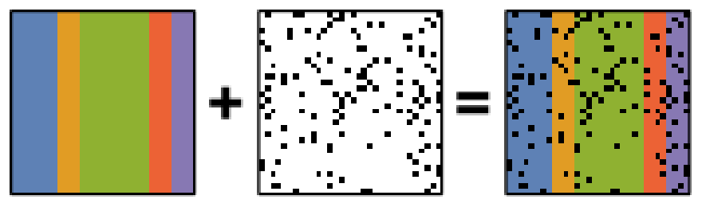

.. _ml-label:

Machine learning
****************

Introduction
============

HyperSpy provides easy access to several "machine learning" algorithms that
can be useful when analysing multi-dimensional data. In particular,
decomposition algorithms, such as principal component analysis (PCA), or
blind source separation (BSS) algorithms, such as independent component
analysis (ICA), are available through the methods described in this section.

.. hint::

   HyperSpy will decompose a dataset, :math:`X`, into two new datasets:
   one with the dimension of the signal space known as **factors** (:math:`A`),
   and the other with the dimension of the navigation space known as **loadings**
   (:math:`B`), such that :math:`X = A B^T`.

   For some of the algorithms listed below, the decomposition results in
   an `approximation` of the dataset, i.e. :math:`X \approx A B^T`.

.. _mva.decomposition:

Decomposition
=============

Decomposition techniques are most commonly used as a means of noise
reduction (or `denoising`) and dimensionality reduction. To apply a
decomposition to your dataset, run the :py:meth:`~.learn.mva.MVA.decomposition`
method, for example:

.. code-block:: python

   >>> import numpy as np
   >>> from hyperspy.signals import Signal1D

   >>> s = Signal1D(np.random.randn(10, 10, 200))
   >>> s.decomposition()

   >>> # Load data from a file, then decompose
   >>> s = hs.load("my_file.hspy")
   >>> s.decomposition()

.. note::
   The signal ``s`` must be multi-dimensional, *i.e.*
   ``s.axes_manager.navigation_size > 1``

One of the most popular uses of :py:meth:`~.learn.mva.MVA.decomposition`
is data denoising. This is achieved by using a limited set of components
to make a model of the original dataset, omitting the less significant components that
ideally contain only noise.

To reconstruct your denoised or reduced model, run the
:py:meth:`~.learn.mva.MVA.get_decomposition_model` method. For example:

.. code-block:: python

   >>> # Use all components to reconstruct the model
   >>> sc = s.get_decomposition_model()

   >>> # Use first 3 components to reconstruct the model
   >>> sc = s.get_decomposition_model(3)

   >>> # Use components [0, 2] to reconstruct the model
   >>> sc = s.get_decomposition_model([0, 2])

Sometimes, it is useful to examine the residuals between your original data and
the decomposition model. You can easily calculate and display the residuals,
since :py:meth:`~.learn.mva.MVA.get_decomposition_model` returns a new
object, which in the example above we have called ``sc``:

.. code-block:: python

   >>> (s - sc).plot()

You can perform operations on this new object ``sc`` later.
It is a copy of the original ``s`` object, except that the data has
been replaced by the model constructed using the chosen components.

If you provide the ``output_dimension`` argument, which takes an integer value,
the decomposition algorithm attempts to find the best approximation for the
dataset :math:`X` with only a limited set of factors :math:`A` and loadings :math:`B`,
such that :math:`X \approx A B^T`.

.. code-block:: python

   >>> s.decomposition(output_dimension=3)

Some of the algorithms described below require ``output_dimension`` to be provided.

Available algorithms
--------------------

HyperSpy implements a number of decomposition algorithms via the ``algorithm`` argument.
The table below lists the algorithms that are currently available, and includes
links to the appropriate documentation for more information on each one.

.. note::

   Choosing which algorithm to use is likely to depend heavily on the nature of your
   dataset and the type of analysis you are trying to perform. We discuss some of the
   reasons for choosing one algorithm over another below, but would encourage you to
   do your own research as well. The `scikit-learn documentation
   <https://scikit-learn.org/stable/modules/decomposition.html>`_ is a
   very good starting point.

.. _decomposition-table:

.. table:: Available decomposition algorithms in HyperSpy

   +--------------------------+----------------------------------------------------------------+
   | Algorithm                | Method                                                         |
   +==========================+================================================================+
   | "SVD" (default)          | :py:func:`~.learn.svd_pca.svd_pca`                             |
   +--------------------------+----------------------------------------------------------------+
   | "MLPCA"                  | :py:func:`~.learn.mlpca.mlpca`                                 |
   +--------------------------+----------------------------------------------------------------+
   | "sklearn_pca"            | :py:class:`sklearn.decomposition.PCA`                          |
   +--------------------------+----------------------------------------------------------------+
   | "NMF"                    | :py:class:`sklearn.decomposition.NMF`                          |
   +--------------------------+----------------------------------------------------------------+
   | "sparse_pca"             | :py:class:`sklearn.decomposition.SparsePCA`                    |
   +--------------------------+----------------------------------------------------------------+
   | "mini_batch_sparse_pca"  | :py:class:`sklearn.decomposition.MiniBatchSparsePCA`           |
   +--------------------------+----------------------------------------------------------------+
   | "RPCA"                   | :py:func:`~.learn.rpca.rpca_godec`                             |
   +--------------------------+----------------------------------------------------------------+
   | "ORPCA"                  | :py:class:`~.learn.rpca.ORPCA`                                 |
   +--------------------------+----------------------------------------------------------------+
   | "ORNMF"                  | :py:class:`~.learn.ornmf.ORNMF`                                |
   +--------------------------+----------------------------------------------------------------+
   | custom object            | An object implementing  ``fit()`` and  ``transform()`` methods |
   +--------------------------+----------------------------------------------------------------+

.. _mva.svd:

Singular value decomposition (SVD)
----------------------------------

The default algorithm in HyperSpy is ``"SVD"``, which uses an approach called
"singular value decomposition" to decompose the data in the form
:math:`X = U \Sigma V^T`. The factors are given by :math:`U \Sigma`, and the
loadings are given by :math:`V^T`. For more information, please read the method
documentation for :py:func:`~.learn.svd_pca.svd_pca`.

.. code-block:: python

   >>> import numpy as np
   >>> from hyperspy.signals import Signal1D

   >>> s = Signal1D(np.random.randn(10, 10, 200))
   >>> s.decomposition()

.. note::
   In some fields, including electron microscopy, this approach of applying an SVD
   directly to the data :math:`X` is often called PCA :ref:`(see below) <mva.pca>`.

   However, in the classical definition of PCA, the SVD should be applied to data that has
   first been "centered" by subtracting the mean, i.e. :math:`\mathrm{SVD}(X - \bar X)`.

   The ``"SVD"`` algorithm in HyperSpy **does not** apply this
   centering step by default. As a result, you may observe differences between
   the output of the ``"SVD"`` algorithm and, for example,
   :py:class:`sklearn.decomposition.PCA`, which **does** apply centering.

.. _mva.pca:

Principal component analysis (PCA)
----------------------------------

One of the most popular decomposition methods is `principal component analysis
<https://en.wikipedia.org/wiki/Principal_component_analysis>`_ (PCA).
To perform PCA on your dataset, run the :py:meth:`~.learn.mva.MVA.decomposition`
method with any of following arguments.

If you have `scikit-learn <https://scikit-learn.org/>`_ installed:

.. code-block:: python

   >>> s.decomposition(algorithm="sklearn_pca")

You can also turn on centering with the default ``"SVD"`` algorithm via
the ``"centre"`` argument:

.. code-block:: python

   # Subtract the mean along the navigation axis
   >>> s.decomposition(algorithm="SVD", centre="navigation")

   # Subtract the mean along the signal axis
   >>> s.decomposition(algorithm="SVD", centre="signal")

You can also use :py:class:`sklearn.decomposition.PCA` directly:

.. code-block:: python

   >>> from sklearn.decomposition import PCA

   >>> s.decomposition(algorithm=PCA())

.. _poissonian-noise-label:

Poissonian noise
----------------

Most of the standard decomposition algorithms assume that the noise of the data
follows a Gaussian distribution (also known as "homoskedastic noise").
In cases where your data is instead corrupted by Poisson noise, HyperSpy
can "normalize" the data by performing a scaling operation, which can greatly
enhance the result. More details about the normalization procedure can be
found in :ref:`[Keenan2004] <Keenan2004>`.

To apply Poissonian noise normalization to your data:

.. code-block:: python

   >>> s.decomposition(normalize_poissonian_noise=True)

   >>> # Because it is the first argument we could have simply written:
   >>> s.decomposition(True)

.. warning::
   Poisson noise normalization cannot be used in combination with data
   centering using the ``'centre'`` argument. Attempting to do so will
   raise an error.

.. _mva.mlpca:

Maximum likelihood principal component analysis (MLPCA)
-------------------------------------------------------

Instead of applying Poisson noise normalization to your data, you can instead
use an approach known as Maximum Likelihood PCA (MLPCA), which provides a more
robust statistical treatment of non-Gaussian "heteroskedastic noise".

.. code-block:: python

   >>> s.decomposition(algorithm="MLPCA")

For more information, please read the method documentation for :py:func:`~.learn.mlpca.mlpca`.

.. note::

   You must set the ``output_dimension`` when using MLPCA.

.. _mva.rpca:

Robust principal component analysis (RPCA)
------------------------------------------

PCA is known to be very sensitive to the presence of outliers in data. These
outliers can be the result of missing or dead pixels, X-ray spikes, or very
low count data. If one assumes a dataset, :math:`X`, to consist of a low-rank
component :math:`L` corrupted by a sparse error component :math:`S`, such that
:math:`X=L+S`, then Robust PCA (RPCA) can be used to recover the low-rank
component for subsequent processing :ref:`[Candes2011] <Candes2011>`.

   Schematic diagram of the robust PCA problem, which combines a low-rank matrix
   with sparse errors. Robust PCA aims to decompose the matrix back into these two
   components.

.. note::

   You must set the ``output_dimension`` when using Robust PCA.

The default RPCA algorithm is GoDec :ref:`[Zhou2011] <Zhou2011>`. In HyperSpy
it returns the factors and loadings of :math:`L`. RPCA solvers work by using
regularization, in a similar manner to lasso or ridge regression, to enforce
the low-rank constraint on the data. The low-rank regularization parameter,
``lambda1``, defaults to ``1/sqrt(n_features)``, but it is strongly recommended
that you explore the behaviour of different values.

.. code-block:: python

   >>> s.decomposition(algorithm="RPCA", output_dimension=3, lambda1=0.1)

HyperSpy also implements an *online* algorithm for RPCA developed by Feng et
al. :ref:`[Feng2013] <Feng2013>`. This minimizes memory usage, making it
suitable for large datasets, and can often be faster than the default
algorithm.

.. code-block:: python

   >>> s.decomposition(algorithm="ORPCA", output_dimension=3)

The online RPCA implementation sets several default parameters that are
usually suitable for most datasets, including the regularization parameter
highlighted above. Again, it is strongly recommended that you explore the
behaviour of these parameters. To further improve the convergence, you can
"train" the algorithm with the first few samples of your dataset. For example,
the following code will train ORPCA using the first 32 samples of the data.

.. code-block:: python

   >>> s.decomposition(algorithm="ORPCA", output_dimension=3, training_samples=32)

Finally, online RPCA includes two alternatives methods to the default
block-coordinate descent solver, which can again improve both the convergence
and speed of the algorithm. These are particularly useful for very large datasets.

The methods are based on stochastic gradient descent (SGD), and take an
additional parameter to set the learning rate. The learning rate dictates
the size of the steps taken by the gradient descent algorithm, and setting
it too large can lead to oscillations that prevent the algorithm from
finding the correct minima. Usually a value between 1 and 2 works well:

.. code-block:: python

   >>> s.decomposition(algorithm="RPCA",
   ...                 output_dimension=3,
   ...                 method="SGD",
   ...                 subspace_learning_rate=1.1)

You can also use Momentum Stochastic Gradient Descent (MomentumSGD),
which typically improves the convergence properties of stochastic gradient
descent. This takes the further parameter "momentum", which should be a
fraction between 0 and 1.

.. code-block:: python

   >>> s.decomposition(algorithm="RPCA",
   ...                 output_dimension=3,
   ...                 method="MomentumSGD",
   ...                 subspace_learning_rate=1.1,
   ...                 subspace_momentum=0.5)

Using the "SGD" or "MomentumSGD" methods enables the subspace,
i.e. the underlying low-rank component, to be tracked as it changes
with each sample update. The default method instead assumes a fixed,
static subspace.

.. _mva.nmf:

Non-negative matrix factorization (NMF)
---------------------------------------

Another popular decomposition method is non-negative matrix factorization
(NMF), which can be accessed in HyperSpy with:

.. code-block:: python

   >>> s.decomposition(algorithm='NMF')

Unlike PCA, NMF forces the components to be strictly non-negative, which can
aid the physical interpretation of components for count data such as images,
EELS or EDS. For an example of NMF in EELS processing, see
:ref:`[Nicoletti2013] <[Nicoletti2013]>`.

NMF takes the optional argument ``output_dimension``, which determines the number
of components to keep. Setting this to a small number is recommended to keep
the computation time small. Often it is useful to run a PCA decomposition first
and use the :ref:`scree plot <mva.scree_plot>` to determine a suitable value
for ``output_dimension``.

.. _mva.rnmf:

Robust non-negative matrix factorization (RNMF)
-----------------------------------------------

In a similar manner to the online, robust methods that complement PCA
:ref:`above <mva.rpca>`, HyperSpy includes an online robust NMF method.
This is based on the OPGD (Online Proximal Gradient Descent) algorithm
of :ref:`[Zhao2016] <Zhao2016>`.

.. note::

   You must set the ``output_dimension`` when using Robust NMF.

As before, you can control the regularization applied via the parameter "lambda1":

.. code-block:: python

   >>> s.decomposition(algorithm="ORNMF", output_dimension=3, lambda1=0.1)

The MomentumSGD method  is useful for scenarios where the subspace, i.e. the
underlying low-rank component, is changing over time.

.. code-block:: python

   >>> s.decomposition(algorithm="ORNMF",
   ...                 output_dimension=3,
   ...                 method="MomentumSGD",
   ...                 subspace_learning_rate=1.1,
   ...                 subspace_momentum=0.5)

Both the default and MomentumSGD solvers assume an *l2*-norm minimization problem,
which can still be sensitive to *very* heavily corrupted data. A more robust
alternative is available, although it is typically much slower.

.. code-block:: python

   >>> s.decomposition(algorithm="ORNMF", output_dimension=3, method="RobustPGD")

.. _mva.custom_decomposition:

Custom decomposition algorithms
-------------------------------

HyperSpy supports passing a custom decomposition algorithm, provided it follows the form of a
`scikit-learn estimator <https://scikit-learn.org/stable/developers/develop.html>`_.
Any object that implements ``fit()`` and ``transform()`` methods is acceptable, including
:py:class:`sklearn.pipeline.Pipeline` and :py:class:`sklearn.model_selection.GridSearchCV`.
You can access the fitted estimator by passing ``return_info=True``.

.. code-block:: python

   >>> # Passing a custom decomposition algorithm
   >>> from sklearn.preprocessing import MinMaxScaler
   >>> from sklearn.pipeline import Pipeline
   >>> from sklearn.decomposition import PCA

   >>> pipe = Pipeline([("scaler", MinMaxScaler()), ("PCA", PCA())])
   >>> out = s.decomposition(algorithm=pipe, return_info=True)

   >>> out
   Pipeline(memory=None,
            steps=[('scaler', MinMaxScaler(copy=True, feature_range=(0, 1))),
                   ('PCA', PCA(copy=True, iterated_power='auto', n_components=None,
                               random_state=None, svd_solver='auto', tol=0.0,
                               whiten=False))],
            verbose=False)

.. _mva.blind_source_separation:

Blind Source Separation
=======================

In some cases it is possible to obtain more physically interpretable set of
components using a process called Blind Source Separation (BSS). This largely
depends on the particular application. For more information about blind source
separation please see :ref:`[Hyvarinen2000] <Hyvarinen2000>`, and for an
example application to EELS analysis, see :ref:`[Pena2010] <Pena2010>`.

.. warning::

   The BSS algorithms operate on the result of a previous
   decomposition analysis. It is therefore necessary to perform a
   :ref:`decomposition <mva.decomposition>` first before calling
   :py:meth:`~.learn.mva.MVA.blind_source_separation`, otherwise it
   will raise an error.

   You must provide an integer ``number_of_components`` argument,
   or a list of components as the ``comp_list`` argument. This performs
   BSS on the chosen number/list of components from the previous
   decomposition.

To perform blind source separation on the result of a previous decomposition,
run the :py:meth:`~.learn.mva.MVA.blind_source_separation` method, for example:

.. code-block:: python

   >>> import numpy as np
   >>> from hyperspy.signals import Signal1D

   >>> s = Signal1D(np.random.randn(10, 10, 200))
   >>> s.decomposition(output_dimension=3)

   >>> s.blind_source_separation(number_of_components=3)

   # Perform only on the first and third components
   >>> s.blind_source_separation(comp_list=[0, 2])

Available algorithms
--------------------

HyperSpy implements a number of BSS algorithms via the ``algorithm`` argument.
The table below lists the algorithms that are currently available, and includes
links to the appropriate documentation for more information on each one.

.. _bss-table:

.. table:: Available blind source separation algorithms in HyperSpy

   +-----------------------------+----------------------------------------------------------------+
   | Algorithm                   | Method                                                         |
   +=============================+================================================================+
   | "sklearn_fastica" (default) | :py:class:`sklearn.decomposition.FastICA`                      |
   +-----------------------------+----------------------------------------------------------------+
   | "orthomax"                  | :py:func:`~.learn.orthomax.orthomax`                           |
   +-----------------------------+----------------------------------------------------------------+
   | "FastICA"                   | :py:class:`mdp.nodes.FastICANode`                              |
   +-----------------------------+----------------------------------------------------------------+
   | "JADE"                      | :py:class:`mdp.nodes.JADENode`                                 |
   +-----------------------------+----------------------------------------------------------------+
   | "CuBICA"                    | :py:class:`mdp.nodes.CuBICANode`                               |
   +-----------------------------+----------------------------------------------------------------+
   | "TDSEP"                     | :py:class:`mdp.nodes.TDSEPNode`                                |
   +-----------------------------+----------------------------------------------------------------+
   | custom object               | An object implementing  ``fit()`` and  ``transform()`` methods |
   +-----------------------------+----------------------------------------------------------------+

.. note::

   Except :py:func:`~.learn.orthomax.orthomax`, all of the implemented BSS algorithms listed above
   rely on external packages being available on your system. ``sklearn_fastica``, requires
   `scikit-learn <https://scikit-learn.org/>`_ while ``FastICA, JADE, CuBICA, TDSEP``
   require the `Modular toolkit for Data Processing (MDP) <http://mdp-toolkit.sourceforge.net/>`_.

.. _mva.orthomax:

Orthomax
--------

Orthomax rotations are a statistical technique used to clarify and highlight the relationship among factors,
by adjusting the coordinates of PCA results. The most common approach is known as
`"varimax" <https://en.wikipedia.org/wiki/Varimax_rotation>`_, which intended to maximize the variance shared
among the components while preserving orthogonality. The results of an orthomax rotation following PCA are
often "simpler" to interpret than just PCA, since each componenthas a more discrete contribution to the data.

.. code-block:: python

   >>> import numpy as np
   >>> from hyperspy.signals import Signal1D

   >>> s = Signal1D(np.random.randn(10, 10, 200))
   >>> s.decomposition(output_dimension=3)

   >>> s.blind_source_separation(number_of_components=3, algorithm="orthomax")

.. _mva.ica:

Independent component analysis (ICA)
------------------------------------

One of the most common approaches for blind source separation is
`Independent Component Analysis (ICA) <https://en.wikipedia.org/wiki/Independent_component_analysis>`_.
This separates a signal into subcomponents by assuming that the subcomponents are (a) non-Gaussian,
and (b) that they are statistically independent from each other.

.. _mva.custom_bss:

Custom BSS algorithms
---------------------

As with :ref:`decomposition <mva.decomposition>`, HyperSpy supports passing a custom BSS algorithm,
provided it follows the form of a `scikit-learn estimator <https://scikit-learn.org/stable/developers/develop.html>`_.
Any object that implements ``fit()`` and ``transform()`` methods is acceptable, including
:py:class:`sklearn.pipeline.Pipeline` and :py:class:`sklearn.model_selection.GridSearchCV`.
You can access the fitted estimator by passing ``return_info=True``.

.. code-block:: python

   >>> # Passing a custom BSS algorithm
   >>> from sklearn.preprocessing import MinMaxScaler
   >>> from sklearn.pipeline import Pipeline
   >>> from sklearn.decomposition import FastICA

   >>> pipe = Pipeline([("scaler", MinMaxScaler()), ("ica", FastICA())])
   >>> out = s.blind_source_separation(number_of_components=3, algorithm=pipe, return_info=True)

   >>> out
   Pipeline(memory=None,
            steps=[('scaler', MinMaxScaler(copy=True, feature_range=(0, 1))),
                   ('ica', FastICA(algorithm='parallel', fun='logcosh', fun_args=None,
                                   max_iter=200, n_components=3, random_state=None,
                                   tol=0.0001, w_init=None, whiten=True))],
            verbose=False)

.. _mva.visualization:

.. include:: cluster.rst

Visualizing results
===================

HyperSpy includes a number of plotting methods for visualizing the results
of decomposition and blind source separation analyses. All the methods
begin with ``plot_``.

.. _mva.scree_plot:

Scree plots
-----------

.. note::
   Scree plots are only available for the ``"SVD"`` and ``"PCA"`` algorithms.

PCA will sort the components in the dataset in order of decreasing
variance. It is often useful to estimate the dimensionality of the data by
plotting the explained variance against the component index. This plot is
sometimes called a scree plot. For most datasets, the values in a scree plot
will decay rapidly, eventually becoming a slowly descending line.

To obtain a scree plot for your dataset, run the
:py:meth:`~.learn.mva.MVA.plot_explained_variance_ratio` method:

.. code-block:: python

   >>> s.plot_explained_variance_ratio(n=20)

.. figure::  images/screeplot.png
   :align:   center
   :width:   500

   PCA scree plot

The point at which the scree plot becomes linear (often referred to as
the "elbow") is generally judged to be a good estimation of the dimensionality
of the data (or equivalently, the number of components that should be retained
- see below). Components to the left of the elbow are considered part of the "signal",
while components to the right are considered to be "noise", and thus do not explain
any significant features of the data.

By specifying a ``threshold`` value, a cutoff line will be drawn at the total variance
specified, and the components above this value will be styled distinctly from the
remaining components to show which are considered signal, as opposed to noise.
Alternatively, by providing an integer value for ``threshold``, the line will
be drawn at the specified component (see below).

Note that in the above scree plot, the first component has index 0. This is because
Python uses zero-based indexing. To switch to a "number-based" (rather than
"index-based") notation, specify the ``xaxis_type`` parameter:

.. code-block:: python

   >>> s.plot_explained_variance_ratio(n=20, threshold=4, xaxis_type='number')

.. figure::  images/screeplot2.png
   :align:   center
   :width:   500

   PCA scree plot with number-based axis labeling and a threshold value
   specified

The number of significant components can be estimated and a vertical line
drawn to represent this by specifying ``vline=True``. In this case, the "elbow"
is found in the variance plot by estimating the distance from each point in the
variance plot to a line joining the first and last points of the plot, and then
selecting the point where this distance is largest.

If multiple maxima are found, the index corresponding to the first occurrence
is returned. As the index of the first component is zero, the number of
significant PCA components is the elbow index position + 1. More details
about the elbow-finding technique can be found in
:ref:`[Satopää2011] <Satopää2011>`, and in the documentation for
:py:meth:`~.learn.mva.MVA.estimate_elbow_position`.

.. figure::  images/screeplot_elbow_method.png
   :align:   center
   :width:   500

.. figure::  images/screeplot3.png
   :align:   center
   :width:   500

   PCA scree plot with number-based axis labeling and an estimate of the no of significant
   positions based on the "elbow" position

These options (together with many others), can be customized to
develop a figure of your liking. See the documentation of
:py:meth:`~.learn.mva.MVA.plot_explained_variance_ratio` for more details.

Sometimes it can be useful to get the explained variance ratio as a spectrum.
For example, to plot several scree plots obtained with
different data pre-treatments in the same figure, you can combine
:py:func:`~.drawing.utils.plot_spectra` with
:py:meth:`~.learn.mva.MVA.get_explained_variance_ratio`.

.. _mva.plot_decomposition:

Decomposition plots
-------------------

HyperSpy provides a number of methods for visualizing the factors and loadings
found by a decomposition analysis. To plot everything in a compact form,
use :py:meth:`~.signal.MVATools.plot_decomposition_results`.

You can also plot the factors and loadings separately using the following
methods. It is recommended that you provide the number of factors or loadings
you wish to visualise, since the default is to plot all of them.

* :py:meth:`~.signal.MVATools.plot_decomposition_factors`
* :py:meth:`~.signal.MVATools.plot_decomposition_loadings`

.. _mva.plot_bss:

Blind source separation plots
-----------------------------

Visualizing blind source separation results is much the same as decomposition.
You can use :py:meth:`~.signal.MVATools.plot_bss_results` for a compact display,
or instead:

* :py:meth:`~.signal.MVATools.plot_bss_factors`
* :py:meth:`~.signal.MVATools.plot_bss_loadings`

.. _mva.get_results:

Clustering plots
----------------

Visualizing cluster results is much the same as decomposition.
You can use :py:meth:`~.signal.MVATools.plot_bss_results` for a compact display,
or instead:

* :py:meth:`~.signal.MVATools.plot_cluster_results`.
* :py:meth:`~.signal.MVATools.plot_cluster_signals`.
* :py:meth:`~.signal.MVATools.plot_cluster_labels`.

Obtaining the results as BaseSignal instances
=============================================

The decomposition and BSS results are internally stored as numpy arrays in the
:py:class:`~.signal.BaseSignal` class. Frequently it is useful to obtain the
decomposition/BSS factors and loadings as HyperSpy signals, and HyperSpy
provides the following methods for that purpose:

* :py:meth:`~.signal.MVATools.get_decomposition_loadings`
* :py:meth:`~.signal.MVATools.get_decomposition_factors`
* :py:meth:`~.signal.MVATools.get_bss_loadings`
* :py:meth:`~.signal.MVATools.get_bss_factors`

.. _mva.saving-label:

Saving and loading results
==========================

Saving in the main file
-----------------------

If you save the dataset on which you've performed machine learning analysis in
the :ref:`hspy-format` format (the default in HyperSpy) (see
:ref:`saving_files`), the result of the analysis is also saved in the same
file automatically, and it is loaded along with the rest of the data when you
next open the file.

.. note::
   This approach currently supports storing one decomposition and one BSS
   result, which may not be enough for your purposes.

Saving to an external file
--------------------------

Alternatively, you can save the results of the current machine learning
analysis to a separate file with the
:py:meth:`~.learn.mva.LearningResults.save` method:

.. code-block:: python

   >>> # Save the result of the analysis
   >>> s.learning_results.save('my_results.npz')

   >>> # Load back the results
   >>> s.learning_results.load('my_results.npz')

Exporting in different formats
------------------------------

You can also export the results of a machine learning analysis to any format
supported by HyperSpy with the following methods:

* :py:meth:`~.signal.MVATools.export_decomposition_results`
* :py:meth:`~.signal.MVATools.export_bss_results`

These methods accept many arguments to customise the way in which the
data is exported, so please consult the method documentation. The options
include the choice of file format, the prefixes for loadings and factors,
saving figures instead of data and more.

.. warning::
   Data exported in this way cannot be easily loaded into HyperSpy's
   machine learning structure.
