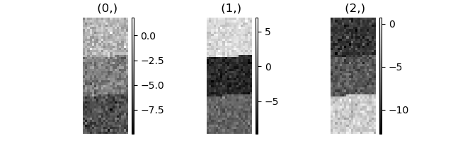
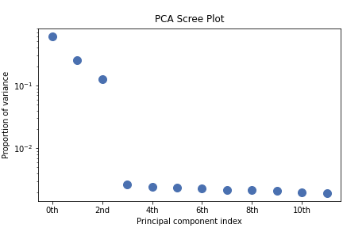
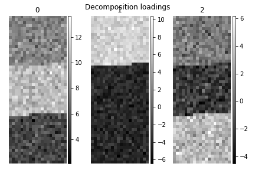
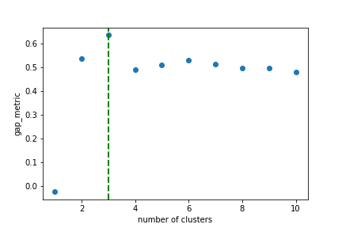
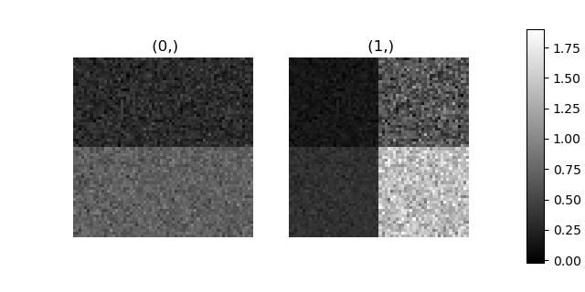
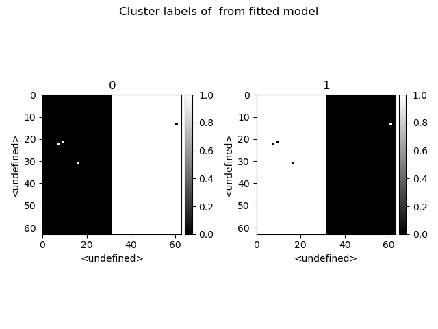
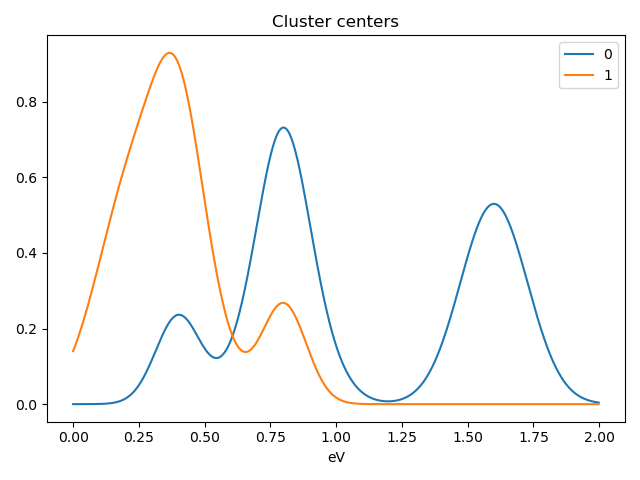
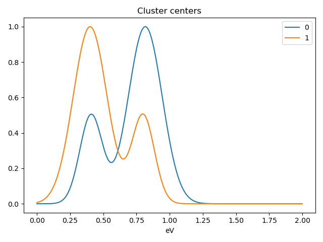

.. _cluster_analysis-label:

Cluster analysis
================

.. versionadded:: 1.6

Introduction
------------

`Cluster analysis <https://en.wikipedia.org/wiki/Cluster_analysis>`__ or clustering
is the task of grouping a set of measurements such that measurements in the same
group (called a cluster) are more similar (in some sense) to each other than to
those in other groups (clusters).
A HyperSpy signal can represent a number of large arrays of different measurements
which can represent spectra, images or sets of paramaters.
Identifying and extracting trends from large datasets is often difficult and
decomposition methods, blind source separation and cluster analysis play an important role in this process.

Cluster analysis, in essence, compares the "distances" (or similar metric)
between different sets of measurements and groups those that are closest together.
The features it groups can be raw data points, for example, comparing for
every navigation dimension all points of a spectrum. However, if the
dataset is large, the process of clustering can be computationally intensive so
clustering is more commonly used on an extracted set of features or parameters.
For example, extraction of two peak positions of interest via a fitting process
rather than clustering all spectra points.

In favourable cases, matrix decomposition and related methods can decompose the
data into a (ideally small) set of significant loadings and factors.
The factors capture a core representation of the features in the data and the loadings
provide the mixing ratios of these factors that best describe the original data.
Overall, this usually represents a much smaller data volume compared to the original data
and can helps to identify correlations.

A detailed description of the application of cluster analysis in x-ray
spectro-microscopy and further details on the theory and implementation can
be found in :ref:`[Lerotic2004] <Lerotic2004>`.

Nomenclature
------------

Taking the example of a 1D Signal of dimensions ``(20, 10|4)`` containing the
dataset, we say there are 200 *samples*. The four measured parameters are the
*features*. If we choose to search for 3 clusters within this dataset, we
derive three main values:

1. The `labels`, of dimensions ``(3| 20, 10)``. Each navigation position is
   assigned to a cluster. The `labels` of each cluster are boolean arrays
   that mark the data that has been assigned to the cluster with `True`.
2. The `cluster_distances`, of dimensions ``(3| 20, 10)``, which are the
   distances of all the data points to the centroid of each cluster.
3. The "*cluster signals*", which are signals that are representative of
   their clusters. In HyperSpy two are computer:
   `cluster_sum_signals` and `cluster_centroid_signals`,
   of dimensions ``(3| 4)``, which are the sum of all the cluster signals
   that belong to each cluster or the signal closest to each cluster
   centroid respectively.

Clustering functions HyperSpy
-----------------------------

All HyperSpy signals have the following methods for clustering analysis:

* :meth:`~.api.signals.BaseSignal.cluster_analysis`
* :meth:`~.api.signals.BaseSignal.plot_cluster_results`
* :meth:`~.api.signals.BaseSignal.plot_cluster_labels`
* :meth:`~.api.signals.BaseSignal.plot_cluster_signals`
* :meth:`~.api.signals.BaseSignal.plot_cluster_distances`
* :meth:`~.api.signals.BaseSignal.get_cluster_signals`
* :meth:`~.api.signals.BaseSignal.get_cluster_labels`
* :meth:`~.api.signals.BaseSignal.get_cluster_distances`
* :meth:`~.api.signals.BaseSignal.estimate_number_of_clusters`
* :meth:`~.api.signals.BaseSignal.plot_cluster_metric`

The :meth:`~.api.signals.BaseSignal.cluster_analysis` method can perform cluster
analysis using any :external+sklearn:ref:`scikit-learn clustering <clustering>`
algorithms or any other object with a compatible API. This involves importing
the relevant algorithm class from scikit-learn.

.. code-block:: python

    >>> from sklearn.cluster import KMeans # doctest: +SKIP
    >>> s.cluster_analysis(
    ...    cluster_source="signal", algorithm=KMeans(n_clusters=3, n_init=8)
    ...    ) # doctest: +SKIP

For convenience, the default algorithm is the ``kmeans`` algorithm and is imported
internally. All extra keyword arguments are passed to the algorithm when
present. Therefore the following code is equivalent to the previous one:

For example:

.. code-block:: python

    >>> s.cluster_analysis(
    ...    cluster_source="signal", n_clusters=3, preprocessing="norm", algorithm="kmeans", n_init=8
    ...    ) # doctest: +SKIP

is equivalent to:

:meth:`~.api.signals.BaseSignal.cluster_analysis` computes the cluster labels. The
clusters areas with identical label are averaged to create a set of cluster
centres. This averaging can be performed on the ``signal`` itself, the
:ref:`BSS <mva.blind_source_separation>` or :ref:`decomposition <mva.decomposition>` results
or a user supplied signal.

Pre-processing
--------------

Cluster analysis measures the distances between features and groups them. It
is often necessary to pre-process the features in order to obtain meaningful
results.

For example, pre-processing can be useful to reveal clusters when
performing cluster analysis of decomposition results. Decomposition methods
decompose data into a set of factors and a set of loadings defining the
mixing needed to represent the data. If signal 1 is reduced to three
components with mixing 0.1 0.5 2.0, and signal 2 is reduced to a mixing of 0.2
1.0 4.0, it should be clear that these represent the same signal but with a
scaling difference. Normalization of the data can again be used to remove
scaling effects.

Therefore, the pre-processing step
will highly influence the results and should be evaluated for the problem
under investigation.

All pre-processing methods from (or compatible with) the
:external+sklearn:ref:`scikit-learn pre-processing <preprocessing>` module can be passed
to the ``scaling`` keyword of the :meth:`~.api.signals.BaseSignal.cluster_analysis`
method. For convenience, the following methods from scikit-learn are
available as standard: ``standard`` , ``minmax`` and ``norm`` as
standard. Briefly, ``norm`` treats the features as a vector and normalizes the
vector length. ``standard`` re-scales each feature by removing the mean and
scaling to unit variance. ``minmax`` normalizes each feature between the
minimum and maximum range of that feature.

Cluster signals
^^^^^^^^^^^^^^^

In HyperSpy *cluster signals* are signals that somehow represent their clusters.
The concept is ill-defined, since cluster algorithms only assign data points to
clusters. HyperSpy computes 2 cluster signals,

1. ``cluster_sum_signals``, which are the sum of all the cluster signals
   that belong to each cluster.
2. ``cluster_centroid_signals``, which is the signal closest to each cluster
   centroid.

When plotting the "*cluster signals*" we can select any of those
above using the ``signal`` keyword argument:

.. code-block:: python

    >>> s.plot_cluster_labels(signal="centroid") # doctest: +SKIP

In addition, it is possible to plot the mean signal over the different
clusters:

.. code-block:: python

    >>> s.plot_cluster_labels(signal="mean") # doctest: +SKIP

Clustering with user defined algorithms
^^^^^^^^^^^^^^^^^^^^^^^^^^^^^^^^^^^^^^^
User developed preprocessing or cluster algorithms can be
used in place of the sklearn methods.
A preprocessing object needs a ``fit_transform`` which
appropriately scales the data.
The example below defines a preprocessing class which normalizes
the data then applies a square root to enhances weaker features.

.. code-block:: python

    >>> class PowerScaling(object):
    ...
    ...     def __init__(self,power=0.5):
    ...         self.power = power
    ...
    ...     def fit_transform(self,data):
    ...         norm = np.amax(data,axis=1)
    ...         scaled_data = data/norm[:,None]
    ...         scaled_data = scaled_data - np.min(scaled_data)+1.0e-8
    ...         scaled_data = scaled_data ** self.power
    ...         return scaled_data

The PowerScaling class can then be passed to the cluster_analysis method for use.

.. code-block:: python

    >>> ps = PowerScaling() # doctest: +SKIP
    >>> s.cluster_analysis(
    ...    cluster_source="decomposition", number_of_components=3, preprocessing=ps
    ...    ) # doctest: +SKIP

For user defined clustering algorithms the class must implementation
``fit`` and have a ``label_`` attribute that contains the clustering labels.
An example template would be:

.. code-block:: python

    >>> class MyClustering(object):
    ...
    ...     def __init__(self):
    ...         self.labels_ = None
    ...
    ...     def fit_(self,X):
    ...         self.labels_ = do_something(X)

Examples
--------

Clustering using decomposition results
^^^^^^^^^^^^^^^^^^^^^^^^^^^^^^^^^^^^^^

Let's use the :func:`sklearn.datasets.make_blobs`
function supplied by `scikit-learn` to make dummy data to see how clustering
might work in practice.

.. code-block:: python

    >>> from sklearn.datasets import make_blobs
    >>> data = make_blobs(
    ...         n_samples=1000,
    ...         n_features=100,
    ...         centers=3,
    ...         shuffle=False,
    ...         random_state=1)[0].reshape(50, 20, 100)
    >>> s = hs.signals.Signal1D(data)

.. code-block:: python

    >>> hs.plot.plot_images(s.T.inav[:9], axes_decor="off") # doctest: +SKIP

To see how cluster analysis works it's best to first examine the signal.
Moving around the image you should be able to see 3 distinct regions in which
the 1D signal modulates slightly.

.. code-block:: python

    >>> s.plot()

Let's perform SVD to reduce the dimensionality of the dataset by exploiting
redundancies:

.. code-block:: python

    >>> s.decomposition()
    Decomposition info:
      normalize_poissonian_noise=False
      algorithm=SVD
      output_dimension=None
      centre=None
    >>> s.plot_explained_variance_ratio()
    <Axes: title={'center': '\nPCA Scree Plot'}, xlabel='Principal component index', ylabel='Proportion of variance'>

From the scree plot we deduce that, as expected, that the dataset can be reduce
to 3 components. Let's plot their loadings:

.. code-block:: python

    >>> s.plot_decomposition_loadings(comp_ids=3, axes_decor="off") # doctest: +SKIP

In the SVD loading we can identify 3 regions, but they are mixed in the components.
Let's perform cluster analysis of decomposition results, to find similar regions
and the representative features in those regions. Notice that this dataset does
not require any pre-processing for cluster analysis.

.. code-block:: python

    >>> s.cluster_analysis(cluster_source="decomposition", number_of_components=3, preprocessing=None)
    >>> s.plot_cluster_labels(axes_decor="off") # doctest: +SKIP

.. image:: ../images/clustering_labels.png

To see what the labels the cluster algorithm has assigned you can inspect
the ``cluster_labels``:

.. code-block:: python

    >>> s.learning_results.cluster_labels[0] # doctest: +SKIP
    array([0, 0, 0, 0, 0, 0, 0, 0, 0, 0, 0, 0, 0, 0, 0, 0, 0, 0, 0, 0, 0, 0,
       0, 0, 0, 0, 0, 0, 0, 0, 0, 0, 0, 0, 0, 0, 0, 0, 0, 0, 0, 0, 0, 0,
       0, 0, 0, 0, 0, 0, 0, 0, 0, 0, 0, 0, 0, 0, 0, 0, 0, 0, 0, 0, 0, 0,
       0, 0, 0, 0, 0, 0, 0, 0, 0, 0, 0, 0, 0, 0, 0, 0, 0, 0, 0, 0, 0, 0,
       0, 0, 0, 0, 0, 0, 0, 0, 0, 0, 0, 0, 0, 0, 0, 0, 0, 0, 0, 0, 0, 0,
       0, 0, 0, 0, 0, 0, 0, 0, 0, 0, 0, 0, 0, 0, 0, 0, 0, 0, 0, 0, 0, 0,
       0, 0, 0, 0, 0, 0, 0, 0, 0, 0, 0, 0, 0, 0, 0, 0, 0, 0, 0, 0, 0, 0,
       0, 0, 0, 0, 0, 0, 0, 0, 0, 0, 0, 0, 0, 0, 0, 0, 0, 0, 0, 0, 0, 0,
       0, 0, 0, 0, 0, 0, 0, 0, 0, 0, 0, 0, 0, 0, 0, 0, 0, 0, 0, 0, 0, 0,
       0, 0, 0, 0, 0, 0, 0, 0, 0, 0, 0, 0, 0, 0, 0, 0, 0, 0, 0, 0, 0, 0,
       0, 0, 0, 0, 0, 0, 0, 0, 0, 0, 0, 0, 0, 0, 0, 0, 0, 0, 0, 0, 0, 0,
       0, 0, 0, 0, 0, 0, 0, 0, 0, 0, 0, 0, 0, 0, 0, 0, 0, 0, 0, 0, 0, 0,
       0, 0, 0, 0, 0, 0, 0, 0, 0, 0, 0, 0, 0, 0, 0, 0, 0, 0, 0, 0, 0, 0,
       0, 0, 0, 0, 0, 0, 0, 0, 0, 0, 0, 0, 0, 0, 0, 0, 0, 0, 0, 0, 0, 0,
       0, 0, 0, 0, 0, 0, 0, 0, 0, 0, 0, 0, 0, 0, 0, 0, 0, 0, 0, 0, 0, 0,
       0, 0, 0, 0, 1, 1, 1, 1, 1, 1, 1, 1, 1, 1, 1, 1, 1, 1, 1, 1, 1, 1,
       1, 1, 1, 1, 1, 1, 1, 1, 1, 1, 1, 1, 1, 1, 1, 1, 1, 1, 1, 1, 1, 1,
       1, 1, 1, 1, 1, 1, 1, 1, 1, 1, 1, 1, 1, 1, 1, 1, 1, 1, 1, 1, 1, 1,
       1, 1, 1, 1, 1, 1, 1, 1, 1, 1, 1, 1, 1, 1, 1, 1, 1, 1, 1, 1, 1, 1,
       1, 1, 1, 1, 1, 1, 1, 1, 1, 1, 1, 1, 1, 1, 1, 1, 1, 1, 1, 1, 1, 1,
       1, 1, 1, 1, 1, 1, 1, 1, 1, 1, 1, 1, 1, 1, 1, 1, 1, 1, 1, 1, 1, 1,
       1, 1, 1, 1, 1, 1, 1, 1, 1, 1, 1, 1, 1, 1, 1, 1, 1, 1, 1, 1, 1, 1,
       1, 1, 1, 1, 1, 1, 1, 1, 1, 1, 1, 1, 1, 1, 1, 1, 1, 1, 1, 1, 1, 1,
       1, 1, 1, 1, 1, 1, 1, 1, 1, 1, 1, 1, 1, 1, 1, 1, 1, 1, 1, 1, 1, 1,
       1, 1, 1, 1, 1, 1, 1, 1, 1, 1, 1, 1, 1, 1, 1, 1, 1, 1, 1, 1, 1, 1,
       1, 1, 1, 1, 1, 1, 1, 1, 1, 1, 1, 1, 1, 1, 1, 1, 1, 1, 1, 1, 1, 1,
       1, 1, 1, 1, 1, 1, 1, 1, 1, 1, 1, 1, 1, 1, 1, 1, 1, 1, 1, 1, 1, 1,
       1, 1, 1, 1, 1, 1, 1, 1, 1, 1, 1, 1, 1, 1, 1, 1, 1, 1, 1, 1, 1, 1,
       1, 1, 1, 1, 1, 1, 1, 1, 1, 1, 1, 1, 1, 1, 1, 1, 1, 1, 1, 1, 1, 1,
       1, 1, 1, 1, 1, 1, 1, 1, 1, 1, 1, 1, 1, 1, 1, 1, 1, 1, 1, 1, 1, 1,
       1, 1, 1, 1, 1, 1, 1, 0, 0, 0, 0, 0, 0, 0, 0, 0, 0, 0, 0, 0, 0, 0,
       0, 0, 0, 0, 0, 0, 0, 0, 0, 0, 0, 0, 0, 0, 0, 0, 0, 0, 0, 0, 0, 0,
       0, 0, 0, 0, 0, 0, 0, 0, 0, 0, 0, 0, 0, 0, 0, 0, 0, 0, 0, 0, 0, 0,
       0, 0, 0, 0, 0, 0, 0, 0, 0, 0, 0, 0, 0, 0, 0, 0, 0, 0, 0, 0, 0, 0,
       0, 0, 0, 0, 0, 0, 0, 0, 0, 0, 0, 0, 0, 0, 0, 0, 0, 0, 0, 0, 0, 0,
       0, 0, 0, 0, 0, 0, 0, 0, 0, 0, 0, 0, 0, 0, 0, 0, 0, 0, 0, 0, 0, 0,
       0, 0, 0, 0, 0, 0, 0, 0, 0, 0, 0, 0, 0, 0, 0, 0, 0, 0, 0, 0, 0, 0,
       0, 0, 0, 0, 0, 0, 0, 0, 0, 0, 0, 0, 0, 0, 0, 0, 0, 0, 0, 0, 0, 0,
       0, 0, 0, 0, 0, 0, 0, 0, 0, 0, 0, 0, 0, 0, 0, 0, 0, 0, 0, 0, 0, 0,
       0, 0, 0, 0, 0, 1, 0, 0, 0, 0, 0, 0, 0, 0, 0, 0, 0, 0, 0, 0, 0, 0,
       0, 0, 0, 0, 0, 0, 0, 0, 0, 0, 0, 0, 0, 0, 0, 0, 0, 0, 0, 0, 0, 0,
       0, 0, 0, 0, 0, 0, 0, 0, 0, 0, 0, 0, 0, 0, 0, 0, 0, 0, 0, 0, 0, 0,
       0, 0, 0, 0, 0, 0, 0, 0, 0, 0, 0, 0, 0, 0, 0, 0, 0, 0, 0, 0, 0, 0,
       0, 0, 0, 0, 0, 0, 0, 0, 0, 0, 0, 0, 0, 0, 0, 0, 0, 0, 0, 0, 0, 0,
       0, 0, 0, 0, 0, 0, 0, 0, 0, 0, 0, 0, 0, 0, 0, 0, 0, 0, 0, 0, 0, 0,
       0, 0, 0, 0, 0, 0, 0, 0, 0, 0])

In this case we know there are 3 cluster, but for real examples the number of
clusters is not known *a priori*. A number of metrics, such as elbow,
Silhouette and Gap can be used to estimate the optimal number of clusters.
The elbow method measures the sum-of-squares of the distances within a
cluster and, as for the PCA decomposition, an "elbow" or point where the gains
diminish with increasing number of clusters indicates the ideal number of
clusters. Silhouette analysis measures how well separated clusters are and
can be used to determine the most likely number of clusters. As the scoring
is a measure of separation of clusters a number of solutions may occur and
maxima in the scores are used to indicate possible solutions. Gap analysis
is similar but compares the “gap” between the clustered data results and
those from a randomly data set of the same size. The largest gap indicates
the best clustering. The metric results can be plotted to check how
well-defined the clustering is.

.. code-block:: python

    >>> s.estimate_number_of_clusters(cluster_source="decomposition", metric="gap")
    3
    >>> s.plot_cluster_metric()
    <Axes: xlabel='number of clusters', ylabel='gap_metric'>

The optimal number of clusters can be set or accessed from the learning
results

.. code-block:: python

    >>> s.learning_results.number_of_clusters # doctest: +SKIP
    3

Clustering using another signal as source
^^^^^^^^^^^^^^^^^^^^^^^^^^^^^^^^^^^^^^^^^

In this example we will perform clustering analysis on the position of two
peaks. The signals containing the position of the peaks can be computed for
example using :ref:`curve fitting <model-label>`. Given an existing fitted
model, the parameters can be extracted as signals and stacked. Clustering can
then be applied as described previously to identify trends in the fitted
results.

Let's start by creating a suitable synthetic dataset.

.. code-block:: python

    >>> import hyperspy.api as hs
    >>> import numpy as np
    >>> s_dummy = hs.signals.Signal1D(np.zeros((64, 64, 1000)))
    >>> s_dummy.axes_manager.signal_axes[0].scale = 2e-3
    >>> s_dummy.axes_manager.signal_axes[0].units = "eV"
    >>> s_dummy.axes_manager.signal_axes[0].name = "energy"
    >>> m = s_dummy.create_model()
    >>> m.append(hs.model.components1D.GaussianHF(fwhm=0.2))
    >>> m.append(hs.model.components1D.GaussianHF(fwhm=0.3))
    >>> m.components.GaussianHF.centre.map["values"][:32, :] = .3 + .1
    >>> m.components.GaussianHF.centre.map["values"][32:, :] = .7 + .1
    >>> m.components.GaussianHF_0.centre.map["values"][:, 32:] = m.components.GaussianHF.centre.map["values"][:, 32:] * 2
    >>> m.components.GaussianHF_0.centre.map["values"][:, :32] = m.components.GaussianHF.centre.map["values"][:, :32] * 0.5
    >>> for component in m:
    ...     component.centre.map["is_set"][:] = True
    ...     component.centre.map["values"][:] += np.random.normal(size=(64, 64)) * 0.01
    >>> s = m.as_signal()
    >>> stack = [component.centre.as_signal() for component in m]
    >>> hs.plot.plot_images(stack, axes_decor="off", colorbar="single", suptitle="") # doctest: +SKIP

Let's now perform cluster analysis on the stack and calculate the centres using
the spectrum image. Notice that we don't need to fit the model to the data
because this is a synthetic dataset. When analysing experimental data you will
need to fit the model first. Also notice that here we need to pre-process the
dataset by normalization in order to reveal the clusters due to the
proportionality relationship between the position of the peaks.

.. code-block:: python

    >>> stack = hs.stack([component.centre.as_signal() for component in m])
    >>> s.estimate_number_of_clusters(cluster_source=stack.T, preprocessing="norm")
    2
    >>> s.cluster_analysis(cluster_source=stack.T, source_for_centers=s, n_clusters=2, preprocessing="norm")
    >>> s.plot_cluster_labels() # doctest: +SKIP

.. code-block:: python

    >>> s.plot_cluster_signals(signal="mean") # doctest: +SKIP

Notice that in this case averaging or summing the signals of
each cluster is not appropriate, since the clustering criterium
is the ratio between the peaks positions. A better alternative
is to plot the signals closest to the centroids:

.. code-block:: python

    >>> s.plot_cluster_signals(signal="centroid") # doctest: +SKIP

