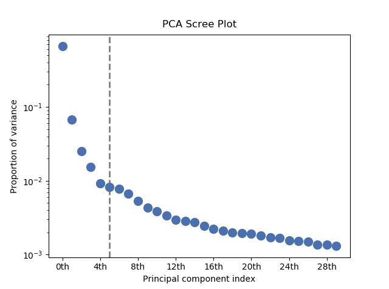

.. _mva.visualization:

Visualizing results
===================

HyperSpy includes a number of plotting methods for visualizing the results
of decomposition and blind source separation analyses. All the methods
begin with ``plot_``.

.. _mva.scree_plot:

Scree plots
-----------

.. note::
   Scree plots are only available for the ``"SVD"`` and ``"PCA"`` algorithms.

PCA will sort the components in the dataset in order of decreasing
variance. It is often useful to estimate the dimensionality of the data by
plotting the explained variance against the component index. This plot is
sometimes called a scree plot. For most datasets, the values in a scree plot
will decay rapidly, eventually becoming a slowly descending line.

To obtain a scree plot for your dataset, run the
:meth:`~.api.signals.BaseSignal.plot_explained_variance_ratio` method:

.. code-block:: python

   >>> s.plot_explained_variance_ratio(n=20) # doctest: +SKIP

.. figure::  ../images/screeplot.png
   :align:   center
   :width:   500

   PCA scree plot

The point at which the scree plot becomes linear (often referred to as
the "elbow") is generally judged to be a good estimation of the dimensionality
of the data (or equivalently, the number of components that should be retained
- see below). Components to the left of the elbow are considered part of the "signal",
while components to the right are considered to be "noise", and thus do not explain
any significant features of the data.

By specifying a ``threshold`` value, a cutoff line will be drawn at the total variance
specified, and the components above this value will be styled distinctly from the
remaining components to show which are considered signal, as opposed to noise.
Alternatively, by providing an integer value for ``threshold``, the line will
be drawn at the specified component (see below).

Note that in the above scree plot, the first component has index 0. This is because
Python uses zero-based indexing. To switch to a "number-based" (rather than
"index-based") notation, specify the ``xaxis_type`` parameter:

.. code-block:: python

   >>> s.plot_explained_variance_ratio(n=20, threshold=4, xaxis_type='number') # doctest: +SKIP

.. figure::  ../images/screeplot2.png
   :align:   center
   :width:   500

   PCA scree plot with number-based axis labeling and a threshold value
   specified

The number of significant components can be estimated and a vertical line
drawn to represent this by specifying ``vline=True``. In this case, the "elbow"
is found in the variance plot by estimating the distance from each point in the
variance plot to a line joining the first and last points of the plot, and then
selecting the point where this distance is largest.

If multiple maxima are found, the index corresponding to the first occurrence
is returned. As the index of the first component is zero, the number of
significant PCA components is the elbow index position + 1. More details
about the elbow-finding technique can be found in
:ref:`[Satopää2011] <Satopää2011>`, and in the documentation for
:meth:`~.api.signals.BaseSignal.estimate_elbow_position`.

.. figure::  ../images/screeplot_elbow_method.png
   :align:   center
   :width:   500

   PCA scree plot with number-based axis labeling and an estimate of the no of significant
   positions based on the "elbow" position

These options (together with many others), can be customized to
develop a figure of your liking. See the documentation of
:meth:`~.api.signals.BaseSignal.plot_explained_variance_ratio` for more details.

Sometimes it can be useful to get the explained variance ratio as a spectrum.
For example, to plot several scree plots obtained with
different data pre-treatments in the same figure, you can combine
:func:`~.api.plot.plot_spectra` with
:meth:`~.api.signals.BaseSignal.get_explained_variance_ratio`.

.. _mva.plot_decomposition:

Decomposition plots
-------------------

HyperSpy provides a number of methods for visualizing the factors and loadings
found by a decomposition analysis. To plot everything in a compact form,
use :meth:`~.api.signals.BaseSignal.plot_decomposition_results`.

You can also plot the factors and loadings separately using the following
methods. It is recommended that you provide the number of factors or loadings
you wish to visualise, since the default is to plot all of them.

* :meth:`~.api.signals.BaseSignal.plot_decomposition_factors`
* :meth:`~.api.signals.BaseSignal.plot_decomposition_loadings`

.. _mva.plot_bss:

Blind source separation plots
-----------------------------

Visualizing blind source separation results is much the same as decomposition.
You can use :meth:`~.api.signals.BaseSignal.plot_bss_results` for a compact display,
or instead:

* :meth:`~.api.signals.BaseSignal.plot_bss_factors`
* :meth:`~.api.signals.BaseSignal.plot_bss_loadings`

.. _mva.get_results:

Clustering plots
----------------

Visualizing cluster results is much the same as decomposition.
You can use :meth:`~.api.signals.BaseSignal.plot_bss_results` for a compact display,
or instead:

* :meth:`~.api.signals.BaseSignal.plot_cluster_results`.
* :meth:`~.api.signals.BaseSignal.plot_cluster_signals`.
* :meth:`~.api.signals.BaseSignal.plot_cluster_labels`.
