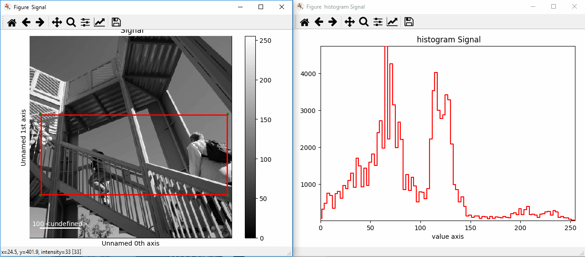
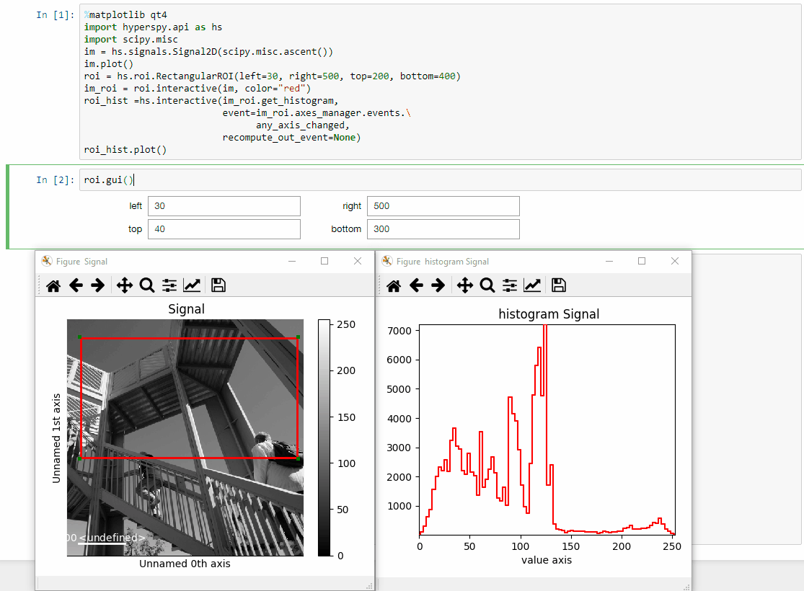
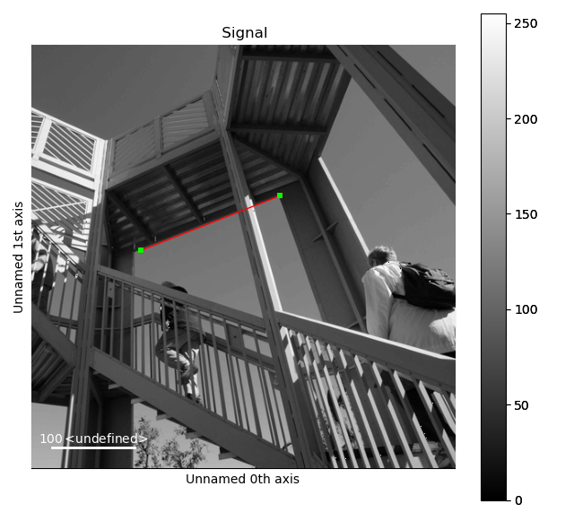
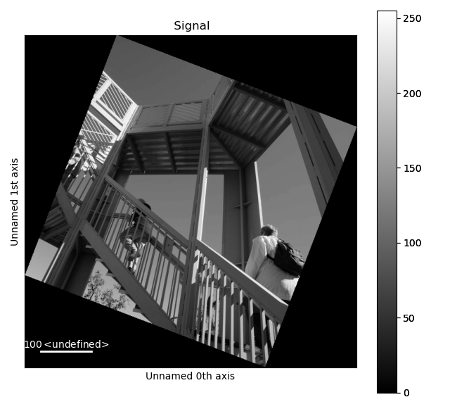

.. _roi-label:

Region Of Interest (ROI)
************************

ROIs can be defined to select part of any compatible signal and may be applied
either to the navigation or to the signal axes. A number of different ROIs are
available:

* :py:class:`~.roi.Point1DROI`
* :py:class:`~.roi.Point2DROI`
* :py:class:`~.roi.SpanROI`
* :py:class:`~.roi.RectangularROI`
* :py:class:`~.roi.CircleROI`
* :py:class:`~.roi.Line2DROI`

Once created, an ROI can be applied to the signal:

.. code-block:: python

    >>> s = hs.signals.Signal1D(np.arange(2000).reshape((20,10,10)))
    >>> im = hs.signals.Signal2D(np.arange(100).reshape((10,10)))
    >>> roi = hs.roi.RectangularROI(left=3, right=7, top=2, bottom=5)
    >>> sr = roi(s)
    >>> sr
    <Signal1D, title: , dimensions: (4, 3|10)>
    >>> imr = roi(im)
    >>> imr
    <Signal2D, title: , dimensions: (|4, 3)>

ROIs can also be used :ref:`interactively <interactive-label>` with widgets.
The following example shows how to interactively apply ROIs to an image. Note
that *it is necessary* to plot the signal onto which the widgets will be
added before calling :py:meth:`~.roi.BaseInteractiveROI.interactive`.

.. code-block:: python

    >>> import scipy
    >>> im = hs.signals.Signal2D(scipy.datasets.ascent())
    >>> rectangular_roi = hs.roi.RectangularROI(left=30, right=500,
    ...                                         top=200, bottom=400)
    >>> line_roi = hs.roi.Line2DROI(0, 0, 512, 512, 1)
    >>> point_roi = hs.roi.Point2DROI(256, 256)
    >>> im.plot()
    >>> roi2D = rectangular_roi.interactive(im, color="blue")
    >>> roi1D = line_roi.interactive(im, color="yellow")
    >>> roi0D = point_roi.interactive(im, color="red")

.. figure::  images/image_with_rois.png
  :align:   center
  :width:   500

.. figure::  images/roi1d.png
  :align:   center
  :width:   500

.. figure::  images/roi2d.png
  :align:   center
  :width:   500

.. NOTE::

    Depending on your screen and display settings, it can be difficult to `pick`
    or manipulate widgets and you can try to change the pick tolerance in
    the :ref:`HyperSpy plot preferences <configuring-hyperspy-label>`.
    Typically, using a 4K resolution with a small scaling factor (<150 %), setting
    the pick tolerance to 15 instead of 7.5 makes the widgets easier to manipulate.

If instantiated without arguments, (i.e. ``rect = RectangularROI()`` the roi
will automatically determine sensible values to center it when
interactively adding it to a signal. This provides a conventient starting point
to further manipulate the ROI, either by hand or using the gui (i.e. ``rect.gui``).

Notably, since ROIs are independent from the signals they sub-select, the widget
can be plotted on a different signal altogether.

.. code-block:: python

    >>> import scipy
    >>> im = hs.signals.Signal2D(scipy.datasets.ascent())
    >>> s = hs.signals.Signal1D(np.random.rand(512, 512, 512))
    >>> roi = hs.roi.RectangularROI(left=30, right=77, top=20, bottom=50)
    >>> s.plot() # plot signal to have where to display the widget
    >>> imr = roi.interactive(im, navigation_signal=s, color="red")
    >>> roi(im).plot()

ROIs are implemented in terms of physical coordinates and not pixels, so with
proper calibration will always point to the same region.

.. figure::  images/random_image_with_rect_roi.png
  :align:   center
  :width:   500

.. figure::  images/random_image_with_rect_roi_spectrum.png
  :align:   center
  :width:   500

.. figure::  images/roi2d.png
  :align:   center
  :width:   500

And of course, as all interactive operations, interactive ROIs are chainable.
The following example shows how to display interactively the histogram of a
rectangular ROI. Notice how we customise the default event connections in
order to increase responsiveness.

.. code-block:: python

   >>> import scipy
   >>> im = hs.signals.Signal2D(scipy.datasets.ascent())
   >>> im.plot()
   >>> roi = hs.roi.RectangularROI(left=30, right=500, top=200, bottom=400)
   >>> im_roi = roi.interactive(im, color="red")
   >>> roi_hist = hs.interactive(im_roi.get_histogram,
   ...                           event=roi.events.changed,
                                 bins=150, # Set number of bins for `get_histogram`
   ...                           recompute_out_event=None)
   >>> roi_hist.plot()

.. versionadded:: 1.3
    ROIs can be used in place of slices when indexing and to define a
    signal range in functions taken a ``signal_range`` argument.

All ROIs have a :meth:`gui` method that displays an user interface if
a hyperspy GUI is installed (currently only works with the
``hyperspy_gui_ipywidgets`` GUI), enabling precise control of the ROI
parameters:

.. code-block:: python

    >>> # continuing from above:
    >>> roi.gui()

.. versionadded:: 1.4
    :meth:`~.roi.Line2DROI.angle` can be used to calculate an angle between
    ROI line and one of the axes providing its name through optional argument ``axis``:

.. code-block:: python

    >>> import scipy
    >>> ima = hs.signals.Signal2D(scipy.datasets.ascent())
    >>> roi = hs.roi.Line2DROI(x1=144, y1=240, x2=306, y2=178, linewidth=0)
    >>> ima.plot()
    >>> roi.interactive(ima, color='red')

.. code-block:: python

    >>> roi.angle(axis='vertical')
    -100.97166759025453

The default output of the method is in degrees, though radians can be selected
as follows:

.. code-block:: python

    >>> roi.angle(axis='vertical', units='radians')
    -1.7622880506791903

Conveniently, :meth:`~.roi.Line2DROI.angle` can be used to rotate an image to
align selected features with respect to vertical or horizontal axis:

.. code-block:: python

    >>> ima.map(scipy.ndimage.rotate, angle=roi.angle(axis='horizontal'), inplace=False).plot()

.. _roi-slice-label:

Slicing using ROIs
------------------

ROIs can be used in place of slices when indexing. For example:

.. code-block:: python

    >>> s = hs.datasets.two_gaussians()
    >>> roi = hs.roi.SpanROI(left=5, right=15)
    >>> sc = s.isig[roi]
    >>> im = hs.signals.Signal2D(scipy.datasets.ascent())
    >>> roi = hs.roi.RectangularROI(left=120, right=460., top=300, bottom=560)
    >>> imc = im.isig[roi]

.. versionadded:: 1.3
    :meth:`gui` method.

.. versionadded:: 1.6
    New :meth:`__getitem__` method for all ROIs.

In addition, all ROIs have a py:meth:`__getitem__` method that enables
using them in place of tuples.
For example, the method :py:meth:`~._signals.Signal2D.align2D` takes a ``roi``
argument with the left, right, top, bottom coordinates of the ROI.
Handily, we can pass a :py:class:`~.roi.RectangularROI` ROI instead.

.. code-block:: python

    >>> import hyperspy.api as hs
    >>> import numpy as np
    >>> im = hs.signals.Signal2D(np.random.random((10,30,30))
    >>> roi = hs.roi.RectangularROI(left=2, right=10, top=0, bottom=5))
    >>> tuple(roi)
    (2.0, 10.0, 0.0, 5.0)
    >>> im.align2D(roi=roi)
