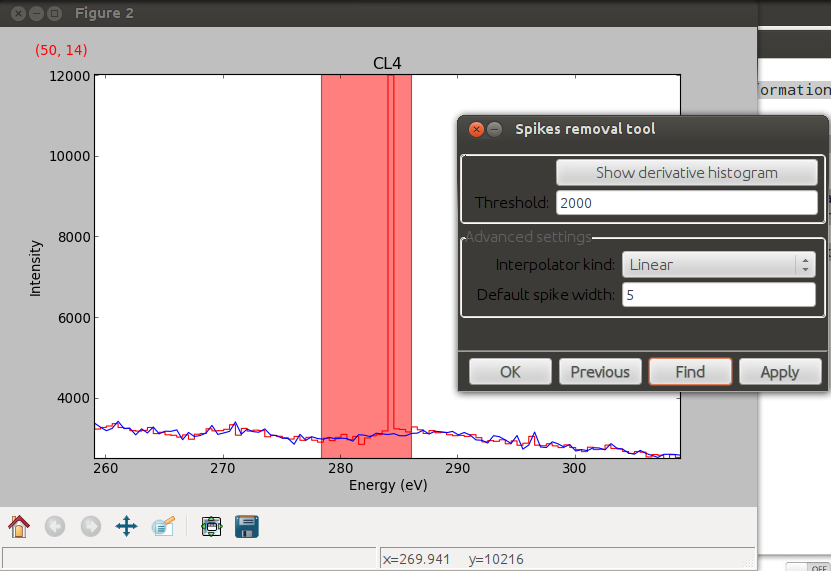

Signal1D Tools
**************

The methods described in this section are only available for one-dimensional
signals in the Signal1D class.

.. _signal1D.crop:

Cropping
--------

In addition to cropping using the powerful and compact :ref:`Signal indexing
<signal.indexing>` syntax the following method is available to crop spectra
using a GUI:

The :py:meth:`~.signal.Signal1D.crop_signal1D`, method is used to crop the
spectral energy range. If no parameter is passed, a user interface appears in
which to crop the one dimensional signal.

Background removal
------------------

The :py:meth:`~.signal.Signal1DTools.remove_background` method provides
background removal capabilities through both a CLI and a GUI. Current
background type supported are power law, offset, polynomial and gaussian.
By default the background is estimated, but a full fit can also be used.
The full fit is more accurate, but slower.

Calibration
-----------

The :py:meth:`~.signal.Signal1DTools.calibrate` method provides a user
interface to calibrate the spectral axis.

Alignment
---------

The following methods use sub-pixel cross-correlation or user-provided shifts
to align spectra. They support applying the same transformation to multiple
files.

* :py:meth:`~._signals.signal1d.Signal1DTools.align1D`
* :py:meth:`~._signals.signal1d.Signal1DTools.shift1D`

.. _integrate_1D-label:

Integration
-----------

The :py:meth:`~._signals.signal1d.Signal1DTools.integrate_in_range` method
provides a GUI and a CLI to integrate the 1D signal dimension in a given range
using Simpson's rule.

Data smoothing
--------------

The following methods (that include user interfaces when no arguments are
passed) can perform data smoothing with different algorithms:

* :py:meth:`~._signals.signal1d.Signal1DTools.smooth_lowess`
* :py:meth:`~._signals.signal1d.Signal1DTools.smooth_tv`
* :py:meth:`~._signals.signal1d.Signal1DTools.smooth_savitzky_golay`

Spike removal
--------------
.. versionadded:: 0.5

:py:meth:`~._signals.signal1d.Signal1D.spikes_removal_tool` provides an user
interface to remove spikes from spectra.

   Spikes removal tool.

Peak finding
------------

A peak finding routine based on the work of T. O'Haver is available in HyperSpy
through the :py:meth:`~._signals.signal1d.Signal1DTools.find_peaks1D_ohaver`
method.

Other methods
-------------

* Interpolate the spectra in between two positions
  :py:meth:`~._signals.signal1d.Signal1DTools.interpolate_in_between`
* Convolve the spectra with a gaussian
  :py:meth:`~._signals.signal1d.Signal1DTools.gaussian_filter`
* Apply a hanning taper to the spectra
  :py:meth:`~._signals.signal1d.Signal1DTools.hanning_taper`
