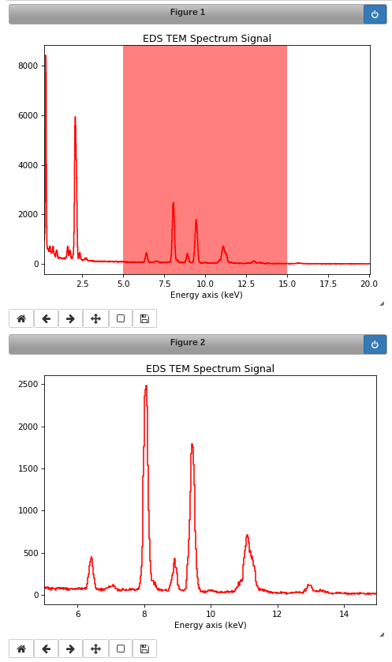

Signal1D Tools
**************

The methods described in this section are only available for one-dimensional
signals in the Signal1D class.

.. _signal1D.crop:

Cropping
--------

The :py:meth:`~.signal.Signal1D.crop_signal1D` crops the
spectral energy range *in-place*. If no parameter is passed, a user interface
appears in which to crop the one dimensional signal. For example:

.. code-block:: python

    s = hs.datasets.example_signals.EDS_TEM_Spectrum()
    s.crop_signal1D(5, 15) # s is cropped in place

Additionally, cropping in HyperSpy can be performed using the :ref:`Signal
indexing <signal.indexing>` syntax. For example, the following crops a spectrum
to the 5 keV-15 keV region:

.. code-block:: python

    s = hs.datasets.example_signals.EDS_TEM_Spectrum()
    sc = s.isig[5.:15.] # s is not cropped, sc is a "cropped view" of s

It is possible to crop interactively using :ref:`roi-label`. For example:

.. code-block:: python

    s = hs.datasets.example_signals.EDS_TEM_Spectrum()
    roi = hs.roi.SpanROI(left=5, right=15)
    s.plot()
    sc = roi.interactive(s)

.. _interactive_signal1d_cropping_image:

   Interactive spectrum cropping using a ROI.

Background removal
------------------

The :py:meth:`~.signal.Signal1D.remove_background` method provides
background removal capabilities through both a CLI and a GUI. Current
background type supported are power law, offset, polynomial and gaussian.
By default the background is estimated, but a full fit can also be used.
The full fit is more accurate, but slower.

Calibration
-----------

The :py:meth:`~.signal.Signal1D.calibrate` method provides a user
interface to calibrate the spectral axis.

Alignment
---------

The following methods use sub-pixel cross-correlation or user-provided shifts
to align spectra. They support applying the same transformation to multiple
files.

* :py:meth:`~._signals.signal1d.Signal1D.align1D`
* :py:meth:`~._signals.signal1d.Signal1D.shift1D`

.. _integrate_1D-label:

Integration
-----------

.. deprecated:: 1.3
    :py:meth:`~._signals.signal1d.Signal1D.integrate_in_range`.
    It will be removed in 2.0. Use :py:meth:`~.signal.BaseSignal.integrate1D`
    instead, possibly in combination with a :ref:`ROI-label` if interactivity
    is required.

Data smoothing
--------------

The following methods (that include user interfaces when no arguments are
passed) can perform data smoothing with different algorithms:

* :py:meth:`~._signals.signal1d.Signal1D.smooth_lowess`
  (requires ``statsmodels`` to be installed)
* :py:meth:`~._signals.signal1d.Signal1D.smooth_tv`
* :py:meth:`~._signals.signal1d.Signal1D.smooth_savitzky_golay`

Spike removal
--------------
.. versionadded:: 0.5

:py:meth:`~._signals.signal1d.Signal1D.spikes_removal_tool` provides an user
interface to remove spikes from spectra.

.. figure::  images/spikes_removal_tool.png
   :align:   center
   :width:   500

   Spikes removal tool.

Peak finding
------------

A peak finding routine based on the work of T. O'Haver is available in HyperSpy
through the :py:meth:`~._signals.signal1d.Signal1D.find_peaks1D_ohaver`
method.

Other methods
-------------

* Interpolate the spectra in between two positions
  :py:meth:`~._signals.signal1d.Signal1D.interpolate_in_between`
* Convolve the spectra with a gaussian
  :py:meth:`~._signals.signal1d.Signal1D.gaussian_filter`
* Apply a hanning taper to the spectra
  :py:meth:`~._signals.signal1d.Signal1D.hanning_taper`
