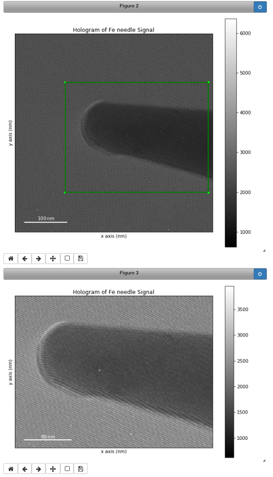

Signal2D Tools
**************

The methods described in this section are only available for two-dimensional
signals in the Signal2D class.

.. _signal2D.align:

Two dimensional signal registration (alignment)
-----------------------------------------------

.. versionadded:: 0.5
   :py:meth:`~._signals.signal2d.Signal2D.align2D` and
   :py:meth:`~._signals.signal2d.Signal2D.estimate_shift2D` methods.

.. versionadded:: 1.4
   ``sub_pixel_factor`` keyword.

The :py:meth:`~._signals.signal2d.Signal2D.align2D` method provides
advanced image alignment functionality. Sub-pixel accuracy can be achieved
by using skimage's upsampled matrix-multiplication DFT method
:ref:`[Guizar2008] <Guizar2008>`—by setting the `sub_pixel_factor` keyword argument—
and/or, for multi-dimensional datasets only, using the statistical method
:ref:`[Schaffer2004] <Schaffer2004>`—by setting the ``reference`` keyword argument to ``"stat"``.

.. _image.crop:

Cropping an image
-----------------

The :py:meth:`~._signals.signal2d.Signal2DTools.crop_image` method crops the
image *in-place* e.g.:

.. code-block:: python

    >>> im = hs.datasets.example_signals.object_hologram()
    >>> imc = im.crop(left=120, top=300, bottom=560) # im is cropped in-place

Cropping in HyperSpy is performed using the :ref:`Signal indexing
<signal.indexing>` syntax. For example, to crop an image:

.. code-block:: python

    >>> im = hs.datasets.example_signals.object_hologram()
    >>> # im is not cropped, imc is a "cropped view" of im
    >>> imc = im.isig[120.:, 300.:560.]

It is possible to crop interactively using :ref:`roi-label`. For example:

.. code-block:: python

    >>> im = hs.datasets.example_signals.object_hologram()
    >>> roi = hs.roi.RectangularROI(left=120, right=460., top=300, bottom=560)
    >>> im.plot()
    >>> imc = roi.interactive(im)
    >>> imc.plot()

.. _interactive_signal2d_cropping_image:

   Interactive image cropping using a ROI.

Add a linear ramp
-----------------

A linear ramp can be added to the signal via the
:py:func:`~._signals.signal2d.Signal2D.add_ramp` method. The parameters
`ramp_x` and `ramp_y` dictate the slope of the ramp in `x`- and `y` direction,
while the offset is determined by the `offset` parameter. The fulcrum of the
linear ramp is at the origin and the slopes are given in units of the axis
with the according scale taken into account. Both are available via the
:py:class:`~.axes.AxesManager` of the signal.
