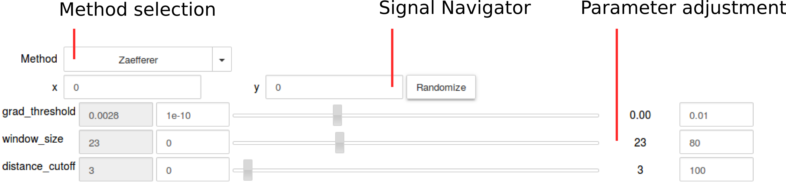

Signal2D Tools
**************

The methods described in this section are only available for two-dimensional signals in the Signal2D class.

Two dimensional signal registration (alignment)
-----------------------------------------------

.. versionadded:: 0.5

The :py:meth:`~._signals.signal2d.Signal2DTools.align2D` method provides advanced image
alignment functionality, including subpixel alignment.

.. _image.crop:

Cropping an image
-----------------

In addition to cropping using the powerful and compact :ref:`signal.indexing`
the following method is available to crop spectra the familiar top, bottom,
left, right syntax.

* :py:meth:`~._signals.signal2d.Signal2DTools.crop_image`

Peak finding
------------

.. versionadded:: 1.0.0

The :py:meth:`~.signal.Signal2DTools.find_peaks2D` method provides access to a
number of algorithms for that achieve peak finding in two dimensional signals.
The methods available are as follows:

Zaeferrer peak finder
^^^^^^^^^^^^^^^^^^^^^

.. code-block:: python

    >>> s.find_peaks2D(method='zaefferer')

This algorithm was developed by Zaefferer [1]_ and the
implementation here is after the description of the algorithm in the Ph.D.
thesis of Thomas A. White. It is based on a gradient threshold followed by a
local maximum search within a square window, which is moved until it is
centered on the brightest point, which is taken as a peak if it is within a
certain distance of the starting point.

Ball statistical peak finder
^^^^^^^^^^^^^^^^^^^^^^^^^^^^

.. code-block:: python

    >>> s.find_peaks2D(method='stat')

Developed by Gordon Ball, and described in the Ph.D. thesis of Thomas A.
White, this method is based on finding points which have a statistically
higher value than the surrounding areas, then iterating between smoothing and
binarising until the number of peaks has converged. This method is slow, but
very robust to a variety of image types.

Matrix based peak finding
^^^^^^^^^^^^^^^^^^^^^^^^^

.. code-block:: python

    >>> s.find_peaks2D(method='laplacian_of_gaussians')
    >>> s.find_peaks2D(method='difference_of_gaussians')

These methods are essentially wrappers around the
`scikit-image <http://scikit-image
.org/docs/dev/auto_examples/plot_blob.html>`_ Laplacian
of Gaussian and Difference of Gaussian methods, based on stacking the
Laplacian/difference of images convolved with Gaussian kernels of various
standard deviations. Both are very rapid and relatively robust, given
appropriate parameters.

Interactive Parametrization
---------------------------

.. code-block:: python

    >>> s.find_peaks2D_interactive()

Many of the peak finding algorithms implemented here have a number of
tuneable parameters that significantly affect their accuracy. Finding the
correct parameters can be difficult. An interactive tool for the Jupyter
(originally IPython) notebook has been developed to help.

Several widgets are available:

* The method selector is used to compare different methods. The last-set
  parameters are maintained.
* The signal navigator is used where a signal has navigation axes. The
  randomizer will select random indices.
* The parameter adjusters will update the parameters of the method and re-plot
  the new peaks.

.. note:: Some methods take significantly longer than others, particularly
    where there are a large number of peaks to be found. The plotting window
    may be inactive during this time.

References
----------

.. [1] S. Zaefferer, “New developments of computer-aided
   crystallographic analysis in transmission electron microscopy research
   papers,” J. Appl. Crystallogr., vol. 33, no. v, pp. 10–25, 2000.