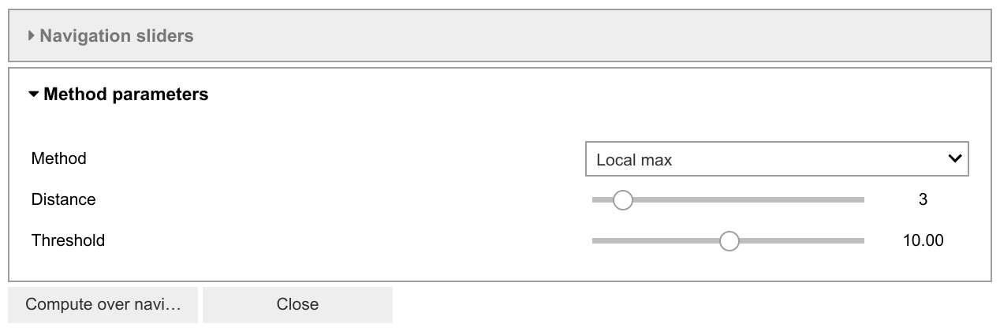

.. _signal2d-label:

Signal2D Tools
**************

The methods described in this section are only available for two-dimensional
signals in the :class:`~.api.signals.Signal2D`. class.

.. _signal2D.align:

Signal registration and alignment
---------------------------------

The :meth:`~.api.signals.Signal2D.align2D` and
:meth:`~.api.signals.Signal2D.estimate_shift2D` methods provide
advanced image alignment functionality.

.. code-block:: python

    # Estimate shifts, then align the images
    >>> shifts = s.estimate_shift2D() # doctest: +SKIP
    >>> s.align2D(shifts=shifts) # doctest: +SKIP

    # Estimate and align in a single step
    >>> s.align2D() # doctest: +SKIP

.. warning::

    ``s.align2D()`` will modify the data **in-place**. If you don't want
    to modify your original data, first take a copy before aligning.

Sub-pixel accuracy can be achieved in two ways:

* `scikit-image's <https://scikit-image.org/>`_ upsampled matrix-multiplication DFT method
  :ref:`[Guizar2008] <Guizar2008>`, by setting the ``sub_pixel_factor``
  keyword argument
* for multi-dimensional datasets only, using the statistical
  method :ref:`[Schaffer2004] <Schaffer2004>`, by setting the ``reference``
  keyword argument to ``"stat"``

.. code-block:: python

    # skimage upsampling method
    >>> shifts = s.estimate_shift2D(sub_pixel_factor=20) # doctest: +SKIP

    # stat method
    >>> shifts = s.estimate_shift2D(reference="stat") # doctest: +SKIP

    # combined upsampling and statistical method
    >>> shifts = s.estimate_shift2D(reference="stat", sub_pixel_factor=20) # doctest: +SKIP

If you have a large stack of images, the image alignment is automatically done in
parallel.

You can control the number of threads used with the ``num_workers`` argument. Or by adjusting
the scheduler of the :ref:`dask backend <dask_backends>`.

.. code-block:: python

    # Estimate shifts
    >>> shifts = s.estimate_shift2D() # doctest: +SKIP

    # Align images in parallel using 4 threads
    >>> s.align2D(shifts=shifts, num_workers=4) # doctest: +SKIP

.. _signal2D.crop:

Cropping a Signal2D
-------------------

The :meth:`~.api.signals.Signal2D.crop_signal` method crops the
image *in-place* e.g.:

.. code-block:: python

    >>> im = hs.data.wave_image()
    >>> im.crop_signal(left=0.5, top=0.7, bottom=2.0) # im is cropped in-place

Cropping in HyperSpy is performed using the :ref:`Signal indexing
<signal.indexing>` syntax. For example, to crop an image:

.. code-block:: python

    >>> im = hs.data.wave_image()
    >>> # im is not cropped, imc is a "cropped view" of im
    >>> imc = im.isig[0.5:, 0.7:2.0]

It is possible to crop interactively using :ref:`roi-label`. For example:

.. code-block:: python

    >>> im = hs.data.wave_image()
    >>> roi = hs.roi.RectangularROI()
    >>> im.plot()
    >>> imc = roi.interactive(im)
    >>> imc.plot()

.. _interactive_signal2d_cropping_image:

.. figure::  images/interactive_signal2d_cropping.png
   :align:   center

   Interactive image cropping using a ROI.

Interactive calibration
-----------------------

The scale can be calibrated interactively by using
:meth:`~.api.signals.Signal2D.calibrate`, which is used to
set the scale by dragging a line across some feature of known size.

.. code-block:: python

    >>> s = hs.signals.Signal2D(np.random.random((200, 200)))
    >>> s.calibrate() # doctest: +SKIP

The same function can also be used non-interactively.

.. code-block:: python

    >>> s = hs.signals.Signal2D(np.random.random((200, 200)))
    >>> s.calibrate(x0=1, y0=1, x1=5, y1=5, new_length=3.4, units="nm", interactive=False)

Add a linear ramp
-----------------

A linear ramp can be added to the signal via the
:meth:`~.api.signals.Signal2D.add_ramp` method. The parameters
``ramp_x`` and ``ramp_y`` dictate the slope of the ramp in ``x``- and ``y`` direction,
while the offset is determined by the ``offset`` parameter. The fulcrum of the
linear ramp is at the origin and the slopes are given in units of the axis
with the according scale taken into account. Both are available via the
:class:`~.axes.AxesManager` of the signal.

.. _peak_finding-label:

Peak finding
------------

.. versionadded:: 1.6

The :meth:`~.api.signals.Signal2D.find_peaks` method provides access
to a number of algorithms for peak finding in two dimensional signals. The
methods available are:

Maximum based peak finder
^^^^^^^^^^^^^^^^^^^^^^^^^

.. code-block:: python

    >>> s.find_peaks(method='local_max') # doctest: +SKIP
    >>> s.find_peaks(method='max') # doctest: +SKIP
    >>> s.find_peaks(method='minmax') # doctest: +SKIP

These methods search for peaks using maximum (and minimum) values in the
image. There all have a ``distance`` parameter to set the minimum distance
between the peaks.

- the ``'local_max'`` method uses the :func:`skimage.feature.peak_local_max`
  function (``distance`` and ``threshold`` parameters are mapped to
  ``min_distance`` and ``threshold_abs``, respectively).
- the ``'max'`` method uses the
  :func:`~.hyperspy.utils.peakfinders2D.find_peaks_max` function to search
  for peaks higher than ``alpha * sigma``, where ``alpha`` is parameters and
  ``sigma`` is the standard deviation of the image. It also has a ``distance``
  parameters to set the minimum distance between peaks.
- the ``'minmax'`` method uses the
  :func:`~.hyperspy.utils.peakfinders2D.find_peaks_minmax` function to locate
  the positive peaks in an image by comparing maximum and minimum filtered
  images. Its ``threshold`` parameter defines the minimum difference between
  the maximum and minimum filtered images.

Zaeferrer peak finder
^^^^^^^^^^^^^^^^^^^^^

.. code-block:: python

    >>> s.find_peaks(method='zaefferer') # doctest: +SKIP

This algorithm was developed by Zaefferer :ref:`[Zaefferer2000] <Zaefferer2000>`.
It is based on a gradient threshold followed by a local maximum search within a square window,
which is moved until it is centered on the brightest point, which is taken as a
peak if it is within a certain distance of the starting point. It uses the
:func:`~.hyperspy.utils.peakfinders2D.find_peaks_zaefferer` function, which can take
``grad_threshold``, ``window_size`` and ``distance_cutoff`` as parameters. See
the :func:`~.hyperspy.utils.peakfinders2D.find_peaks_zaefferer` function documentation
for more details.

Ball statistical peak finder
^^^^^^^^^^^^^^^^^^^^^^^^^^^^

.. code-block:: python

    >>> s.find_peaks(method='stat') # doctest: +SKIP

Described by White :ref:`[White2009] <White2009>`, this method is based on finding points that
have a statistically higher value than the surrounding areas, then iterating
between smoothing and binarising until the number of peaks has converged. This
method can be slower than the others, but is very robust to a variety of image types.
It uses the :func:`~.hyperspy.utils.peakfinders2D.find_peaks_stat` function, which can take
``alpha``, ``window_radius`` and ``convergence_ratio`` as parameters. See the
:func:`~.hyperspy.utils.peakfinders2D.find_peaks_stat` function documentation for more
details.

Matrix based peak finding
^^^^^^^^^^^^^^^^^^^^^^^^^

.. code-block:: python

    >>> s.find_peaks(method='laplacian_of_gaussians') # doctest: +SKIP
    >>> s.find_peaks(method='difference_of_gaussians') # doctest: +SKIP

These methods are essentially wrappers around the
Laplacian of Gaussian (:func:`skimage.feature.blob_log`) or the difference
of Gaussian (:func:`skimage.feature.blob_dog`) methods, based on stacking
the Laplacian/difference of images convolved with Gaussian kernels of various
standard deviations. For more information, see the example in the
`scikit-image documentation <https://scikit-image.org/docs/dev/auto_examples/features_detection/plot_blob.html>`_.

Template matching
^^^^^^^^^^^^^^^^^

.. code-block:: python

    >>> x, y = np.meshgrid(np.arange(-2, 2.5, 0.5), np.arange(-2, 2.5, 0.5))
    >>> template = hs.model.components2D.Gaussian2D().function(x, y)
    >>> s.find_peaks(method='template_matching', template=template, interactive=False)
    <BaseSignal, title: , dimensions: (|ragged)>

This method locates peaks in the cross correlation between the image and a
template using the :func:`~.hyperspy.utils.peakfinders2D.find_peaks_xc` function. See
the :func:`~.hyperspy.utils.peakfinders2D.find_peaks_xc` function documentation for
more details.

Interactive parametrization
---------------------------

Many of the peak finding algorithms implemented here have a number of tunable
parameters that significantly affect their accuracy and speed. The GUIs can be
used to set to select the method and set the parameters interactively:

.. code-block:: python

    >>> s.find_peaks(interactive=True) # doctest: +SKIP

Several widgets are available:

* The method selector is used to compare different methods. The last-set
  parameters are maintained.
* The parameter adjusters will update the parameters of the method and re-plot
  the new peaks.

.. note:: Some methods take significantly longer than others, particularly
   where there are a large number of peaks to be found. The plotting window
   may be inactive during this time.
