
Tools: the Signal class
***********************

The Signal class and its subclasses
-----------------------------------

.. WARNING::
    This subsection can be a bit confusing for beginners.
    Do not worry if you do not understand it all.

HyperSpy stores the data in the :py:class:`~.signal.BaseSignal` class, that is
the object that you get when e.g. you load a single file using
:py:func:`~.io.load`. Most of the data analysis functions are also contained in
this class or its specialized subclasses. The :py:class:`~.signal.BaseSignal`
class contains general functionality that is available to all the subclasses.
The subclasses provide functionality that is normally specific to a particular
type of data, e.g. the :py:class:`~._signals.signal1d.Signal1D` class provides
common functionality to deal with one-dimensional (e.g. spectral) data and
:py:class:`~._signals.eels.EELSSpectrum` (which is a subclass of
:py:class:`~._signals.signal1d.Signal1D`) adds extra functionality to the
:py:class:`~._signals.signal1d.Signal1D` class for electron energy-loss
spectroscopy data analysis.

The :ref:`table below <signal_subclasses_table-label>` summarises all the
currently available specialised :py:class:`~.signal.BaseSignal` subclasses.

.. versionchanged:: 1.0

    The :py:class:`~._signals.signal1D.Signal1D`,
    :py:class:`~._signals.image.Signal2D` and :py:class:`~.signal.BaseSignal`
    classes deprecated the old `Spectrum` `Image` and `Signal` classes.

.. versionadded:: 1.0

    New :py:class:`~._signals.complex_signal.ComplexSignal`,
    :py:class:`~._signals.complex_signal1d.ComplexSignal1D` and
    :py:class:`~._signals.complex_signal2d.ComplexSignal2D`
    :py:class:`~.signal.BaseSignal` subclasses specialised in complex data.

The :py:mod:`~.signals` module, which contains all available signal subclasses,
is imported in the user namespace when loading hyperspy. In the following
example we create a Signal2D instance from a 2D numpy array:

.. code-block:: python

    >>> im = hs.signals.Signal2D(np.random.random((64,64)))
    >>> im
    <Signal2D, title: , dimensions: (|64, 64)>

The different signals store other objects in what are called attributes. For
examples, the data is stored in a numpy array in the
:py:attr:`~.signal.BaseSignal.data` attribute, the original parameters in the
:py:attr:`~.signal.BaseSignal.original_metadata` attribute, the mapped parameters
in the :py:attr:`~.signal.BaseSignal.metadata` attribute and the axes
information (including calibration) can be accessed (and modified) in the
:py:attr:`~.signal.BaseSignal.axes_manager` attribute.

Signal initialization
---------------------

Many of the values in the :py:attr:`~.signal.BaseSignal.axes_manager` can be
set when making the :py:class:`~.signal.BaseSignal` object.

.. code-block:: python

    >>> dict0 = {'size': 10, 'name':'Ax0', 'units':'A', 'scale':0.2, 'offset':1}
    >>> dict1 = {'size': 20, 'name':'Ax1', 'units':'B', 'scale':0.1, 'offset':2} 
    >>> s = hs.signals.BaseSignal(np.random.random((10,20)), axes=[dict0, dict1])
    >>> s.axes_manager
    <Axes manager, axes: (|20, 10)>
		Name |   size |  index |  offset |   scale |  units 
    ================ | ====== | ====== | ======= | ======= | ====== 
    ---------------- | ------ | ------ | ------- | ------- | ------ 
	       Axes1 |     20 |        |       2 |     0.1 |      B 
	       Axes0 |     10 |        |       1 |     0.2 |      A

This also applies to the :py:attr:`~.signal.BaseSignal.metadata`.

.. code-block:: python

    >>> metadata_dict = {'General':{'name':'A BaseSignal'}}
    >>> metadata_dict['General']['title'] = 'A BaseSignal title'
    >>> s = hs.signals.BaseSignal(np.arange(10), metadata=metadata_dict)
    >>> s.metadata
    ├── General
    │   ├── name = A BaseSignal
    │   └── title = A BaseSignal title
    └── Signal
	├── binned = False
	└── signal_type =

The navigation and signal dimensions
------------------------------------

HyperSpy can deal with data of arbitrary dimensions. Each dimension is
internally classified as either "navigation" or "signal" and the way this
classification is done determines the behaviour of the signal.

The concept is probably best understood with an example: let's imagine a three
dimensional dataset e.g. a numpy array with dimensions `(10, 20, 30)`. This
dataset could be an spectrum image acquired by scanning over a sample in two
dimensions. As in this case the signal is one-dimensional we use a
:py:class:`~._signals.signal1D.Signal1D` subclass for this data e.g.:

.. code-block:: python

    >>> s = hs.signals.Signal1D(np.random.random((10, 20, 30)))
    >>> s
    <Signal1D, title: , dimensions: (20, 10|30)>

In HyperSpy's terminology, the *signal dimension* of this dataset is 30 and
the navigation dimensions (20, 10). Notice the separator `|` between the
navigation and signal dimensions.

However, the same dataset could also be interpreted as an image
stack instead.  Actually it could has been acquired by capturing two
dimensional images at different wavelengths. Then it would be natural to
identify the two spatial dimensions as the signal dimensions and the wavelength
dimension as the navigation dimension. To view the data in this way we could
have used a :py:class:`~._signals.signal2D.Signal2D` instead e.g.:

.. code-block:: python

    >>> im = hs.signals.Signal2D(np.random.random((10, 20, 30)))
    >>> im
    <Signal2D, title: , dimensions: (10|30, 20)>

Indeed, for data analysis purposes,
one may like to operate with an image stack as if it was a set of spectra or
viceversa. One can easily switch between these two alternative ways of
classifiying the dimensions of a three-dimensional dataset by
:ref:`transforming between BaseSignal subclasses
<transforming.signal>`.

The same dataset could be seen as a three-dimensional signal:

.. code-block:: python

    >>> td = hs.signals.BaseSignal(np.random.random((10, 20, 30)))
    >>> td
    <BaseSignal, title: , dimensions: (|30, 20, 10)>

Notice that with use :py:class:`~.signal.BaseSignal` because there is
no specialised subclass for three-dimensional data. Also note that by default
:py:class:`~.signal.BaseSignal` interprets all dimensions as signal dimensions.
We could also configure it to operate on the dataset as a three-dimensional
array of scalars by changing the default *view* of
:py:class:`~.signal.BaseSignal` by taking the transpose of it:

.. code-block:: python

    >>> scalar = td.T
    >>> scalar
    <BaseSignal, title: , dimensions: (30, 20, 10|)>

For more examples of manipulating signal axes in the "signal-navigation" space
can be found in :ref:`signal.transpose`.

.. NOTE::

    Although each dimension can be arbitrarily classified as "navigation
    dimension" or "signal dimension", for most common tasks there is no need to
    modify HyperSpy's default choice.

.. _transforming.signal:

Transforming between signal subclasses
^^^^^^^^^^^^^^^^^^^^^^^^^^^^^^^^^^^^^^

The different subclasses are characterized by the `signal_type` metadata attribute,
the data `dtype` and the signal dimension. See the table and diagram below.
`signal_type` describes the nature of the signal. It can be any string, normally the
acronym associated with a particular signal. In certain cases HyperSpy provides
features that are only available for a particular signal type through
:py:class:`~.signal.BaseSignal` subclasses. The :py:class:`~.signal.BaseSignal` method
:py:meth:`~.signal.BaseSignal.set_signal_type` changes the signal_type in place, which
may result in a :py:class:`~.signal.BaseSignal` subclass transformation.

Furthermore, the `dtype` of the signal data also affects the subclass assignment. There are
e.g. specialised signal subclasses to handle complex data (see the following diagram).

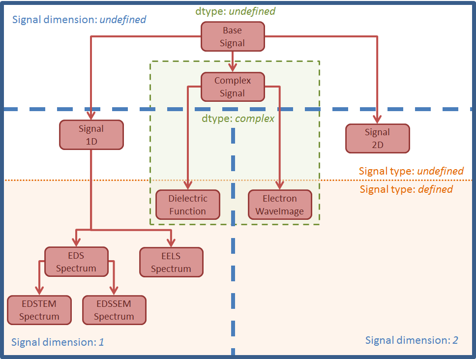

  Diagram showing the inheritance structure of the different subclasses

.. _signal_subclasses_table-label:

.. table:: BaseSignal subclass :py:attr:`~.signal.BaseSignal.metadata` attributes.

    +-------------------------------------------------------------------------+------------------+-----------------------+----------+
    |                      BaseSignal subclass                                | signal_dimension |  signal_type          |  dtype   |
    +=========================================================================+==================+=======================+==========+
    |                 :py:class:`~.signal.BaseSignal`                         |        -         |       -               |  real    |
    +-------------------------------------------------------------------------+------------------+-----------------------+----------+
    |           :py:class:`~._signals.signal1d.Signal1D`                      |        1         |       -               |  real    |
    +-------------------------------------------------------------------------+------------------+-----------------------+----------+
    |           :py:class:`~._signals.eels.EELSSpectrum`                      |        1         |     EELS              |  real    |
    +-------------------------------------------------------------------------+------------------+-----------------------+----------+
    |           :py:class:`~._signals.eds_sem.EDSSEMSpectrum`                 |        1         |    EDS_SEM            |  real    |
    +-------------------------------------------------------------------------+------------------+-----------------------+----------+
    |           :py:class:`~._signals.eds_tem.EDSTEMSpectrum`                 |        1         |    EDS_TEM            |  real    |
    +-------------------------------------------------------------------------+------------------+-----------------------+----------+
    |              :py:class:`~._signals.signal2d.Signal2D`                   |        2         |       -               |  real    |
    +-------------------------------------------------------------------------+------------------+-----------------------+----------+
    |      :py:class:`~._signals.hologram_image.HologramImage`                |        2         |      hologram         |  real    |
    +-------------------------------------------------------------------------+------------------+-----------------------+----------+
    |           :py:class:`~._signals.dielectric_function.DielectricFunction` |        1         |    DielectricFunction |  complex |
    +-------------------------------------------------------------------------+------------------+-----------------------+----------+
    |      :py:class:`~._signals.complex_signal.ComplexSignal`                |        -         |       -               | complex  |
    +-------------------------------------------------------------------------+------------------+-----------------------+----------+
    |    :py:class:`~._signals.complex_signal1d.ComplexSignal1D`              |        1         |       -               | complex  |
    +-------------------------------------------------------------------------+------------------+-----------------------+----------+
    |    :py:class:`~._signals.complex_signal2d.ComplexSignal2D`              |        2         |       -               | complex  |
    +-------------------------------------------------------------------------+------------------+-----------------------+----------+

The following example shows how to transform between different subclasses.

   .. code-block:: python

       >>> s = hs.signals.Signal1D(np.random.random((10,20,100)))
       >>> s
       <Signal1D, title: , dimensions: (20, 10|100)>
       >>> s.metadata
       ├── signal_type =
       └── title =
       >>> im = s.to_signal2D()
       >>> im
       <Signal2D, title: , dimensions: (100|20, 10)>
       >>> im.metadata
       ├── signal_type =
       └── title =
       >>> s.set_signal_type("EELS")
       >>> s
       <EELSSpectrum, title: , dimensions: (20, 10|100)>
       >>> s.change_dtype("complex")
       >>> s
       <ComplexSignal1D, title: , dimensions: (20, 10|100)>

.. _signal.binned:

Binned and unbinned signals
---------------------------

.. versionadded:: 0.7

Signals that are a histogram of a probability density function (pdf) should
have the ``signal.metadata.Signal.binned`` attribute set to
``True``. This is because some methods operate differently in signals that are
*binned*.

.. versionchanged:: 1.0 ``Simulation``, ``SpectrumSimulation`` and ``ImageSimulation``
   classes removed.

The default value of the ``binned`` attribute is shown in the
following table:

.. table:: Binned default values for the different subclasses.

    +---------------------------------------------------------------+--------+
    |                       BaseSignal subclass                     | binned |
    +===============================================================+========+
    |                 :py:class:`~.signal.BaseSignal`               | False  |
    +---------------------------------------------------------------+--------+
    |           :py:class:`~._signals.signal1d.Signal1D`            | False  |
    +---------------------------------------------------------------+--------+
    |           :py:class:`~._signals.eels.EELSSpectrum`            | True   |
    +---------------------------------------------------------------+--------+
    |           :py:class:`~._signals.eds_sem.EDSSEMSpectrum`       | True   |
    +---------------------------------------------------------------+--------+
    |           :py:class:`~._signals.eds_tem.EDSTEMSpectrum`       | True   |
    +---------------------------------------------------------------+--------+
    |              :py:class:`~._signals.signal2d.Signal2D`         | False  |
    +---------------------------------------------------------------+--------+
    |      :py:class:`~._signals.complex_signal.ComplexSignal`      | False  |
    +---------------------------------------------------------------+--------+
    |    :py:class:`~._signals.complex_signal1d.ComplexSignal1D`    | False  |
    +---------------------------------------------------------------+--------+
    |    :py:class:`~._signals.complex_signal2d.ComplexSignal2D`    | False  |
    +---------------------------------------------------------------+--------+

To change the default value:

.. code-block:: python

    >>> s.metadata.Signal.binned = True

Generic tools
-------------

Below we briefly introduce some of the most commonly used tools (methods). For
more details about a particular method click on its name. For a detailed list
of all the methods available see the :py:class:`~.signal.BaseSignal` documentation.

The methods of this section are available to all the signals. In other chapters
methods that are only available in specialized
subclasses.

Mathematical operations
^^^^^^^^^^^^^^^^^^^^^^^

.. versionchanged:: 1.0

A number of mathematical operations are available
in :py:class:`~.signal.BaseSignal`. Most of them are just wrapped numpy
functions.

The methods that perform mathematical opearation over one or more axis at a
time are:

* :py:meth:`~.signal.BaseSignal.sum`
* :py:meth:`~.signal.BaseSignal.max`
* :py:meth:`~.signal.BaseSignal.min`
* :py:meth:`~.signal.BaseSignal.mean`
* :py:meth:`~.signal.BaseSignal.std`
* :py:meth:`~.signal.BaseSignal.var`
* :py:meth:`~.signal.BaseSignal.nansum`
* :py:meth:`~.signal.BaseSignal.nanmax`
* :py:meth:`~.signal.BaseSignal.nanmin`
* :py:meth:`~.signal.BaseSignal.nanmean`
* :py:meth:`~.signal.BaseSignal.nanstd`
* :py:meth:`~.signal.BaseSignal.nanvar`

Note that by default all this methods perform the operation over *all*
navigation axes.

Example:

.. code-block:: python

    >>> s = hs.signals.BaseSignal(np.random.random((2,4,6)))
    >>> s.axes_manager[0].name = 'E'
    >>> s
    <BaseSignal, title: , dimensions: (4, 2|6)>
    >>> # by default perform operation over all navigation axes
    >>> s.sum()
    <BaseSignal, title: , dimensions: (|6)>
    >>> # can also pass axes individually
    >>> s.sum('E')
    <BaseSignal, title: , dimensions: (2|6)>
    >>> # or a tuple of axes to operate on, with duplicates, by index or directly
    >>> ans = s.sum((-1, s.axes_manager[1], 'E', 0))
    >>> ans
    <BaseSignal, title: , dimensions: (|1)>
    >>> ans.axes_manager[0]
    <Scalar axis, size: 1>

The following methods operate only on one axis at a time:

* :py:meth:`~.signal.BaseSignal.diff`
* :py:meth:`~.signal.BaseSignal.derivative`
* :py:meth:`~.signal.BaseSignal.integrate_simpson`
* :py:meth:`~.signal.BaseSignal.integrate1D`
* :py:meth:`~.signal.BaseSignal.valuemax`
* :py:meth:`~.signal.BaseSignal.indexmax`

.. versionadded:: 1.0
   numpy ufunc operate on HyperSpy signals

.. _ufunc-label:

All numpy ufunc can operate on :py:class:`~.signal.BaseSignal`
instances, for example:

.. code-block:: python

    >>> s = hs.signals.Signal1D([0, 1])
    >>> s.metadata.General.title = "A"
    >>> s
    <Signal1D, title: A, dimensions: (|2)>
    >>> np.exp(s)
    <Signal1D, title: exp(A), dimensions: (|2)>
    >>> np.exp(s).data
    array([ 1.        ,  2.71828183])
    >>> np.power(s, 2)
    <Signal1D, title: power(A, 2), dimensions: (|2)>
    >>> np.add(s, s)
    <Signal1D, title: add(A, A), dimensions: (|2)>
    >>> np.add(hs.signals.Signal1D([0, 1]), hs.signals.Signal1D([0, 1]))
    <Signal1D, title: add(Untitled Signal 1, Untitled Signal 2), dimensions: (|2)>

Notice that the title is automatically updated. When the signal has no title
a new title is automatically generated:

.. code-block:: python

    >>> np.add(hs.signals.Signal1D([0, 1]), hs.signals.Signal1D([0, 1]))
    <Signal1D, title: add(Untitled Signal 1, Untitled Signal 2), dimensions: (|2)>

Functions (other than unfucs) that operate on numpy arrays can also operate
on :py:class:`~.signal.BaseSignal` instances, however they return a numpy
array instead of a :py:class:`~.signal.BaseSignal` instance e.g.:

.. code-block:: python

    >>> np.angle(s)
    array([ 0.,  0.])

.. _signal.indexing:

Indexing
^^^^^^^^
.. versionadded:: 0.6
.. versionchanged:: 0.8.1

Indexing a :py:class:`~.signal.BaseSignal`  provides a powerful, convenient and
Pythonic way to access and modify its data. In HyperSpy indexing is achieved
using ``isig`` and ``inav``, which allow the navigation and signal dimensions
to be indexed independently. The idea is essentially to specify a subset of the
data based on its position in the array and it is therefore essential to know
the convention adopted for specifying that position, which is described here.

Those new to Python may find indexing a somewhat esoteric concept but once
mastered it is one of the most powerful features of Python based code and
greatly simplifies many common tasks. HyperSpy's Signal indexing is similar
to numpy array indexing and those new to Python are encouraged to read the
associated `numpy documentation on the subject  <http://ipython.org/>`_.

Key features of indexing in HyperSpy are as follows (note that some of these
features differ from numpy):

* HyperSpy indexing does:

  + Allow independent indexing of signal and navigation dimensions
  + Support indexing with decimal numbers.
  + Use the image order for indexing i.e. [x, y, z,...] (hyperspy) vs
    [...,z,y,x] (numpy)

* HyperSpy indexing does not:

  + Support indexing using arrays.
  + Allow the addition of new axes using the newaxis object.

The examples below illustrate a range of common indexing tasks.

First consider indexing a single spectrum, which has only one signal dimension
(and no navigation dimensions) so we use ``isig``:

.. code-block:: python

    >>> s = hs.signals.Signal1D(np.arange(10))
    >>> s
    <Signal1D, title: , dimensions: (|10)>
    >>> s.data
    array([0, 1, 2, 3, 4, 5, 6, 7, 8, 9])
    >>> s.isig[0]
    <Signal1D, title: , dimensions: (|1)>
    >>> s.isig[0].data
    array([0])
    >>> s.isig[9].data
    array([9])
    >>> s.isig[-1].data
    array([9])
    >>> s.isig[:5]
    <Signal1D, title: , dimensions: (|5)>
    >>> s.isig[:5].data
    array([0, 1, 2, 3, 4])
    >>> s.isig[5::-1]
    <Signal1D, title: , dimensions: (|6)>
    >>> s.isig[5::-1]
    <Signal1D, title: , dimensions: (|6)>
    >>> s.isig[5::2]
    <Signal1D, title: , dimensions: (|3)>
    >>> s.isig[5::2].data
    array([5, 7, 9])

Unlike numpy, HyperSpy supports indexing using decimal numbers, in which case
HyperSpy indexes using the axis scales instead of the indices.

.. code-block:: python

    >>> s = hs.signals.Signal1D(np.arange(10))
    >>> s
    <Signal1D, title: , dimensions: (|10)>
    >>> s.data
    array([0, 1, 2, 3, 4, 5, 6, 7, 8, 9])
    >>> s.axes_manager[0].scale = 0.5
    >>> s.axes_manager[0].axis
    array([ 0. ,  0.5,  1. ,  1.5,  2. ,  2.5,  3. ,  3.5,  4. ,  4.5])
    >>> s.isig[0.5:4.].data
    array([1, 2, 3, 4, 5, 6, 7])
    >>> s.isig[0.5:4].data
    array([1, 2, 3])
    >>> s.isig[0.5:4:2].data
    array([1, 3])

Importantly the original :py:class:`~.signal.BaseSignal` and its "indexed self"
share their data and, therefore, modifying the value of the data in one
modifies the same value in the other. Note also that in the example below
s.data is used to access the data as a numpy array directly and this array is
then indexed using numpy indexing.

.. code-block:: python

    >>> s = hs.signals.Signal1D(np.arange(10))
    >>> s
    <Signal1D, title: , dimensions: (10,)>
    >>> s.data
    array([0, 1, 2, 3, 4, 5, 6, 7, 8, 9])
    >>> si = s.isig[::2]
    >>> si.data
    array([0, 2, 4, 6, 8])
    >>> si.data[:] = 10
    >>> si.data
    array([10, 10, 10, 10, 10])
    >>> s.data
    array([10,  1, 10,  3, 10,  5, 10,  7, 10,  9])
    >>> s.data[:] = 0
    >>> si.data
    array([0, 0, 0, 0, 0])

Of course it is also possible to use the same syntax to index multidimensional
data treating navigation axes using ``inav`` and signal axes using ``isig``.

.. code-block:: python

    >>> s = hs.signals.Signal1D(np.arange(2*3*4).reshape((2,3,4)))
    >>> s
    <Signal1D, title: , dimensions: (10, 10, 10)>
    >>> s.data
    array([[[ 0,  1,  2,  3],
        [ 4,  5,  6,  7],
        [ 8,  9, 10, 11]],

       [[12, 13, 14, 15],
        [16, 17, 18, 19],
        [20, 21, 22, 23]]])
    >>> s.axes_manager[0].name = 'x'
    >>> s.axes_manager[1].name = 'y'
    >>> s.axes_manager[2].name = 't'
    >>> s.axes_manager.signal_axes
    (<t axis, size: 4>,)
    >>> s.axes_manager.navigation_axes
    (<x axis, size: 3, index: 0>, <y axis, size: 2, index: 0>)
    >>> s.inav[0,0].data
    array([0, 1, 2, 3])
    >>> s.inav[0,0].axes_manager
    <Axes manager, axes: (<t axis, size: 4>,)>
    >>> s.inav[0,0].isig[::-1].data
    array([3, 2, 1, 0])
    >>> s.isig[0]
    <Signal1D, title: , dimensions: (2, 3)>
    >>> s.isig[0].axes_manager
    <Axes manager, axes: (<x axis, size: 3, index: 0>, <y axis, size: 2, index: 0>)>
    >>> s.isig[0].data
    array([[ 0,  4,  8],
       [12, 16, 20]])

Independent indexation of the signal and navigation dimensions is demonstrated
further in the following:

.. code-block:: python

    >>> s = hs.signals.Signal1D(np.arange(2*3*4).reshape((2,3,4)))
    >>> s
    <Signal1D, title: , dimensions: (10, 10, 10)>
    >>> s.data
    array([[[ 0,  1,  2,  3],
        [ 4,  5,  6,  7],
        [ 8,  9, 10, 11]],

       [[12, 13, 14, 15],
        [16, 17, 18, 19],
        [20, 21, 22, 23]]])
    >>> s.axes_manager[0].name = 'x'
    >>> s.axes_manager[1].name = 'y'
    >>> s.axes_manager[2].name = 't'
    >>> s.axes_manager.signal_axes
    (<t axis, size: 4>,)
    >>> s.axes_manager.navigation_axes
    (<x axis, size: 3, index: 0>, <y axis, size: 2, index: 0>)
    >>> s.inav[0,0].data
    array([0, 1, 2, 3])
    >>> s.inav[0,0].axes_manager
    <Axes manager, axes: (<t axis, size: 4>,)>
    >>> s.isig[0]
    <Signal1D, title: , dimensions: (2, 3)>
    >>> s.isig[0].axes_manager
    <Axes manager, axes: (<x axis, size: 3, index: 0>, <y axis, size: 2, index: 0>)>
    >>> s.isig[0].data
    array([[ 0,  4,  8],
       [12, 16, 20]])

The same syntax can be used to set the data values in signal and navigation
dimensions respectively:

.. code-block:: python

    >>> s = hs.signals.Signal1D(np.arange(2*3*4).reshape((2,3,4)))
    >>> s
    <Signal1D, title: , dimensions: (10, 10, 10)>
    >>> s.data
    array([[[ 0,  1,  2,  3],
        [ 4,  5,  6,  7],
        [ 8,  9, 10, 11]],

       [[12, 13, 14, 15],
        [16, 17, 18, 19],
        [20, 21, 22, 23]]])
    >>> s.inav[0,0].data
    array([0, 1, 2, 3])
    >>> s.inav[0,0] = 1
    >>> s.inav[0,0].data
    array([1, 1, 1, 1])
    >>> s.inav[0,0] = s[1,1]
    >>> s.inav[0,0].data
    array([16, 17, 18, 19])

.. _signal.operations:

Signal operations
^^^^^^^^^^^^^^^^^
.. versionadded:: 0.6

.. versionadded:: 0.8.3

:py:class:`~.signal.BaseSignal` supports all the Python binary arithmetic
opearations (+, -, \*, //, %, divmod(), pow(), \*\*, <<, >>, &, ^, \|),
augmented binary assignments (+=, -=, \*=, /=, //=, %=, \*\*=, <<=, >>=, &=,
^=, \|=), unary operations (-, +, abs() and ~) and rich comparisons operations
(<, <=, ==, x!=y, <>, >, >=).

These operations are performed element-wise. When the dimensions of the signals
are not equal `numpy broadcasting rules apply
<http://docs.scipy.org/doc/numpy/user/basics.broadcasting.html>`_ independently
for the navigation and signal axes.

In the following example `s2` has only one navigation axis while `s` has two.
However, because the size of their first navigation axis is the same, their
dimensions are compatible and `s2` is
broacasted to match `s`'s dimensions.

.. code-block:: python

    >>> s = hs.signals.Signal2D(np.ones((3,2,5,4)))
    >>> s2 = hs.signals.Signal2D(np.ones((2,5,4)))
    >>> s
    <Signal2D, title: , dimensions: (2, 3|4, 5)>
    >>> s2
    <Signal2D, title: , dimensions: (2|4, 5)>
    >>> s + s2
    <Signal2D, title: , dimensions: (2, 3|4, 5)>

In the following example the dimensions are not compatible and an exception
is raised.

.. code-block:: python

    >>> s = hs.signals.Signal2D(np.ones((3,2,5,4)))
    >>> s2 = hs.signals.Signal2D(np.ones((3,5,4)))
    >>> s
    <Signal2D, title: , dimensions: (2, 3|4, 5)>
    >>> s2
    <Signal2D, title: , dimensions: (3|4, 5)>
    >>> s + s2
    Traceback (most recent call last):
      File "<ipython-input-55-044bb11a0bd9>", line 1, in <module>
        s + s2
      File "<string>", line 2, in __add__
      File "/home/fjd29/Python/hyperspy/hyperspy/signal.py", line 2686, in _binary_operator_ruler
        raise ValueError(exception_message)
    ValueError: Invalid dimensions for this operation

Broacasting operates exactly in the same way for the signal axes:

.. code-block:: python

    >>> s = hs.signals.Signal2D(np.ones((3,2,5,4)))
    >>> s2 = hs.signals.Signal1D(np.ones((3, 2, 4)))
    >>> s
    <Signal2D, title: , dimensions: (2, 3|4, 5)>
    >>> s2
    <Signal1D, title: , dimensions: (2, 3|4)>
    >>> s + s2
    <Signal2D, title: , dimensions: (2, 3|4, 5)>

In-place operators also support broadcasting, but only when broadcasting would
not change the left most signal dimensions:

.. code-block:: python

    >>> s += s2
    >>> s
    <Signal2D, title: , dimensions: (2, 3|4, 5)>
    >>> s2 += s
    Traceback (most recent call last):
      File "<ipython-input-64-fdb9d3a69771>", line 1, in <module>
        s2 += s
      File "<string>", line 2, in __iadd__
      File "/home/fjd29/Python/hyperspy/hyperspy/signal.py", line 2737, in _binary_operator_ruler
        self.data = getattr(sdata, op_name)(odata)
    ValueError: non-broadcastable output operand with shape (3,2,1,4) doesn\'t match the broadcast shape (3,2,5,4)

.. _signal.iterator:

Iterating over the navigation axes
^^^^^^^^^^^^^^^^^^^^^^^^^^^^^^^^^^

BaseSignal instances are iterables over the navigation axes. For example, the
following code creates a stack of 10 images and saves them in separate "png"
files by iterating over the signal instance:

.. code-block:: python

    >>> image_stack = hs.signals.Signal2D(np.random.random((2, 5, 64,64)))
    >>> for single_image in image_stack:
    ...    single_image.save("image %s.png" % str(image_stack.axes_manager.indices))
    The "image (0, 0).png" file was created.
    The "image (1, 0).png" file was created.
    The "image (2, 0).png" file was created.
    The "image (3, 0).png" file was created.
    The "image (4, 0).png" file was created.
    The "image (0, 1).png" file was created.
    The "image (1, 1).png" file was created.
    The "image (2, 1).png" file was created.
    The "image (3, 1).png" file was created.
    The "image (4, 1).png" file was created.

The data of the signal instance that is returned at each iteration is a view of
the original data, a property that we can use to perform operations on the
data.  For example, the following code rotates the image at each coordinate  by
a given angle and uses the :py:func:`~.utils.stack` function in combination
with `list comprehensions
<http://docs.python.org/2/tutorial/datastructures.html#list-comprehensions>`_
to make a horizontal "collage" of the image stack:

.. code-block:: python

    >>> import scipy.ndimage
    >>> image_stack = hs.signals.Signal2D(np.array([scipy.misc.lena()]*5))
    >>> image_stack.axes_manager[1].name = "x"
    >>> image_stack.axes_manager[2].name = "y"
    >>> for image, angle in zip(image_stack, (0, 45, 90, 135, 180)):
    ...    image.data[:] = scipy.ndimage.rotate(image.data, angle=angle,
    ...    reshape=False)
    >>> collage = hs.stack([image for image in image_stack], axis=0)
    >>> collage.plot()

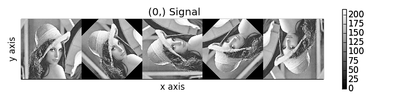

  Rotation of images by iteration.

.. versionadded:: 0.7

Iterating external functions with the map method
^^^^^^^^^^^^^^^^^^^^^^^^^^^^^^^^^^^^^^^^^^^^^^^^

Performing an operation on the data at each coordinate, as in the previous example,
using an external function can be more easily accomplished using the
:py:meth:`~.signal.BaseSignal.map` method:

.. code-block:: python

    >>> import scipy.ndimage
    >>> image_stack = hs.signals.Signal2D(np.array([scipy.misc.lena()]*4))
    >>> image_stack.axes_manager[1].name = "x"
    >>> image_stack.axes_manager[2].name = "y"
    >>> image_stack.map(scipy.ndimage.rotate,
    ...                            angle=45,
    ...                            reshape=False)
    >>> collage = hs.stack([image for image in image_stack], axis=0)
    >>> collage.plot()

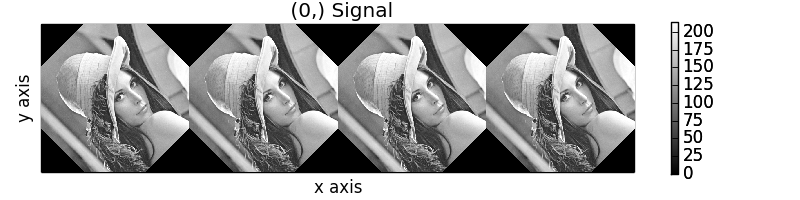

  Rotation of images by the same amount using :py:meth:`~.signal.BaseSignal.map`.

The :py:meth:`~.signal.BaseSignal.map` method can also take variable
arguments as in the following example.

.. code-block:: python

    >>> import scipy.ndimage
    >>> image_stack = hs.signals.Signal2D(np.array([scipy.misc.lena()]*4))
    >>> image_stack.axes_manager[1].name = "x"
    >>> image_stack.axes_manager[2].name = "y"
    >>> angles = hs.signals.BaseSignal(np.array([0, 45, 90, 135]))
    >>> modes = hs.signals.BaseSignal(np.array(['constant', 'nearest', 'reflect', 'wrap']))
    >>> image_stack.map(scipy.ndimage.rotate,
    ...                            angle=angles.T,
    ...                            reshape=False,
    ...                            mode=modes.T)
    calculating 100% |#############################################| ETA:  00:00:00Cropping

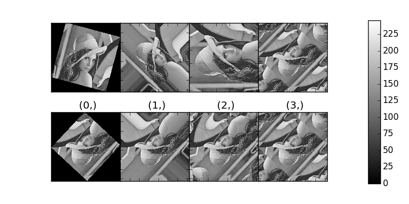

  Rotation of images using :py:meth:`~.signal.BaseSignal.map` with different
  arguments for each image in the stack.

.. versionadded:: 1.2.0
    ``inplace`` keyword and non-preserved output shapes

If all function calls do not return identically-shaped results, only navigation
information is preserved, and the final result is an array where
each element corresponds to the result of the function (or arbitrary object
type). As such, most HyperSpy functions cannot operate on such Signal, and the
data should be accessed directly.

``inplace`` keyword (by default ``True``) of the
:py:meth:`~.signal.BaseSignal.map` method allows either overwriting the current
data (default, ``True``) or storing it to a new signal (``False``).

.. code-block:: python

    >>> import scipy.ndimage
    >>> image_stack = hs.signals.Signal2D(np.array([scipy.misc.ascent()]*4))
    >>> angles = hs.signals.BaseSignal(np.array([0, 45, 90, 135]))
    >>> result = image_stack.map(scipy.ndimage.rotate,
    ...                            angle=angles.T,
    ...                            inplace=False,
    ...                            reshape=True)
    100%|████████████████████████████████████████████| 4/4 [00:00<00:00, 18.42it/s]

    >>> result
    <BaseSignal, title: , dimensions: (4|)>
    >>> image_stack.data.dtype
    dtype('O')
    >>> for d in result.data.flat:
    ...     print(d.shape)
    (512, 512)
    (724, 724)
    (512, 512)
    (724, 724)

.. versionadded:: 1.2.0
    ``parallel`` keyword.

The execution can be sped up by passing ``parallel`` keyword to the
:py:meth:`~.signal.BaseSignal.map` method:

.. code-block:: python

    >>> import time
    >>> def slow_func(data):
    ...     time.sleep(1.)
    ...     return data+1
    >>> s = hs.signals.Signal1D(np.arange(20).reshape((20,1)))
    >>> s
    <Signal1D, title: , dimensions: (20|1)>
    >>> s.map(slow_func, parallel=False)
    100%|██████████████████████████████████████| 20/20 [00:20<00:00,  1.00s/it]
    >>> # some operations will be done in parallel:
    >>> s.map(slow_func, parallel=True)
    100%|██████████████████████████████████████| 20/20 [00:02<00:00,  6.73it/s]

Cropping
^^^^^^^^

Cropping can be performed in a very compact and powerful way using
:ref:`signal.indexing` . In addition it can be performed using the following
method or GUIs if cropping :ref:`signal1D <signal1D.crop>` or :ref:`signal2D
<signal2D.crop>`. There is also a general :py:meth:`~.signal.BaseSignal.crop`
method that operates *in place*.

Rebinning
^^^^^^^^^

The :py:meth:`~.signal.BaseSignal.rebin` method rebins data in place down to a size
determined by the user.

Folding and unfolding
^^^^^^^^^^^^^^^^^^^^^

When dealing with multidimensional datasets it is sometimes useful to transform
the data into a two dimensional dataset. This can be accomplished using the
following two methods:

* :py:meth:`~.signal.BaseSignal.fold`
* :py:meth:`~.signal.BaseSignal.unfold`

It is also possible to unfold only the navigation or only the signal space:

* :py:meth:`~.signal.BaseSignal.unfold_navigation_space`
* :py:meth:`~.signal.BaseSignal.unfold_signal_space`

.. _signal.stack_split:

Splitting and stacking
^^^^^^^^^^^^^^^^^^^^^^

Several objects can be stacked together over an existing axis or over a
new axis using the :py:func:`~.utils.stack` function, if they share axis
with same dimension.

.. code-block:: python

    >>> image = hs.signals.Signal2D(scipy.misc.lena())
    >>> image = hs.stack([hs.stack([image]*3,axis=0)]*3,axis=1)
    >>> image.plot()

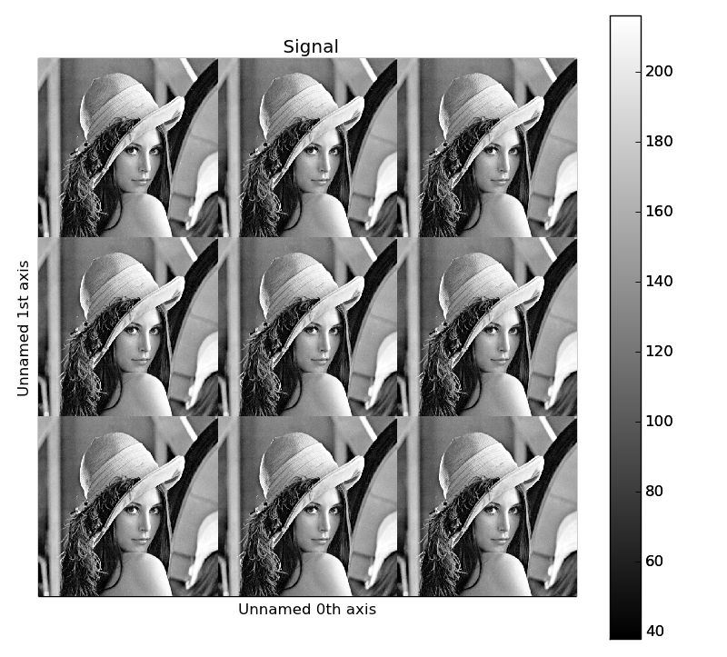

  Stacking example.

An object can be splitted into several objects
with the :py:meth:`~.signal.BaseSignal.split` method. This function can be used
to reverse the :py:func:`~.utils.stack` function:

.. code-block:: python

    >>> image = image.split()[0].split()[0]
    >>> image.plot()

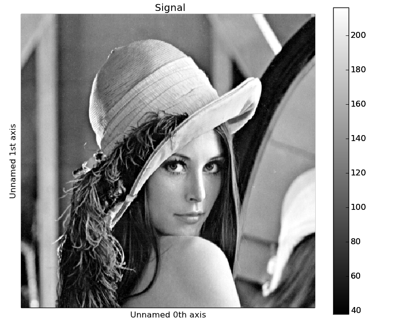

  Splitting example.

.. _signal.change_dtype:

Changing the data type
^^^^^^^^^^^^^^^^^^^^^^

Even if the original data is recorded with a limited dynamic range, it is often
desirable to perform the analysis operations with a higher precision.
Conversely, if space is limited, storing in a shorter data type can decrease
the file size. The :py:meth:`~.signal.BaseSignal.change_dtype` changes the data
type in place, e.g.:

.. code-block:: python

    >>> s = hs.load('EELS Signal1D Signal2D (high-loss).dm3')
        Title: EELS Signal1D Signal2D (high-loss).dm3
        Signal type: EELS
        Data dimensions: (21, 42, 2048)
        Data representation: spectrum
        Data type: float32
    >>> s.change_dtype('float64')
    >>> print(s)
        Title: EELS Signal1D Signal2D (high-loss).dm3
        Signal type: EELS
        Data dimensions: (21, 42, 2048)
        Data representation: spectrum
        Data type: float64

.. versionadded:: 0.7
   Support for RGB signals.

In addition to all standard numpy dtypes, HyperSpy supports four extra
dtypes for RGB images: rgb8, rgba8, rgb16 and rgba16. The requirements for changing
from and to any rgbx dtype are more strict than for most other dtype
conversions. To change to a rgbx dtype the `signal_dimension` must be 1 and its size 3(4) 3(4) for rgb(rgba) dtypes and the
dtype must be uint8(uint16) for rgbx8(rgbx16).  After conversion
the `signal_dimension` becomes 2. The dtype
of images of dtype rgbx8(rgbx16) can only be changed to uint8(uint16) and
the `signal_dimension` becomes 1.

In the following example we create a 1D signal with signal size 3 and with
`dtype` `"uint16"` and change its dtype to `"rgb16"` for plotting.

.. code-block:: python

    >>> rgb_test = np.zeros((1024, 1024, 3))
    >>> ly, lx = rgb_test.shape[:2]
    >>> offset_factor = 0.16
    >>> size_factor = 3
    >>> Y, X = np.ogrid[0:lx, 0:ly]
    >>> rgb_test[:,:,0] = (X - lx / 2 - lx*offset_factor) ** 2 + (Y - ly / 2 - ly*offset_factor) ** 2 < lx * ly / size_factor **2
    >>> rgb_test[:,:,1] = (X - lx / 2 + lx*offset_factor) ** 2 + (Y - ly / 2 - ly*offset_factor) ** 2 < lx * ly / size_factor **2
    >>> rgb_test[:,:,2] = (X - lx / 2) ** 2 + (Y - ly / 2 + ly*offset_factor) ** 2 < lx * ly / size_factor **2
    >>> rgb_test *= 2**16 - 1
    >>> s = hs.signals.Signal1D(rgb_test)
    >>> s.change_dtype("uint16")
    >>> s
    <Signal1D, title: , dimensions: (1024, 1024|3)>
    >>> s.change_dtype("rgb16")
    >>> s
    <Signal2D, title: , dimensions: (|1024, 1024)>
    >>> s.plot()

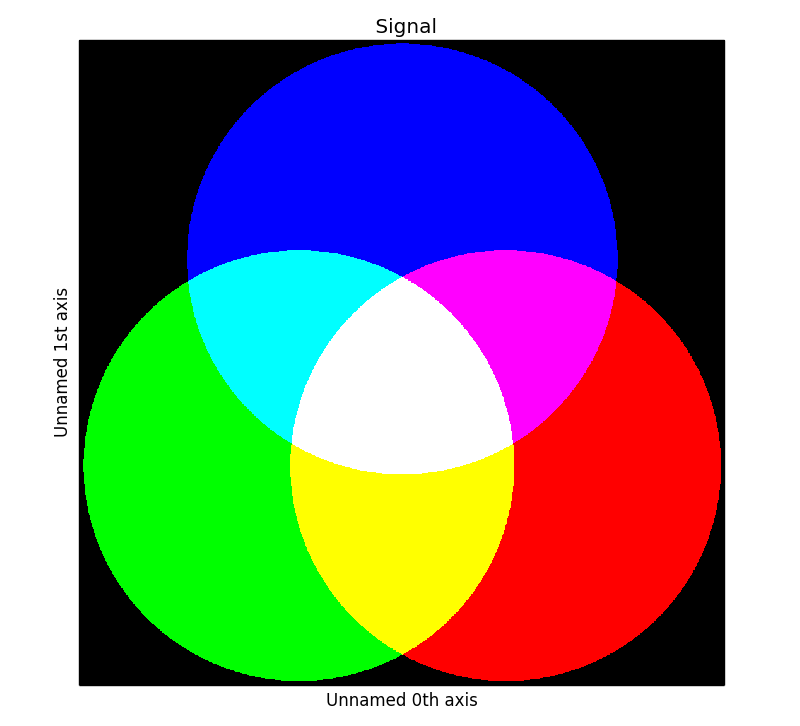

  RGB data type example.

.. _signal.transpose:

Transposing (changing signal spaces)
^^^^^^^^^^^^^^^^^^^^^^^^^^^^^^^^^^^^
.. versionadded:: 1.1

:py:meth:`~.signal.BaseSignal.transpose` method changes how the dataset
dimensions are interpreted (as signal or navigation axes). By default is
swaps the signal and navigation axes. For example:

.. code-block:: python

   >>> s = hs.signals.Signal1D(np.zeros((4,5,6)))
   >>> s
   <Signal1D, title: , dimensions: (5, 4|6)>
   >>> s.transpose()
   <Signal2D, title: , dimensions: (6|4, 5)>

For :py:meth:`~.signal.BaseSignal.T` is a shortcut for the default behaviour:

.. code-block:: python

   >>> s = hs.signals.Signal1D(np.zeros((4,5,6))).T
   <Signal2D, title: , dimensions: (6|4, 5)>

The method accepts both explicit axes to keep in either space, or just a number
of axes required in one space (just one number can be specified, as the other
is defined as "all other axes"). When axes order is not explicitly defined,
they are "rolled" from one space to the other as if the ``<navigation axes |
signal axes >`` wrap a circle. The example below should help clarifying this.

.. code-block:: python

    >>> # just create a signal with many distinct dimensions
    >>> s = hs.signals.BaseSignal(np.random.rand(1,2,3,4,5,6,7,8,9))
    >>> s
    <BaseSignal, title: , dimensions: (|9, 8, 7, 6, 5, 4, 3, 2, 1)>
    >>> s.transpose(signal_axes=5) # roll to leave 5 axes in signal space
    <BaseSignal, title: , dimensions: (4, 3, 2, 1|9, 8, 7, 6, 5)>
    >>> s.transpose(navigation_axes=3) # roll leave 3 axes in navigation space
    <BaseSignal, title: , dimensions: (3, 2, 1|9, 8, 7, 6, 5, 4)>
    >>> # 3 explicitly defined axes in signal space
    >>> s.transpose(signal_axes=[0, 2, 6])
    <BaseSignal, title: , dimensions: (8, 6, 5, 4, 2, 1|9, 7, 3)>
    >>> # A mix of two lists, but specifying all axes explicitly
    >>> # The order of axes is preserved in both lists
    >>> s.transpose(navigation_axes=[1, 2, 3, 4, 5, 8], signal_axes=[0, 6, 7])
    <BaseSignal, title: , dimensions: (8, 7, 6, 5, 4, 1|9, 3, 2)>

A convenience functions :py:func:`~.utils.transpose` is available to operate on
many signals at once, for example enabling plotting any-dimension signals
trivially:

.. code-block:: python

    >>> s2 = hs.signals.BaseSignal(np.random.rand(2, 2)) # 2D signal
    >>> s3 = hs.signals.BaseSignal(np.random.rand(3, 3, 3)) # 3D signal
    >>> s4 = hs.signals.BaseSignal(np.random.rand(4, 4, 4, 4)) # 4D signal
    >>> hs.plot.plot_images(hs.transpose(s2, s3, s4, signal_axes=2))

The :py:meth:`~.signal.BaseSignal.transpose` method accepts keyword argument
``optimize``, which is ``False`` by default, meaning modifying the output
signal data **always modifies the original data** i.e. the data is just a view
of the original data. If ``True``, the method ensures the data in memory is
stored in the most efficient manner for iterating by making a copy of the data
if required, hence modifying the output signal data **not always modifies the
original data**.

The convenience methods :py:meth:`~.signal.BaseSignal.as_signal1D` and
:py:meth:`~.signal.BaseSignal.as_signal2D` internally use
:py:meth:`~.signal.BaseSignal.transpose`, but always optimize the data
for iteration over the navigation axes if required. Hence, these methods do not
always return a view of the original data. If a copy of the data is required
use `:py:meth:`~.signal.BaseSignal.deepcopy` on the output of any of these
methods e.g.:

.. code-block:: python

   >>> hs.signals.Signal1D(np.zeros((4,5,6))).T.deepcopy()
   <Signal2D, title: , dimensions: (6|4, 5)>

Basic statistical analysis
--------------------------
.. versionadded:: 0.7

:py:meth:`~.signal.BaseSignal.get_histogram` computes the histogram and
conveniently returns it as signal instance. It provides methods to
calculate the bins. :py:meth:`~.signal.BaseSignal.print_summary_statistics` prints
the five-number summary statistics of the data.

These two methods can be combined with
:py:meth:`~.signal.BaseSignal.get_current_signal` to compute the histogram or
print the summary statistics of the signal at the current coordinates, e.g:
.. code-block:: python

    >>> s = hs.signals.EELSSpectrum(np.random.normal(size=(10,100)))
    >>> s.print_summary_statistics()
    Summary statistics
    ------------------
    mean:	0.021
    std:	0.957
    min:	-3.991
    Q1:	-0.608
    median:	0.013
    Q3:	0.652
    max:	2.751

    >>> s.get_current_signal().print_summary_statistics()
    Summary statistics
    ------------------
    mean:   -0.019
    std:    0.855
    min:    -2.803
    Q1: -0.451
    median: -0.038
    Q3: 0.484
    max:    1.992

Histogram of different objects can be compared with the functions
:py:func:`~.drawing.utils.plot_histograms` (see
:ref:`visualisation <plot_spectra>` for the plotting options). For example,
with histograms of several random chi-square distributions:

.. code-block:: python

    >>> img = hs.signals.Signal2D([np.random.chisquare(i+1,[100,100]) for i in range(5)])
    >>> hs.plot.plot_histograms(img,legend='auto')

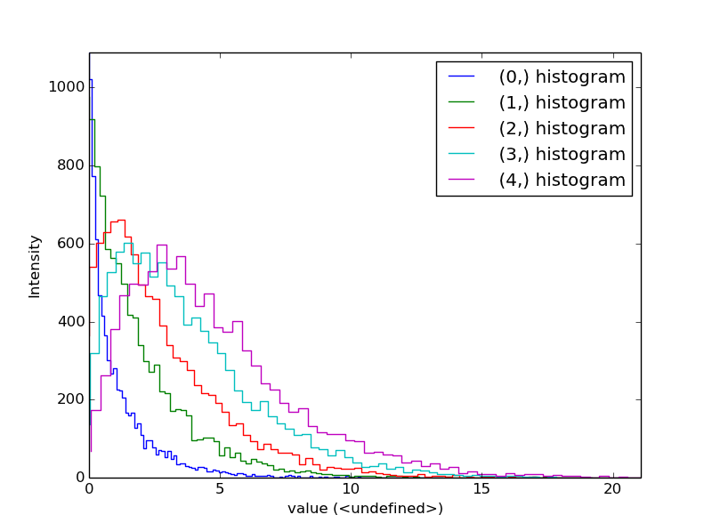

   Comparing histograms.

.. _signal.noise_properties:

Setting the noise properties
----------------------------

Some data operations require the data variance. Those methods use the
``metadata.Signal.Noise_properties.variance`` attribute if it exists. You can
set this attribute as in the following example where we set the variance to be
10:

.. code-block:: python

    s.metadata.Signal.set_item("Noise_properties.variance", 10)

For heterocedastic noise the ``variance`` attribute must be a
:class:`~.signal_base.BaseSignal`.  Poissonian noise is a common case  of
heterocedastic noise where the variance is equal to the expected value. The
:meth:`~.signal_base.BaseSignal.estimate_poissonian_noise_variance`
:class:`~.signal_base.BaseSignal` method can help setting the variance of data with
semi-poissonian noise. With the default arguments, this method simply sets the
variance attribute to the given ``expected_value``. However, more generally
(although then noise is not strictly poissonian), the variance may be proportional
to the expected value. Moreover, when the noise is a mixture of white
(gaussian) and poissonian noise, the variance is described by the following
linear model:

    .. math::

        \mathrm{Var}[X] = (a * \mathrm{E}[X] + b) * c

Where `a` is the ``gain_factor``, `b` is the ``gain_offset`` (the Gaussian
noise variance) and `c` the ``correlation_factor``. The correlation
factor accounts for correlation of adjacent signal elements that can
be modelled as a convolution with a Gaussian point spread function.
:meth:`~.signal.BaseSignal.estimate_poissonian_noise_variance` can be used to set
the noise properties when the variance can be described by this linear model,
for example:

.. code-block:: python

  >>> s = hs.signals.Spectrum(np.ones(100))
  >>> s.add_poissonian_noise()
  >>> s.metadata
  ├── General
  │   └── title =
  └── Signal
      ├── binned = False
      └── signal_type =

  >>> s.estimate_poissonian_noise_variance()
  >>> s.metadata
  ├── General
  │   └── title =
  └── Signal
      ├── Noise_properties
      │   ├── Variance_linear_model
      │   │   ├── correlation_factor = 1
      │   │   ├── gain_factor = 1
      │   │   └── gain_offset = 0
      │   └── variance = <SpectrumSimulation, title: Variance of , dimensions: (|100)>
      ├── binned = False
      └── signal_type =

Speeding up operations
----------------------

.. versionadded:: 1.0

Reusing a Signal for output
^^^^^^^^^^^^^^^^^^^^^^^^^^^

Many signal methods create and return a new signal. For fast operations, the
new signal creation time is non-negligible. Also, when the operation is
repeated many times, for example in a loop, the cumulative creation time can
become significant. Therefore, many operations on
:py:class:`~.signal.BaseSignal` accept an optional argument `out`. If an
existing signal is passed to `out`, the function output will be placed into
that signal, instead of being returned in a new signal.  The following example
shows how to use this feature to slice a :py:class:`~.signal.BaseSignal`. It is
important to know that the :py:class:`~.signal.BaseSignal` instance passed in
the `out` argument must be well-suited for the purpose. Often this means that
it must have the same axes and data shape as the
:py:class:`~.signal.BaseSignal` that would normally be returned by the
operation.

.. code-block:: python

    >>> s = signals.Signal1D(np.arange(10))
    >>> s_sum = s.sum(0)
    >>> s_sum.data
    array(45)
    >>> s.isig[:5].sum(0, out=s_sum)
    >>> s_sum.data
    array(10)
    >>> s_roi = s.isig[:3]
    >>> s_roi
    <Signal1D, title: , dimensions: (|3)>
    >>> s.isig.__getitem__(slice(None, 5), out=s_roi)
    >>> s_roi
    <Signal1D, title: , dimensions: (|5)>

.. _interactive-label:

Interactive operations
----------------------

.. versionadded:: 1.0

The function :py:func:`~.interactive.interactive` ease the task of defining
operations that are automatically updated when an event is triggered. By
default it recomputes the operation when data or the axes of the original
signal changes.

.. code-block:: python

    >>> s = hs.signals.Signal1D(np.arange(10.))
    >>> ssum = hs.interactive(s.sum, axis=0)
    >>> ssum.data
    array(45.0)
    >>> s.data /= 10
    >>> s.events.data_changed.trigger()
    >>> ssum.data
    4.5

The interactive operations can be chained.

.. code-block:: python

    >>> s = hs.signals.Signal1D(np.arange(2 * 3 * 4).reshape((2, 3, 4)))
    >>> ssum = hs.interactive(s.sum, axis=0)
    >>> ssum_mean = hs.interactive(ssum.mean, axis=0)
    >>> ssum_mean.data
    array([ 30.,  33.,  36.,  39.])
    >>> s.data
    array([[[ 0,  1,  2,  3],
            [ 4,  5,  6,  7],
            [ 8,  9, 10, 11]],

           [[12, 13, 14, 15],
            [16, 17, 18, 19],
            [20, 21, 22, 23]]])
    >>> s.data *= 10
    >>> s.events.data_changed.trigger(obj=s)
    >>> ssum_mean.data
    array([ 300.,  330.,  360.,  390.])

.. _roi-label:

Region Of Interest (ROI)
------------------------

.. versionadded:: 1.0

A number of different ROIs are available:

* :py:class:`~.roi.Point1DROI`
* :py:class:`~.roi.Point2DROI`
* :py:class:`~.roi.SpanROI`
* :py:class:`~.roi.RectangularROI`
* :py:class:`~.roi.CircleROI`
* :py:class:`~.roi.Line2DROI`

Once created, a ROI can be used to return a part of any compatible signal:

.. code-block:: python

    >>> s = hs.signals.Signal1D(np.arange(2000).reshape((20,10,10)))
    >>> im = hs.signals.Signal2D(np.arange(100).reshape((10,10)))
    >>> roi = hs.roi.RectangularROI(left=3, right=7, top=2, bottom=5)
    >>> sr = roi(s)
    >>> sr
    <Signal1D, title: , dimensions: (4, 3|10)>
    >>> imr = roi(im)
    >>> imr
    <Signal2D, title: , dimensions: (|4, 3)>

ROIs can also be used :ref:`interactively <interactive-label>` with widgets. The
following examples shows how to interactively apply ROIs to an image. Note
that *it is necessary* to plot the signal onto which the widgets will be
added before calling :py:meth:`~.roi.BaseInteractiveROI.interactive`.

.. code-block:: python

    >>> import scipy.misc
    >>> im = hs.signals.Signal2D(scipy.misc.ascent())
    >>> rectangular_roi = hs.roi.RectangularROI(left=30, right=500, top=200, bottom=400)
    >>> line_roi = hs.roi.Line2DROI(0, 0, 512, 512, 1)
    >>> point_roi = hs.roi.Point2DROI(256, 256)
    >>> im.plot()
    >>> roi2D = rectangular_roi.interactive(im, color="blue")
    >>> roi1D = line_roi.interactive(im, color="yellow")
    >>> roi0D = point_roi.interactive(im, color="red")

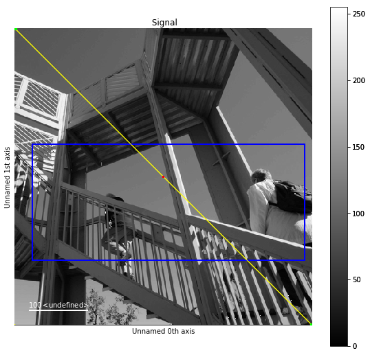

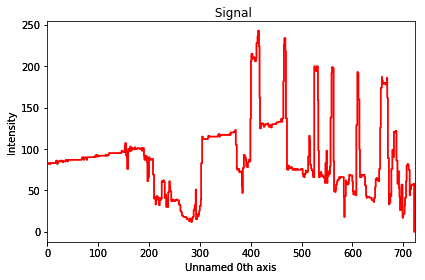

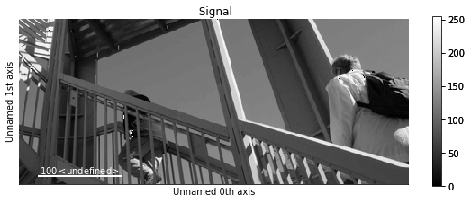

Notably,
since ROIs are independent from the signals they sub-select, the widget can be
plotted on a different signal altogether.

.. code-block:: python

    >>> import scipy.misc
    >>> im = hs.signals.Signal2D(scipy.misc.ascent())
    >>> s = hs.signals.Signal1D(np.random.rand(512, 512, 512))
    >>> roi = hs.roi.RectangularROI(left=30, right=77, top=20, bottom=50)
    >>> s.plot() # plot signal to have where to display the widget
    >>> imr = roi.interactive(im, navigation_signal=s, color="red")
    >>> roi(im).plot()

ROIs are implemented in terms of physical coordinates and not pixels, so with
proper calibration will always point to the same region.

.. figure::  images/random_image_with_rect_roi.png
  :align:   center
  :width:   500

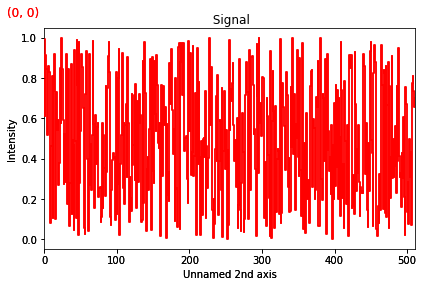

And of course, as all interactive operations, interactive ROIs are chainable.
The following example shows how to display interactively the histogram of a
rectangular ROI. Notice how we customise the default event connections in
order to increase responsiveness.

.. code-block:: python

   >>> import scipy.misc
   >>> im = hs.signals.Signal2D(scipy.misc.ascent())
   >>> im.plot()
   >>> roi = hs.roi.RectangularROI(left=30, right=500, top=200, bottom=400)
   >>> im_roi = roi.interactive(im, color="red")
   >>> roi_hist =hs.interactive(im_roi.get_histogram, event=im_roi.axes_manager.events.any_axis_changed, recompute_out_event=None)
   >>> roi_hist.plot()

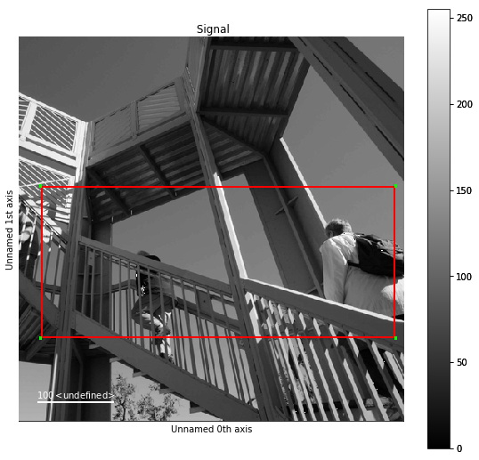

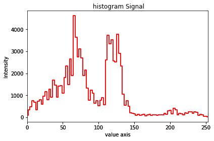

.. _complex_data-label:

Handling complex data
---------------------

The HyperSpy :py:class:`~.hyperspy.signals.ComplexSignal` signal class and its subclasses
for 1-dimensional and 2-dimensional data allow the user to access complex properties like the
`real` and `imag` parts of the data or the `amplitude` (also known as the modulus) and `phase`
(also known as angle or argument) directly. Getting and setting those properties can be done
as follows:

.. code-block:: python

  >>> real = s.real      # real is a new HyperSpy signal accessing the same data
  >>> s.real = new_real  # new_real can be an array or signal
  >>> imag = s.imag      # imag  is a new HyperSpy signal accessing the same data
  >>> s.imag = new_imag  # new_imag can be an array or signal

It is important to note that `data` passed to the constructor of a
:py:class:`~._signals.complex_signal.ComplexSignal` (or to a subclass), which is not already
complex, will be converted to the numpy standard of `np.complex`/`np.complex128`. `data` which
is already complex will be passed as is.

To transform a real signal into a complex one use:

.. code-block:: python

    >>> s.change_dtype(complex)

Changing the `dtype` of a complex signal to something real is not clearly defined and thus not
directly possible. Use the `real`, `imag`, `amplitude` or `phase` properties instead to extract
the real data that is desired.

Calculate the angle / phase / argument
^^^^^^^^^^^^^^^^^^^^^^^^^^^^^^^^^^^^^^

The :py:func:`~hyperspy.signals.ComplexSignal.angle` function can be used to calculate the
angle, which is equivalent to using the `phase` property if no argument is used. If the data is
real, the angle will be 0 for positive values and 2$\pi$ for negative values. If the `deg`
parameter is set to `True`, the result will be given in degrees, otherwise in rad (default).
The underlying function is the :py:func:`~numpy.angle` function.
:py:func:`~hyperspy.signals.ComplexSignal.angle` will return an appropriate HyperSpy signal.

Phase unwrapping
^^^^^^^^^^^^^^^^

With the :py:func:`~hyperspy.signals.ComplexSignal.unwrapped_phase` method the complex phase
of a signal can be unwrapped and returned as a new signal. The underlying method is
:py:func:`~skimage.restoration.unwrap`, which uses the algorithm described in:
Miguel Arevallilo Herraez, David R. Burton, Michael J. Lalor, and Munther A. Gdeisat,
“Fast two-dimensional phase-unwrapping algorithm based on sorting by reliability following
a noncontinuous path”, Journal Applied Optics, Vol. 41, No. 35, pp. 7437, 2002.
(doi: 10.1364/AO.41.007437).

Add a linear phase ramp
^^^^^^^^^^^^^^^^^^^^^^^

For 2-dimensional complex images, a linear phase ramp can be added to the signal via the
:py:func:`~._signals.complex_signal2d.ComplexSignal2D.add_phase_ramp` method. The parameters
`ramp_x` and `ramp_y` dictate the slope of the ramp in `x`- and `y` direction, while the offset
is determined by the `offset` parameter. The fulcrum of the linear ramp is at the origin
and the slopes are given in units of the axis with the according scale taken into account.
Both are available via the :py:class:`~.axes.AxesManager` of the signal.
