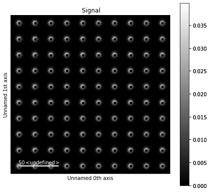
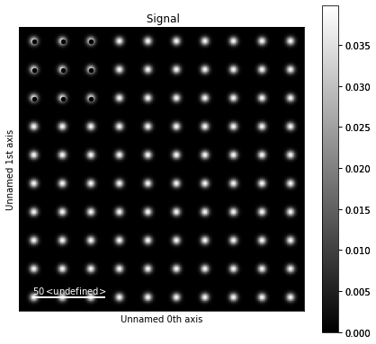

Vector Signal Tools
*******************

.. versionadded:: 2.0
    BaseVectorSignal class was added to extend the functionality of ragged signals

The methods described in this section are only available for vector signals
signals in the :py:class:`~._signals.vector_signal.BaseVectorSignal`. class.

The Vector class is a new class added in version 2.0 which is designed to store data which
is organized as a collection of vectors of some length. These arrays are ragged, such
that they can have arbitrary length but constant width.  Vectors in hyperspy usually
represent pixel positions related to some Signal.  Like Signals, they can have signal dimensions
return

This class is designed to be extendable and closely integrated with methods
in `sklearn` or other packages with advanced tools for vector characterization.

The :py:method:`~._signals.vector_signal.BaseVectorSignal.cluster` is designed to take
some `ClusterMixin <https://scikit-learn.org/stable/modules/generated/sklearn.base.ClusterMixin.html#sklearn.base.ClusterMixin>`
object which has a method `fit_predict` which returns a set of labels. More information on the
methods available is available `here <https://scikit-learn.org/stable/modules/clustering.html>

Using a Vector Signal
*********************

One of the main uses of a vector signal are finding peaks within some dataset. This method
is great to pair with the find_peaks method or some other workflow which returns a ragged
set of data.

For very large datasets, we suggest peak finding as a good way to easily share and present large
datasets.  Each raw vector dataset can be easily shared and downloaded allowing for easy to follow
workflows.

.. code-block:: python

    import hyperspy.api as hs
    s = hs.datasets.artificial_data.get_atomic_resolution_tem_signal2d()
    peaks = s.find_peaks(method="local_max", threshold_abs=.01, interactive=False)
    peaks = hs.signals.BaseVectorSignal(peaks)
    m = peaks.to_markers()

    s.plot()
    s.add_marker(m)

Operations like slicing also are available for vector signals.  This is different than how ragged signals
work. For example we can take only the vectors from 0:50 using the example below.

.. code-block:: python

    new_p = peaks.isig[0:50,0:50]
    m = new_p.to_markers()
    p.plot()
    p.add_marker(m, plot_signal=True)

