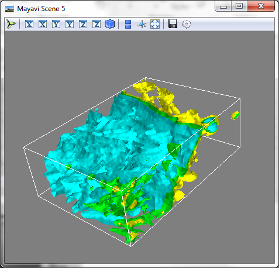
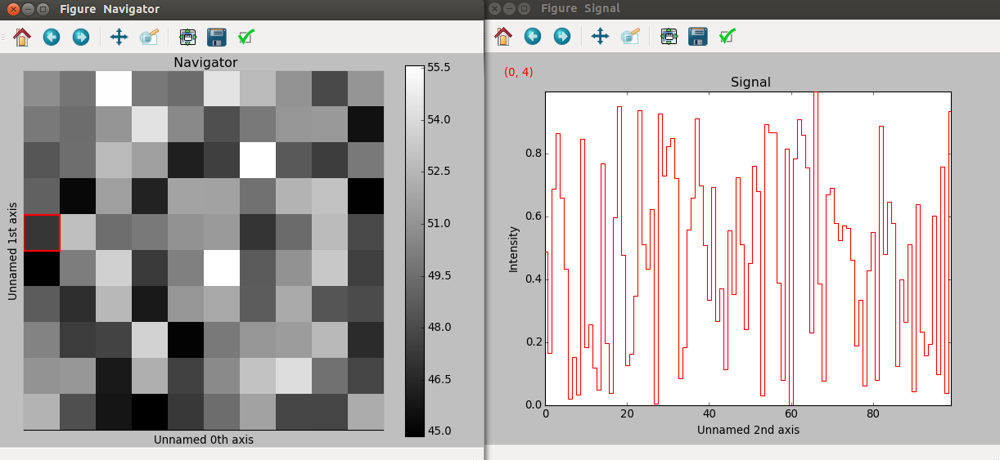
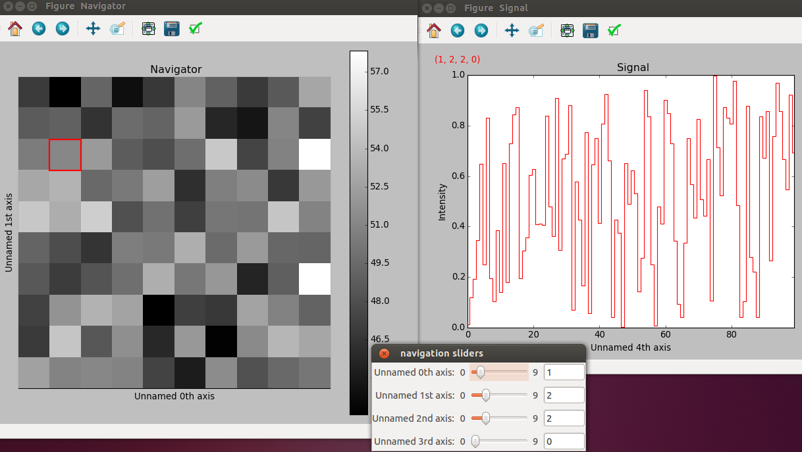
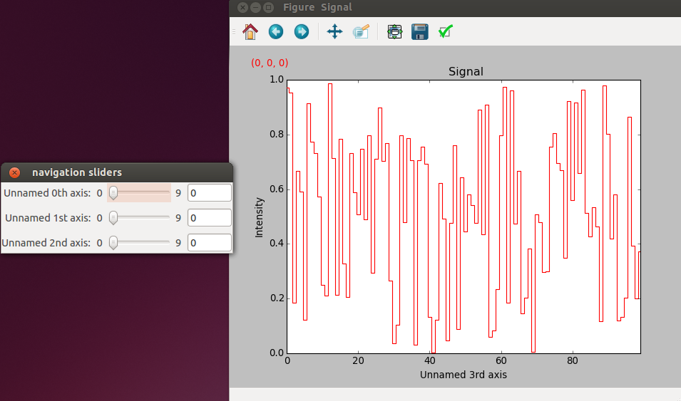
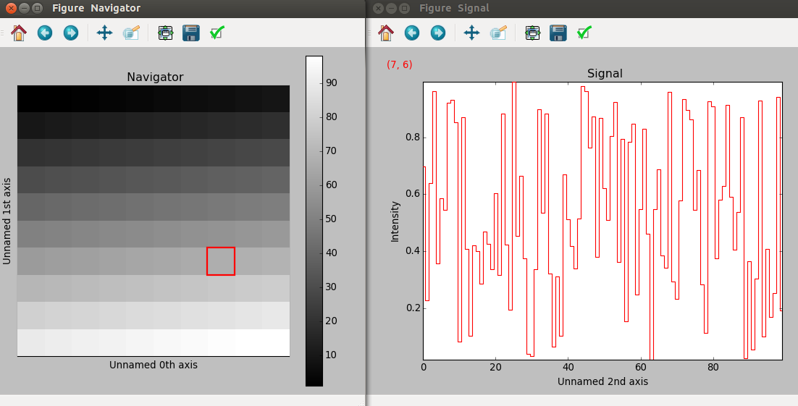

.. _visualization-label:

Visualisation of multi-dimensional data
****************************************

With the aim to ease the data analysis of multidimensionnal data, Hyperspy provides
a powerful and flexible :py:meth:`~.signal.Signal.plot` method to visualize 
n-dimensional data. In this chapter, the visualisation of data of 3 or more dimensions is exemplified with a image stack and a 4D hyperspectrum obtained by recording two signals in
parallele in a FIB/SEM: the intensity of the secondary electron emission (SE image) and the X-ray spectrum (EDS map).

The plot() function
-------------------

The visualisation with :py:meth:`~.signal.Signal.plot` of 1D and 2D signal
is given in :ref:`getting started <getting-help-label>`. Further options
are shown here.

Stack of images
^^^^^^^^^^^^^^^

Stack of 2D images can be imported as an 3D image and plotted with a slider.

.. code-block:: python

    >>> img = load('image*.tif', stack=True)
    >>> img.plot(navigator="slider")
    
    
.. figure::  images/3D_image.png
   :align:   center
   :width:   500    

   Visualisation of a 3D image with a slider.   
   
Spectrum images
^^^^^^^^^^^^^^

A stack of 2D spectrum images can be imported as a 3D spectrum image and plotted 
with sliders.

.. code-block:: python

    >>> spec = load('spectrum_image*.tif', stack=True)
    >>> spec.plot()
    
    
.. figure::  images/3D_spectrum.png
   :align:   center
   :width:   650    

   Visualisation of a 3D spectrum image with sliders.
   
If the 3D images has the same spatial dimension as the 3D spectrum image,
it can be used as an external signal for the navigator.
   
   
.. code-block:: python

    >>> spec.plot(navigator=img)    
    
.. figure::  images/3D_spectrum_external.png
   :align:   center
   :width:   650    

   Visualisation of a 3D spectrum image. The navigator is an external signal.
   
Stack of spectral images
^^^^^^^^^^^^^^^^^^^^^^^^

The 3D spectrum image can be transformed in a stack of spectral images for 
an alternative display.

.. code-block:: python

    >>> imgSpec = spec.to_image((0, 1))
    >>> imgSpec.plot(navigator='spectrum')
    
    
.. figure::  images/3D_image_spectrum.png
   :align:   center
   :width:   650    

   Visualisation of a stack of 2D spectral images.
   
An external signal (e.g. a spectrum) can be used as a navigator, for example 
the "maximum spectrum" for which each channel is the maximum of all pixels. 

.. code-block:: python

    >>> specMax = spec.max(0).max(0).max(0)
    >>> imgSpec.plot(navigator=specMax)
    
    
.. figure::  images/3D_image_spectrum_external.png
   :align:   center
   :width:   650    

   Visualisation of a stack of 2D spectral images. 
   The navigator is the "maximum spectrum".

Using Mayavi to visualize 3D data
---------------------------------

Although Hyperspy does not currently support plotting when signal_dimension 
is greater than 2, `Mayavi <http://docs.enthought.com/mayavi/mayavi/>`_ 
can be used for this purpose.

In the following example we also use `scikit-image <http://scikit-image.org/>`_ for noise reduction: 

.. code-block:: python

    >>> #Import packages
    >>> from skimage import filter
    >>> from mayavi import mlab
    >>> #Generate the X-ray intensity map of Nickel L alpha
    >>> NiMap = specImg3Dc.get_intensity_map(['Ni_La'])[0]
    >>> #Reduce the noise
    >>> NiMapDenoise = filter.tv_denoise(NiMap.data)
    >>> #Plot isosurfaces
    >>> mlab.contour3d(NiMapDenoise)
    >>> mlab.outline()
        
    

   Visualisation of isosurfaces with mayavi.
   
.. NOTE::

    The sample and the data used in this chapter are described in 
    P. Burdet, `et al.`, Acta Materialia, 61, p. 3090-3098 (2013) (see
    `abstract <http://infoscience.epfl.ch/record/185861/>`_).

Comparing spectra
-----------------

.. versionadded:: 0.7

:py:meth:`~.utils.plot.plot_spectra()` is used to plot several spectra in the same figure, which
can make it easier to compare them. For example to see changes in EELS fine structure over 
a line scan. 
To plot a cascade style figure from a spectrum, and saving it in a file:

.. code-block:: python

    >>> s = signals.Spectrum(np.random.random((6,1000)), stack=True)
    >>> cascade_plot = utils.plot.plot_spectra(s, padding=1)
    >>> cascade_plot.figure.savefig("cascade_plot.png")

.. figure::  images/plot_spectra_cascade.png
  :align:   center
  :width:   500    

A padding value of 1 keeps the individual plots from overlapping. However in most cases
a lower padding value can be used, to get tighter plots.

Using the color argument one can assign a color to all the spectrums, or specific colors
for each spectrum. In the same way, one can also assign the line style. 
On can also give a legend:

.. code-block:: python

    >>> color_list = ['red', 'red', 'blue', 'blue', 'red', 'red']
    >>> line_style_list = ['-','--','steps','-.',':','-']
    >>> legend_list = ['a', 'b', 'c', 'd', 'e', 'f']
    >>> utils.plot.plot_spectra(s, padding=1, color=color_list,
    >>> line_style=line_style_list,legend=legend_list)

.. figure::  images/plot_spectra_color.png
  :align:   center
  :width:   500    

There are also two other styles, heatmap and mosaic:

.. code-block:: python

    >>> utils.plot.plot_spectra(s, style='heatmap')

.. figure::  images/plot_spectra_heatmap.png
  :align:   center
  :width:   500    

.. code-block:: python

    >>> s = signals.Spectrum(np.random.random((2,1000)), stack=True)
    >>> utils.plot.plot_spectra(s, style='mosaic')
    
.. figure::  images/plot_spectra_mosaic.png
  :align:   center
  :width:   500    

The function returns a matplotlib ax object, which can be used to customize the figure:

.. code-block:: python

    >>> s = signals.Spectrum(np.random.random((6,1000)), stack=True)
    >>> cascade_plot = utils.plot.plot_spectra(s)
    >>> cascade_plot.set_xlabel("An axis")
    >>> cascade_plot.set_ylabel("Another axis")
    >>> cascade_plot.set_title("A title!")
    >>> plt.draw()

.. figure::  images/plot_spectra_customize.png
  :align:   center
  :width:   500    

Plotting signals with different navigators 
^^^^^^^^^^^^^^^^^^^^^^^^^^^^^^^^^^^^^^^^^^

Using :py:meth:`~.plot()` one can a plot signal using different navigators.
To plot a signal with 2 navigation dimensions and 1 signal dimension (a spectral image):

.. code-block:: python

    >>> s = signals.Spectrum(np.random.random(10000).reshape(10,10,100))
    >>> s.plot(navigator="auto")

Where each point in the image is a sum over spectrum at that point. This option
is the default one, so:

    >>> s.plot()

Is equivalent. 

If the signal has more than 2 navigation dimensions sliders will be provided, in
addition to the image shown earlier.

The signal can also be plotted with only sliders as navigators:

.. code-block:: python

    >>> s = signals.Spectrum(np.random.random(100000).reshape(10,10,10,100))
    >>> s.plot(navigator="slider")

An image can also be used as navigator, if the image has the same navigation
dimensions as the signal:

.. code-block:: python

    >>> s = signals.Spectrum(np.random.random(10000).reshape(10,10,100))
    >>> s1 = signals.Image(np.arange(100).reshape(10,10))
    >>> s.plot(navigator=s1)

The navigator can also be a spectrum, which if the signal has more than
1 navigation dimension will also provide a slider (as for navigator="auto"):

.. code-block:: python

    >>> s = signals.Spectrum(np.random.random(10000).reshape(10,10,100))
    >>> s.plot(navigator="spectrum")

.. figure::  images/plot_navigator_spectrum.png
  :align:   center
  :width:   500    

Lastly, if no navigator is needed use navigator=None:

.. code-block:: python

    >>> s = signals.Spectrum(np.random.random(10000).reshape(10,10,100))
    >>> s.plot(navigator=None)
