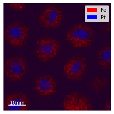
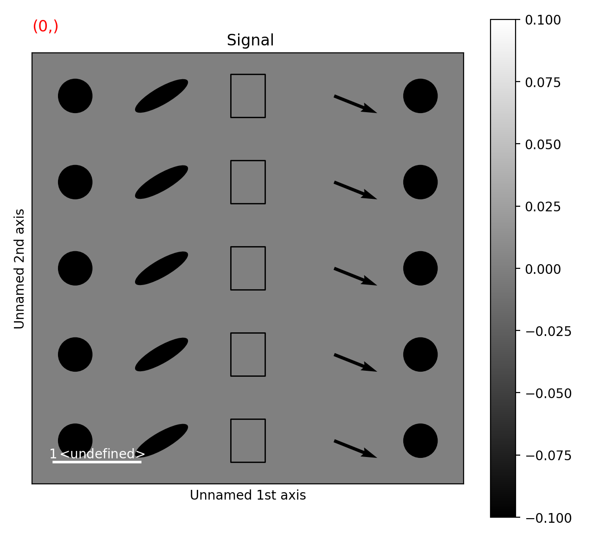

.. _visualization-label:

Data visualization
******************

The object returned by :func:`~.api.load`, a :class:`~.api.signals.BaseSignal`
instance, has a :meth:`~.api.signals.BaseSignal.plot` method that is powerful and
flexible to visualize n-dimensional data. In this chapter, the
visualisation of multidimensional data is exemplified with two experimental
datasets: an EELS spectrum image and an EDX dataset consisting of a secondary
electron emission image stack and a 3D hyperspectral image, both simultaneously
acquired by recording two signals in parallel in a FIB/SEM.

.. code-block:: python

    >>> s = hs.load('YourDataFilenameHere') # doctest: +SKIP
    >>> s.plot() # doctest: +SKIP

if the object is single spectrum or an image one window will appear when
calling the plot method.

.. _visualization_md:

Multidimensional spectral data
==============================

If the object is a 1D or 2D spectrum-image (i.e. with 2 or 3 dimensions when
including energy) two figures will appear, one containing a plot of the
spectrum at the current coordinates and the other an image of the data summed
over its spectral dimension if 2D or an image with the spectral dimension in
the x-axis if 1D:

.. _2d_SI:

.. figure::  images/2D_SI.png
   :align:   center
   :width:   500

   Visualisation of a 2D spectrum image.

.. _1d_SI:

.. figure::  images/1D_SI.png
   :align:   center
   :width:   500

   Visualisation of a 1D spectrum image.

.. versionadded:: 1.4
   Customizable keyboard shortcuts to navigate multi-dimensional datasets.

To change the current coordinates, click on the pointer (which will be a line
or a square depending on the dimensions of the data) and drag it around. It is
also possible to move the pointer by using the numpad arrows **when numlock is
on and the spectrum or navigator figure is selected**. When using the numpad
arrows the PageUp and PageDown keys change the size of the step.

The current coordinates can be either set by navigating the
:meth:`~.api.signals.BaseSignal.plot`, or specified by pixel indices
in ``s.axes_manager.indices`` or as calibrated coordinates in
``s.axes_manager.coordinates``.

An extra cursor can be added by pressing the ``e`` key. Pressing ``e`` once
more will disable the extra cursor:

In matplotlib, left and right arrow keys are by default set to navigate the
"zoom" history. To avoid the problem of changing zoom while navigating,
``Ctrl`` + arrows can be used instead. Navigating without using the modifier keys
will be deprecated in version 2.0.

To navigate navigation dimensions larger than 2, modifier keys can be used.
The defaults are ``Shift`` + ``left``/``right`` and ``Shift`` + ``up``/``down``,
(``Alt`` + ``left``/``right`` and ``Alt`` + ``up``/``down``)
for navigating dimensions 2 and 3 (4 and 5) respectively. Modifier keys do not work with the numpad.

Hotkeys and modifier keys for navigating the plot can be set in the
:ref:`HyperSpy plot preferences <configuring-hyperspy-label>`.
Note that some combinations will not work for all platforms, as some systems reserve them for
other purposes.

If you want to jump to some point in the dataset.  In that case you can hold the ``Shift`` key
and click the point you are interested in.  That will automatically take you to that point in the
data.  This also helps with lazy data as you don't have to load every chunk in between.

.. figure::  images/second_pointer.png
   :align:   center
   :width:   500

   Visualisation of a 2D spectrum image using two pointers.

Sometimes the default size of the rectangular cursors used to navigate images
can be too small to be dragged or even seen. It
is possible to change the size of the cursors by pressing the ``+`` and ``-``
keys  **when the navigator window is selected**.

The following keyboard shortcuts are available when the 1D signal figure is in focus:

.. table:: Keyboard shortcuts available on the signal figure of 1D signal data

    =======================   =============================
    key                       function
    =======================   =============================
    e                         Switch second pointer on/off
    Ctrl + Arrows             Change coordinates for dimensions 0 and 1 (typically x and y)
    Shift + Arrows            Change coordinates for dimensions 2 and 3
    Alt + Arrows              Change coordinates for dimensions 4 and 5
    PageUp                    Increase step size
    PageDown                  Decrease step size
    ``+``                     Increase pointer size when the navigator is an image
    ``-``                     Decrease pointer size when the navigator is an image
    ``l``                     switch the scale of the y-axis between logarithmic and linear
    =======================   =============================

To close all the figures run the following command:

.. code-block:: python

    >>> import matplotlib.pyplot as plt
    >>> plt.close('all')

.. NOTE::

    ``plt.close('all')`` is a `matplotlib <https://matplotlib.org/>`_ command.
    Matplotlib is the library that HyperSpy uses to produce the plots. You can
    learn how to pan/zoom and more  `in the matplotlib documentation
    <https://matplotlib.org/stable/users/explain/interactive.html>`_

.. NOTE::

    Plotting ``float16`` images is currently not supported by matplotlib; however, it is
    possible to convert the type of the data by using the
    :meth:`~.api.signals.BaseSignal.change_dtype` method, e.g. ``s.change_dtype('float32')``.

Multidimensional image data
===========================

Equivalently, if the object is a 1D or 2D image stack two figures will appear,
one containing a plot of the image at the current coordinates and the other
a spectrum or an image obtained by summing over the image dimensions:

.. _1D_image_stack.png:

.. figure::  images/1D_image_stack.png
   :align:   center
   :width:   500

   Visualisation of a 1D image stack.

.. _2D_image_stack.png:

.. figure::  images/2D_image_stack.png
   :align:   center
   :width:   500

   Visualisation of a 2D image stack.

.. versionadded:: 1.4
   ``l`` keyboard shortcut

The following keyboard shortcuts are availalbe when the 2D signal figure is in focus:

.. table:: Keyboard shortcuts available on the signal figure of 2D signal data

    =======================   =============================
    key                       function
    =======================   =============================
    Ctrl + Arrows             Change coordinates for dimensions 0 and 1 (typically x and y)
    Shift + Arrows            Change coordinates for dimensions 2 and 3
    Alt + Arrows              Change coordinates for dimensions 4 and 5
    PageUp                    Increase step size
    PageDown                  Decrease step size
    ``+``                     Increase pointer size when the navigator is an image
    ``-``                     Decrease pointer size when the navigator is an image
    ``h``                     Launch the contrast adjustment tool
    ``l``                     switch the norm of the intensity between logarithmic and linear
    =======================   =============================

.. _plot.customize_images:

Customising image plot
======================

The image plot can be customised by passing additional arguments when plotting.
Colorbar, scalebar and contrast controls are HyperSpy-specific, however
:meth:`matplotlib.axes.Axes.imshow` arguments are supported as well:

.. code-block:: python

    >>> import scipy
    >>> img = hs.signals.Signal2D(scipy.datasets.ascent())
    >>> img.plot(colorbar=True, scalebar=False, axes_ticks=True, cmap='RdYlBu_r')

.. figure::  images/custom_cmap.png
   :align:   center
   :width:   500

   Custom colormap and switched off scalebar in an image.

.. versionadded:: 1.4
   ``norm`` keyword argument

The ``norm`` keyword argument can be used to select between linear, logarithmic
or custom (using a matplotlib norm) intensity scale. The default, "auto",
automatically selects a logarithmic scale when plotting a power spectrum.

.. versionadded:: 1.6
   ``autoscale`` keyword argument

The ``autoscale`` keyword argument can be used to specify which axis limits are
reset when the data or navigation indices change. It can take any combinations
of the following characters:

* ``'x'``: to reset the horizontal axes
* ``'y'``: to reset the vertical axes
* ``'v'``: to reset the contrast of the image  according to ``vmin`` and ``vmax``

By default (``autoscale='v'``), only the contrast of the image will be reset
automatically. For example, to reset the extent of the image (x and y) to their
maxima but not the contrast, use ``autoscale='xy'``; To reset all limits,
including the contrast of the image, use ``autoscale='xyv'``:

.. code-block:: python

    >>> import numpy as np
    >>> img = hs.signals.Signal2D(np.arange(10*10*10).reshape(10, 10, 10))
    >>> img.plot(autoscale='xyv')

.. _plot.divergent_colormaps-label:

When plotting using divergent colormaps, if ``centre_colormap`` is ``True``
(default) the contrast is automatically adjusted so that zero corresponds to
the center of the colormap (usually white). This can be useful e.g. when
displaying images that contain pixels with both positive and negative values.

The following example shows the effect of centring the color map:

.. code-block:: python

    >>> x = np.linspace(-2 * np.pi, 2 * np.pi, 128)
    >>> xx, yy = np.meshgrid(x, x)
    >>> data1 = np.sin(xx * yy)
    >>> data2 = data1.copy()
    >>> data2[data2 < 0] /= 4
    >>> im = hs.signals.Signal2D([data1, data2])
    >>> hs.plot.plot_images(im, cmap="RdBu", tight_layout=True)
    [<Axes: title={'center': ' (0,)'}>, <Axes: title={'center': ' (1,)'}>]

.. figure::  images/divergent_cmap.png
   :align:   center
   :width:   500

   Divergent color map with ``Centre colormap`` enabled (default).

The same example with the feature disabled:

.. code-block:: python

    >>> x = np.linspace(-2 * np.pi, 2 * np.pi, 128)
    >>> xx, yy = np.meshgrid(x, x)
    >>> data1 = np.sin(xx * yy)
    >>> data2 = data1.copy()
    >>> data2[data2 < 0] /= 4
    >>> im = hs.signals.Signal2D([data1, data2])
    >>> hs.plot.plot_images(im, centre_colormap=False, cmap="RdBu", tight_layout=True)
    [<Axes: title={'center': ' (0,)'}>, <Axes: title={'center': ' (1,)'}>]

.. figure::  images/divergent_cmap_no_centre.png
   :align:   center
   :width:   500

   Divergent color map with ``centre_colormap`` disabled.

.. _plot.customize_navigator:

.. versionadded:: 2.0.0
   ``plot_style`` keyword argument to allow for "horizontal" or "vertical" alignment of subplots (e.g. navigator
   and signal) when using the `ipympl` or `widget` backends. A default value can also be set using the
   :ref:`HyperSpy plot preferences <configuring-hyperspy-label>`.

Customizing the "navigator"
===========================

.. versionadded:: 1.1.2
   Passing keyword arguments to the navigator plot.

The navigator can be customised by using the ``navigator_kwds`` argument. For
example, in case of a image navigator, all image plot arguments mentioned in
the section :ref:`plot.customize_images` can be passed as a dictionary to the
``navigator_kwds`` argument:

.. code-block:: python

    >>> import numpy as np
    >>> import scipy
    >>> im = hs.signals.Signal2D(scipy.datasets.ascent())
    >>> ims = hs.signals.BaseSignal(np.random.rand(15,13)).T * im
    >>> ims.metadata.General.title = 'My Images'
    >>> ims.plot(colorbar=False,
    ...          scalebar=False,
    ...          axes_ticks=False,
    ...          cmap='viridis',
    ...          navigator_kwds=dict(colorbar=True,
    ...                              scalebar_color='red',
    ...                              cmap='Blues',
    ...                              axes_ticks=False)
    ...          )

.. figure::  images/custom_nav_opts.png
   :align:   center
   :height:   250

   Custom different options for both signal and navigator image plots

Data files used in the following examples can be downloaded using

.. code-block:: python

    >>> #Download the data (130MB)
    >>> from urllib.request import urlretrieve, urlopen # doctest: +SKIP
    >>> from zipfile import ZipFile # doctest: +SKIP
    >>> files = urlretrieve("https://www.dropbox.com/s/s7cx92mfh2zvt3x/"
    ...                     "HyperSpy_demos_EDX_SEM_files.zip?raw=1",
    ...                     "./HyperSpy_demos_EDX_SEM_files.zip") # doctest: +SKIP
    >>> with ZipFile("HyperSpy_demos_EDX_SEM_files.zip") as z: # doctest: +SKIP
    ...     z.extractall()

.. NOTE::
    See also the
    `SEM EDS tutorials <https://nbviewer.org/github/hyperspy/hyperspy-demos/tree/main/electron_microscopy/EDS/>`_ .

.. NOTE::

    The sample and the data used in this chapter are described in
    :ref:`[Burdet2013] <[Burdet2013]>`.

Stack of 2D images can be imported as an 3D image and plotted with a slider
instead of the 2D navigator as in the previous example.

.. code-block:: python

    >>> img = hs.load('Ni_superalloy_0*.tif', stack=True) # doctest: +SKIP
    >>> img.plot(navigator='slider') # doctest: +SKIP

.. figure::  images/3D_image.png
   :align:   center
   :width:   500

   Visualisation of a 3D image with a slider.

A stack of 2D spectrum images can be imported as a 3D spectrum image and
plotted with sliders.

.. code-block:: python

    >>> s = hs.load('Ni_superalloy_0*.rpl', stack=True).as_signal1D(0) # doctest: +SKIP
    >>> s.plot() # doctest: +SKIP

.. figure::  images/3D_spectrum.png
   :align:   center
   :width:   650

   Visualisation of a 3D spectrum image with sliders.

If the 3D images has the same spatial dimension as the 3D spectrum image, it
can be used as an external signal for the navigator.

.. code-block:: python

    >>> im = hs.load('Ni_superalloy_0*.tif', stack=True) # doctest: +SKIP
    >>> s = hs.load('Ni_superalloy_0*.rpl', stack=True).as_signal1D(0) # doctest: +SKIP
    >>> dim = s.axes_manager.navigation_shape # doctest: +SKIP
    
    Rebin the image
    
    >>> im = im.rebin([dim[2], dim[0], dim[1]]) # doctest: +SKIP
    >>> s.plot(navigator=im) # doctest: +SKIP

.. figure::  images/3D_spectrum_external.png
   :align:   center
   :width:   650

   Visualisation of a 3D spectrum image. The navigator is an external signal.

The 3D spectrum image can be transformed in a stack of spectral images for an
alternative display.

.. code-block:: python

    >>> imgSpec = hs.load('Ni_superalloy_0*.rpl', stack=True) # doctest: +SKIP
    >>> imgSpec.plot(navigator='spectrum') # doctest: +SKIP

.. figure::  images/3D_image_spectrum.png
   :align:   center
   :width:   650

   Visualisation of a stack of 2D spectral images.

An external signal (e.g. a spectrum) can be used as a navigator, for example
the "maximum spectrum" for which each channel is the maximum of all pixels.

.. code-block:: python

    >>> imgSpec = hs.load('Ni_superalloy_0*.rpl', stack=True) # doctest: +SKIP
    >>> specMax = imgSpec.max(-1).max(-1).max(-1).as_signal1D(0) # doctest: +SKIP
    >>> imgSpec.plot(navigator=specMax) # doctest: +SKIP

.. figure::  images/3D_image_spectrum_external.png
   :align:   center
   :width:   650

   Visualisation of a stack of 2D spectral images.
   The navigator is the "maximum spectrum".

Lastly, if no navigator is needed, "navigator=None" can be used.

.. _visualization_3D_EDS-label:

Using Mayavi to visualize 3D data
=================================

Data files used in the following examples can be downloaded using

.. code-block:: python

    >>> from urllib.request import urlretrieve # doctest: +SKIP
    >>> url = 'http://cook.msm.cam.ac.uk/~hyperspy/EDS_tutorial/' # doctest: +SKIP
    >>> urlretrieve(url + 'Ni_La_intensity.hdf5', 'Ni_La_intensity.hdf5') # doctest: +SKIP

.. NOTE::
    See also the
    `EDS tutorials <https://nbviewer.org/github/hyperspy/hyperspy-demos/tree/main/electron_microscopy/EDS/>`_ .

Although HyperSpy does not currently support plotting when signal_dimension is
greater than 2, `Mayavi <https://docs.enthought.com/mayavi/mayavi/>`_ can be
used for this purpose.

In the following example we also use `scikit-image <https://scikit-image.org/>`_
for noise reduction. More details about
:meth:`exspy.signals.EDSSpectrum.get_lines_intensity` method can be
found in :external+exspy:ref:`EDS lines intensity<get_lines_intensity>`.

.. code-block:: python

    >>> from mayavi import mlab # doctest: +SKIP
    >>> ni = hs.load('Ni_La_intensity.hdf5') # doctest: +SKIP
    >>> mlab.figure() # doctest: +SKIP
    >>> mlab.contour3d(ni.data, contours=[85]) # doctest: +SKIP
    >>> mlab.outline(color=(0, 0, 0)) # doctest: +SKIP

.. figure::  images/plot_3D_mayavi.png
   :align:   center
   :width:   400

   Visualisation of isosurfaces with mayavi.

.. NOTE::
    See also the
    `SEM EDS tutorials <https://nbviewer.org/github/hyperspy/hyperspy-demos/tree/main/electron_microscopy/EDS/>`_ .

.. NOTE::

    The sample and the data used in this chapter are described in
    P. Burdet, `et al.`, Ultramicroscopy, 148, p. 158-167 (2015).

.. _plot_spectra:

Plotting multiple signals
=========================

HyperSpy provides three functions to plot multiple signals (spectra, images or
other signals): :func:`~.api.plot.plot_images`,
:func:`~.api.plot.plot_spectra`, and
:func:`~.api.plot.plot_signals` in the :mod:`~.api.plot` package.

.. _plot.images:

Plotting several images
-----------------------

:func:`~.api.plot.plot_images` is used to plot several images in the
same figure. It supports many configurations and has many options available
to customize the resulting output. The function returns a list of
:class:`matplotlib.axes.Axes`,
which can be used to further customize the figure. Some examples are given
below. Plots generated from another installation may look slightly different
due to ``matplotlib`` GUI backends and default font sizes. To change the
font size globally, use the command ``matplotlib.rcParams.update({'font
.size': 8})``.

.. versionadded:: 1.5
   Add support for plotting :class:`~.api.signals.BaseSignal` with navigation
   dimension 2 and signal dimension 0.

A common usage for :func:`~.api.plot.plot_images` is to view the
different slices of a multidimensional image (a *hyperimage*):

.. code-block:: python

    >>> import scipy
    >>> image = hs.signals.Signal2D([scipy.datasets.ascent()]*6)
    >>> angles = hs.signals.BaseSignal(range(10,70,10))
    >>> image.map(scipy.ndimage.rotate, angle=angles.T, reshape=False)
    >>> hs.plot.plot_images(image, tight_layout=True) # doctest: +SKIP

.. figure::  images/plot_images_defaults.png
  :align:   center
  :width:   500

  Figure generated with :func:`~.api.plot.plot_images` using the
  default values.

This example is explained in :ref:`Signal iterator<signal.iterator>`.

By default, :func:`~.api.plot.plot_images` will attempt to auto-label
the images based on the Signal titles. The labels (and title) can be
customized with the `suptitle` and `label` arguments. In this example, the
axes labels and the ticks are also disabled with `axes_decor`:

.. code-block:: python

    >>> import scipy
    >>> image = hs.signals.Signal2D([scipy.datasets.ascent()]*6)
    >>> angles = hs.signals.BaseSignal(range(10,70,10))
    >>> image.map(scipy.ndimage.rotate, angle=angles.T, reshape=False)
    >>> hs.plot.plot_images(
    ...     image, suptitle='Turning Ascent', axes_decor='off',
    ...     label=['Rotation {}$^\degree$'.format(angles.data[i]) for
    ...            i in range(angles.data.shape[0])], colorbar=None) # doctest: +SKIP

.. figure::  images/plot_images_custom-labels.png
  :align:   center
  :width:   500

  Figure generated with :func:`~.api.plot.plot_images` with customised
  labels.

:func:`~.api.plot.plot_images` can also be used to easily plot a list
of `Images`, comparing different `Signals`, including RGB images. This
example also demonstrates how to wrap labels using `labelwrap` (for preventing
overlap) and using a single `colorbar` for all the Images, as opposed to
multiple individual ones:

.. code-block:: python

    >>> import scipy
    >>> import numpy as np
    >>>
    
    Load red channel of raccoon as an image

    >>> image0 = hs.signals.Signal2D(scipy.datasets.face()[:,:,0])
    >>> image0.metadata.General.title = 'Rocky Raccoon - R'
    
    Load ascent into a length 6 hyper-image

    >>> image1 = hs.signals.Signal2D([scipy.datasets.ascent()]*6)
    >>> angles = hs.signals.BaseSignal(np.arange(10,70,10)).T
    >>> image1.map(scipy.ndimage.rotate, angle=angles, reshape=False)
    >>> image1.data = np.clip(image1.data, 0, 255)  # clip data to int range
    
    Load green channel of raccoon as an image

    >>> image2 = hs.signals.Signal2D(scipy.datasets.face()[:,:,1])
    >>> image2.metadata.General.title = 'Rocky Raccoon - G'
    >>>
    Load rgb image of the raccoon

    >>> rgb = hs.signals.Signal1D(scipy.datasets.face())
    >>> rgb.change_dtype("rgb8")
    >>> rgb.metadata.General.title = 'Raccoon - RGB'
    >>>
    >>> images = [image0, image1, image2, rgb]
    >>> for im in images:
    ...     ax = im.axes_manager.signal_axes
    ...     ax[0].name, ax[1].name = 'x', 'y'
    ...     ax[0].units, ax[1].units = 'mm', 'mm'
    >>> hs.plot.plot_images(images, tight_layout=True,
    ...                     colorbar='single', labelwrap=20) # doctest: +SKIP

.. figure::  images/plot_images_image-list.png
  :align:   center
  :width:   500

  Figure generated with :func:`~.api.plot.plot_images` from a list of
  images.

Data files used in the following example can be downloaded using (These data
are described in :ref:`[Rossouw2015] <Rossouw2015>`.

.. code-block:: python

    >>> #Download the data (1MB)
    >>> from urllib.request import urlretrieve, urlopen # doctest: +SKIP
    >>> from zipfile import ZipFile # doctest: +SKIP
    >>> files = urlretrieve("https://www.dropbox.com/s/ecdlgwxjq04m5mx/"
    ...                     "HyperSpy_demos_EDS_TEM_files.zip?raw=1",
    ...                     "./HyperSpy_demos_EDX_TEM_files.zip") # doctest: +SKIP
    >>> with ZipFile("HyperSpy_demos_EDX_TEM_files.zip") as z:
    ...     z.extractall() # doctest: +SKIP

Another example for this function is plotting EDS line intensities see
:external+exspy:ref:`EDS chapter <get_lines_intensity>`. One can use the following commands
to get a representative figure of the X-ray line intensities of an EDS
spectrum image. This example also demonstrates changing the colormap (with
`cmap`), adding scalebars to the plots (with `scalebar`), and changing the
`padding` between the images. The padding is specified as a dictionary,
which is passed to :meth:`matplotlib.figure.Figure.subplots_adjust`.

.. code-block:: python

    >>> si_EDS = hs.load("core_shell.hdf5") # doctest: +SKIP
    >>> im = si_EDS.get_lines_intensity() # doctest: +SKIP
    >>> hs.plot.plot_images(im,
    ...     tight_layout=True, cmap='RdYlBu_r', axes_decor='off',
    ...     colorbar='single', vmin='1th', vmax='99th', scalebar='all',
    ...     scalebar_color='black', suptitle_fontsize=16,
    ...     padding={'top':0.8, 'bottom':0.10, 'left':0.05,
    ...              'right':0.85, 'wspace':0.20, 'hspace':0.10}) # doctest: +SKIP

.. figure::  images/plot_images_eds.png
  :align:   center
  :width:   500

  Using :func:`~.api.plot.plot_images` to plot the output of
  :meth:`~.exspy.signals.EDSSpectrum.get_lines_intensity`.

.. |subplots_adjust| image:: images/plot_images_subplots.png

.. NOTE::

    This padding can also be changed interactively by clicking on the
    |subplots_adjust| button in the GUI (button may be different when using
    different graphical backends).

Finally, the ``cmap`` option of :func:`~.api.plot.plot_images`
supports iterable types, allowing the user to specify different colormaps
for the different images that are plotted by providing a list or other
generator:

.. code-block:: python

    >>> si_EDS = hs.load("core_shell.hdf5") # doctest: +SKIP
    >>> im = si_EDS.get_lines_intensity() # doctest: +SKIP
    >>> hs.plot.plot_images(im,
    ...    tight_layout=True, cmap=['viridis', 'plasma'], axes_decor='off',
    ...    colorbar='multi', vmin='1th', vmax='99th', scalebar=[0],
    ...    scalebar_color='white', suptitle_fontsize=16) # doctest: +SKIP

.. figure::  images/plot_images_eds_cmap_list.png
  :align:   center
  :width:   500

  Using :func:`~.api.plot.plot_images` to plot the output of
  :meth:`~.exspy.signals.EDSSpectrum.get_lines_intensity` using a unique
  colormap for each image.

The ``cmap`` argument can also be given as ``'mpl_colors'``, and as a result,
the images will be plotted with colormaps generated from the default
``matplotlib`` colors, which is very helpful when plotting multiple spectral
signals and their relative intensities (such as the results of a
:meth:`~.api.signals.BaseSignal.decomposition` analysis). This example uses
:func:`~.api.plot.plot_spectra`, which is explained in the
`next section`__.

__ plot.spectra_

.. code-block:: python

    >>> si_EDS = hs.load("core_shell.hdf5") # doctest: +SKIP
    >>> si_EDS.change_dtype('float') # doctest: +SKIP
    >>> si_EDS.decomposition(True, algorithm='NMF', output_dimension=3) # doctest: +SKIP
    >>> factors = si_EDS.get_decomposition_factors() # doctest: +SKIP
    >>>
    >>> # the first factor is a very strong carbon background component, so we
    >>> # normalize factor intensities for easier qualitative comparison
    >>> for f in factors:
    ...     f.data /= f.data.max() # doctest: +SKIP
    >>>
    >>> loadings = si_EDS.get_decomposition_loadings() # doctest: +SKIP
    >>>
    >>> hs.plot.plot_spectra(factors.isig[:14.0], style='cascade', padding=-1) # doctest: +SKIP
    >>>
    >>> # add some lines to nicely label the peak positions
    >>> plt.axvline(6.403, c='C2', ls=':', lw=0.5) # doctest: +SKIP
    >>> plt.text(x=6.503, y=0.85, s='Fe-K$_\\alpha$', color='C2') # doctest: +SKIP
    >>> plt.axvline(9.441, c='C1', ls=':', lw=0.5) # doctest: +SKIP
    >>> plt.text(x=9.541, y=0.85, s='Pt-L$_\\alpha$', color='C1') # doctest: +SKIP
    >>> plt.axvline(2.046, c='C1', ls=':', lw=0.5) # doctest: +SKIP
    >>> plt.text(x=2.146, y=0.85, s='Pt-M', color='C1') # doctest: +SKIP
    >>> plt.axvline(8.040, ymax=0.8, c='k', ls=':', lw=0.5) # doctest: +SKIP
    >>> plt.text(x=8.14, y=0.35, s='Cu-K$_\\alpha$', color='k') # doctest: +SKIP
    >>>
    >>> hs.plot.plot_images(loadings, cmap='mpl_colors',
    ...             axes_decor='off', per_row=1,
    ...             label=['Background', 'Pt core', 'Fe shell'],
    ...             scalebar=[0], scalebar_color='white',
    ...             padding={'top': 0.95, 'bottom': 0.05,
    ...                      'left': 0.05, 'right':0.78}) # doctest: +SKIP

.. figure::  images/plot_images_eds_cmap_factors_side_by_side.png
  :align:   center
  :width:   500

  Using :func:`~.api.plot.plot_images` with ``cmap='mpl_colors'``
  together with :func:`~.api.plot.plot_spectra` to visualize the
  output of a non-negative matrix factorization of the EDS data.

.. NOTE::

    Because it does not make sense, it is not allowed to use a list or
    other iterable type for the ``cmap`` argument together with ``'single'``
    for the ``colorbar`` argument. Such an input will cause a warning and
    instead set the ``colorbar`` argument to ``None``.

.. versionadd: 1.4
    Double-clicking into an axis in the panel created by ``plot_images``
    triggers a plot event, creating a new figure in which the selected signal is
    presented alone. This helps navigating through panels with many figures by
    selecting and enlarging some of them and allowing comfortable zooming. This
    functionality is only enabled if a ``matplotlib`` backend that supports the
    ``button_press_event`` in the figure canvas is being used.

It is also possible to plot multiple images overlayed on the same figure by
passing the argument ``overlay=True`` to the
:func:`~.api.plot.plot_images` function. This should only be done when
images have the same scale (eg. for elemental maps from the same dataset).
Using the same data as above, the Fe and Pt signals can be plotted using
different colours. Any color can be input via matplotlib color characters or
hex values.

.. code-block:: python

    >>> si_EDS = hs.load("core_shell.hdf5") # doctest: +SKIP
    >>> im = si_EDS.get_lines_intensity() # doctest: +SKIP
    >>> hs.plot.plot_images(im,scalebar='all', overlay=True, suptitle=False,
    ...                     axes_decor='off') # doctest: +SKIP

.. _plot.spectra:

Plotting several spectra
------------------------

:func:`~.api.plot.plot_spectra` is used to plot several spectra in the
same figure. It supports different styles, the default
being "overlap".

.. versionadded:: 1.5
   Add support for plotting :class:`~.api.signals.BaseSignal` with navigation
   dimension 1 and signal dimension 0.

In the following example we create a list of 9 single spectra (gaussian
functions with different sigma values) and plot them in the same figure using
:func:`~.api.plot.plot_spectra`. Note that, in this case, the legend
labels are taken from the individual spectrum titles. By clicking on the
legended line, a spectrum can be toggled on and off.

.. code-block:: python

     >>> s = hs.signals.Signal1D(np.zeros((200)))
     >>> s.axes_manager[0].offset = -10
     >>> s.axes_manager[0].scale = 0.1
     >>> m = s.create_model()
     >>> g = hs.model.components1D.Gaussian()
     >>> m.append(g)
     >>> gaussians = []
     >>> labels = []

     >>> for sigma in range(1, 10):
     ...         g.sigma.value = sigma
     ...         gs = m.as_signal()
     ...         gs.metadata.General.title = "sigma=%i" % sigma
     ...         gaussians.append(gs)
     ...
     >>> hs.plot.plot_spectra(gaussians,legend='auto')
     <Axes: xlabel='<undefined> (<undefined>)', ylabel='Intensity'>

.. figure::  images/plot_spectra_overlap.png
  :align:   center
  :width:   500

  Figure generated by :func:`~.api.plot.plot_spectra` using the
  `overlap` style.

Another style, "cascade", can be useful when "overlap" results in a plot that
is too cluttered e.g. to visualize
changes in EELS fine structure over a line scan. The following example
shows how to plot a cascade style figure from a spectrum, and save it in
a file:

.. code-block:: python

    >>> import scipy
    >>> s = hs.signals.Signal1D(scipy.datasets.ascent()[100:160:10])
    >>> cascade_plot = hs.plot.plot_spectra(s, style='cascade')
    >>> cascade_plot.figure.savefig("cascade_plot.png") # doctest: +SKIP

.. figure::  images/plot_spectra_cascade.png
  :align:   center
  :width:   350

  Figure generated by :func:`~.api.plot.plot_spectra` using the
  `cascade` style.

The "cascade" `style` has a `padding` option. The default value, 1, keeps the
individual plots from overlapping. However in most cases a lower
padding value can be used, to get tighter plots.

Using the color argument one can assign a color to all the spectra, or specific
colors for each spectrum. In the same way, one can also assign the line style
and provide the legend labels:

.. code-block:: python

    >>> import scipy
    >>> s = hs.signals.Signal1D(scipy.datasets.ascent()[100:160:10])
    >>> color_list = ['red', 'red', 'blue', 'blue', 'red', 'red']
    >>> linestyle_list = ['-', '--', '-.', ':', '-']
    >>> hs.plot.plot_spectra(s, style='cascade', color=color_list,
    ...                      linestyle=linestyle_list, legend='auto')
    <Axes: xlabel='<undefined> (<undefined>)'>

.. figure::  images/plot_spectra_color.png
  :align:   center
  :width:   350

  Customising the line colors in :func:`~.api.plot.plot_spectra`.

A simple extension of this functionality is to customize the colormap that
is used to generate the list of colors. Using a list comprehension, one can
generate a list of colors that follows a certain colormap:

.. code-block:: python

    >>> import scipy
    >>> fig, axarr = plt.subplots(1,2)
    >>> s1 = hs.signals.Signal1D(scipy.datasets.ascent()[100:160:10])
    >>> s2 = hs.signals.Signal1D(scipy.datasets.ascent()[200:260:10])
    >>> hs.plot.plot_spectra(s1,
    ...                         style='cascade',
    ...                         color=[plt.cm.RdBu(i/float(len(s1)-1))
    ...                                for i in range(len(s1))],
    ...                         ax=axarr[0],
    ...                         fig=fig)
    <Axes: xlabel='<undefined> (<undefined>)'>
    >>> hs.plot.plot_spectra(s2,
    ...                         style='cascade',
    ...                         color=[plt.cm.summer(i/float(len(s1)-1))
    ...                                for i in range(len(s1))],
    ...                         ax=axarr[1],
    ...                         fig=fig)
    <Axes: xlabel='<undefined> (<undefined>)'>
    >>> axarr[0].set_xlabel('RdBu (colormap)')
    Text(0.5, 0, 'RdBu (colormap)')
    >>> axarr[1].set_xlabel('summer (colormap)')
    Text(0.5, 0, 'summer (colormap)')

.. figure::  images/plot_spectra_colormap.png
  :align:   center
  :width:   500

  Customising the line colors in :func:`~.api.plot.plot_spectra` using
  a colormap.

There are also two other styles, "heatmap" and "mosaic":

.. code-block:: python

    >>> import scipy
    >>> s = hs.signals.Signal1D(scipy.datasets.ascent()[100:160:10])
    >>> hs.plot.plot_spectra(s, style='heatmap')
    <Axes: title={'center': ' Signal'}, xlabel='Unnamed 0th axis', ylabel='Spectra'>

.. figure::  images/plot_spectra_heatmap.png
  :align:   center
  :width:   500

  Figure generated by :func:`~.api.plot.plot_spectra` using the
  `heatmap` style.

.. code-block:: python

    >>> import scipy
    >>> s = hs.signals.Signal1D(scipy.datasets.ascent()[100:120:10])
    >>> hs.plot.plot_spectra(s, style='mosaic')
    array([<Axes: ylabel='Intensity'>,
           <Axes: xlabel='<undefined> (<undefined>)', ylabel='Intensity'>],
          dtype=object)

.. figure::  images/plot_spectra_mosaic.png
  :align:   center
  :width:   350

  Figure generated by :func:`~.api.plot.plot_spectra` using the
  `mosaic` style.

For the "heatmap" style, different
`matplotlib color schemes <https://matplotlib.org/stable/gallery/color/colormap_reference.html>`_
can be used:

.. code-block:: python

    >>> import matplotlib.cm
    >>> import scipy
    >>> s = hs.signals.Signal1D(scipy.datasets.ascent()[100:120:10])
    >>> ax = hs.plot.plot_spectra(s, style="heatmap")
    >>> ax.images[0].set_cmap(matplotlib.cm.plasma)

.. figure::  images/plot_spectra_heatmap_plasma.png
  :align:   center
  :width:   500

  Figure generated by :func:`~.api.plot.plot_spectra` using the
  `heatmap` style showing how to customise the color map.

Any parameter that can be passed to matplotlib.pyplot.figure can also be used
with plot_spectra() to allow further customization  (when using the
"overlap", "cascade", or "mosaic" styles). In the following example, `dpi`,
`facecolor`, `frameon`, and `num` are all parameters that are passed
directly to matplotlib.pyplot.figure as keyword arguments:

.. code-block:: python

    >>> import scipy
    >>> s = hs.signals.Signal1D(scipy.datasets.ascent()[100:160:10])
    >>> legendtext = ['Plot 0', 'Plot 1', 'Plot 2', 'Plot 3',
    ...               'Plot 4', 'Plot 5']
    >>> cascade_plot = hs.plot.plot_spectra(
    ...     s, style='cascade', legend=legendtext, dpi=60,
    ...     facecolor='lightblue', frameon=True, num=5)
    >>> cascade_plot.set_xlabel("X-axis")
    Text(0.5, 0, 'X-axis')
    >>> cascade_plot.set_ylabel("Y-axis")
    Text(0, 0.5, 'Y-axis')
    >>> cascade_plot.set_title("Cascade plot")
    Text(0.5, 1.0, 'Cascade plot')

.. figure:: images/plot_spectra_kwargs.png
  :align:   center
  :width:   350

  Customising the figure with keyword arguments.

The function returns a matplotlib ax object, which can be used to customize
the figure:

.. code-block:: python

    >>> import scipy
    >>> s = hs.signals.Signal1D(scipy.datasets.ascent()[100:160:10])
    >>> cascade_plot = hs.plot.plot_spectra(s)
    >>> cascade_plot.set_xlabel("An axis")
    Text(0.5, 0, 'An axis')
    >>> cascade_plot.set_ylabel("Another axis")
    Text(0, 0.5, 'Another axis')
    >>> cascade_plot.set_title("A title!")
    Text(0.5, 1.0, 'A title!')

.. figure::  images/plot_spectra_customize.png
  :align:   center
  :width:   350

  Customising the figure by setting the matplotlib axes properties.

A matplotlib ax and fig object can also be specified, which can be used to
put several subplots in the same figure. This will only work for "cascade"
and "overlap" styles:

.. code-block:: python

    >>> import scipy
    >>> fig, axarr = plt.subplots(1,2)
    >>> s1 = hs.signals.Signal1D(scipy.datasets.ascent()[100:160:10])
    >>> s2 = hs.signals.Signal1D(scipy.datasets.ascent()[200:260:10])
    >>> hs.plot.plot_spectra(s1, style='cascade',
    ...                      color='blue', ax=axarr[0], fig=fig)
    <Axes: xlabel='<undefined> (<undefined>)'>
    >>> hs.plot.plot_spectra(s2, style='cascade',
    ...                      color='red', ax=axarr[1], fig=fig)
    <Axes: xlabel='<undefined> (<undefined>)'>

.. figure::  images/plot_spectra_ax_argument.png
  :align:   center
  :width:   350

  Plotting on existing matplotlib axes.

.. _plot.signals:

Plotting several signals
^^^^^^^^^^^^^^^^^^^^^^^^

:func:`~.api.plot.plot_signals` is used to plot several signals at the
same time. By default the navigation position of the signals will be synced,
and the signals must have the same dimensions. To plot two spectra at the
same time:

.. code-block:: python

    >>> import scipy
    >>> s1 = hs.signals.Signal1D(scipy.datasets.face()).as_signal1D(0).inav[:,:3]
    >>> s2 = s1.deepcopy()*-1
    >>> hs.plot.plot_signals([s1, s2])

.. figure::  images/plot_signals.png
  :align:   center
  :width:   500

  The :func:`~.api.plot.plot_signals` plots several signals with
  optional synchronized navigation.

The navigator can be specified by using the navigator argument, where the
different options are "auto", None, "spectrum", "slider" or Signal.
For more details about the different navigators,
see :ref:`the navigator options<plot.customize_navigator>`.
To specify the navigator:

.. code-block:: python

    >>> import scipy
    >>> s1 = hs.signals.Signal1D(scipy.datasets.face()).as_signal1D(0).inav[:,:3]
    >>> s2 = s1.deepcopy()*-1
    >>> hs.plot.plot_signals([s1, s2], navigator="slider") # doctest: +SKIP

.. figure::  images/plot_signals_slider.png
  :align:   center
  :width:   500

  Customising the navigator in :func:`~.api.plot.plot_signals`.

Navigators can also be set differently for different plots using the
navigator_list argument. Where the navigator_list be the same length
as the number of signals plotted, and only contain valid navigator options.
For example:

.. code-block:: python

    >>> import scipy
    >>> s1 = hs.signals.Signal1D(scipy.datasets.face()).as_signal1D(0).inav[:,:3]
    >>> s2 = s1.deepcopy()*-1
    >>> s3 = hs.signals.Signal1D(np.linspace(0,9,9).reshape([3,3]))
    >>> hs.plot.plot_signals([s1, s2], navigator_list=["slider", s3]) # doctest: +SKIP

.. figure::  images/plot_signals_navigator_list.png
  :align:   center
  :width:   500

  Customising the navigator in :func:`~.api.plot.plot_signals` by
  providing a navigator list.

Several signals can also be plotted without syncing the navigation by using
sync=False. The navigator_list can still be used to specify a navigator for
each plot:

.. code-block:: python

    >>> import scipy
    >>> s1 = hs.signals.Signal1D(scipy.datasets.face()).as_signal1D(0).inav[:,:3]
    >>> s2 = s1.deepcopy()*-1
    >>> hs.plot.plot_signals([s1, s2], sync=False, navigator_list=["slider", "slider"]) # doctest: +SKIP

.. figure::  images/plot_signals_sync.png
  :align:   center
  :width:   500

  Disabling syncronised navigation in :func:`~.api.plot.plot_signals`.

.. _plot.markers:

Markers
=======

HyperSpy provides an easy access the collections classes of matplotlib. These markers provide
powerful ways to annotate high dimensional datasets easily.

.. code-block:: python

    >>> import scipy
    >>> im = hs.signals.Signal2D(scipy.datasets.ascent())
    >>> m = hs.plot.markers.Rectangles(
    ...    offsets=[[275, 250],], widths= [250,],
    ...    heights=[300],color="red", facecolor="none")
    >>> im.add_marker(m)

.. figure::  images/plot_markers_std.png
  :align:   center
  :width:   400

  Rectangle static marker.

By providing an array of positions, the marker can also change position when
navigating the signal. In the following example, the local maxima are displayed
for each R, G and B channel of a colour image.

.. code-block:: python

    >>> from skimage.feature import peak_local_max
    >>> import scipy
    >>> ims = hs.signals.BaseSignal(scipy.datasets.face()).as_signal2D([1,2])
    >>> index = ims.map(peak_local_max,min_distance=100,
    ...                 num_peaks=4, inplace=False, ragged=True)
    >>> m = hs.plot.markers.Points.from_signal(index, color='red')
    >>> ims.add_marker(m)

.. figure::  images/plot_markers_im.gif
  :align:   center
  :width:   100%

  Point markers in image.

Markers can be added to the navigator as well. In the following example,
each slice of a 2D spectrum is tagged with a text marker on the signal plot.
Each slice is indicated with the same text on the navigator.

.. code-block:: python

    >>> import numpy as np
    >>> s = hs.signals.Signal1D(np.arange(100).reshape([10,10]))
    >>> s.plot(navigator='spectrum')
    >>> offsets = [[i, s.sum(-1).data[i]+5] for i in range(s.axes_manager.shape[0])]
    >>> text = 'abcdefghij'
    >>> m = hs.plot.markers.Texts(offsets=offsets, texts=[*text], verticalalignment="bottom")
    >>> s.add_marker(m, plot_on_signal=False)
    >>> offsets = np.empty(s.axes_manager.navigation_shape, dtype=object)
    >>> texts = np.empty(s.axes_manager.navigation_shape, dtype=object)
    >>> x = 4
    >>> for i in range(10):
    ...    offsets[i] = [[x, int(s.inav[i].isig[x].data)],]
    ...    texts[i] = np.array([text[i],])
    >>> m_sig = hs.plot.markers.Texts(offsets=offsets, texts=texts, verticalalignment="bottom")
    >>> s.add_marker(m_sig)

.. figure::  images/plot_markers_nav.gif
  :align:   center
  :width:   100%

  Multi-dimensional markers.

Permanent markers
-----------------

.. versionadded:: 1.2
   Permanent markers.

These markers can also be permanently added to a signal, which is saved in
``metadata.Markers``:

.. code-block:: python

    >>> s = hs.signals.Signal2D(np.arange(100).reshape(10, 10))
    >>> marker = hs.plot.markers.Points(offsets = [[5,9]], sizes=1, units="xy")
    >>> s.add_marker(marker, permanent=True)
    >>> s.metadata.Markers
    └── Points = <Points (Points), length: 1>
    >>> s.plot()

.. figure::  images/permanent_marker_one.png
  :align:   center
  :width:   400

  Plotting with permanent markers.

Markers can be removed by deleting them from the metadata

.. code-block:: python

    >>> s = hs.signals.Signal2D(np.arange(100).reshape(10, 10))
    >>> marker = hs.plot.markers.Points(offsets = [[5,9]], sizes=1)
    >>> s.add_marker(marker, permanent=True)
    >>> s.metadata.Markers
    └── Points = <Points (Points), length: 1>
    >>> del s.metadata.Markers.Points
    >>> s.metadata.Markers # Returns nothing

To suppress plotting of permanent markers, use `plot_markers=False` when
calling `s.plot`:

.. code-block:: python

    >>> s = hs.signals.Signal2D(np.arange(100).reshape(10, 10))
    >>> marker = hs.plot.markers.Points(offsets=[[5,9]], sizes=1, units="xy")
    >>> s.add_marker(marker, permanent=True, plot_marker=False)
    >>> s.plot(plot_markers=False)

If the signal has a navigation dimension, the markers can be made to change
as a function of the navigation index by passing in kwargs with ``dtype=object``.
For a signal with 1 navigation axis:

.. code-block:: python

    >>> s = hs.signals.Signal2D(np.arange(300).reshape(3, 10, 10))
    >>> offsets = np.empty(s.axes_manager.navigation_shape, dtype=object)
    >>> marker_pos = [[5,9], [1,8], [2,1]]
    >>> for i,m in zip(np.ndindex(3), marker_pos):
    ...     offsets[i] = m
    >>> marker = hs.plot.markers.Points(offsets=offsets, color="red", sizes=10)
    >>> s.add_marker(marker, permanent=True)

.. figure::  images/plot_markers_nav_index.gif
  :align:   center
  :width:   100%

Plotting with markers that change with the navigation index.

Or for a signal with 2 navigation axes:

.. code-block:: python

    >>> s = hs.signals.Signal2D(np.arange(400).reshape(2, 2, 10, 10))
    >>> marker_pos = np.array([[[5,1], [1,2]],[[2,9],[6,8]]])
    >>> offsets = np.empty(s.axes_manager.navigation_shape, dtype=object)
    >>> for i in np.ndindex(s.axes_manager.navigation_shape):
    ...     offsets[i] = [marker_pos[i],]
    >>> marker = hs.plot.markers.Points(offsets=offsets, sizes=10)
    >>> s.add_marker(marker, permanent=True)

.. figure::  images/plot_markers_2dnav_index.gif
  :align:   center
  :width:   100%

  Plotting with markers that change with the two-dimensional navigation index.

This can be extended to 4 (or more) navigation dimensions:

.. code-block:: python

    >>> s = hs.signals.Signal2D(np.arange(1600).reshape(2, 2, 2, 2, 10, 10))
    >>> x = np.arange(16).reshape(2, 2, 2, 2)
    >>> y = np.arange(16).reshape(2, 2, 2, 2)
    >>> offsets = np.empty(s.axes_manager.navigation_shape, dtype=object)
    >>> for i in np.ndindex(s.axes_manager.navigation_shape):
    ...     offsets[i] = [[x[i],y[i]],]
    >>> marker = hs.plot.markers.Points(offsets=offsets, color='red', sizes=10)
    >>> s.add_marker(marker, permanent=True) # doctest: +SKIP

You can add a couple of different types of markers at the same time.

.. code-block:: python

    >>> import hyperspy.api as hs
    >>> import numpy as np
    >>> s = hs.signals.Signal2D(np.arange(300).reshape(3, 10, 10))
    >>> markers = []
    >>> v_line_pos = np.empty(3, dtype=object)
    >>> point_offsets = np.empty(3, dtype=object)
    >>> text_offsets = np.empty(3, dtype=object)
    >>> h_line_pos = np.empty(3, dtype=object)
    >>> random_colors = np.empty(3, dtype=object)
    >>> num=200
    >>> for i in range(3):
    ...     v_line_pos[i] = np.random.rand(num)*10
    ...     h_line_pos[i] = np.random.rand(num)*10
    ...     point_offsets[i] = np.random.rand(num,2)*10
    ...     text_offsets[i] = np.random.rand(num,2)*10
    ...     random_colors = np.random.rand(num,3)
    >>> v_marker = hs.plot.markers.VerticalLines(offsets=v_line_pos, color=random_colors)
    >>> h_marker = hs.plot.markers.HorizontalLines(offsets=h_line_pos, color=random_colors)
    >>> p_marker = hs.plot.markers.Points(offsets=point_offsets, color=random_colors, sizes=(.1,))
    >>> t_marker = hs.plot.markers.Texts(offsets=text_offsets, texts=["sometext", ])
    >>> s.add_marker([v_marker,h_marker, p_marker, t_marker], permanent=True)

.. figure::  images/plot_markers_2dnav_random_iter_many_types.gif
  :align:   center
  :width:   100%

  Plotting many types of markers with an iterable so they change with the
  navigation index.

Permanent markers are stored in the HDF5 file if the signal is saved:

.. code-block:: python

    >>> s = hs.signals.Signal2D(np.arange(100).reshape(10, 10))
    >>> marker = hs.plot.markers.Points([[2, 1]], color='red')
    >>> s.add_marker(marker, plot_marker=False, permanent=True)
    >>> s.metadata.Markers
    └── Points = <Points (Points), length: 1>
    >>> s.save("storing_marker.hspy") # doctest: +SKIP
    >>> s1 = hs.load("storing_marker.hspy") # doctest: +SKIP
    >>> s1.metadata.Markers # doctest: +SKIP
    └── Points = <Points (Points), length: 1>

Supported markers
-----------------

The markers currently supported in HyperSpy are:

.. table:: List of supported markers, their signature and their corresponding matplotlib objects.
    :widths: 20 40 40

    +--------------------------------------------------------------+----------------------------------------------------+----------------------------------------------------+
    | HyperSpy Markers                                             | Signature                                          |  Matplotlib Collection                             |
    +==============================================================+====================================================+====================================================+
    | :class:`~.drawing._markers.arrows.Arrows`                    | ``offsets``, ``U``, ``V``, ``C``, ``**kwargs``     |  :class:`matplotlib.quiver.Quiver`                 |
    +--------------------------------------------------------------+----------------------------------------------------+----------------------------------------------------+
    | :class:`~.drawing._markers.circles.Circles`                  | ``offsets``, ``sizes``, ``**kwargs``               |  :class:`matplotlib.collections.CircleCollection`  |
    +--------------------------------------------------------------+----------------------------------------------------+----------------------------------------------------+
    | :class:`~.drawing._markers.ellipses.Ellipses`                | ``offsets``, ``widths``, ``heights``, ``**kwargs`` |  :class:`matplotlib.collections.EllipseCollection` |
    +--------------------------------------------------------------+----------------------------------------------------+----------------------------------------------------+
    | :class:`~.drawing._markers.horizontal_lines.HorizontalLines` | ``offsets``, ``**kwargs``                          |  :class:`matplotlib.collections.LineCollection`    |
    +--------------------------------------------------------------+----------------------------------------------------+----------------------------------------------------+
    | :class:`~.drawing._markers.lines.Lines`                      | ``segments``, ``**kwargs``                         |  :class:`matplotlib.collections.LineCollection`    |
    +--------------------------------------------------------------+----------------------------------------------------+----------------------------------------------------+
    | :class:`~.drawing.markers.Markers`                           | ``offsets``, ``**kwargs``                          |                                                    |
    +--------------------------------------------------------------+----------------------------------------------------+----------------------------------------------------+
    | :class:`~.drawing._markers.points.Points`                    | ``offsets``, ``**kwargs``                          |  :class:`matplotlib.collections.CircleCollection`  |
    +--------------------------------------------------------------+----------------------------------------------------+----------------------------------------------------+
    | :class:`~.drawing._markers.polygons.Polygons`                | ``verts``, ``**kwargs``                            |  :class:`matplotlib.collections.PolyCollection`    |
    +--------------------------------------------------------------+----------------------------------------------------+----------------------------------------------------+
    | :class:`~.drawing._markers.rectangles.Rectangles`            | ``offsets``, ``widths``, ``heights``, ``**kwargs`` |  Custom ``RectangleCollection``                    |
    +--------------------------------------------------------------+----------------------------------------------------+----------------------------------------------------+
    | :class:`~.drawing._markers.squares.Squares`                  | ``offsets``, ``widths``, ``**kwargs``              |  Custom ``SquareCollection``                       |
    +--------------------------------------------------------------+----------------------------------------------------+----------------------------------------------------+
    | :class:`~.drawing._markers.texts.Texts`                      | ``offsets``, ``texts``, ``**kwargs``               |  Custom ``TextCollection``                         |
    +--------------------------------------------------------------+----------------------------------------------------+----------------------------------------------------+
    | :class:`~.drawing._markers.vertical_lines.VerticalLines`     | ``offsets``, ``**kwargs``                          |  :class:`matplotlib.collections.LineCollection`    |
    +--------------------------------------------------------------+----------------------------------------------------+----------------------------------------------------+

Marker properties
-----------------

The optional parameters (``**kwargs``, keyword arguments) can be used for extra parameters used for
each matplotlib collection.  Any parameter which can be set using the :meth:`matplotlib.collections.Collection.set`
method can be used as an iterating parameter with respect to the navigation index by passing in a numpy array
with ``dtype=object``. Otherwise to set the parameter globally the kwarg can directly be passed.

Additionally, if some ``**kwargs`` are shorter in length to some other parameter it will be cycled such that

>>> prop[i % len(prop)] # doctest: +SKIP

where i is the ith element of the collection.

Relative Markers
----------------

Many times when annotating 1-D Plots, you want to add markers which are relative to the data.  For example,
you may want to add a line which goes from [0, y], where y is the value at x.  To do this, you can set the
``offset_transform`` and/or ``transform`` to ``"relative"``.

.. code::

    >>> s = hs.signals.Signal1D(np.random.rand(3, 15))
    >>> from matplotlib.collections import LineCollection
    >>> m = hs.plot.markers.Lines(segments=[[[2, 0], [2, 1.0]]], transform="relative")
    >>> s.plot()
    >>> s.add_marker(m)

This marker will create a line at a value=2, which extends from 0 --> 1 and updates as the index changes.

Path Markers
------------

Adding new types of markers to hyperspy is relatively simple. Currently, hyperspy supports any
:class:`matplotlib.collections.Collection` object. For most common cases this should be sufficient,
as matplotlib has a large number of built-in collections beyond what is available directly in hyperspy.

In the event that you want a specific shape that is not supported, you can define a custom
:class:`matplotlib.path.Path` object and then use the :class:`matplotlib.collections.PathCollection`
to add the markers to the plot. Currently, there is no support for saving Path based markers but that can
be added if there are specific use cases.

Extra information about Markers
-------------------------------
.. versionadded:: 2.0
   Marker Collections for faster plotting of many markers

Hyperspy's `Markers` class and its subclasses extends the capabilities of the
:class:`matplotlib.collections.Collection` class and subclasses.
Primarily it allows dynamic markers to be initialized by passing key word arguments with ``dtype=object``. Those
attributes are then updated with the plot as you navigate through the plot.

In most cases the ``offsets`` kwarg is used to map some marker to multiple positions in the plot. For example we can
define a plot of Ellipses using:

.. code-block:: python

    >>> import numpy as np
    >>> import hyperspy.api as hs
    >>> hs.plot.markers.Ellipses(heights=(.4,), widths=(1,),
    ...                          angles=(10,), offsets=np.array([[0,0], [1,1]]))
    <Ellipses, length: 2>

Alternatively, if we want to make ellipses with different heights and widths we can pass multiple values to
heights, widths and angles.  In general these properties will be applied such that ``prop[i % len(prop)]`` so
passing ``heights=(.1,.2,.3)`` will result in the ellipse at ``offsets[0]`` with a height of 0.1 the ellipse at
``offsets[1]`` with a height of 0.1, ellipse at ``offsets[2]`` has a height of 0.3 and the ellipse at ``offsets[3]`` has
a height of 0.1 and so on.

For attributes which we want to by dynamic and change with the navigation coordinates, we can pass those values as
an array with ``dtype=object``.  Each of those values will be set as the index changes, similarly to signal data,
the current ``index`` of the axis manager is used to retrieve the current array of
markers at that ``index``.  Additionally, lazy markers are treated similarly where the current
chunk for a marker is cached.

.. NOTE::
    Only kwargs which can be passed to :meth:`matplotlib.collections.Collection.set` can be dynamic.

:class:`~.api.plot.markers.Markers` operates in a similar way to signals when the data is
retrieved. The current ``index`` for the signal is used to retrieve the current array of
markers at that ``index``.  Additionally, lazy markers are treated similarly where the current
chunk for a marker is cached.

If we want to plot a series of points, we can use the following code, in this case
both the ``sizes`` and ``offsets`` kwargs are dynamic and change with each index.

.. code-block:: python

    >>> import numpy as np
    >>> import hyperspy.api as hs
    >>> data = np.empty((2,2), dtype=object)
    >>> sizes = np.empty((2,2), dtype=object)
    >>> for i, ind in enumerate(np.ndindex((2,2))):
    ...     data[ind] = np.random.rand(i+1,2)*3 # dynamic positions
    ...     sizes[ind] = [(i+1)/10,]  # dynamic sizes
    >>> m = hs.plot.markers.Points(sizes=sizes, offsets=data, color="r", units="xy")
    >>> s = hs.signals.Signal2D(np.zeros((2,2,4,4)))
    >>> s.plot()
    >>> s.add_marker(m)

The :class:`~.api.plot.markers.Markers` also has a class method :meth:`~.api.plot.markers.Markers.from_signal` which can
be used to create a set of markers from the output of some map function.  In this case ``signal.data`` is mapped
to some ``key`` and used to initialize a :class:`~.api.plot.markers.Markers` object. If the signal has the attribute
``signal.metadata.Peaks.signal_axes`` and convert_units = True then the values will be converted to the proper units
before creating the :class:`~.api.plot.markers.Markers` object.

.. NOTE::
    For kwargs like size, height, etc. the scale and the units of the x axis are used to plot.

Let's consider how plotting a bunch of different collections might look:

.. code-block:: python

    >>> import hyperspy.api as hs
    >>> import numpy as np

    >>> collections = [hs.plot.markers.Points,
    ...                hs.plot.markers.Ellipses,
    ...                hs.plot.markers.Rectangles,
    ...                hs.plot.markers.Arrows,
    ...                hs.plot.markers.Circles,
    ...               ]
    >>> num_col = len(collections)
    >>> offsets = [np.stack([np.ones(num_col)*i, np.arange(num_col)], axis=1) for i in range(len(collections))]
    >>> kwargs = [{"sizes":(.4,),"facecolor":"black"},
    ...           {"widths":(.2,), "heights":(.7,), "angles":(60,), "facecolor":"black"},
    ...           {"widths":(.4,), "heights":(.5,), "facecolor":"none", "edgecolor":"black"},
    ...           {"U":(.5,), "V":(.2), "facecolor":"black"},
    ...           {"sizes":(.4,), "facecolor":"black"},]
    >>> for k, o, c in zip(kwargs, offsets, collections):
    ...     k["offsets"] = o
    >>> collections = [C(**k) for k,C in zip(kwargs, collections)]
    >>> s = hs.signals.Signal2D(np.zeros((2, num_col, num_col)))
    >>> s.plot()
    >>> s.add_marker(collections)

