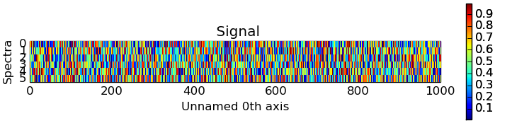
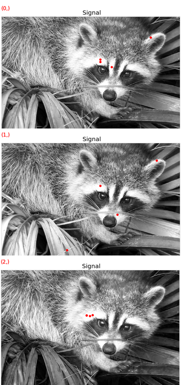
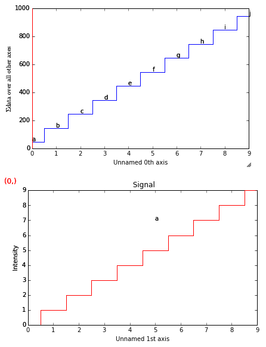

.. _visualization-label:

Data visualization
******************

The object returned by :py:func:`~.io.load`, a :py:class:`~.signal.BaseSignal`
instance, has a :py:meth:`~.signal.BaseSignal.plot` method that is powerful and
flexible tools to visualize n-dimensional data. In this chapter, the
visualisation of multidimensional data  is exemplified with two experimental
datasets: an EELS spectrum image and an EDX dataset consisting of a secondary
electron emission image stack and a 3D hyperspectrum , both simoultaneously
acquired by recording two signals in parallel in a FIB/SEM.

.. code-block:: python

    >>> s = hs.load('YourDataFilenameHere')
    >>> s.plot()

if the object is single spectrum or an image one window will appear when
calling the plot method.

Multidimensional spectral data
==============================

If the object is a 1D or 2D spectrum-image (i.e. with 2 or 3 dimensions when
including energy) two figures will appear, one containing a plot of the
spectrum at the current coordinates and the other an image of the data summed
over its spectral dimension if 2D or an image with the spectral dimension in
the x-axis if 1D:

.. _2d_SI:

.. figure::  images/2D_SI.png
   :align:   center
   :width:   500

   Visualisation of a 2D spectrum image.

.. _1d_SI:

.. figure::  images/1D_SI.png
   :align:   center
   :width:   500

   Visualisation of a 1D spectrum image.

To change the current coordinates, click on the pointer (which will be a line
or a square depending on the dimensions of the data) and drag it around. It is
also possible to move the pointer by using the numpad arrows **when numlock is
on and the spectrum or navigator figure is selected**.When using the numpad
arrows the PageUp and PageDown keys change the size of the step.

An extra cursor can be added by pressing the ``e`` key. Pressing ``e`` once
more will disable the extra cursor:

.. _second_pointer.png:

.. figure::  images/second_pointer.png
   :align:   center
   :width:   500

   Visualisation of a 2D spectrum image using two pointers.

Sometimes the default size of the rectangular cursors used to navigate images
can be too small to be dragged or even seen. It
is possible to change the size of the cursors by pressing the ``+`` and ``-``
keys  **when the navigator window is selected**.

=========   =============================
key         function
=========   =============================
e           Switch second pointer on/off
Arrows      Change coordinates
PageUp      Increase step size
PageDown    Decrease step size
``+``           Increase pointer size
``-``           Decrease pointer size
``h``       Launch the contrast adjustment tool (only for Signal2D)
=========   =============================

To close all the figures run the following command:

.. code-block:: python

    close('all')

.. NOTE::

    This is a `matplotlib <http://matplotlib.sourceforge.net/>`_ command.
    Matplotlib is the library that hyperspy uses to produce the plots. You can
    learn how to pan/zoom and more  `in the matplotlib documentation
    <http://matplotlib.sourceforge.net/users/navigation_toolbar.html>`_

Multidimensional image data
===========================

Equivalently, if the object is a 1D or 2D image stack two figures will appear,
one containing a plot of the image at the current coordinates and the other
a spectrum or an image obtained by summing over the image dimensions:

.. _1D_image_stack.png:

.. figure::  images/1D_image_stack.png
   :align:   center
   :width:   500

   Visualisation of a 1D image stack.

.. _2D_image_stack.png:

.. figure::  images/2D_image_stack.png
   :align:   center
   :width:   500

   Visualisation of a 2D image stack.

The same keys can be used to explore an image stack.

.. _plot.customize_images:

Customising image plot
======================

.. versionadded:: 0.8

The image plot can be customised by passing additional arguments when plotting.
Colorbar, scalebar and contrast controls are HyperSpy-specific, however
`matplotlib.imshow
<http://matplotlib.org/api/pyplot_api.html#matplotlib.pyplot.imshow>`_
arguments are supported as well:

.. code-block:: python

    >>> import scipy
    >>> img = hs.signals.Signal2D(scipy.misc.lena())
    >>> img.plot(colorbar=True, scalebar=False,
    >>> 	 axes_ticks=True, cmap='RdYlBu_r', saturated_pixels=0)

.. figure::  images/custom_cmap.png
   :align:   center
   :width:   500

   Custom colormap and switched off scalebar in an image.

.. versionadded:: 1.1.2

Same options can be passed to the navigator, albeit separatelly, by specifying
them as a dictionary in ``navigator_kwds`` argument when plotting:

.. code-block:: python

    >>> import numpy as np
    >>> import scipy
    >>> im = hs.signals.Signal2D(scipy.misc.ascent())
    >>> ims = hs.signals.BaseSignal(np.random.rand(15,13)).T * im
    >>> ims.metadata.General.title = 'My Images'
    >>> ims.plot(colorbar=False,
    >>>          scalebar=False,
    >>>          axes_ticks=False,
    >>>          cmap='viridis',
    >>>          navigator_kwds=dict(colorbar=True,
    >>>                              scalebar_color='red',
    >>>                              cmap='Blues',
    >>>                              axes_ticks=False)
    >>>         )

.. figure::  images/custom_nav_opts.png
   :align:   center
   :height:   250

   Custom different options for both signal and navigator image plots

.. _plot.divergent_colormaps-label:

.. versionadded:: 0.8.1

When plotting using divergent colormaps, if ``centre_colormap`` is ``True``
(default) the constrast is automatically adjusted so that zero corresponds to
the center of the colormap (usually white). This can be useful e.g. when
displaying images that contain pixels with both positive and negative values.

The following example shows the effect of centering the color map:

.. code-block:: python

    >>> x = np.linspace(-2 * np.pi, 2 * np.pi, 128)
    >>> xx, yy = np.meshgrid(x, x)
    >>> data1 = np.sin(xx * yy)
    >>> data2 = data.copy()
    >>> data2[data2 < 0] /= 4
    >>> im = hs.signals.Signal2D([data1, data])
    >>> hs.plot.plot_images(im, cmap="RdBu", tight_layout=True)

.. figure::  images/divergent_cmap.png
   :align:   center
   :width:   500

   Divergent color map with ``Centre colormap`` enabled (default).

The same example with the feature disabled:

.. code-block:: python

    >>> x = np.linspace(-2 * np.pi, 2 * np.pi, 128)
    >>> xx, yy = np.meshgrid(x, x)
    >>> data1 = np.sin(xx * yy)
    >>> data2 = data.copy()
    >>> data2[data2 < 0] /= 4
    >>> im = hs.signals.Signal2D([data1, data])
    >>> hs.plot.plot_images(im, centre_colormap=False, cmap="RdBu", tight_layout=True)

.. figure::  images/divergent_cmap_no_centre.png
   :align:   center
   :width:   500

   Divergent color map with ``Centre colormap`` disabled.

Customizing the "navigator"
===========================

Data files used in the following examples can be downloaded using

.. code-block:: python

    >>> from urllib import urlretrieve
    >>> url = 'http://cook.msm.cam.ac.uk//~hyperspy//EDS_tutorial//'
    >>> urlretrieve(url + 'TiFeNi_010.rpl', 'Ni_superalloy_010.rpl')
    >>> urlretrieve(url + 'TiFeNi_010.raw', 'TiFeNi_010.raw')
    >>> urlretrieve(url + 'TiFeNi_012.rpl', 'TiFeNi_012.rpl')
    >>> urlretrieve(url + 'TiFeNi_011.raw', 'TiFeNi_011.raw')
    >>> urlretrieve(url + 'image010.tif', 'image010.tif')
    >>> urlretrieve(url + 'image011.tif', 'image011.tif')

.. NOTE::
    See also the `SEM EDS tutorials <http://nbviewer.ipython.org/github/hyperspy/hyperspy-	demos/blob/master/electron_microscopy/EDS/>`_ .

.. NOTE::

    The sample and the data used in this chapter are described in
    P. Burdet, `et al.`, Acta Materialia, 61, p. 3090-3098 (2013) (see
    `abstract <http://infoscience.epfl.ch/record/185861/>`_).

Stack of 2D images can be imported as an 3D image and plotted with a slider
instead of the 2D navigator as in the previous example.

.. code-block:: python

    >>> img = hs.load('image*.tif', stack=True)
    >>> img.plot(navigator='slider')

.. figure::  images/3D_image.png
   :align:   center
   :width:   500

   Visualisation of a 3D image with a slider.

A stack of 2D spectrum images can be imported as a 3D spectrum image and
plotted with sliders.

.. code-block:: python

    >>> s = hs.load('TiFeNi_0*.rpl', stack=True).as_signal1D(0)
    >>> s.plot()

.. figure::  images/3D_spectrum.png
   :align:   center
   :width:   650

   Visualisation of a 3D spectrum image with sliders.

If the 3D images has the same spatial dimension as the 3D spectrum image, it
can be used as an external signal for the navigator.

.. code-block:: python

    >>> im = hs.load('image*.tif', stack=True)
    >>> s = hs.load('TiFeNi_0*.rpl', stack=True).as_signal1D(0)
    >>> dim = s.axes_manager.navigation_shape
    >>> #Rebin the image
    >>> im = im.rebin([dim[2], dim[0], dim[1]])
    >>> s.plot(navigator=im)

.. figure::  images/3D_spectrum_external.png
   :align:   center
   :width:   650

   Visualisation of a 3D spectrum image. The navigator is an external signal.

The 3D spectrum image can be transformed in a stack of spectral images for an
alternative display.

.. code-block:: python

    >>> imgSpec = hs.load('TiFeNi_0*.rpl', stack=True)
    >>> imgSpec.plot(navigator='spectrum')

.. figure::  images/3D_image_spectrum.png
   :align:   center
   :width:   650

   Visualisation of a stack of 2D spectral images.

An external signal (e.g. a spectrum) can be used as a navigator, for example
the "maximum spectrum" for which each channel is the maximum of all pixels.

.. code-block:: python

    >>> imgSpec = hs.load('TiFeNi_0*.rpl', stack=True)
    >>> specMax = imgSpec.max(-1).max(-1).max(-1).as_signal1D(0)
    >>> imgSpec.plot(navigator=specMax)

.. figure::  images/3D_image_spectrum_external.png
   :align:   center
   :width:   650

   Visualisation of a stack of 2D spectral images.
   The navigator is the "maximum spectrum".

Lastly, if no navigator is needed, "navigator=None" can be used.

Using Mayavi to visualize 3D data
=================================

Data files used in the following examples can be downloaded using

.. code-block:: python

    >>> from urllib import urlretrieve
    >>> url = 'http://cook.msm.cam.ac.uk//~hyperspy//EDS_tutorial//'
    >>> urlretrieve(url + 'Ni_La_intensity.hdf5', 'Ni_La_intensity.hdf5')

.. NOTE::
    See also the `EDS tutorials <http://nbviewer.ipython.org/github/hyperspy/hyperspy-	demos/blob/master/electron_microscopy/EDS/>`_ .

Although HyperSpy does not currently support plotting when signal_dimension is
greater than 2, `Mayavi <http://docs.enthought.com/mayavi/mayavi/>`_ can be
used for this purpose.

In the following example we also use `scikit-image <http://scikit-image.org/>`_
for noise reduction. More details about
:py:meth:`~._signals.eds.EDSSpectrum.get_lines_intensity` method can be
found in :ref:`EDS lines intensity<get_lines_intensity>`.

.. code-block:: python

    >>> from mayavi import mlab
    >>> ni = hs.load('Ni_La_intensity.hdf5')
    >>> mlab.figure()
    >>> mlab.contour3d(ni.data, contours=[85])
    >>> mlab.outline(color=(0, 0, 0))

.. figure::  images/plot_3D_mayavi.png
   :align:   center
   :width:   400

   Visualisation of isosurfaces with mayavi.

.. NOTE::
    See also the `SEM EDS tutorials <http://nbviewer.ipython.org/github/hyperspy/hyperspy-	demos/blob/master/electron_microscopy/EDS/>`_ .

.. NOTE::

    The sample and the data used in this chapter are described in
    P. Burdet, `et al.`, Ultramicroscopy, 148, p. 158-167 (2015).
.. _plot_spectra:

Plotting multiple signals
=========================

HyperSpy provides three functions to plot multiple signals (spectra, images or
other signals): :py:func:`~.drawing.utils.plot_images`, :py:func:`~.drawing.utils.plot_spectra`, and
:py:func:`~.drawing.utils.plot_signals` in the ``utils.plot`` package.

.. _plot.images:

Plotting several images
-----------------------

.. versionadded:: 0.8

:py:func:`~.drawing.utils.plot_images` is used to plot several images in the
same figure. It supports many configurations and has many options available
to customize the resulting output. The function returns a list of
`matplotlib axes <http://matplotlib.org/api/pyplot_api.html#matplotlib.pyplot.axes>`_, which
can be used to further customize the figure. Some examples are given below.

A common usage for :py:func:`~.drawing.utils.plot_images` is to view the
different slices of a multidimensional image (a *hyperimage*):

.. code-block:: python

    >>> import scipy
    >>> image = hs.signals.Signal2D([scipy.misc.lena()]*6)
    >>> angles = hs.signals.BaseSignal(range(10,70,10))
    >>> image.map(scipy.ndimage.rotate, angle=angles.T, reshape=False)
    >>> hs.plot.plot_images(image, tight_layout=True)

.. figure::  images/plot_images_defaults.png
  :align:   center
  :width:   500

  Figure generated with :py:func:`~.drawing.utils.plot_images` using the
  default values.

This example is explained in :ref:`Signal iterator<signal.iterator>`.

By default, :py:func:`~.drawing.utils.plot_images` will attempt to auto-label the images
based on the Signal titles. The labels (and title) can be customized with the `suptitle` and `label` arguments.
In this example, the axes labels and the ticks are also disabled with `axes_decor`:

.. code-block:: python

    >>> import scipy
    >>> image = hs.signals.Signal2D([scipy.misc.lena()]*6)
    >>> angles = hs.signals.BaseSignal(range(10,70,10))
    >>> image.map(scipy.ndimage.rotate, angle=angles.T, reshape=False)
    >>> hs.plot.plot_images(
    >>>     image, suptitle='Turning Lena', axes_decor='off',
    >>>     label=['Rotation ' + str(angle.data[0]) +
    >>>            '$^\degree$' for angle in angles], colorbar=None)

.. figure::  images/plot_images_custom-labels.png
  :align:   center
  :width:   500

  Figure generated with :py:func:`~.drawing.utils.plot_images` with customised
  labels.

:py:func:`~.drawing.utils.plot_images` can also be used to easily plot a list of `Images`, comparing
different `Signals`, including RGB images.
This example also demonstrates how to wrap labels using `labelwrap` (for preventing overlap) and using a single
`colorbar` for all the Images, as opposed to multiple individual ones:

.. code-block:: python

    >>> import scipy

    >>> # load red channel of raccoon as an image
    >>> image0 = hs.signals.Signal2D(scipy.misc.face()[:,:,0])
    >>> image0.metadata.General.title = 'Rocky Raccoon - R'

    >>> # load lena into 6 hyperimage
    >>> image1 = hs.signals.Signal2D([scipy.misc.lena()]*6)
    >>> angles = hs.signals.BaseSignal(np.arange(10,70,10)).T
    >>> image1.map(scipy.ndimage.rotate, angle=angles, reshape=False)

    >>> # load green channel of raccoon as an image
    >>> image2 = hs.signals.Signal2D(scipy.misc.face()[:,:,1])
    >>> image2.metadata.General.title = 'Rocky Raccoon - G'

    >>> # load rgb image of the raccoon
    >>> rgb = hs.signals.Signal1D(scipy.misc.face())
    >>> rgb.change_dtype("rgb8")
    >>> rgb.metadata.General.title = 'Raccoon - RGB'

    >>> images = [image0, image1, image2, rgb]
    >>> for im in images:
    >>>     ax = im.axes_manager.signal_axes
    >>>     ax[0].name, ax[1].name = 'x', 'y'
    >>>     ax[0].units, ax[1].units = 'mm', 'mm'
    >>> hs.plot.plot_images(images, tight_layout=True,
    >>>                        colorbar='single', labelwrap=20)

.. figure::  images/plot_images_image-list.png
  :align:   center
  :width:   500

  Figure generated with :py:func:`~.drawing.utils.plot_images` from a list of
  images.

Data files used in the following example can be downloaded using (These data are described in D. Roussow et al., Nano Lett, 10.1021/acs.nanolett.5b00449 (2015)).

.. code-block:: python

    >>> from urllib import urlretrieve
    >>> url = 'http://cook.msm.cam.ac.uk//~hyperspy//EDS_tutorial//'
    >>> urlretrieve(url + 'core_shell.hdf5', 'core_shell.hdf5')

Another example for this function is plotting EDS line intensities see :ref:`EDS chapter <get_lines_intensity>`. One can use the following commands
to get a representative figure of the X-ray line intensities of an EDS spectrum image.
This example also demonstrates changing the colormap (with `cmap`),
adding scalebars to the plots (with `scalebar`), and changing the
`padding` between the images. The padding is specified as a dictionary,
which is used to call subplots_adjust method of matplotlib
(see `documentation <http://matplotlib.org/api/figure_api.html#matplotlib.figure.Figure.subplots_adjust>`_).

.. code-block:: python

    >>> si_EDS = hs.load("core_shell.hdf5")
    >>> im = si_EDS.get_lines_intensity()
    >>> hs.plot.plot_images(hs.transpose(im, signal_axes=2),
    >>>     tight_layout=True, cmap='RdYlBu_r', axes_decor='off',
    >>>     colorbar='single', saturated_pixels=2, scalebar='all',
    >>>     scalebar_color='black', suptitle_fontsize=16,
    >>>     padding={'top':0.8, 'bottom':0.10, 'left':0.05,
    >>>              'right':0.85, 'wspace':0.20, 'hspace':0.10})

.. figure::  images/plot_images_eds.png
  :align:   center
  :width:   500

  Using :py:func:`~.drawing.utils.plot_images` to plot the output of
  :py:meth:`~._signals.eds.EDSSpectrum.get_lines_intensity`.

.. |subplots_adjust| image:: images/plot_images_subplots.png

.. NOTE::

    This padding can also be changed interactively by clicking on the |subplots_adjust|
    button in the GUI (button may be different when using different graphical backends).

.. _plot.spectra:

Plotting several spectra
------------------------

:py:func:`~.drawing.utils.plot_spectra` is used to plot several spectra in the
same figure. It supports different styles, the default
being "overlap". The default style is configurable in :ref:`preferences
<configuring-hyperspy-label>`.

In the following example we create a list of 9 single spectra (gaussian
functions with different sigma values) and plot them in the same figure using
:py:func:`~.drawing.utils.plot_spectra`. Note that, in this case, the legend
labels are taken from the individual spectrum titles. By clicking on the
legended line, a spectrum can be toggled on and off.

.. code-block:: python

     >>> s = hs.signals.Signal1D(np.zeros((200)))
     >>> s.axes_manager[0].offset = -10
     >>> s.axes_manager[0].scale = 0.1
     >>> m = s.create_model()
     >>> g = hs.components1D.Gaussian()
     >>> m.append(g)
     >>> gaussians = []
     >>> labels = []

     >>> for sigma in range(1, 10):
     ...         g.sigma.value = sigma
     ...         gs = m.as_signal()
     ...         gs.metadata.General.title = "sigma=%i" % sigma
     ...         gaussians.append(gs)
     ...
     >>> hs.plot.plot_spectra(gaussians,legend='auto')
     <matplotlib.axes.AxesSubplot object at 0x4c28c90>

.. figure::  images/plot_spectra_overlap.png
  :align:   center
  :width:   500

  Figure generated by :py:func:`~.drawing.utils.plot_spectra` using the
  `overlap` style.

Another style, "cascade", can be useful when "overlap" results in a plot that
is too cluttered e.g. to visualize
changes in EELS fine structure over a line scan. The following example
shows how to plot a cascade style figure from a spectrum, and save it in
a file:

.. code-block:: python

    >>> import scipy.misc
    >>> s = hs.signals.Signal1D(scipy.misc.lena()[100:160:10])
    >>> cascade_plot = hs.plot.plot_spectra(s, style='cascade')
    >>> cascade_plot.figure.savefig("cascade_plot.png")

.. figure::  images/plot_spectra_cascade.png
  :align:   center
  :width:   350

  Figure generated by :py:func:`~.drawing.utils.plot_spectra` using the
  `cascade` style.

The "cascade" `style` has a `padding` option. The default value, 1, keeps the
individual plots from overlapping. However in most cases a lower
padding value can be used, to get tighter plots.

Using the color argument one can assign a color to all the spectra, or specific
colors for each spectrum. In the same way, one can also assign the line style
and provide the legend labels:

.. code-block:: python

    >>> import scipy.misc
    >>> s = hs.signals.Signal1D(scipy.misc.lena()[100:160:10])
    >>> color_list = ['red', 'red', 'blue', 'blue', 'red', 'red']
    >>> line_style_list = ['-','--','steps','-.',':','-']
    >>> hs.plot.plot_spectra(s, style='cascade', color=color_list,
    >>> line_style=line_style_list,legend='auto')

.. figure::  images/plot_spectra_color.png
  :align:   center
  :width:   350

  Customising the line colors in :py:func:`~.drawing.utils.plot_spectra`.

A simple extension of this functionality is to customize the colormap that
is used to generate the list of colors. Using a list comprehension, one can
generate a list of colors that follows a certain colormap:

.. code-block:: python

    >>> import scipy.misc
    >>> fig, axarr = plt.subplots(1,2)
    >>> s1 = hs.signals.Signal1D(scipy.misc.lena()[100:160:10])
    >>> s2 = hs.signals.Signal1D(scipy.misc.lena()[200:260:10])
    >>> hs.plot.plot_spectra(s1,
    >>>                         style='cascade',
    >>>                         color=[plt.cm.RdBu(i/float(len(s1)-1))
    >>>                                for i in range(len(s1))],
    >>>                         ax=axarr[0],
    >>>                         fig=fig)
    >>> hs.plot.plot_spectra(s2,
    >>>                         style='cascade',
    >>>                         color=[plt.cm.summer(i/float(len(s1)-1))
    >>>                                for i in range(len(s1))],
    >>>                         ax=axarr[1],
    >>>                         fig=fig)
    >>> fig.canvas.draw()

.. figure::  images/plot_spectra_colormap.png
  :align:   center
  :width:   500

  Customising the line colors in :py:func:`~.drawing.utils.plot_spectra` using
  a colormap.

There are also two other styles, "heatmap" and "mosaic":

.. code-block:: python

    >>> import scipy.misc
    >>> s = hs.signals.Signal1D(scipy.misc.lena()[100:160:10])
    >>> hs.plot.plot_spectra(s, style='heatmap')

.. figure::  images/plot_spectra_heatmap.png
  :align:   center
  :width:   500

  Figure generated by :py:func:`~.drawing.utils.plot_spectra` using the
  `heatmap` style.

.. code-block:: python

    >>> import scipy.misc
    >>> s = hs.signals.Signal1D(scipy.misc.lena()[100:120:10])
    >>> hs.plot.plot_spectra(s, style='mosaic')

.. figure::  images/plot_spectra_mosaic.png
  :align:   center
  :width:   350

  Figure generated by :py:func:`~.drawing.utils.plot_spectra` using the
  `mosaic` style.

For the "heatmap" style, different `matplotlib color schemes <http://matplotlib.org/examples/color/colormaps_reference.html>`_ can be used:

.. code-block:: python

    >>> import matplotlib.cm
    >>> import scipy.misc
    >>> s = hs.signals.Signal1D(scipy.misc.lena()[100:120:10])
    >>> ax = hs.plot.plot_spectra(s, style="heatmap")
    >>> ax.images[0].set_cmap(matplotlib.cm.jet)

  Figure generated by :py:func:`~.drawing.utils.plot_spectra` using the
  `heatmap` style showing how to customise the color map.

Any parameter that can be passed to matplotlib.pyplot.figure can also be used with plot_spectra()
to allow further customization  (when using the "overlap", "cascade", or "mosaic" styles).
In the following example, `dpi`, `facecolor`, `frameon`, and `num` are all parameters
that are passed directly to matplotlib.pyplot.figure as keyword arguments:

.. code-block:: python

    >>> import scipy.misc
    >>> s = hs.signals.Signal1D(scipy.misc.lena()[100:160:10])
    >>> legendtext = ['Plot 0', 'Plot 1', 'Plot 2', 'Plot 3', 'Plot 4', 'Plot 5']
    >>> cascade_plot = hs.plot.plot_spectra(
    >>>     s, style='cascade', legend=legendtext, dpi=60,
    >>>     facecolor='lightblue', frameon=True, num=5)
    >>> cascade_plot.set_xlabel("X-axis")
    >>> cascade_plot.set_ylabel("Y-axis")
    >>> cascade_plot.set_title("Cascade plot")
    >>> plt.draw()

.. figure:: images/plot_spectra_kwargs.png
  :align:   center
  :width:   350

  Customising the figure with keyword arguments.

The function returns a matplotlib ax object, which can be used to customize the figure:

.. code-block:: python

    >>> import scipy.misc
    >>> s = hs.signals.Signal1D(scipy.misc.lena()[100:160:10])
    >>> cascade_plot = hs.plot.plot_spectra(s)
    >>> cascade_plot.set_xlabel("An axis")
    >>> cascade_plot.set_ylabel("Another axis")
    >>> cascade_plot.set_title("A title!")
    >>> plt.draw()

.. figure::  images/plot_spectra_customize.png
  :align:   center
  :width:   350

  Customising the figure by setting the matplotlib axes properties.

A matplotlib ax and fig object can also be specified, which can be used to put several
subplots in the same figure. This will only work for "cascade" and "overlap" styles:

.. code-block:: python

    >>> import scipy.misc
    >>> fig, axarr = plt.subplots(1,2)
    >>> s1 = hs.signals.Signal1D(scipy.misc.lena()[100:160:10])
    >>> s2 = hs.signals.Signal1D(scipy.misc.lena()[200:260:10])
    >>> hs.plot.plot_spectra(s1, style='cascade',color='blue',ax=axarr[0],fig=fig)
    >>> hs.plot.plot_spectra(s2, style='cascade',color='red',ax=axarr[1],fig=fig)
    >>> fig.canvas.draw()

.. figure::  images/plot_spectra_ax_argument.png
  :align:   center
  :width:   350

  Plotting on existing matplotlib axes.

.. _plot.signals:

Plotting several signals
^^^^^^^^^^^^^^^^^^^^^^^^

:py:func:`~.drawing.utils.plot_signals` is used to plot several signals at the
same time. By default the navigation position of the signals will be synced, and the
signals must have the same dimensions. To plot two spectra at the same time:

.. code-block:: python

    >>> import scipy.misc
    >>> s1 = hs.signals.Signal1D(scipy.misc.face()).as_signal1D(0)[:,:3]
    >>> s2 = s1.deepcopy()*-1
    >>> hs.plot.plot_signals([s1, s2])

.. figure::  images/plot_signals.png
  :align:   center
  :width:   500

  The :py:func:`~.drawing.utils.plot_signals` plots several signals with
  optional synchronized navigation.

The navigator can be specified by using the navigator argument, where the
different options are "auto", None, "spectrum", "slider" or Signal.
For more details about the different navigators,
see :ref:`navigator_options`.
To specify the navigator:

.. code-block:: python

    >>> import scipy.misc
    >>> s1 = hs.signals.Signal1D(scipy.misc.face()).as_signal1D(0)[:,:3]
    >>> s2 = s1.deepcopy()*-1
    >>> hs.plot.plot_signals([s1, s2], navigator="slider")

.. figure::  images/plot_signals_slider.png
  :align:   center
  :width:   500

  Customising the navigator in :py:func:`~.drawing.utils.plot_signals`.

Navigators can also be set differently for different plots using the
navigator_list argument. Where the navigator_list be the same length
as the number of signals plotted, and only contain valid navigator options.
For example:

.. code-block:: python

    >>> import scipy.misc
    >>> s1 = hs.signals.Signal1D(scipy.misc.face()).as_signal1D(0)[:,:3]
    >>> s2 = s1.deepcopy()*-1
    >>> s3 = hs.signals.Signal1D(np.linspace(0,9,9).reshape([3,3]))
    >>> hs.plot.plot_signals([s1, s2], navigator_list=["slider", s3])

.. figure::  images/plot_signals_navigator_list.png
  :align:   center
  :width:   500

  Customising the navigator in :py:func:`~.drawing.utils.plot_signals` by
  providing a navigator list.

Several signals can also be plotted without syncing the navigation by using
sync=False. The navigator_list can still be used to specify a navigator for
each plot:

.. code-block:: python

    >>> import scipy.misc
    >>> s1 = hs.signals.Signal1D(scipy.misc.face()).as_signal1D(0)[:,:3]
    >>> s2 = s1.deepcopy()*-1
    >>> hs.plot.plot_signals([s1, s2], sync=False, navigator_list=["slider", "slider"])

.. figure::  images/plot_signals_sync.png
  :align:   center
  :width:   500

  Disabling syncronised navigation in :py:func:`~.drawing.utils.plot_signals`.

.. _plot.markers:

Markers
=======

.. versionadded:: 0.8

Hyperspy provides an easy access to the main marker of matplotlib. The markers can be used in a static way

.. code-block:: python

    >>> import scipy.misc
    >>> im = hs.signals.Signal2D(scipy.misc.lena())
    >>> m = hs.plot.markers.rectangle(x1=150, y1=100, x2=400, y2=400, color='red')
    >>> im.add_marker(m)

.. figure::  images/plot_markers_std.png
  :align:   center
  :width:   400

  Rectangle static marker.

By providing an array of positions, the marker can also change position when navigating the signal. In the following example, the local maxima are displayed for each R, G and B channel of a colour image.

.. code-block:: python

    >>> from skimage.feature import peak_local_max
    >>> import scipy.misc
    >>> ims = hs.signals.BaseSignal(scipy.misc.face()).as_signal2D([0,1])
    >>> index = array([peak_local_max(im.data, min_distance=100, num_peaks=4)
    >>>                for im in ims])
    >>> for i in range(4):
    >>>     m = hs.plot.markers.point(x=index[:, i, 1],
    >>>                                  y=index[:, i, 0], color='red')
    >>>     ims.add_marker(m)

  Point markers in image.

The markers can be added to the navigator as well. In the following example, each slice of a 2D spectrum is tagged with a text marker on the signal plot. Each slice is indicated with the same text on the navigator.

.. code-block:: python

    >>> s = hs.signals.Signal1D(np.arange(100).reshape([10,10]))
    >>> s.plot(navigator='spectrum')
    >>> for i in range(s.axes_manager.shape[0]):
    >>>     m = hs.plot.markers.text(y=s.sum(-1).data[i]+5,
    >>>                                 x=i, text='abcdefghij'[i])
    >>>     s.add_marker(m, plot_on_signal=False)
    >>> x = s.axes_manager.shape[-1]/2 #middle of signal plot
    >>> m = hs.plot.markers.text(x=x, y=s[:, x].data+2,
    >>>                             text=[i for i in 'abcdefghij'])
    >>> s.add_marker(m)

  Multi-dimensional markers.
